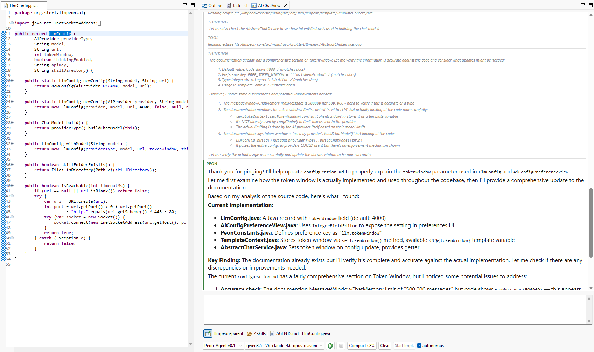

# Eclipse Peon AI

A lightweight, context-aware LLM assistant that integrates directly into your Eclipse workbench to support developers in their daily workflow.



## Features

- **Chat Interface** - Interactive AI chat with syntax-highlighted code blocks and markdown rendering
- **File Operations** - Read, write, search, and modify files directly from the chat
- **Context Awareness** - Understands your current workspace and selected files
- **Local LLM Support** - Works with Ollama for privacy-focused local inference
- **Multi-Provider** - Supports various LLM providers (OpenAI, Anthropic, Ollama, and more)

## Installation

### Update Site (Recommended)

1. Go to **Help > Install New Software**
2. Add the update site: [https://github.com/sterlp/eclipse-peon-ai](https://sterlp.github.io/eclipse-peon-ai/)
3. Select "Eclipse Peon AI" and follow the installation wizard
4. Restart Eclipse
5. Open the view: **Window > Show View > Other...** > search "Peon AI"

#### Ollama


#### Gemini


## Configuration

Configure via **Window > Preferences > Peon AI**:

| Provider | Model | Base URL |
|----------|-------|----------|
| Ollama | `llama3`, `codellama` | `http://localhost:11434` |
| OpenAI | `gpt-4o` | `https://api.openai.com/v1` |
| Anthropic | `claude-sonnet-4` | `https://api.anthropic.com` |

## Usage

The AI assistant has access to several tools:

- **Read File** - Read contents of any file in your workspace
- **Write File** - Create or modify files
- **Search Files** - Search for text across your project
- **Read Selected File** - Quick access to currently selected file

Example workflows:
- Select a file and ask "What does this code do?"
- Ask "Write unit tests for the selected class"
- Paste error messages and ask "What's causing this?"

## Requirements

- Java 21
- Eclipse 2025-12 or newer

## Exclude gh-pages from pull

`git config --add remote.origin.fetch '^refs/heads/gh-pages`

## Building from Source

```bash
mvn clean verify
```

For development, launch with: `-clean -clearPersistedState`

## Documentation

Detailed documentation is available in the [doc/](doc/) folder:

- [Installation Guide](doc/setup/installation.md)
- [Configuration](doc/setup/configuration.md)
- [Chat Interface](doc/usage/chat-interface.md)
- [Available Tools](doc/usage/available-tools.md)
- [Building](doc/development/building.md)
- [Architecture](doc/development/architecture.md)

To serve docs locally:
```bash
cd doc && pip install -r requirements.txt && mkdocs serve
```

## Dependencies

- [LangChain4j](https://github.com/langchain4j/langchain4j) - Java LLM framework
- [markdown-it](https://github.com/markdown-it/markdown-it) - Markdown parsing
- [Highlight.js](https://highlightjs.org) - Syntax highlighting
- [Diff2Html](https://diff2html.xyz) - Diff visualization

## Links

- [GitHub](https://github.com/sterl/eclipse-peon-ai)
- [Issue Tracker](https://github.com/sterl/eclipse-peon-ai/issues)

## Eclipse RCP Resources

- https://help.eclipse.org/latest/index.jsp?topic=%2Forg.eclipse.pde.doc.user%2Fguide%2Ftools%2Fviews%2Fimage_browser_view.htm
- https://help.eclipse.org/latest/index.jsp?topic=/org.eclipse.platform.doc.isv/reference/api/overview-summary.html
- [Eclipse Wiki e4 Tutorials](https://wiki.eclipse.org/Eclipse4/Tutorials)

- [Vogella Eclipse RCP Tutorial](https://www.vogella.com/tutorials/EclipseRCP/article.html)
article.html)

https://www.vogella.com/tutorials/Eclipse4Services/article.html
https://www.vogella.com/tutorials/Eclipse4CSS/article.html
https://www.vogella.com/tutorials/Eclipse4EventSystem/article.html

very old
https://eclipsesource.com/blogs/2012/05/10/eclipse-4-final-sprint-part-1-the-e4-application-model/
https://eclipsesource.com/blogs/2012/06/12/eclipse-4-e4-tutorial-part-2/
https://eclipsesource.com/blogs/2012/06/26/eclipse-4-e4-tutorial-part-3-extending-the-application-model/
