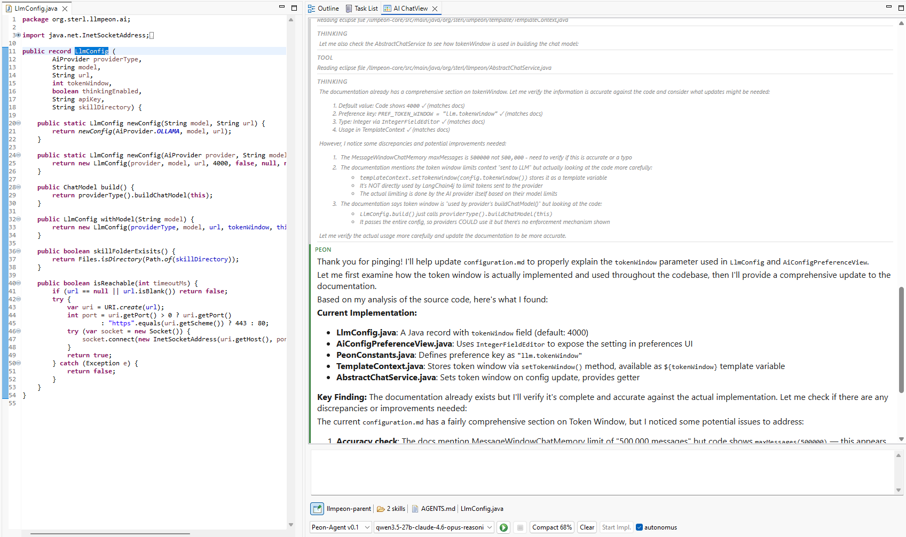
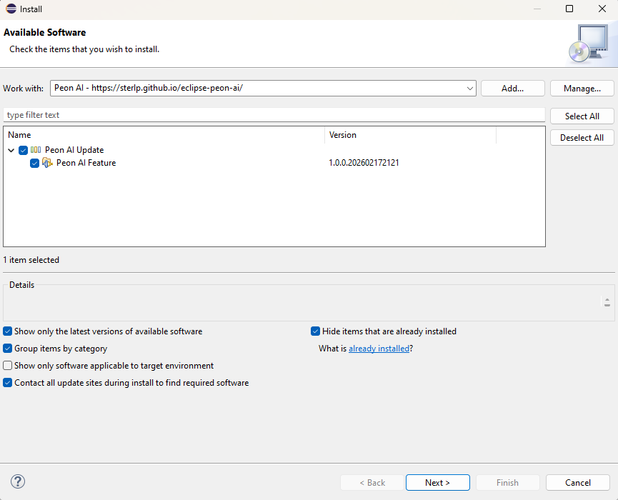
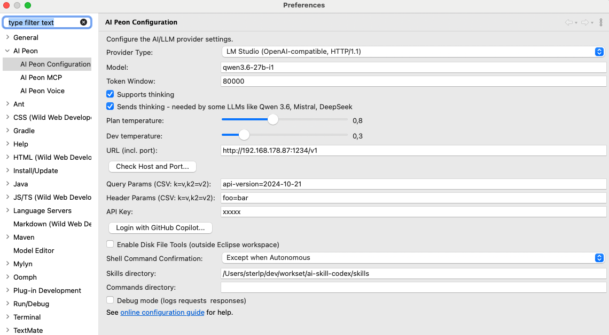
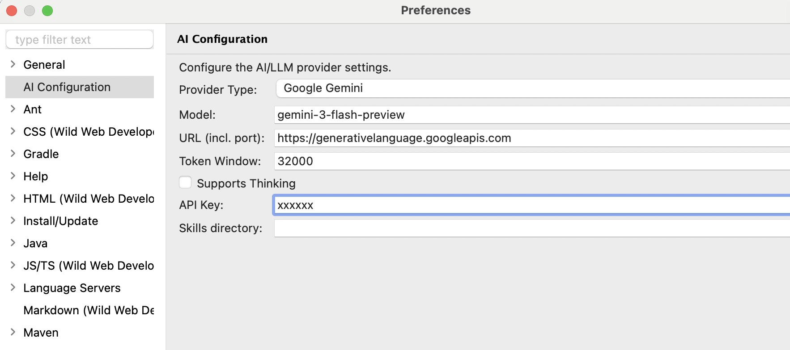

# Eclipse Peon AI

A lightweight, context-aware LLM assistant that integrates directly into your Eclipse workbench to support developers in their daily workflow.



## Features

- **Chat Interface** - Interactive AI chat with syntax-highlighted code blocks and markdown rendering
- **File Operations** - Read, write, search, and modify files directly from the chat
- **Context Awareness** - Understands your current workspace and selected files
- **Local LLM Support** - Works with Ollama for privacy-focused local inference
- **Multi-Provider** - Supports Ollama, OpenAI (and compatible), Google Gemini, Mistral AI, Anthropic Claude, and GitHub Copilot

## Known Issues

- LM Studio Qwen 3.5 9B may never call tools: https://github.com/lmstudio-ai/lmstudio-bug-tracker/issues/1592

## Installation

### Eclipse marketplace

- [Peon AI on eclipse marketplace](https://marketplace.eclipse.org/content/peon-ai)

### Update Site

1. Go to **Help > Install New Software**
2. Add the update site: [https://sterlp.github.io/eclipse-peon-ai/](https://sterlp.github.io/eclipse-peon-ai/)
3. Select "Eclipse Peon AI" and follow the installation wizard
4. Restart Eclipse
5. Open the view: **Window > Show View > Other...** > search "Peon AI"



#### LM Studio



#### Gemini


### Or find a free LLM

- https://models.dev/

## Configuration

Configure via **Window > Preferences > Peon AI**:

| Provider | Model | Base URL | API Key |
|----------|-------|----------|---------|
| `OLLAMA` | `llama3.2`, `codellama`, `qwen2.5-coder` | `http://localhost:11434` | — |
| `LM Studio` | `qwen/qwen3.5-9b` | `http://localhost:1234/v1` | — |
| `OPEN_AI` | `gpt-4o`, `gpt-4o-mini` | `https://api.openai.com/v1` | required |
| `GOOGLE_GEMINI` | `gemini-2.0-flash`, `gemini-2.5-pro-preview-03-25` | *(leave empty)* | required |
| `MISTRAL` | `mistral-large-latest`, `codestral-latest` | *(leave empty)* | required |
| `ANTHROPIC` | `claude-3-5-sonnet`, `claude-3-opus` | *(leave empty)* | required |
| `GITHUB_MODELS` | Various (use model picker) | `https://models.inference.ai.azure.com` | GitHub PAT |
| `GITHUB_COPILOT` | Claude Sonnet/Opus, GPT-5, etc. | *(leave empty)* | OAuth login |

> **OpenAI-compatible APIs** (LM Studio, OpenRouter, vLLM, GitHub Models, …): use appropriate provider or `OPEN_AI` with custom base URL.
> 
> **GitHub Copilot Subscription:** Click "Login with GitHub Copilot..." in preferences to authenticate and access Claude Sonnet/Opus, GPT-5, and other Copilot models.

## Usage

Example workflows:
- Select a file and ask "What does this code do?"
- Ask "Write unit tests for the selected class"
- Paste error messages and ask "What's causing this?"

## Tools

- [x] **Edit File** - Targeted find-and-replace edits without rewriting the whole file
- [x] **Read/Write/Create/Delete File** - Full file operations in workspace and on disk
- [x] **Search Files** - Find files by name across the workspace
- [x] **Grep** - Full-text content search across all open projects
- [x] **Build Project** - Trigger Eclipse builds and report errors/warnings
- [x] **Run Tests** - Execute JUnit 5 tests and report failures with stack traces
- [x] **Shell Command** - Run OS commands (git, mvn, npm, etc.)
- [x] **Web Fetch** - Fetch URLs and convert to markdown for reading docs
- [x] **List Projects** - Discover open projects with their type (java, maven, gradle)
- [ ] **Git Tool** - Dedicated git operations (status, diff, commit, log) with structured output
- [x] **Code Navigation** - Find types (supports `*`, `?` wildcards and camelCase e.g. `NPE`), find references, find implementations via Eclipse JDT
- [ ] **Refactor** - Rename symbols, extract methods, and move classes using Eclipse refactoring
- [x] `v1.1.0` **Agent Mode** Preview of the agent mode
- [x] `v1.2.0` **MCP** Support MCP servers using langchain4j MCP integration
- [x] `v1.3.0` **Github Copilot** Support

## Requirements

- Java 21
- Eclipse 2025-12 or newer

## Exclude gh-pages from pull

`git config --add remote.origin.fetch '^refs/heads/gh-pages`

## Building from Source

```bash
mvn clean verify
```

For development, launch with: `-clean -clearPersistedState`

## Documentation

Detailed documentation is available at [peon-ai-4e.sterl.org](https://peon-ai-4e.sterl.org):

- [Installation Guide](https://peon-ai-4e.sterl.org/setup/installation/)
- [Configuration](https://peon-ai-4e.sterl.org/setup/configuration/)
- [AGENTS.md & Skills](https://peon-ai-4e.sterl.org/setup/agents-and-skills/)
- [Building](https://peon-ai-4e.sterl.org/development/building/)
- [Architecture](https://peon-ai-4e.sterl.org/development/architecture/)

To serve docs locally:
```bash
cd doc && pip install -r requirements.txt && mkdocs serve
```

## Dependencies

- [LangChain4j](https://github.com/langchain4j/langchain4j) - Java LLM framework
- [markdown-it](https://github.com/markdown-it/markdown-it) - Markdown parsing
- [Highlight.js](https://highlightjs.org) - Syntax highlighting
- [Diff2Html](https://diff2html.xyz) - Diff visualization
- [flexmark](https://github.com/vsch/flexmark-java)

## Usefull commands

### Update version

`mvn org.eclipse.tycho:tycho-versions-plugin:set-version -DnewVersion=1.1.0-SNAPSHOT`

## Eclipse RCP Resources

- https://help.eclipse.org/latest/index.jsp?topic=%2Forg.eclipse.pde.doc.user%2Fguide%2Ftools%2Fviews%2Fimage_browser_view.htm
- https://help.eclipse.org/latest/index.jsp?topic=/org.eclipse.platform.doc.isv/reference/api/overview-summary.html
- [Eclipse Wiki e4 Tutorials](https://wiki.eclipse.org/Eclipse4/Tutorials)

- [Vogella Eclipse RCP Tutorial](https://www.vogella.com/tutorials/EclipseRCP/article.html)

- https://www.vogella.com/tutorials/Eclipse4Services/article.html
- https://www.vogella.com/tutorials/Eclipse4CSS/article.html
- https://www.vogella.com/tutorials/Eclipse4EventSystem/article.html

very old stuff
https://eclipsesource.com/blogs/2012/05/10/eclipse-4-final-sprint-part-1-the-e4-application-model/
https://eclipsesource.com/blogs/2012/06/12/eclipse-4-e4-tutorial-part-2/
https://eclipsesource.com/blogs/2012/06/26/eclipse-4-e4-tutorial-part-3-extending-the-application-model/
