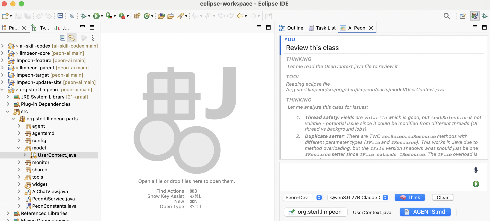

# Peon AI — Interaction Design

## Layout (top → bottom)

```
┌──────────────────────────────────────────────────────┐
│  1. Chat History (ChatMarkdownWidget)                │
│     fills all available vertical space               │
│                                                      │
├──────────────────────────────────────────────────────┤
│  2+3+4. Input Block (single SWT.BORDER, white bg)    │
│  ┌─────────────────────────────────────────────────┐ │
│  │ [📎 file.java ×] [📎 pom.xml ×]  (hidden)       │ │
│  ├─────────────────────────────────────────────────┤ │
│  │ Text (auto-grow, min 2, max 7 rows)       [🎤] │ │
│  │                                           [▶/■] │ │
│  ├─────────────────────────────────────────────────┤ │
│  │ [Plan▾] [Model▾] [🧠 Think] [Clear]      [▶/■] │ │
│  │ [Start Impl.] [☐ autonomous]  (conditional)     │ │
│  ├─────────────────────────────────────────────────┤ │
│  │ [📌 ProjectName] [⚡ N skills] [AGENTS.md]      │ │
│  │ [file.java] [MCP on/off] [Compact 45K/100K]     │ │
│  └─────────────────────────────────────────────────┘ │
└──────────────────────────────────────────────────────┘
```

## Section Details

### 2 — User Input (UserInputWidget)

- **File chips bar**: hidden until files are attached. Each chip: file icon + name + `×`. `+` button opens workspace file picker.
- **StyledText**: auto-grows, minimum 2 rows, maximum 7 rows (then scrolls). `Enter` = newline, `Ctrl/Cmd+Enter` = send. Native OS background (white) — never set explicitly.
- **Right column**: fixed-width column right of the StyledText, vertically filling the row. `verticalSpacing = 0` so buttons sit flush with no separator gap.
  - **Mic button** `[🎤]` at top: flat paint-based `Button` (see [swt-integrated-input-buttons.md](swt-integrated-input-buttons.md)). Turns red while recording via `setBackground(red)` — the PaintListener picks it up. Created on first show, disposed on hide. Hidden unless voice is configured.
  - **Send/Stop button** `[▶/■]` at bottom: always visible. Shows send icon when idle, stop icon while a request is in flight.
- **Layout**: `GridLayout(2)` in the text row, `horizontalSpacing = 0` — StyledText fills, right column holds mic (top) and send/stop (bottom).

### 3 — Action Bar (ActionsBarWidget)

Sections 2, 3 and 4 share the same background color so they form one cohesive input block.

Layout: `GridLayout(2)` — left cell is a wrapping `RowLayout` composite, right cell is `SendOrStopButton` pinned `SWT.RIGHT`. `horizontalSpacing = 0` between StyledText and adjacent buttons so seams aren't visible as gray lines.

| Position | Control | Notes |
|----------|---------|-------|
| Left | **Mode selector** (`Plan`, `Dev`, `Agent`) | combo |
| Left | **Model selector** | combo, ~200px |
| Left | **🧠 Think toggle** | on/off for extended thinking; default from "Supports Thinking" preference; session-only, not written back to preferences |
| Left | **Clear** | clears conversation history |
| Right (pinned) | **Send / Stop** | always rightmost; icon swaps while working |
| Conditional | **Start Impl.** | visible in Plan/Agent mode when AI has replied |
| Conditional | **☐ autonomous** | checkbox, visible in Agent mode only |

### 4 — Status Bar (StatusLineWidget)

Wrapping `RowLayout` so controls reflow on narrow views. Shares background with sections 2 and 3.

| Control | Type | Notes |
|---------|------|-------|
| **📌 Project** | Toggle button | pin/unpin project; shows project name; hidden if no project |
| **Selected file** | Label | currently active file in editor; automatically included in chat context |
| **AGENTS.md** | Label/icon | shown only when an AGENTS.md is found |
| **⚡ N skills** | Toggle button | on/off; enables/disables skill loading; shows count |
| **MCP on/off** | Toggle button | enables/disables MCP tool servers |
| **Compact N/M** | Push button | color coding: yellow ≥ 70 %, red ≥ 88 % |



## Visual Unification

Sections 2, 3 and 4 are children of a single `inputBlock` composite (`SWT.BORDER`). The single border on the outer wrapper is the only border in the input area — no internal borders between sections. Dividing lines between sections are optional thin separators at most.

**Implementation rules** (Phase 1, applies to section 2 today; sections 3–4 will follow in Phase 2):

- **Never** call `setBackground(...)` or `setBackgroundMode(SWT.INHERIT_FORCE)` on any composite that contains a `StyledText`. On macOS this overrides the native renderer and produces a gray field instead of white. Let the OS paint it.
- Icon buttons are paint-based `Button(SWT.PUSH | SWT.NATIVE)` widgets — see `SwtUtil.createIconButton` and [swt-integrated-input-buttons.md](swt-integrated-input-buttons.md). They inherit the parent's native background and have no visible OS frame.
- Dynamic state (e.g. mic recording red) uses `button.setBackground(color)` + `redraw()`; the PaintListener fills with the new color. Reset to `null` to restore the inherited native background.

