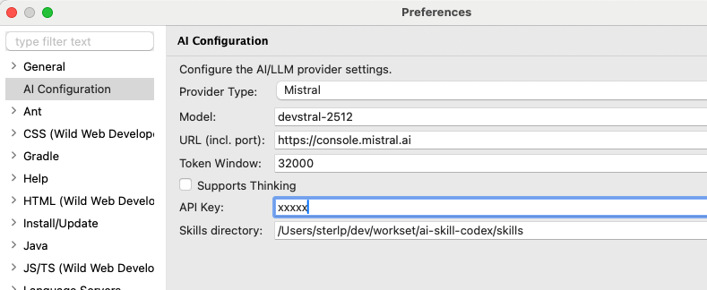

# Configuration

After installation, configure the plugin via **Window > Preferences > Peon AI**.

## Provider Settings

### Ollama

Run models locally e.g. windows.

| Setting | Value |
|---------|-------|
| Provider | `OLLAMA` |
| Model | `llama3.2`, `codellama`, `qwen2.5-coder`, `mistral` |
| Base URL | `http://localhost:11434` |

- [Ollama documentation](https://ollama.com/library)
- [Ollama model library](https://ollama.com/search)

### LM Studio

Run models locally — e.g. for MAC.

| Setting | Value |
|---------|-------|
| Provider | `LM Studio / OpenAI HTTP 1.1` |
| Model | `qwen/qwen3.5-9b` |
| Base URL | `http://localhost:1234/v1` |

### OpenAI

| Setting | Value |
|---------|-------|
| Provider | `OPEN_AI` |
| Model | `gpt-4o`, `gpt-4o-mini`, `o3-mini` |
| Base URL | `https://api.openai.com/v1` |
| API Key | Your OpenAI API key |

- [OpenAI model overview](https://platform.openai.com/docs/models)
- [OpenAI API keys](https://platform.openai.com/api-keys)

::: tip OpenAI-compatible APIs
Any OpenAI-compatible server (LM Studio, OpenRouter, LocalAI, vLLM, …) works by changing the Base URL.
Set the API Key to a dummy value like `none` if the server does not require one.
:::

### Google Gemini

| Setting | Value |
|---------|-------|
| Provider | `GOOGLE_GEMINI` |
| Model | `gemini-2.0-flash`, `gemini-2.5-pro-preview-03-25` |
| Base URL | *(leave empty)* |
| API Key | Your Google AI Studio API key |

- [Gemini model overview](https://ai.google.dev/gemini-api/docs/models/gemini)
- [Get a free API key](https://aistudio.google.com/apikey)

### Mistral AI

| Setting | Value |
|---------|-------|
| Provider | `MISTRAL` |
| Model | `mistral-large-latest`, `mistral-small-latest`, `codestral-latest` |
| Base URL | *(leave empty)* or e.g. https://console.mistral.ai |
| API Key | Your Mistral API key |

- [Mistral model overview](https://docs.mistral.ai/getting-started/models/models_overview/)
- [Get a Mistral API key](https://console.mistral.ai/api-keys/)

### Github Copilot

- [Model overview](https://docs.github.com/en/copilot/reference/ai-models/supported-models)

## Testing the Connection

1. Open the Peon AI chat view
2. Type a test message like "Hello"
3. If configured correctly, you should receive a response