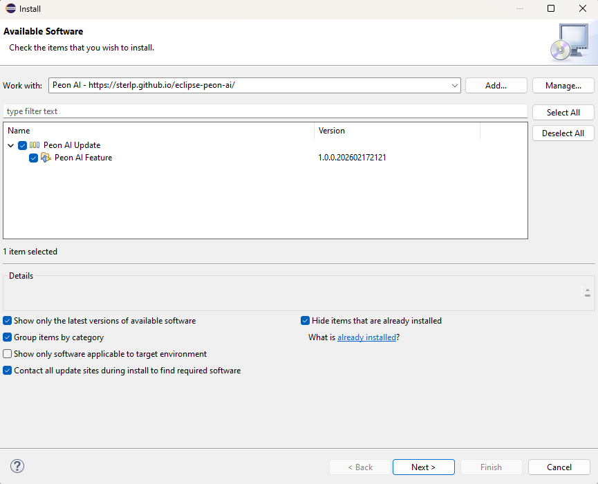

# Installation

## Update Site (Recommended)

Install directly from Eclipse:

1. Go to **Help > Install New Software**
2. Click **Add...** to add a new repository
3. Enter the update site URL: `https://github.com/sterlp/eclipse-peon-ai`
4. Select "Eclipse Peon AI" from the list
5. Click **Next** and follow the installation wizard
6. Restart Eclipse when prompted

## Requirements

- Eclipse 2025-12 or newer
- Java 21
- An LLM provider (Ollama recommended for local use)

## After Installation

1. Go to **Window > Show View > Other...**
2. Search for "Peon AI" or "AI Chat"
3. The chat view will appear in your workbench
