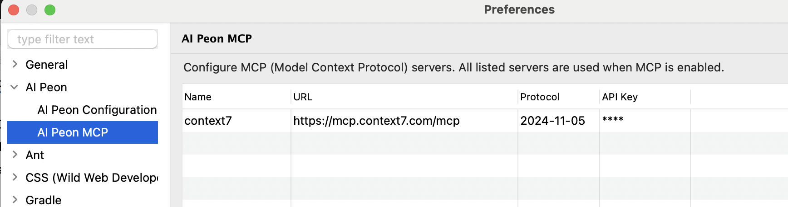

# MCP Configuration

MCP (Model Context Protocol) lets Peon AI connect to external tool servers — for example a GitHub server, a database query server, or any custom MCP-compatible service. The connected tools become available to the developer agent during implementation.

## Setup

Open **Window → Preferences → Peon AI → MCP Servers**.

Each server entry has four fields:

| Field | Description |
|---|---|
| **Name** | Display name shown in the UI and used in log output. |
| **URL** | Streamable HTTP endpoint of the MCP server, e.g. `https://mcp.context7.com/mcp`. |
| **API Key** | Optional Bearer token. Leave empty if the server requires no authentication. |
| **Protocol Version** | MCP protocol version to announce. Defaults to `2024-11-05`. Only change this if the server requires a different version. |

Enable the **MCP** toggle in the chat toolbar to activate the configured servers. Peon AI connects to all servers on toggle-on and disconnects on toggle-off.

## Notes

- MCP tools are exposed directly to the **developer agent**. The planner agent does not receive them directly — MCP tools carry no read/write flag, so the planner's read-only filter cannot be applied safely. The planner can still reach MCP tools indirectly via the search sub-agent, which does include them.
- The search sub-agent (used during planning and implementation) also has access to MCP tools, so read-only MCP servers (e.g. documentation lookup) are useful there too.
- If any configured server fails to connect, all servers are disconnected and an error is shown — this prevents the agent from working with an incomplete tool set.
- Tool names are taken directly from the server. If two servers expose a tool with the same name, the last one registered wins.

## Suggested MCP Servers

| Server | Hosting | Best for |
|---|---|---|
| [Context7](https://context7.com) | Cloud (free) | Up-to-date docs for React, Spring, Vite and many other frameworks. No setup required. |
| [docs-mcp-server](https://github.com/arabold/docs-mcp-server) | Self-hosted | Any documentation site you can crawl. Fully private — nothing leaves your machine. |
| [openapi-mcp](https://github.com/janwilmake/openapi-mcp-server) | Self-hosted | REST APIs with an OpenAPI 3.x spec. Exposes each endpoint as a callable tool. |
