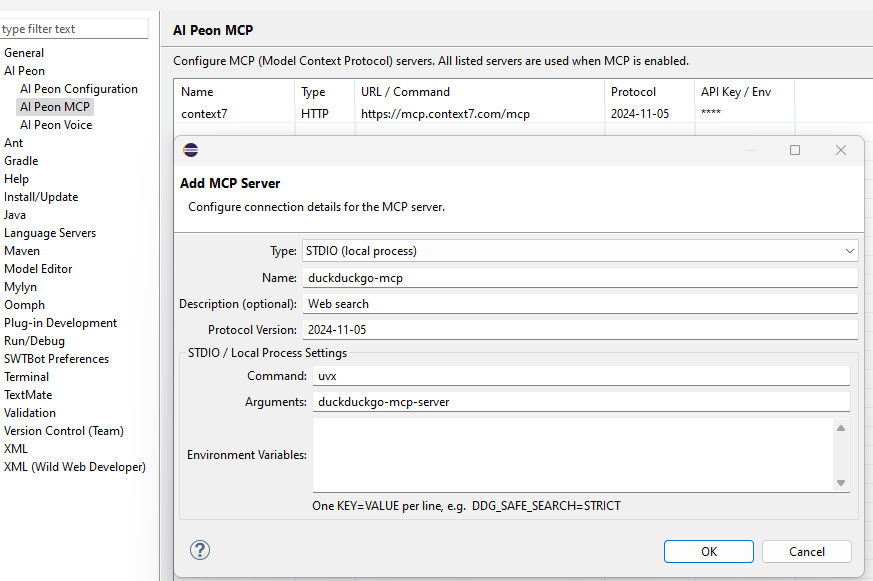

# MCP Configuration

MCP (Model Context Protocol) lets Peon AI connect to external tool servers — for example a documentation lookup server, a web search server, or any custom MCP-compatible service. The connected tools become available to the developer agent during implementation.

## Setup

Open **Window → Preferences → Peon AI → MCP Servers**.


Each server entry has a **Type** — either **HTTP (SSE)** or **STDIO (local process)** — plus common fields shared by both types.

### Common fields

| Field | Description |
|---|---|
| **Name** | Display name shown in the UI and used in log output. |
| **Description** | Optional hint for the AI describing what this server provides (e.g. "Web search"). |
| **Protocol Version** | MCP protocol version to announce. Defaults to `2024-11-05`. Only change this if the server requires a different version. |

### HTTP (SSE) fields

| Field | Description |
|---|---|
| **URL** | Streamable HTTP endpoint of the MCP server, e.g. `https://mcp.context7.com/mcp`. |
| **API Key** | Optional Bearer token. Leave empty if the server requires no authentication. |

### STDIO (local process) fields

STDIO servers run as a local subprocess. Peon AI starts the process and communicates over its stdin/stdout. This is useful for MCP servers that need access to personal credentials or local system resources.

| Field | Description |
|---|---|
| **Command** | Executable to launch, e.g. `uvx` or `npx`. |
| **Arguments** | Space-separated arguments passed to the command, e.g. `duckduckgo-mcp-server`. |
| **Environment Variables** | Optional environment variables in `KEY=VALUE` format, one per line. Use this to pass tokens or configuration without exposing them in a URL. |

**Example — DuckDuckGo web search via `uvx`:**



```
Type:      STDIO (local process)
Name:      duckduckgo-mcp
Command:   uvx
Arguments: duckduckgo-mcp-server
Env:       DDG_SAFE_SEARCH=STRICT
```

> **Prerequisite:** `uvx` requires [uv](https://github.com/astral-sh/uv) to be installed and available on the system `PATH`.

## Enabling MCP

Enable the **MCP** toggle in the chat toolbar to activate the configured servers. Peon AI connects to all servers on toggle-on and disconnects on toggle-off. If any server fails to connect, all servers are disconnected and an error is shown.

## Notes

- MCP tools are exposed directly to the **developer agent**. The planner agent does not receive them directly — MCP tools carry no read/write flag, so the planner's read-only filter cannot be applied safely. The planner can still reach MCP tools indirectly via the search sub-agent, which does include them.
- The search sub-agent (used during planning and implementation) also has access to MCP tools, so read-only MCP servers (e.g. documentation lookup, web search) are useful there too.
- If any configured server fails to connect, all servers are disconnected and an error is shown — this prevents the agent from working with an incomplete tool set.
- Tool names are taken directly from the server. If two servers expose a tool with the same name, the last one registered wins.

## Suggested MCP Servers

| Server | Type | Hosting | Best for |
|---|---|---|---|
| [Context7](https://context7.com) | HTTP | Cloud (free) | Up-to-date docs for React, Spring, Vite and many other frameworks. No setup required. |
| [DuckDuckGo MCP](https://github.com/nickclyde/duckduckgo-mcp-server) | STDIO (`uvx duckduckgo-mcp-server`) | Local | Privacy-friendly web search without an API key. |
| [docs-mcp-server](https://github.com/arabold/docs-mcp-server) | HTTP | Self-hosted | Any documentation site you can crawl. Fully private — nothing leaves your machine. |
| [openapi-mcp](https://github.com/janwilmake/openapi-mcp-server) | HTTP | Self-hosted | REST APIs with an OpenAPI 3.x spec. Exposes each endpoint as a callable tool. |
