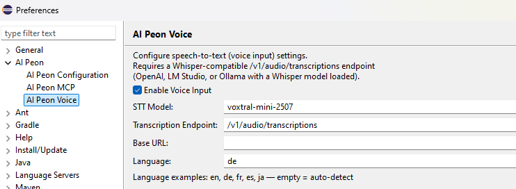
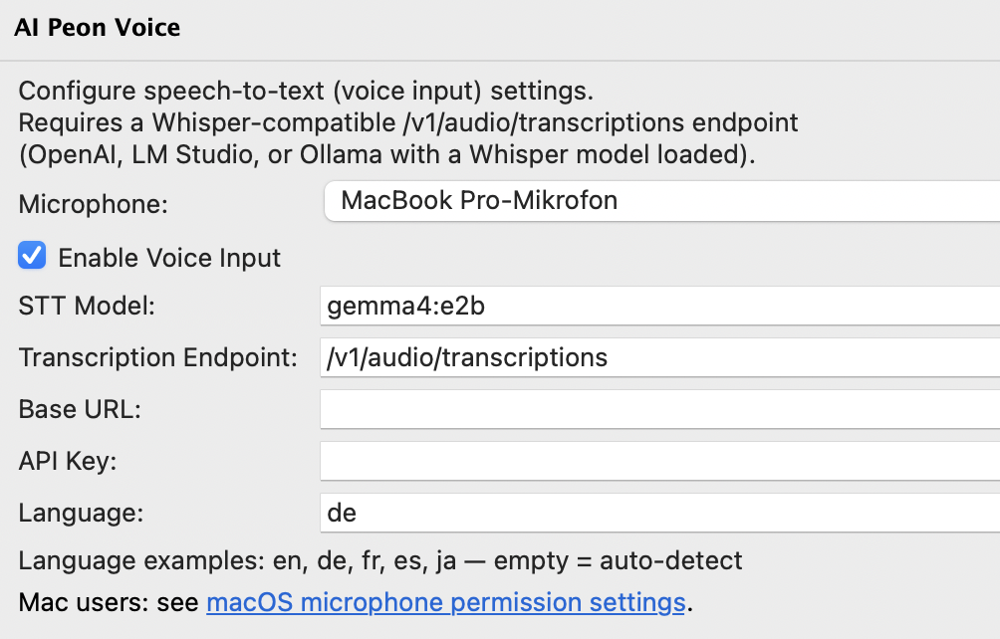

# Voice Input

Peon AI supports speech-to-text via any Whisper-compatible transcription endpoint. Recording is started and stopped with the microphone button in the chat toolbar.

## Setup

Open **Window → Preferences → Peon AI → Voice Input**.



Enable **Enable Voice Input** — the microphone button will appear in the chat toolbar once enabled.

## Fields

| Field | Description | Default |
|---|---|---|
| **STT Model** | Model name sent to the endpoint | `voxtral-mini-latest` |
| **Transcription Endpoint** | Path appended to the base URL | `/v1/audio/transcriptions` |
| **Base URL** | Override the transcription host. Leave empty to reuse the main provider URL. | *(empty)* |
| **API Key** | Override the API key for transcription. Leave empty to reuse the main provider API key. | *(empty)* |
| **Language** | BCP-47 code for better accuracy (e.g. `en`, `de`). Leave empty for auto-detect. | *(empty)* |

::: tip Base URL and API Key are only needed when your voice provider differs from your chat provider
If you use OpenAI for chat and Mistral for transcription, set **Base URL** to `https://api.mistral.ai` and **API Key** to your Mistral key. If both are the same provider, leave both empty.
:::

## Provider Examples

### OpenAI

| Field | Value |
|---|---|
| STT Model | `whisper-1` |
| Base URL | *(leave empty — reuses model url)* |

### Mistral AI

Mistral exposes a Whisper-compatible transcription [endpoint](https://docs.mistral.ai/api/endpoint/audio/transcriptions).

| Field | Value |
|---|---|
| STT Model | `whisper-large-v3` or `voxtral-mini-latest` |
| Base URL | `https://api.mistral.ai` |


### LM Studio (local)

Load a Whisper model in LM Studio and point voice input at your local server.

| Field | Value |
|---|---|
| STT Model | `whisper` |
| Base URL | `http://localhost:1234` |

### Ollama (local)

Ollama [doesn't support the whisper](https://github.com/ollama/ollama/issues/15515#issuecomment-4231546940) models - gemma4 works.

| Field | Value |
|---|---|
| STT Model | `gemma4:e2b` |
| Base URL | `http://localhost:11434` |

If you use `gemma4:26b` or higher for coding - reuse the model.



## Usage

Click the microphone button to start recording — the button turns red while active. Click again to stop; the audio is sent to the transcription endpoint and the result is inserted into the chat input.

## macOS Microphone Permissions

macOS does not automatically grant microphone access to Eclipse. When permission is denied, the system returns silent (all-zero) audio without any error, so recordings appear to succeed but produce no transcription.

If the microphone button records without producing any text, run the following three commands in a terminal, then **restart Eclipse**:

```bash
/usr/libexec/PlistBuddy -c \
  "Add :NSMicrophoneUsageDescription string 'Microphone access for audio recording'" \
  /Applications/Eclipse.app/Contents/Info.plist

codesign --force --deep --sign - /Applications/Eclipse.app

tccutil reset Microphone epp.package.committers
```

After restarting Eclipse, macOS will show the standard microphone permission dialog the next time you use voice input. Grant access and recording will work normally.
(For STS - replace `Eclipse.app` with `SpringToolsForEclipse.app`)

::: tip What each command does
- **PlistBuddy** — adds the `NSMicrophoneUsageDescription` key to Eclipse's `Info.plist`, which macOS requires before it will show the permission dialog.
- **codesign** — re-signs the app bundle so macOS accepts the updated `Info.plist`.
- **tccutil reset** — clears any previously denied microphone entry for the Eclipse bundle so macOS prompts again.
:::
