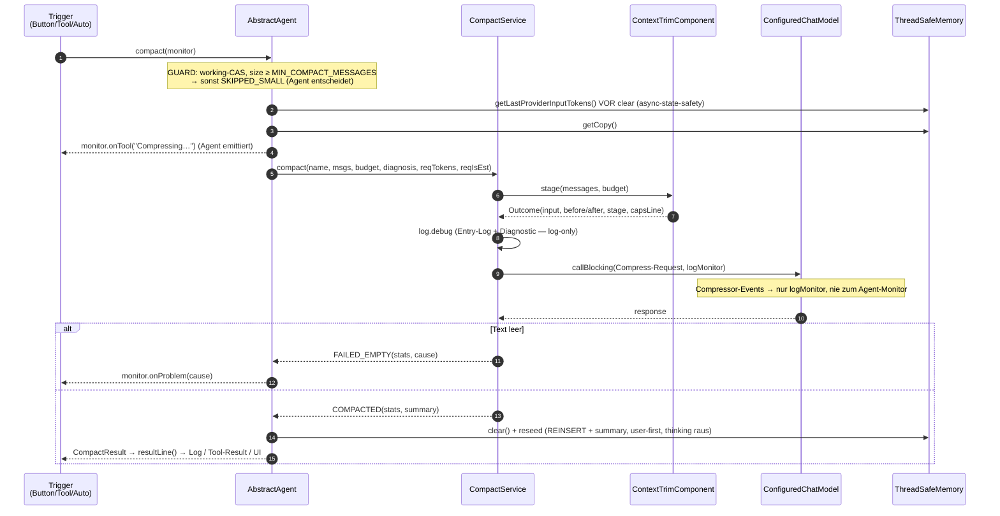

# Compact Architektur

> **Status:** ✅ (2026-09-26, gebaut `414edf4`→`d3e8833`, Da-Dok-Review) ·
> **Fachdocs:** [compact.md](compact.md) (R-CC-1…14) · [compact-input-budget.md](compact-input-budget.md) (R-CIB-1…6) ·
> **ADRs:** [ADR-0055](adr/0055-context-counter-input-not-cost.md) · [ADR-0056](adr/0056-compact-component-and-render-modes.md)

## Verantwortung & Abgrenzung

- **Zweck:** Kompaktiert die Chat-History eines Agenten budgetiert per LLM („Da Scribe") — Stufenkürzung
  des Inputs (R-CIB), Compressor-Call, Ehrliches `CompactResult` (R-CC-3), Diagnose-Dreiklang (R-CC-10).
- **In-Scope:** Trigger-Funnel, Guard/Policy, Staging, LLM-Call, Stats/Result, Log, Token-Diagnose-Format.
- **Out-of-Scope:** Live-Context (kein Think-Stripping im laufenden Turn), UI-State (Lock/Queue →
  [compact-lock.md](compact-lock.md)), Retry/Fehlerklassen (R-CC-7 🚧, mit ApiRetry-Tabelle),
  Context-Pollution an den Quellen ([open-points.md](open-points.md)).
- **Keine Überschneidung mit:** `StreamingBridge` (Chat-Streaming der Hauptkonversation), `ChatMessageUtil`
  (nur generische Token-Mathe), Plugin-UI (rendert model-Values, rechnet nichts).

## Kernprinzip (Ownership)

**Der Agent entscheidet und setzt zurück, der Service führt aus, das Component kürzt, das Result spricht.**

| Komponente | BESITZT |
|---|---|
| `AbstractAgent` (core `agent`) | den Vorgang: Guard/Policy (`working`-CAS, `MIN_COMPACT_MESSAGES`, Budget aus `autoCompactAfter`), `requestTokens`-Capture **vor** `clear()`, clear+reseed, Monitor-Emission (`onTool`/`onProblem`) |
| `CompactService` (core `compact`) | die LLM-Transformation: Compressor-Prompt, Call, log-only Monitor, „genau EIN debug-Log", `Stats` — **monitor-frei**, pure |
| `ContextTrimComponent` (core `compact`) | die Stufenkürzung: Stage-Caps (Think 9000 front, Tool-Results 6000, letzte UserMessage voll, dynamisches Per-Message-Cap), Presets — pure, kein LLM/Memory |
| `CompactResult` (core `model`) | die Antwort: `summary`, `Stats`, `resultLine()` — eine Implementierung für Log + Tool-Result + UI |
| `ThreadSafeMemory` | die Token-Zahlen (`totalTokenUsed`, `tokenIsEstimate`, `lastProviderInputTokens`) + deren Format `tokenDiagnosis()` (R-CC-10) |
| `ChatMessageUtil` | nur die generische Mathe (`chars×2/7`, 1× zentral) |

**Emissions-Regel:** Jede Komponente emittiert nur an den Besitzer ihres Pfads — Agent am Monitor,
Service am Log. Niemand anderes spricht zum User.

## Schnittstellen & Abhängigkeiten

| Richtung | Gegenüber | Wofür |
|---|---|---|
| nutzt | `ThreadSafeMemory` (Agent-seitig) | getCopy, Capture vor clear, tokenDiagnosis |
| nutzt | `CompactService` → `ContextTrimComponent` | stage(input, budget) → Outcome |
| nutzt | `CompactService` → `ConfiguredChatModel` | Compressor-Call (`callBlocking`, log-only Monitor) |
| nutzt | `CompactService` → `ChatMessageUtil` | `estimateTokens` (Formel) |
| genutzt von | Trigger: AIChatView-Button, `CompactSessionTool`, `PoDelegateTool`, Auto-Compact | alle funneln `AiAgent.compact(monitor)` |
| genutzt von | Plugin `AIChatView`/`AiAgentStatusModel` | lesen nur `CompactResult` (model) |

Input: `List<ChatMessage>` + Budget + `tokenDiagnosis`-String + `requestTokens/requestIsEstimate` ·
Output: `CompactResult` (model) — Plugin sieht **keinen** core-`compact`-Typ.

## Diagramm (Sequenz)

## Architektur-Check

- [x] Keine Komponenten-Zyklen (Abhängigkeiten nur „eine Richtung": Agent→Service→Trim→Util)
- [x] Klare Verantwortung, deckt die Regeln des Fachdocs ab (R-CC-11…14)
- [x] Kapselung: Service kennt keinen Agent-/Memory-/Plugin-Typ (nur Strings + Values); Plugin
      importiert nur `CompactResult`
- [x] Single Responsibility, keine Duplizierung (Formel 1×, resultLine 1×, Entry-Log 1×)
- [x] Composable: Service pure & monitor-frei — Tests brauchen kein LLM/keinen Monitor
