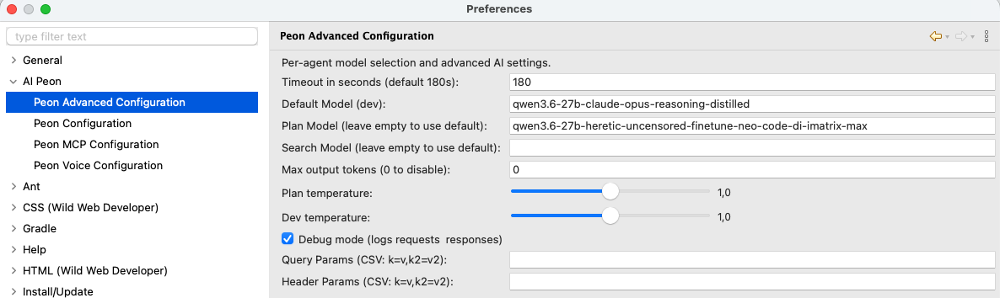

# Advanced Configuration

The AI Peon plugin provides advanced configuration options accessible via **Window > Preferences > AI Peon > Peon Advanced Configuration**.

## Per-Agent Model Selection

Different agents can use different models to optimize for cost, speed, or capability:

| Agent | Purpose | Recommended Model Type |
|-------|---------|----------------------|
| **PO (Jon)** | Coordinating the agent team and clarifying requirements | Strong conversational and reasoning models (e.g., `Sonnet`) |
| **Dev (default)** | Implementing the plan / code generation | Reasoning-capable models (e.g., `Sonnet`) |
| **Plan** | Creating task plans and strategies | Reasoning-capable models (e.g., `Opus`) |
| **Search** | Finding relevant context and information | Fast, smaller models (e.g., `Haiku`) |
| **Compact** | Conversation compression for context management | Fast, smaller models (e.g., `Haiku`) |

### How It Works

1. The **Dev agent always uses the base model** you configure — this is your primary coding model
2. Leave URL or API key empty to inherit it from the base configuration. For the model, an empty **PO** or **Dev** field falls back to the base model; **Plan**, **Search**, and **Compact** use the provider's default model.
3. Pick a model from the **dropdown** (or type one) to override only that agent's model
4. The dropdown is filled from your provider's model list, **fetched once per connection** (the agent's effective URL/key). Click **Refresh** to reload the list — a failed refresh keeps the previous one. A model you have already configured stays selected even if it is missing from the fetched list.

Existing installations start with an empty PO slot, which inherits the base configuration. If Jon was previously controlled through the Plan slot, configure the PO slot once after upgrading.

## Temperature Settings

Every built-in agent — **PO (Jon)**, **Dev**, **Plan**, **Search**, and **Compact** — has its own Temperature field. There is no shared default and no value is inherited between agents.

- **Empty** means unset: Peon omits `temperature` and lets the provider or model choose its default. This is important for GPT-5 and o-series models, which reject non-default temperature values.
- Search and Compact now send nothing unless their own value is set (previously they implicitly sent `0.3` and `0.2`). To keep the old values, enter them once in the corresponding fields.
- Enter a number to send that value for this agent. The field is plain text so provider-specific values are not restricted to an artificial slider range.
- An invalid value is saved but ignored when requests are built; Peon logs a warning and omits `temperature`.
- A top-level `temperature` in **Extra body (JSON)** wins over the Temperature field and is sent only once.

## Per-Agent Think

Thinking/reasoning is sent **per request**, so each agent resolves its own value for its provider and model. This solves mixed setups — for example planning with **GPT** (`reasoning.effort=high`) while implementing with **DeepSeek** through an OpenAI-compatible gateway that rejects `reasoning.effort`.

Every built-in agent — **PO (Jon)**, **Dev** (the default), **Plan**, **Search** and **Compact** — has its own **Think** field on this page, and every [custom agent](./custom-agents.md) sets the same via its `AGENT.md` frontmatter triple. **Nothing is inherited between agents.**

The Think field takes a single value whose form depends on the base provider:

| Provider | Think field | Values |
|----------|-------------|--------|
| **OpenAI family** | dropdown | `high` / `medium` / `low` / `minimal` (`reasoning.effort`) |
| **Claude (Anthropic)** | dropdown | `enabled` / `adaptive` (extended thinking) |
| **Ollama** | checkbox | on (`true`) / off |
| **LM Studio** | free text | any value — sent as the custom `reasoning` body property |

- **Off / empty** — nothing is sent (provider default), except Ollama sends `think:false`.
- **Generic on** (`true`) — the [built-in model mapping](#built-in-model-mapping) picks the concrete value for your provider/model.
- **Concrete value** — used verbatim.

### Auto vs. manual

- **Auto** — the field is set to the generic on (`true`) → Peon uses the built-in mapping for your provider/model.
- **Manual** — set a concrete value (e.g. `high`, `enabled`) → the mapping is switched off and your value is used verbatim.

### Built-in model mapping

When the Think field is set to the generic on (`true`), Peon maps to a provider- and model-specific value using built-in tables (one file per provider under the core plugin's `thinking/` resources):

- **OpenAI family** — known reasoning models (`gpt*`, `o1`, `o3`, `o4`) → `reasoning.effort=high`; an **unknown model → nothing is sent**.
- **Anthropic** — `opus-4-8` / `opus-4-7` / `mythos` → `adaptive`; other Claude models → `enabled`.

**Provider support:**

- **OpenAI family** (OpenAI, OpenAI-official / Azure, GitHub Models, GitHub Copilot) — `reasoning.effort`. Empty/off = nothing sent.
- **Ollama** — the `think` flag: off sends `think:false`, on sends `think:true`, unset omits.
- **Anthropic** — extended thinking (`enabled` / `adaptive`); off = nothing sent.
- **LM Studio** — the custom `reasoning` body property.
- **Google Gemini / Mistral** — no per-request think support; the Think field is hidden and no think value is sent.

### Send thinking back

**Show and resend model thinking** (main Peon Configuration page) is a separate global transport switch. It is **independent** of model support.

## Extra Body / Prompt Caching

Each agent's section has an **Extra body (JSON)** field: raw JSON merged into that agent's request body. This is also where **prompt caching** is configured — Peon no longer enables caching by itself, so **no cache is sent until you configure one** (a deliberate clean break, no silent default, no migration).

### Examples

Three paste-ready examples sit under the field (shown only for providers that support an extra body):

| Example | Body | Effect |
|---------|------|--------|
| **GPT** | `{"prompt_cache_key": "llmpeon"}` | Azure-OpenAI explicit prompt-caching key. On other OpenAI-compatible endpoints the top-level field is ignored (harmless). |
| **Claude** | `{"cache_control": {"type": "ephemeral"}}` | The ephemeral cache marker — effective for Claude behind OpenAI-compatible gateways (LiteLLM & co.) that forward the field. |
| **llama.cpp** | `{"chat_template_kwargs": {"enable_thinking": false}}` | Disables thinking/reasoning in llama.cpp models. |

GPT-5* agents get a default per-agent cache key `peon-ai-<agent>`; override it in the JSON body.

Click the example button to insert it into the field (it replaces the current content). Hover a button for a description. The body is sent per request for OpenAI-family providers and baked in at build time for Anthropic.

Cache hits are visible in the chat's token header: `↑ sent  ↓ received  ⇄ cache-read` — the `⇄` counter accumulates tokens served from the prompt cache (cache writes are shown in the header's tooltip).

### No cache by default

Since the clean break, the provider no longer injects `cache_control` (Claude) or the native Anthropic cache flags on its own. If you want prompt caching, paste the matching example for your provider.

> **Note for direct Anthropic API users:** native system/tool caching (`cache_control` inside the system/tool blocks) is a build-time flag Peon no longer sets, and it cannot be re-enabled through the top-level extra body. Direct Claude API users therefore lose automatic prompt caching; the `cache_control` example works for Claude behind an OpenAI-compatible gateway instead.

## Debug Mode

When enabled, logs all requests and responses to the Eclipse console.

**Use cases:**
- Troubleshooting connection issues
- Understanding what context is being sent to the model
- Debugging prompt template issues if you create an issue

## Query Parameters

Add custom query parameters to API requests (format: `key=value,key2=value2`):

**Example:** `stream=false,timeout=30`

Useful for:
- Provider-specific options not exposed in the UI
- Testing different API behaviors
- Adding custom headers through query strings

## Header Parameters

Add custom HTTP headers to requests (format: `key=value,key2=value2`):

**Example:** `X-Custom-Header=myvalue,Authorization=Bearer token123`

Useful for:
- Custom authentication requirements
- Provider-specific features via headers
- Adding tracking or debugging information

## Max Output Tokens

Controls the maximum number of tokens in model responses (0 = disable limit):
`langchain4j` and some LLMs default to 1024 -- if you have odd behaviors increase this.

| Setting | Effect |
|---------|--------|
| **Low values** (1024) | Short, concise responses; faster generation - may break |
| **Recommended low** (2048) | Have a short value, limits also the think budget where possible |
| **Default nowerdays** (4000) | Usually a a good default or with Opus around 8.000 |
| **Disabled** (0) | Provider's default limit applies - often around 2.048 |

---

## Troubleshooting

### Models Not Being Used by Agents

Restart Eclipse after changing preferences
