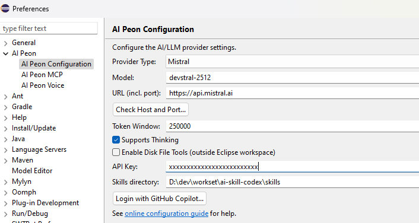

# Configuration

After installation, configure the plugin via **Window > Preferences > Peon AI**.

## Provider Settings

### Ollama

Run models locally e.g. mac.

| Setting | Value |
|---------|-------|
| Provider | `OLLAMA` |
| Model | `llama3.2`, `codellama`, `qwen2.5-coder`, `mistral` |
| Base URL | `http://localhost:11434` |

- [Ollama documentation](https://ollama.com/library)
- [Ollama model library](https://ollama.com/search)

### LM Studio

Run models locally — e.g. for windows.

| Setting | Value |
|---------|-------|
| Provider | `LM Studio / OpenAI HTTP 1.1` |
| Model | `qwen/qwen3.5-9b` |
| Base URL | `http://localhost:1234/v1` |

### OpenAI

| Setting | Value |
|---------|-------|
| Provider | `OPEN_AI` |
| Model | `gpt-4o`, `gpt-4o-mini`, `o3-mini` |
| Base URL | `https://api.openai.com/v1` |
| API Key | Your OpenAI API key |

- [OpenAI model overview](https://platform.openai.com/docs/models)
- [OpenAI API keys](https://platform.openai.com/api-keys)

::: tip OpenAI-compatible APIs
Any OpenAI-compatible server (LM Studio, OpenRouter, LocalAI, vLLM, …) works by changing the Base URL.
Set the API Key to a dummy value like `none` if the server does not require one.
:::

### Google Gemini

| Setting | Value |
|---------|-------|
| Provider | `GOOGLE_GEMINI` |
| Model | `gemini-2.0-flash`, `gemini-2.5-pro-preview-03-25` |
| Base URL | *(leave empty)* |
| API Key | Your Google AI Studio API key |

- [Gemini model overview](https://ai.google.dev/gemini-api/docs/models/gemini)
- [Get a free API key](https://aistudio.google.com/apikey)

### Mistral AI

| Setting | Value |
|---------|-------|
| Provider | `MISTRAL` |
| Model | `mistral-large-latest`, `mistral-small-latest`, `devstral-latest` |
| Base URL | *(leave empty)* — set `https://api.mistral.ai` in Voice preferences if using voice input |
| API Key | Your Mistral API key |

- [Mistral model overview](https://docs.mistral.ai/getting-started/models/models_overview/)
- [Get a Mistral API key](https://console.mistral.ai/api-keys/)

### GitHub (Marketplace)

Using the [GitHub Models marketplace](https://github.com/marketplace/models) with pay-per-use billing.

| Setting | Value |
|---------|-------|
| Provider | `GitHub (PAT)` |
| Model | Varies; use model picker to list available models |
| Base URL | `https://models.inference.ai.azure.com` (default) or custom endpoint |
| API Key | Your GitHub Personal Access Token (PAT) with `models:read` scope |

**Authentication:**
1. Generate a [GitHub PAT](https://github.com/settings/tokens) with `models:read` scope
2. Paste the token in the API Key field
3. Click "Check Host and Port..." to verify connectivity

**Available models:** Use the **Model** picker to list all marketplace models you have access to. Models are filtered to those supporting tool calling only.

---

### GitHub Copilot (Subscription)

Access Claude Sonnet, Claude Opus, Claude Haiku, GPT-5, and more as a [GitHub Copilot](https://github.com/copilot) subscriber.

| Setting | Value |
|---------|-------|
| Provider | `GitHub Copilot (subscription)` |
| Model | Claude Sonnet, Claude Opus, Claude Haiku, GPT-4o, GPT-5-mini, etc. |
| Base URL | *(leave empty for github.com; enter custom domain for GitHub Enterprise)* |
| API Key | *(leave empty; OAuth token obtained via login button)* |

**Authentication:**
1. Click **Login with GitHub Copilot...** button in the preferences
2. Select GitHub deployment type (github.com or GitHub Enterprise)
3. Complete the device flow authorization in your browser
4. The plugin stores your OAuth token and auto-selects the `GITHUB_COPILOT` provider
5. Use the **Model** picker to list available Copilot models (Sonnet, Opus, etc.)

**Requirements:**
- Active GitHub Copilot subscription (Individual $10/month, Business, or Enterprise)
- Copilot access enabled on your GitHub account

**Model availability:** Models listed depend on:
- Your Copilot subscription tier
- Regional availability
- GitHub's current model catalog

---

### Difference: Marketplace vs. Subscription

| | **Marketplace (PAT)** | **Copilot (OAuth)** |
|---|---|---|
| **Product** | GitHub Models marketplace | GitHub Copilot subscription |
| **Auth method** | Personal Access Token | OAuth Device Flow |
| **Billing** | Pay-per-use | Monthly subscription |
| **Models** | Public marketplace catalog | Copilot subscriber models (Claude, GPT-5) |
| **Provider name** | `GITHUB_MODELS` | `GITHUB_COPILOT` |
| **Use case** | One-off testing, marketplace exploration | Primary AI assistant with Copilot benefits |

## Settings

### Token Window

The **Token Window** setting controls how many tokens of conversation history are sent to the AI model with each request. This is configured in the preference page as an integer field and stored in `LlmConfig.tokenWindow`.

| Setting | Value |
|---------|-------|
| Preference Key | `llm.tokenWindow` (`PREF_TOKEN_WINDOW`) |
| Default Value | `80.000` tokens |
| Type | Integer |
| Editor Component | `IntegerFieldEditor` in `AiConfigPreferenceView` |

#### Important Distinction: Token Window vs Message Memory Buffer

| Component | Purpose | Limit | Configurable |
|-----------|---------|-------|--------------|
| **Token Window** | Max token window a model supports | ~256.000 (configurable) | Yes - via this setting |
| **Max output tokens** | Max amount of token a model may generate | 0 (none) | see advanced configuration |

**Explanation:** The token window limits what context is *sent to the LLM* for each request. As soon it is reached a `auto compact` is triggered. In the tool call chain the LLM will get a message to use the `compact session tool` if this limit is reached.

---

#### Important Considerations

1. **Token counting includes both directions**: The token window counts both user messages AND AI model responses in the conversation history.

2. **Provider auto-truncation**: If you set a value larger than your provider supports, they may:
   - Automatically truncate older messages (silently)
   - Reject the request with an error
   - Return degraded responses
   - Locally it will just crash your system

3. **Check provider documentation**: Before setting very high values, verify your specific model's maximum context window in the provider's documentation.

4. **Testing recommended**: After changing token window, test with a longer conversation to ensure the AI can reference earlier messages correctly.

5. **Token estimation vs actual tokens**: The value you set is an estimate; actual token counts vary by language and model encoding.

### Thinking Support

The **Supports Thinking** option enables models that support "thinking" or chain-of-thought reasoning, allowing them to show intermediate reasoning steps before generating final responses. This is useful for complex problem-solving tasks where you want to see the model's thought process.

## Testing the Connection

1. Open the Peon AI chat view
2. Type a test message like "Hello"
3. If configured correctly, you should receive a response

::: tip Troubleshooting
If connection tests fail, verify:
- The server is running and accessible at the specified URL
- Firewall settings allow connections to the port
- For local servers (Ollama, LM Studio), ensure they're started before testing
:::