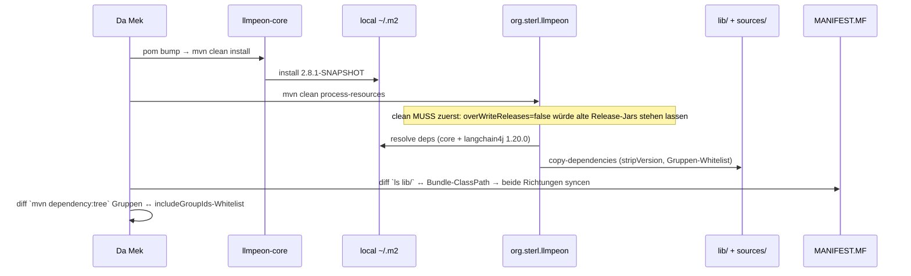

# Plan: Dependency-Update Cycle 2026-09 — branch `story/lib-update-2026-09-09`

## ⛔ STOP-AND-ASK (convention 2026-09-08) — READ FIRST
Bei Compile-Fehlern ohne Lösung, nicht-grün-bekommenden Tests, IST-Widersprüchen zum Plan oder
Unklarheiten: AKTIV bei Jon (askDev) nachfragen — nie still workarounden, nie SOLL ändern.
Zusätzlich bindend: `eclipseBuildProject` vor jedem PDE-Testlauf; Maven Surefire = ground truth
für Testzahlen; hängt ein PDE-Launch mit "0 tests ran" (einmalige Workspace-Trust-Bestätigung
nötig) → Jon informieren, NICHT parallel nachstarten. Commit nach jeder grünen Iteration ALLE
geänderten Dateien (inkl. poms/MANIFEST), nie nur Code. Nur auf dem Branch arbeiten; Merge/Squash
= User-Entscheidung.

## 1. Context
SOLL = **ADR-0044** (`docs/adr/0044-target-2026-09-dependency-update.md`, accepted, normativ).
Ziel: Target-Platform 2026-03 → **2026-09**, jakarta.annotation auf 3.0, langchain4j auf 1.20.0,
übrige pinned libs innerhalb der Major-Line auf latest. User-Entscheidung: Target 2026-09,
Branch `story/lib-update-2026-09-09`, ALLE Lib-Updates werden von uns gemacht (Major-Jumps nur
reporten). Der User hat bereits uncommitted: tycho 5.0.3→5.0.4, target 2026-03→2026-06,
AGENTS.md, AGENTS-DEV.md, docs/memory.md, 6 gelöschte peon-plan/overview-done-*.md.

Verifizierte Fakten (nicht re-verifizieren):
- Repo `/llmpeon-parent` (Disk: `/Users/sterlp/dev/workset/peon-ai`), `main` == origin, HEAD e55668b.
- Simrel 2026-06/09 liefern jakarta.annotation {1.3.5, 3.0.0}; 2.1.1 war zuletzt in 2026-03.
- Maven Central (2026-09-09 geprüft): langchain4j latest = **1.20.0**;
  `langchain4j-mcp` und `langchain4j-open-ai-official` latest = **1.20.0-beta30** (gleiche Linie).
- `org.sterl.llmpeon/META-INF/MANIFEST.MF`: `Import-Package: jakarta.annotation;version="[2.1.0,3.0.0)"`;
  `Bundle-ClassPath` listet ~50 version-less `lib/*.jar`.
- lib/-Mechanik: `org.sterl.llmpeon/pom.xml` maven-dependency-plugin `copy-dependencies`
  (stripVersion, `includeGroupIds`-Whitelist, **`overWriteReleases=false`**), Sources analog;
  maven-clean-plugin räumt `lib/` + `sources/`.
- Aktuelle Pins: lombok 1.18.44 (core-pom property), mockito 5.23.0 (parent property),
  junit-bom 5.12.2, assertj 3.27.3, slf4j-simple **2.0.18 (core/test) und 2.0.17 (plugin/compile —
  doppelt gepinnt!)**, jimfs 1.3.0, flexmark 0.64.8; Plugins: compiler 3.15.0, surefire 3.5.5,
  clean 3.3.2, dependency 3.6.1, resources 3.3.1. Tycho 5.0.4 (bleibt).

## 2. Design decisions
1. **4 vertikale Increments**, jedes unabhängig grün + commit (clean-break, kleine Scheiben).
2. **Beta-Module wandern mit**: `langchain4j-mcp` + `langchain4j-open-ai-official` 1.16.1-beta26 →
   **1.20.0-beta30** (gleiche Familie, passende Linie existiert — ADR "alle Lib-Updates gleiche
   Major-Line" deckt das ab). Safety valve: bricht der Build und ist nicht behavior-preserving
   zu fixen → zurück auf 1.16.1-beta26 + Jon reporten.
3. **slf4j-simple entdoppeln** (inc-4): eine Property `<slf4j-simple.version>` im Parent, beide
   poms referenzieren sie (aktuell 2.0.17 vs. 2.0.18 — still divergent, genau die Art von Drift,
   die AGENTS.md verbietet).
4. **Kein Code-Change außer compile-fixes** — behavior-preserving only. Docs sind Jon's Domain
   (inc-1 committet die User-Änderungen exakt wie sie sind).
5. Version-less jar-Namen in `lib/` + MANIFEST bleiben (stripVersion), keine versionierten Namen.

## 3. Architecture / data flow (inc-3, der nicht-triviale Teil)
Abhängigkeitsrichtung ändert sich nicht. Kritisch ist der lib/-Regenerations-Fluss:

Zwei False-Negative-Fallen (AGENTS.md-Kostenlernen), beide im Plan abgedeckt:
- **Stale jars**: `overWriteReleases=false` → ohne `clean` bleibt altes 1.19.0-jar unter gleichem
  version-less Namen liegen. Immer `clean process-resources`.
- **Whitelist-Lücke**: zieht 1.20.0 eine transitive Abhängigkeit aus einer Gruppe, die nicht in
  `includeGroupIds` steht, fehlt das jar in `lib/` → erst zur Laufzeit ClassNotFoundException
  (teuerster Bug-Typ hier). Deswegen dependency:tree-Diff gegen die Whitelist.

## 4. Affected files / commands (je Increment)

### inc-1 — Housekeeping (kein Code, kein Test) ✅ DONE (fe761f8)
- `git checkout -b story/lib-update-2026-09-09` von main.
- User-Pending-Changes exakt so committen: `pom.xml`, `releng/llmpeon-target/llmpeon.target`,
  `AGENTS.md`, `AGENTS-DEV.md`, `docs/memory.md`, 6 gelöschte `peon-plan/overview-done-*.md`.
- Im Reply: `git diff --stat` (main...HEAD) + One-Liner-Gist pro Doc-Änderung.

### inc-2 — Target 2026-09 + jakarta.annotation 3.0
- `releng/llmpeon-target/llmpeon.target`: URL → `https://download.eclipse.org/releases/2026-09`.
- `org.sterl.llmpeon/META-INF/MANIFEST.MF`: `jakarta.annotation;version="[3.0.0,4.0.0)"`
  (`jakarta.inject [2.0.0,3.0.0)` bleibt — von 2026-09 geliefert, per Resolve verifiziert).
- Verify: `mvn -pl org.sterl.llmpeon,releng/llmpeon-target compile` (echter Resolve-Probe —
  target-only validate ist in Tycho 5 ein No-op), dann `eclipseBuildProject` (beide Plugin-Projekte)
  → Plugin-Suite grün (~194). Commit.

### inc-3 — langchain4j 1.20.0
- `pom.xml` (parent): `<langchain4j.version>1.20.0</langchain4j.version>`,
  neu: `<langchain4j.beta.version>1.20.0-beta30</langchain4j.beta.version>`.
- `org.sterl.llmpeon.core/pom.xml`: `langchain4j-mcp` + `langchain4j-open-ai-official` auf
  `${langchain4j.beta.version}`. Compile-Breaks in core behavior-preserving fixen.
- Ablauf wie Diagramm (§3): core `mvn clean install` → Plugin `mvn clean process-resources`
  → lib/↔MANIFEST-Diff → dependency:tree-Whitelist-Check.
- Verify: core Surefire grün (~699) + Plugin-Suite grün. Commit (inkl. lib/, sources/, MANIFEST).

### inc-4 — übrige pinned libs (gleiche Major-Line, Central-Check zuerst)
- Prüfen & bumpen: lombok 1.18.x, mockito 5.x, junit-bom 5.x, assertj 3.x, slf4j-simple 2.0.x
  (+ Entdoppelung via Parent-Property, s. §2.3), jimfs 1.x, flexmark 0.64.x; Maven-Plugins:
  compiler, surefire, clean, dependency, resources (Versionen in Parent-/Modul-poms, s. §1-Liste).
- Schon latest → nichts tun, im Reply notieren. Major-Jump nötig → NICHT machen, reporten.
- Verify: `mvn clean install` am Parent (alle Module) grün + Plugin-Suite grün. Commit.
- Fallback-Regel: schlägt nur `org.sterl.llmpeon.test` im Maven-Lauf aus Umgebungsgründen fehl →
  Jon reporten; Plugin-Gate bleibt `eclipseRunTests` grün.

## 5. Rules & constraints
- Keine Migrationen: Clean break; MANIFEST-Ranges präzise gegen das Ziel setzen, keine Orbit-Workarounds.
- Sync in BEIDEN Richtungen: fehlen nach Regeneration jars in `lib/` → Einträge aus
  Bundle-ClassPath entfernen; neue jars → Einträge ergänzen (alphabetisch ans Ende ist OK).
- `includeGroupIds`-Whitelist erweitern, wenn dependency:tree neue Gruppen zeigt (sonst False Negative).
- Secrets/n.a. — keine. Keine UI-Änderungen → homepage/ nicht betroffen.
- Kein Docs-Write durch Da Mek (ADR-0044 existiert bereits; Story-Docs pflegt Jon).

## 6. BDD acceptance (meßbar, je Increment)
- **inc-1**: GIVEN main @ e55668b WHEN branch angelegt + User-Changes committet THEN working tree
  clean auf `story/lib-update-2026-09-09`, `git diff --stat main...HEAD` zeigt genau die genannten
  Dateien. (Verifikation: git status; kein Test.)
- **inc-2**: GIVEN target 2026-09 + MANIFEST [3.0.0,4.0.0) WHEN `mvn -pl org.sterl.llmpeon,releng/llmpeon-target compile`
  THEN resolve grün; WHEN Plugin-Suite läuft THEN ~194 Tests, 0 Fehler.
- **inc-3**: GIVEN langchain4j 1.20.0/beta30 WHEN `mvn -pl org.sterl.llmpeon.core clean install`
  THEN Surefire ~699 grün; WHEN `mvn -pl org.sterl.llmpeon clean process-resources` THEN
  `{ls lib/}` == Bundle-ClassPath-Menge (beide Richtungen diff-leer) und keine Gruppe außerhalb
  der Whitelist; WHEN Plugin-Suite THEN 0 Fehler.
- **inc-4**: GIVEN gebumpte Pins WHEN `mvn clean install` (Parent) THEN alle 6 Module grün;
  Plugin-Suite 0 Fehler; Reply listet je Artefakt: alt → neu (oder "bereits latest" / "Major nötig: X").

## 7. Test strategy
Keine neuen Tests — Infrastruktur-Zyklus; der vorhandene Suite-Bestand ist das Meßinstrument
("Test wäre auch ohne Feature grün" greift hier nicht, denn die Suites sind das Feature-Kriterium).
- Core: Maven Surefire (~699, excludedGroups=integration) — ground truth.
- Plugin: OSGi-Suite (~194) via `eclipseRunTests` nach `eclipseBuildProject`; erster Lauf kann
  einmalige Trust-Bestätigung brauchen (hängt → melden, nicht parallel nachstarten).

## 8. Open questions
None — Beta-Module-Bump (§2.2) und slf4j-Entdoppelung (§2.3) sind aus ADR-0044 + User-Vorgabe
("alle Lib-Updates, gleiche Major-Line") abgeleitet und markiert; dev eskaliert via STOP-AND-ASK,
falls der IST dem widerspricht.

## 9. Review (Da Dok, 2026-09-10) — Verdict: **CONCERNS**

### 9.1 Verifizierte Claims (Plan↔Code, Docs↔Code)
- inc-1..4 + docs commits existent: `fe761f8`, `89531af`, `8706406`, `01a056a`, `64135b2`.
- inc-2: target-URL 2026-09 ✓, MANIFEST `jakarta.annotation [3.0.0,4.0.0)` ✓, `jakarta.inject
  [2.0.0,3.0.0)` unverändert ✓ — exakt ADR-0044.
- inc-3: parent `langchain4j.version=1.20.0` + `langchain4j.beta.version=1.20.0-beta30`
  (pom.xml:15-16), core pom nutzt `${langchain4j.beta.version}` für mcp + open-ai-official ✓.
- inc-4: alle Bumps verifiziert latest-in-line (Maven Central, 2026-09-10): lombok 1.18.48,
  junit-bom 5.14.4 (6.x gemeldet), assertj 3.27.7 (4.0.0-M1 gemeldet), slf4j-simple 2.0.19
  (2.1.0-alpha1 gemeldet), jimfs 1.3.2, compiler 3.16.0, surefire 3.6.0, clean 3.5.0,
  dependency 3.11.0, resources 3.5.0. Bereits-latest korrekt: mockito 5.23.0, flexmark 0.64.8.
  slf4j-Entdoppelung §2.3 umgesetzt: Parent-Property 2.0.19, beide poms referenzieren sie ✓.
- lib-Sync stimmt in beiden Richtungen: MANIFEST Bundle-ClassPath ≡ build.properties ≡
  .classpath ≡ lib/ auf Disk (57 jars, u.a. slf4j-simple.jar; okhttp-sse raus,
  kotlin-stdlib-jdk7 + langchain4j-reactive-streaming neu). sources/ = 19 Quell-Jars auf
  1.20.0/beta30/2.0.19 ✓.
- Build-Zustand von mir verifiziert: `eclipseBuildProject` org.sterl.llmpeon + Problems
  llmpeon-core = nur Warnings (null-safety, discouraged access, unused imports), keine Errors ✓.

### 9.2 Deviations — klassifiziert
1. **McpService → StreamableHttpMcpTransport** (org.sterl.llmpeon.core/src/main/java/
   org/sterl/llmpeon/mcp/McpService.java, buildWebMcp ~108-124): HttpMcpTransport ist in
   langchain4j-mcp beta30 entfernt (Quelle verifiziert, nur StreamableHttpMcpTransport existiert)
   → Fix war FORCED, legitime Umsetzung. ABER nicht strikt behavior-preserving: Legacy-MCP-Server
   (HTTP+SSE, 2024-11-05-Protokoll) können sich nicht mehr via HTTP_SSE-Typ verbinden; HTTP und
   HTTP_SSE verhalten sich jetzt identisch. **CONCERN (nicht-blockierend): User muss das
   semantic change sehen (ADR-Addendum oder Release-Note), nicht nur "compile-fix".**
2. **Whitelist nicht erweitert** (`io.smallrye.reactive:mutiny-zero`, transitive Dep von
   langchain4j-reactive-streaming): Begründung verifiziert — AiServiceStreamingEventPublisher
   liegt im langchain4j-Hauptartikel und wird nur von AiServices/DefaultAiServices referenziert;
   core/plugin haben null AiServices-/reactive-Referenzen (nur SmartToolExecutor.java:12,
   DefaultToolExecutor). Kein Laufzeitrisiko. Nicht-blockierend; billige Versicherung wäre,
   die Gruppe trotzdem in `includeGroupIds` aufzunehmen.
3. **lib//sources/ nicht committet** (Plan inc-3 sagte "Commit inkl. lib/, sources/, MANIFEST"):
   `.gitignore` ignoriert lib/ + sources/ (Repo-Konvention, älter als der Zyklus) → committet
   wurden MANIFEST/build.properties/.classpath, Jars via `mvn clean process-resources` regeneriert.
   Legitime Abweichung, in memory.md inc-3 dokumentiert. **Plan coverage gap** (nicht Da Meks
   Schuld): Plan-Wording kollidierte mit .gitignore.
4. **AGENTS-DEV.md m2e-Stale-Model-Bullet** (inc-3, 2026-09-10): korrekt unter "Build & test"
   platziert, neben dem m2e-Lombok-Pitfall; legitim nach inc-24-Präzedenz. Akzeptiert.

### 9.3 Fixture-Bug (Triage-Input, außerhalb dieses Zyklus)
REAL: PeonAiServiceTest.java:1444 und :1501 — beide finally-Blöcke rufen
`deleteRecursively(fixtureSkillsDir.getParent())`; fixtureSkillsDir = `<project>/.agents/skills`
(SkillService.PROJECT_SKILLS_DIR, SkillService.java:34) → getParent() = `<project>/.agents` →
löscht das getrackte `test_project/.agents/skills/test/SKILL.md` mit. Datei ist aktuell wieder
auf Disk ( Smoke-Test-Skill, von User restored). Fix-Vorschlag (nur die selbst erstellten Dateien
löschen) gehört ins Bug-Hunt-Triage — hier nicht umgesetzt (PO-Regel: nur melden).

### 9.4 Risiko-Line
Most likely reason this breaks later: eine künftige nicht-whitelisted transitive Abhängigkeit
(wie heute mutiny-zero) oder eine spätere AiServices-Nutzung → runtime ClassNotFoundException
auf ungetestetem Pfad. Change, der das Risiko am stärksten reduziert: dependency:tree↔
includeGroupIds-Diff als Ritual NACH jedem Lib-Bump festhalten (steht im Plan §3, aber als
einmaliger Schritt — als dauerhaftes Ritual verankern).

### 9.5 Mutations-Check / Skill-Gaps
- Mutation-Check: von PO explizit nicht verlangt (Infrastruktur-Zyklus, Suites = Gate) — entfällt.
- Skill/instruction gaps: keine.