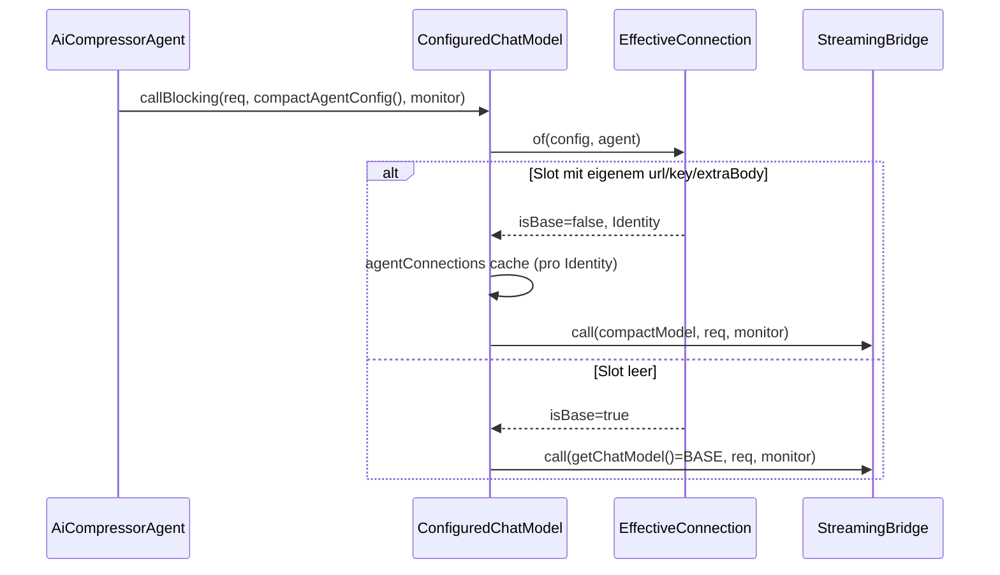

# Plan: COMPACT-Slot steuert den realen Compact-Call (Bug-Fix-Zyklus)

> ## ⛔ STOP-AND-ASK-Regel (memory #26)
> Bei Compile-Fehlern ohne Lösung, nicht-grün-bekommenden Tests, IST-Widersprüchen zu diesem
> Plan oder Unklarheiten: **aktiv bei Jon (askDev-Kanal) nachfragen** — nie still workarounden
> oder das SOLL ändern.

## 1. Kontext

**Bug (code-verifiziert):** `ConfiguredChatModel.callBlocking(ChatRequest, AiMonitor)`
(`org.sterl.llmpeon.core/src/main/java/org/sterl/llmpeon/ai/ConfiguredChatModel.java:36-38`)
baut den Call immer über `getChatModel()` = **BASE-Modell** auf. `AiCompressorAgent.call`
(`.../agent/AiCompressorAgent.java:52-57`) nutzt diesen Pfad — der COMPACT-Slot
(`AgentModelConfig.COMPACT`: URL/Key/Modell/Think/Temp) fließt nur in die Request-Parameter
(`cfg.compactAgentConfig().newRequestParameters(null)`) und in den Display-Namen der
„Compressing…"-Meldung ein, **nicht** in die Verbindung (URL/Key). Ein User-konfiguriertes
Compact-Modell (z.B. lokales llama.cpp) wird nie erreicht.

**SOLL (User 2026-09-13):** Der COMPACT-Slot steuert den tatsächlichen Call in
`AiCompressorAgent.call` vollständig (URL/Key/Modell/Think/Temp). Die Auflösung läuft über
die bestehende Connection-by-Identity-Komponente `ConfiguredChatModel` /
`EffectiveConnection` (ADR-0034) — **kein Zweit-Client**, kein Bypass am Compressor.
Edge: COMPACT-Slot leer → Fallback auf BASE (wie heute), „Empty means unset", kein Default.
Kein Homepage-Edit (PO-Note: die Einstellung tut ab jetzt, was sie verspricht — kein
neues User-Visible Verhalten, das dokumentiert werden müsste).

**Branch:** `fix/compact-slot-model` von `main` (memory #23: Vor Start Git-Zustand selbst
prüfen — aktueller Branch; Branch existiert ggf. schon → mit User abstimmen, nicht still
umbenennen).

## 2. IST-Analyse (verifiziert, memory #18)

Aufrufkette heute:

```
CompactSessionTool / AbstractAgent.compact()
  → AiCompressorAgent.call(messages, monitor)
      → chatModel.callBlocking(request.build(), monitor)     // ConfiguredChatModel:36
          → new StreamingBridge().call(getChatModel(), …)    // BASE-Modell — hier der Bug
```

- `ConfiguredChatModel.modelFor(AgentConfig)` (`ConfiguredChatModel.java:59-68`) ist die
  existierende, getestete Connection-by-Identity-Auflösung:
  `EffectiveConnection.of(config, agent)` → `isBase == true` (Slot hat kein eigenes
  url/key/extraBody) → **gemeinsame Base-Instanz** (kein Doppel-Build); anderes Identity →
  eigener Model, gecacht pro `ConnectionIdentity`. **Genau das Fallback-Verhalten, das die
  Edge verlangt — kommt free, kein Extra-Code.**
- Per-Agent-Model-Name wird per Request gesendet (`ProviderRequestSupport.applyBase`
  → `b.modelName(mc.getModel())`), nicht per Build — dieselbe Konvention wie PO/Plan/
  Search-Agenten via `ToolLoopRequest.call` (`.../tool/ToolLoopRequest.java` →
  `bridge.call(chatModel.modelFor(getAgentConfig()), chatRequest, monitor)`).
- `LlmConfig.compactAgentConfig()` (`LlmConfig.java`) liefert bereits das korrekte
  `AgentConfig` (url/key/model/think/temperature aus dem COMPACT-Record, Provider aus Base).
- Think je Provider: läuft bereits über `newRequestParameters` (OpenAI-Family
  `reasoning.effort`, Anthropic `thinkingType`, Gemini/Mistral build-time) — derselbe Pfad
  wie alle anderen Agenten. **Kein neuer Think-Code nötig.**
- Secrets: `AgentConfig` @ToString(exclude apiKey/extraBody), `EffectiveConnection.toString`
  maskiert, `LlmConfig` @ToString(exclude apiKey/…) — der Fix führt keine neuen Log-Pfade ein.

**Referenzzählung `callBlocking(` (Grep, memory #18):**
- `AiCompressorAgent.java:57` — **wird geändert** (3-Arg-Overload).
- `ConfiguredChatModel.java:30,36,38` — Definitionen (2-Arg bleibt, delegiert an 3-Arg).
- Tests: `BenchmarkTest.java` (3×), `VoiceInputServiceTest.java` (2×), `MockLlmServerTest.java`
  (1×), `AiCompressorAgentTest.java:1` — letzte ist `call_throws_on_null_response`, das einen
  **anonymen Override von `callBlocking(ChatRequest, AiMonitor)`** stubbt → **muss angepasst
  werden** (s. §5).
- Plugin-Modul: keine `callBlocking`-/`AiCompressorAgent`-Referenzen (nur Config-UI für
  `AgentModelConfigSection` etc.) → Compile-uneingeschränkt. Keine Entfernung, keine
  Modul-Grenzen-Brüche (memory #27 erfüllt).

## 3. Design-Entscheidungen

1. **Neuer Overload in `ConfiguredChatModel`, nicht Bypass:**
   ```java
   /** Blocking call on the model for the agent's effective connection (ADR-0034). */
   public ChatResponse callBlocking(ChatRequest req, AgentConfig agent, AiMonitor monitor) {
       return new StreamingBridge().call(modelFor(agent), req, monitor);
   }

   // bestehende 2-Arg-Overloads delegieren:
   public ChatResponse callBlocking(ChatRequest req, AiMonitor monitor) {
       return callBlocking(req, null, monitor);   // agent == null → modelFor → getChatModel()
   }
   ```
   „One behaviour, one implementation" (AGENTS.md): alle Blocking-Calls laufen durch
   `modelFor`; `AiCompressorAgent` bekommt keinen eigenen Client/Bridge. Kein Retry-Zusatz
   (Parität: heutiger Compressor-Call hat keinen `ApiRetry`; ApiRetry-Bug memory #21 gehört
   in eigenen Zyklus).
2. **`AiCompressorAgent.call` überreicht `cfg.compactAgentConfig()`:**
   `chatModel.callBlocking(request.build(), cfg.compactAgentConfig(), monitor)`.
   Display-Name, Parameter (`newRequestParameters(null)`) bleiben wie heute.
3. **Fallback = bestehende `isBase`-Logik** (leerer Slot → Base-Instanz), kein Sonderfall.
4. Kein neues Interface, keine ADR (Fix nutzt ADR-0034-Mechanik wie vorgesehen).

**Call-Flow danach:**



## 4. Betroffene Dateien (vollständige Pfade)

| Datei | Änderung |
|---|---|
| `org.sterl.llmpeon.core/src/main/java/org/sterl/llmpeon/ai/ConfiguredChatModel.java` | + Overload `callBlocking(ChatRequest, AgentConfig, AiMonitor)`; 2-Arg delegiert |
| `org.sterl.llmpeon.core/src/main/java/org/sterl/llmpeon/agent/AiCompressorAgent.java` | Zeile 57: `callBlocking(request.build(), cfg.compactAgentConfig(), monitor)` |
| `org.sterl.llmpeon.core/src/test/java/org/sterl/llmpeon/ai/AiCompressorAgentTest.java` | + 2 Tests (Inc-1), `call_throws_on_null_response` Override an 3-Arg-Overload anpassen |
| `docs/memory.md` | Bug-Eintrag „Nächste Zyklen" → fixed (mit Commit), Session-Stand aktualisieren |
| `docs/compact-input-budget.md` | Abgrenzung: „Compact-Slot-Bug" → gefixt (Commit-Ref) statt Backlog-Verweis |

**Nicht anfassen:** Plugin-Module, `MockLlmServer`, `LlmConfig`, `EffectiveConnection`,
`ProviderRequestSupport`, Homepage.

## 5. Inkremente (jedes für sich grün)

### Inkrement 1 — Roter Test → Fix → grün (alles in einem Maven-Zyklus) — ✅ DONE (efa22df, 2026-09-13)

Status: Branch `fix/compact-slot-model` von main erstellt. Roter Lauf: `compactSlotRoutesCallToCompactConnection` FAILED vor dem Fix (Call landete am Base-Stub, serverB empty — Evidenz im Commit-Message-Bereich). Fix + Test-Anpassung wie §3. Grün: Surefire **730/730** (Baseline 728 + 2 neu). PO-Abweichung befolgt: Docs NICHT angefasst (Jon nach Review), Commit = exakt 3 Dateien.

1. **Git:** Zustand prüfen (Branch `main`, saubert); `fix/compact-slot-model` erstellen
   (existiert schon → User fragen, nicht still wechseln).
2. **Roter Test ZUERST** (Bug-Hunt-Flow, memory #22), in `AiCompressorAgentTest`,
   MockLlmServer-Pattern, **zwei** Server (Base vs. Compact) — Routing pro Server
   nachweisbar (memory #30: Captured-Request-Payload asserten, nicht nur „Call kam"):

   - **`compactSlotRoutesCallToCompactConnection`**
     GIVEN Base-Config (OPEN_AI, model `base-model`, url = serverA) **und** COMPACT-Slot via
     `LlmConfig.withModelConfig("compact", new AgentModelConfig(serverB url, null, "compact-model", null, null, "0.2"))`;
     serverB hat das Briefing queuing (`"WHAT: compact briefing"`);
     WHEN `subject.call(messages, monitor)`;
     THEN `serverB.getLastRequestBody()` enthält `"model":"compact-model"` **und**
     `"temperature":0.2`;
     AND `serverA.getLastRequestBody()` ist null (kein Call an Base);
     AND das Briefing kommt an (Response/Monitor).
   - **`emptyCompactSlotFallsBackToBaseConnection`**
     GIVEN Base-Config url = serverA, COMPACT-Slot leer (kein Eintrag in `modelConfigs`);
     WHEN `subject.call(...)`;
     THEN `serverA.getLastRequestBody()` enthält `"model":"base-model"`;
     AND `serverB.getLastRequestBody()` ist null.
     *(= Inc-2-Edge, sauber im selben Test-Zyklus abgedeckt → eigenes Inkrement 2 entfällt.)*

   **JUnit-Timeout:** beide Tests mit `@Timeout(10)` (MockLlmServer ist lokal, >10 s = Hang).
   Server-Start wie vorhanden (`Thread.sleep(100)` reicht — Server wartet selbst in `start()`
   auf `isAlive`). **Roter Lauf:** Test 1 muss vorher FEHLERN (Call landet bei serverA,
   serverB leer) — Evidenz vor dem Fix notieren (Screentext/Message).

3. **Fix** (§3.1 + §3.2), dann `call_throws_on_null_response` anpassen:
   anonymes Subclass überschreibt jetzt `callBlocking(ChatRequest, AgentConfig, AiMonitor)`
   (sonst greift der Stub nicht mehr — Compressor ruft 3-Arg).
4. **Grün:** `eclipseBuildProject` (`llmpeon-core`) + `mvn test` im Core (Surefire =
   Ground Truth, AGENTS.md). Erwartet: 201 + 2 Tests.
5. **Docs** (gleicher Commit): `docs/memory.md` + `docs/compact-input-budget.md` (§4).
6. **Commit** (inkl. Docs; memory #19): z.B.
   `fix(compact): route compressor call through COMPACT-slot connection (ADR-0034)`.

### Inkrement 2 — entfällt
Fallback-Edge ist in Inc-1 abgedeckt (`emptyCompactSlotFallsBackToBaseConnection`).

## 6. Regeln & Constraints

- GIVEN/WHEN/THEN-Testnamen, JUnit 5 + AssertJ, Core-Module (Maven).
- Log OR throw, never both; keine neuen Log-Statements im Fix (Secrets, memory #20).
- `System.lineSeparator()` bei Content-Strings (memory #7) — hier ohnehin none neu.
- Existing-Pfade der 2-Arg-`callBlocking`-Aufrufer (Benchmark, Voice, MockLlmServer) bleiben
   verhaltensidentisch (Delegation mit `agent == null` → `modelFor(null)` → Base-Instanz,
   bestätigt durch `ModelConnectionCacheTest.baseConnectionIsInheritedInstance`).
- Kein Git-Merge/Squash im Zyklus (User-Entscheidung, memory #19).

## 7. BDD-Akzeptanz (vermessbar)

| # | Szenario | Test |
|---|---|---|
| 1 | **Happy:** COMPACT-Slot konfiguriert (eigene URL/Modell/Temp) → Call geht an Slot-URL mit Slot-Modell + Temp; Base wird nicht angerufen | `AiCompressorAgentTest.compactSlotRoutesCallToCompactConnection` (unit, MockLlmServer) |
| 2 | **Edge:** COMPACT-Slot leer → Call an Base-URL mit Base-Modell (Verhalten wie heute) | `AiCompressorAgentTest.emptyCompactSlotFallsBackToBaseConnection` |
| 3 | **Regressions-Schutz:** Null-Response → `IllegalStateException` (vorhanden, Override angepasst) | `AiCompressorAgentTest.call_throws_on_null_response` |
| 4 | **Regressions-Schutz:** Identity-Cache-Verträge (isBase-Inherit, per-Identity-Cache, Config-Change-Clear) | bestehend: `ModelConnectionCacheTest` (5 Tests) |
| 5 | **Suite-Grün:** Core-Suite via Surefire, keine neuen Fehler | `mvn test` (llmpeon-core) |

## 8. Offene Fragen

Keine — SOLL ist vollständig bestimmt (Ablaufvorgaben + ADR-0034-Mechanik). Einzige
Verzweigungspunkte, die der Dev bei Unklarheit per STOP-AND-ASK klärt: Branch existiert
schon unter anderem Stand; Surefire-Zahlen weichen von 203 ab.

**PO-Note (kein Action):** Kein Homepage-Edit nötig — die Compact-Slot-Einstellung tut
nach dem Fix, was sie immer versprochen hat; kein neues User-Visible Verhalten.

## 9. Review-Befund (PO-Reviewer, 2026-09-13) — Verdict: **ACCEPTED**

Drei-Seiten-Prüfung durchgeführt (Plan↔Code, Docs↔Code, Docs↔Plan). Evidenz:
Build `llmpeon-core` ohne Compile-Fehler; `AiCompressorAgentTest` 5/5 grün;
`ModelConnectionCacheTest` 5/5 grün (BDD #4).

**a) Plan↔Code — vollständig umgesetzt, keine Abweichung:**
- `ConfiguredChatModel.callBlocking(ChatRequest, AgentConfig, AiMonitor)` neu (ADR-0034
  Javadoc), 2-Arg-Overload delegiert mit `null` → `modelFor(null)` → Base-Instanz
  (ConfiguredChatModel.java:33-38). One-behaviour, one implementation, kein Zweit-Client.
- `AiCompressorAgent.call` ruft `callBlocking(request.build(), cfg.compactAgentConfig(),
  monitor)`; Parameters/Display-Namen unverändert (AiCompressorAgent.java:55-62).
- Fallback: leerer Slot → `agentBuilder(empty())` erbt Base url/key →
  `EffectiveConnection.isBase == true` → gemeinsame Base-Instanz, kein Doppel-Build.
  „Empty means unset" eingehalten (kein Default — `AgentTemperature.parse(null)` → null,
  kein Temperature-Parameter gesendet).
- Beide Tests wie §5 spezifiziert: MockLlmServer-Duo, `@Timeout(10)`, Captured-Body-Asserts
  in BEIDE Richtungen (memory #30): Slot-Test assertet `model=compact-model` +
  `temperature=0.2` an serverB UND `serverA.getLastRequestBody() == null`; Fallback-Test
  assertet `model=base-model` an serverA UND serverB null (inkl. Model-Name-Fallback bei
  leerem Slot — stärker als gefordert).
- `call_throws_on_null_response` Override korrekterweise auf den 3-Arg-Overload umgestellt
  (sonst würde der Stub nicht greifen) — verifiziert.
- „Nicht anfassen"-Liste eingehalten (LlmConfig/EffectiveConnection/MockLlmServer/
  ProviderRequestSupport/Plugin unverändert). Secrets: keine neuen Log-Pfade;
  `AgentConfig` @ToString(exclude apiKey/extraBody), `EffectiveConnection.toString` maskiert.

**b) Docs↔Code:** Feature-Doc `compact-input-budget.md` „Abgrenzung"-Befund (Bug: BASE statt
COMPACT-Verbindung) wird vom Code gedeckt — SOLL „Slot steuert Call vollständig (URL/Key/
Modell/Think/Temp), leer → BASE-Fallback" ist implementiert. Docs-Flips
(memory.md, compact-input-budget.md) ausstehend = PO-Aufgabe nach Review — erwartet,
kein Befund.

**c) Docs↔Plan:** Plan deckt den gesamten SOLL-Umfang des Docs-Fixes. **Kein
Plan-coverage-Gap.** (Key-only-Override bei gleicher URL ist nicht neu getestet, aber von
den bestehenden Identity-Verträgen `ModelConnectionCacheTest`/`EffectiveConnectionTest`
gedeckt — BDD #4.)

**Bemerkungen (kein Rework):**
1. Roter-Lauf-Evidenz und „Commit = exakt 3 Dateien" stammen aus dem Plan-Status (efa22df)
   — Git-Historie in dieser Review nicht direkt einsehbar. Test-Honesty-Check am Code:
   `compactSlotRoutesCallToCompactConnection` wäre ohne den Fix rot (serverB leer) — der
   Test kann nicht ohne Feature grün sein.
2. Plan-interner Widerspruch §6 („GIVEN/WHEN/THEN-Testnamen") vs. §5/§7 (exakte
   camelCase-Namen vorgegeben) — Dev hat die explizit benannten Namen verwendet; kein
   Dev-Fehler.
3. Surefire 730 statt Plan-Zahl 203 — PO-Kontext erklärt (Plan-Zahl veraltet;
   Zahlen-Report statt fixer Zahl befohlen). Kein Befund.

Mutation-Check: entfällt (Wiring/Config, durch Captured-Payload-Asserts beidseitig abgedeckt).
