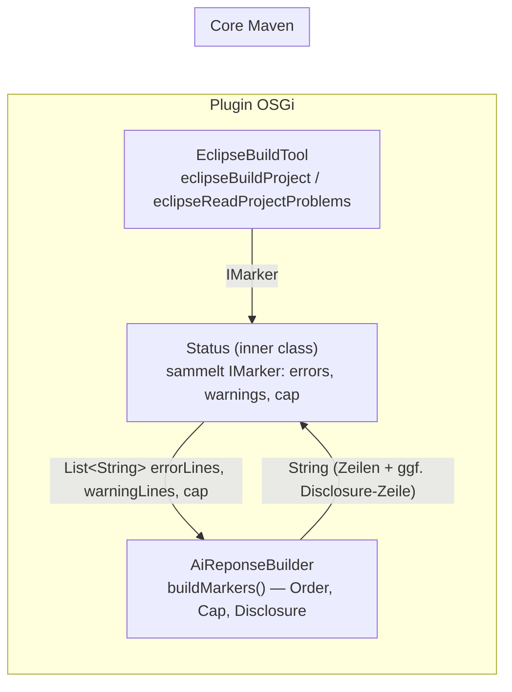

# Plan — R-OD-5: `eclipseBuildProject` Marker-Cap 100 + Disclosure

> **⚠️ STOP-AND-ASK (erste Regel für Da Mek):** Compile-Fehler ohne Lösung, nicht grün werdende
> Tests, IST-Widersprüche zu diesem Plan oder Unklarheiten → **aktiv bei Jon nachfragen (askDev-Kanal)**,
> nie still workarounden, SOLL nie selbst ändern. Vor jeder Clean-Break-Entfernung alle Referenzen
> prüfen (auch plugin↔core — core-Änderungen brechen das Plugin-Compile).

## 1. Kontext

AGENTS.md: „A tool must never lie about a limit." `eclipseBuildProject` druckt aktuell **alle**
ERROR+WARNING-Marker des Projekts unlimitiert (INFO wird gedroppt). SOLL (frisch specified in
`docs/tool-output-disclosure.md`, R-OD-5, 2026-09-24): Marker-Output auf **100** cappen
(Errors zuerst, dann Warnings); bei Kappung nennt der Return die Kappung im bestehenden
`AiReponseBuilder`-Disclosure-Muster: **„showing 100 of N markers"** (Wörtlich aus dem Doc —
kein „— narrow your search" anhängen). Unter 100 Markern: **keine** Disclosure-Zeile. INFO-Marker
bleiben gedroppt (unverändert).

**Schränkung (bewusst, aus dem Doc):** Der Cap gilt **nur für `eclipseBuildProject`**.
`eclipseReadProjectProblems` (alle Modi) bleibt unlimitiert — das ist ein anderer Tool-Vertrag
(docs/project-problems-tool.md) und wird hier nicht angefasst.

Branch: `fix/nextids-bug-report` (12 Commits vor main, **nicht pushen**). Da Mek committet nach
jeder grünen Iteration alle geänderten Dateien workspace-qualifiziert (Code + Tests). Status-Flips
in Docs (UC-OD-5/6 ❌→✅) macht **ausschließlich Jon** — Da Mek berührt
`docs/tool-output-disclosure.md` **nicht**.

## 2. Design-Entscheidungen

1. **Cap-Logik als kleine reine Funktion in core** — `AiReponseBuilder.buildMarkers(errors, warnings, cap)`.
   Begründung: (a) AGENTS.md: shared Logik lebt in core (FileLines, AiReponseBuilder, …), ein
   Disclosure-Muster an einer Stelle (R-OD-4); (b) core kennt kein `IMarker` (keine Eclipse-Abh.)
   → Funktion nimmt fertige Zeilen-Listen (`List<String>`) und int-Cap; deterministisch exakt
   testbar in core (JUnit 5/AssertJ) mit den UC-Zahlen 120/30; (c) Plugin rendert `IMarker` →
   Strings (`markerToAiString`, bleibt privat im Tool) und delegiert nur noch Sortierung/Cap/
   Disclosure an core.
2. **Cap als Parameter, nicht als neue Klasse**: `EclipseBuildTool.Status` bekommt ein Feld
   `int cap = 0` (0 = unlimitiert, keine Disclosure — passt zur „empty means unset"-Konvention).
   Build-Pfad setzt `cap = 100`, readProblems-Pfad bleibt `cap = 0`. `Status` bleibt private
   static inner class; `toString()` delegiert an core. Keine zweite Implementierung.
3. **Disclosure-Trigger strikt `total > cap`** (wie `grepComplete`'s Line-Cap): exakt 100 Marker
   = nichts gekappt = keine Zeile (konsistent mit UC-OD-6 „nichts wurde gekappt").
4. **Disclosure-Zeile ohne „— narrow your search"** — wörtlich „showing 100 of N markers",
   genau so wie das Doc es in Anführungszeichen gibt. Leerzeile davor, wie das bestehende
   `grepComplete`-Suffix-Muster (Body-Zeilen enden mit Separator, Suffix wird mit
   `System.lineSeparator()` davor angehängt).
5. **Integrationstest mit dynamischer Marker-Zahl N** statt exakt 120: `eclipseBuildProject`
   macht CLEAN+FULL-Build und **löscht vorher alle PROBLEM-Marker** — vorher via
   `file.createMarker` gesetzte Marker würden nicht überleben. Also: echte Compile-Errors über
   kaputte Fixture-Dateien erzeugen, nach dem Call die **tatsächliche** Marker-Zahl N aus dem
   Workspace zählen und „showing 100 of N markers" gegen N asserten. JDTs Marker-Zahl pro kaputtem
   File ist nicht exakt bekannt (1–2) — dynamisches N macht den Test flake-free. Die **exakten**
   UC-Zahlen (120 → „showing 100 of 120 markers") werden in core verankert.
6. **Kein Plugin-Test für UC-OD-6 (unter Cap)**: wäre ohne Feature grün (heute: alle Marker,
   keine Disclosure) → „nicht grün ohne Feature = kein Test". Die unter-Cap-Logik ist über den
   core-Test UC-OD-6 + die korrekte Funktion abgedeckt; das Wiring wird über UC-OD-5
   (Cap wird wirklich am Build-Pfad angesetzt) geschützt.
7. **Homepage: keine Änderung** — dort wird `eclipseBuildProject` nur als Tool-Name genannt,
   der Output-Format/Cap ist nicht dokumentiert (verifiziert per Grep).
8. **@Tool-Beschreibung und `onTool`-Logging bleiben unverändert** (`countProblems()` zählt
   weiter die Gesamtzahl — korrekt, die Disclosure steht im Tool-Output).

## 3. Architektur / Datenfluss



- Abhängigkeitsrichtung bleibt nach innen: Plugin rendert Marker → Zeilen und ruft core an;
  core weiß nichts von IMarker/Eclipse.
- Erwarteter Build-Output bei Kappung (Zeilengenaue Form, `␊` = `System.lineSeparator()`):

```
Project test_project problems:␊
&lt;Marker-Zeile 1&gt;␊
...
&lt;Marker-Zeile 100&gt;␊
␊
showing 100 of 120 markers␊
(3s, 12:00)          ← Stats-Suffix bleibt die LETZTE Zeile (UC-TD-4 bleibt grün)
```

- Erwartet ohne Kappung: exakt wie heute (Marker-Zeilen, danach Leerzeile + Stats-Suffix).

## 4. Betroffene Dateien

| Datei | Änderung |
|---|---|
| `org.sterl.llmpeon.core/src/main/java/org/sterl/llmpeon/tool/AiReponseBuilder.java` | **geändert**: `MAX_BUILD_MARKERS = 100` + `buildMarkers(List&lt;String&gt; errors, List&lt;String&gt; warnings, int cap)` (Javadoc: R-OD-5, cap&lt;=0 = unlimitiert, Disclosure nur bei `total > cap`, „showing &lt;cap&gt; of &lt;total&gt; markers", `System.lineSeparator()`). |
| `org.sterl.llmpeon.core/src/test/java/org/sterl/llmpeon/tool/AiReponseBuilderTest.java` | **geändert**: 4 Tests ergänzen (s. §6). |
| `org.sterl.llmpeon/src/org/sterl/llmpeon/parts/tools/EclipseBuildTool.java` | **geändert**: `Status` — Feld `int cap = 0;`, `toString()` → `AiReponseBuilder.buildMarkers(errors.stream().map(EclipseBuildTool::markerToAiString).toList(), warnings…same…, cap)`; `readProjectWide(IProject)` wird zu `readProjectWide(project, 0)` + neue Signatur `readProjectWide(IProject, int cap)` (setzt `status.cap`); `eclipseBuildProject` (Zeile ~211): `readProjectWide(projectRef, AiReponseBuilder.MAX_BUILD_MARKERS) + System.lineSeparator() + stats.suffix()`. Import `org.sterl.llmpeon.tool.AiReponseBuilder` (MANIFEST-Import existiert bereits — `EclipseGrepTool` nutzt ihn; kein Bundle-Manifest-Änderung nötig). |
| `org.sterl.llmpeon.test/src/org/sterl/llmpeon/test/EclipseBuildToolTest.java` | **geändert**: 1 Integrationstest ergänzen (s. §6) + ggf. kleiner Zähl-Helfer. |
| `docs/tool-output-disclosure.md` | **nur lesen** — SOLL steht schon da; Status-Flips ❌→✅ = Jon. |
| Homepage, AGENTS.md, MANIFEST, project-problems-Tool-Code | **unverändert** (siehe §2/5, §3). |

## 5. Regeln & Constraints

- **Test-ID-Kommentar** `// UC-OD-5` bzw. `// UC-OD-6` direkt am Test (Doc-IDs, idPrefix `OD`).
- Core-Tests: JUnit 5 + AssertJ, GIVEN/WHEN/THEN-Kommentare. Plugin-Tests: **JUnit 4, kein
  AssertJ** (OSGi), `assumeTrue(isWorkspaceAvailable())`-Guard wie die Bestands-Tests.
- Test-Namen für UC-OD-5/UC-OD-6 **exakt aus dem Doc**: `buildMarkersCappedWithDisclosure`,
  `buildMarkersUnderCapNoDisclosure` (core).
- `System.lineSeparator()` in der neuen core-Function; hardcoded `"\n"` im bestehenden Header
  („Project X problems:\n") **nicht** anrühren (Out of Scope, minimaler Diff).
- **Test-Hygiene (Memory):** Fixture **vor** dem SUT-Call aufbauen, im `finally` räumen —
  Markers der Fixture-Dateien löschen (`file.deleteMarkers(IMarker.PROBLEM, true, IResource.DEPTH_ZERO)`),
  **vor** dem File-Delete des BasiKlasse-`after()` (File-Löschung läuft über `toDelete` in
  `AbstractIntegrationTest.after()`). Kein Verlassen auf persistiertem State.
- **Build-Abnahme:** `eclipseBuildProject` über die geänderten Projekte (`llmpeon-core`,
  `org.sterl.llmpeon`) vor jedem JUnit-Lauf (stale bin/). PDE-Tests: `eclipseRunTests`
  (org.sterl.llmpeon.test) — **ganze Suite**; der erste Lauf braucht einmalig die
  Workspace-Trust-Bestätigung im UI-Dialog (sonst Launch-Timeout, „0 tests ran") — User
  informieren und auf die PID warten, nie parallel nachstarten. Core: `eclipseRunTests`
  (JUnit 5); Surefire-Reports unter `target/` sind stale — Testzahlen nur aus dem aktuellen
  Run berichten.
- **Git:** Arbeiten auf `fix/nextids-bug-report`, Commit nach jeder grünen Iteration
  (alle Dateien, workspace-qualifiziert), **kein Push**, kein Branch-Wechsel ohne Ansage.
- Ein Increment = alles (core + plugin + tests) kompiliert für sich grün.

## 6. BDD-Akzeptanz → Tests

### UC-OD-5 — buildMarkersCappedWithDisclosure (core, JUnit 5/AssertJ)
- **GIVEN** 40 Error-Zeilen + 80 Warning-Zeilen (120 Marker)
- **WHEN** `AiReponseBuilder.buildMarkers(errors, warnings, AiReponseBuilder.MAX_BUILD_MARKERS)`
- **THEN** genau 100 Marker-Zeilen: Zeilen 1–40 = **alle** Errors (Errors zuerst),
  Zeilen 41–100 = die ersten 60 Warnings (Warning 61+ fehlt); Abschluss-Zeile
  „showing 100 of 120 markers".
- Test: `AiReponseBuilderTest#buildMarkersCappedWithDisclosure`

### UC-OD-5 (Wiring, Plugin, JUnit 4)
- **GIVEN** Fixture-Projekt `test_project` mit 120 kaputten `.java`-Dateien unter
  `src/org/sterl/fixture/cap/` (z. B. Inhalt `package org.sterl.fixture.cap;` ␊ `class CapErr<i> {`
  — geschweifte Klammer fehlt → JDT-ERROR), geschrieben via `eclipseWriteFile` (auto-cleanup)
- **WHEN** `tool.eclipseBuildProject(PeonTestFixture.PROJECT_NAME)`
- **THEN** (N = tatsächlich gezählte PROBLEM-Marker des Projekts, `project.findMarkers(
  IMarker.PROBLEM, true, IResource.DEPTH_INFINITE)`): N > 100 (Sanity); Result enthält
  „showing 100 of " + N + " markers"; genau 100 Marker-Zeilen (Regex `@ line .* @ file `);
  Stats-Suffix ist die letzte Zeile (besteht schon via UC-TD-4, nicht neu testen).
  Timeout: `@Test(timeout = 180000)`.
- Test: `EclipseBuildToolTest#buildReportCappedAt100WithDisclosure`
- **Honesty-Check:** ohne Feature (kein Cap) wären >100 Marker-Zeilen + keine Disclosure-Zeile → Test rot. ✓
- Fallback: falls die gewählte Kapputz-Form unzuverlässig Marker erzeugt (Sanity-N rot) →
  andere kaputte Syntax wählen (z. B. `int x = ;`); schlägt das zweimal fehl → STOP-AND-ASK.

### UC-OD-6 — buildMarkersUnderCapNoDisclosure (core, JUnit 5/AssertJ)
- **GIVEN** 10 Error-Zeilen + 20 Warning-Zeilen (30 Marker)
- **WHEN** `buildMarkers(errors, warnings, MAX_BUILD_MARKERS)`
- **THEN** alle 30 Zeilen anwesend, **keine** „showing"-Zeile.
- Test: `AiReponseBuilderTest#buildMarkersUnderCapNoDisclosure`

### Edge-Tests (core, ohne UC-ID — rein abdeckend)
- `buildMarkersUnlimitedAndExactCapNoDisclosure`: cap 0 → alle Zeilen, keine Disclosure;
  total == cap (100) → alle 100, keine Disclosure.
- `buildMarkersMoreErrorsThanCap`: 120 Errors + 0 Warnings, cap 100 → 100 Zeilen,
  „showing 100 of 120 markers" (Warnings werden nicht erst nach Errors nachgereicht).

**Nicht-Regression (muss weiter grün bleiben):** `AiReponseBuilderTest` (alle Bestands-Tests),
`EclipseBuildToolTest` (alle Bestands-Tests, v. a. `buildReportEndsWithStatsSuffix` (UC-TD-4)
und die `eclipseReadProjectProblems`-Tests — Cap=0-Pfad unverändert).

## 7. Teststrategie

1. **core first**: `AiReponseBuilder.buildMarkers` + Tests schreiben → grün (JUnit 5/AssertJ,
   deterministisch, deckt die exakten UC-Zahlen 120/30 ab).
2. **plugin wiring**: `Status.cap` + `readProjectWide`-Overload + `eclipseBuildProject`-Aufruf
   + Integrationstest UC-OD-5.
3. Verifikation: `eclipseBuildProject("llmpeon-core")` + `eclipseBuildProject("org.sterl.llmpeon")`
   grün → `eclipseRunTests` core (AiReponseBuilderTest, testClassName) → `eclipseRunTests`
   `org.sterl.llmpeon.test` **ganze Suite** (PDE). Bestands-Suite rot → ist es ein
   Regression aus diesem Increment oder vorbestehend? → STOP-AND-ASK mit Befund.
4. Testzeit: Integrationstest baut 120 kaputte Files (CLEAN+FULL) — `timeout = 180000`;
   keine weiteren expliziten Waits nötig (synchroner Workspace-Call).

## 8. Offene Fragen

Keine. (Dynamisches N im Integrationstest statt exakt 120 ist in §2/5 verankert und
aus dem IST-Zwang „Build löscht Marker vorher" abgeleitet; exakte 120 lebt im core-Test.)

## 9. PO-Review (Da Dok, 2026-09-24) — Verdict: **ACCEPTED**

Review-Grundlage: Commit `5d74aab`, Branch `fix/nextids-bug-report`. Vier Seiten geprüft:
Plan↔Code, Docs↔Code, Docs↔Plan, Architektur. Lint (`UC-OD-\d+`): UC-Definitions 5/5,
Test-IDs 6/5, **0 findings**.

**Plan ↔ Code (alle §4-Deliverables vorhanden, eigenständig verifiziert):**
- `AiReponseBuilder.java:16` `MAX_BUILD_MARKERS = 100`; `:24-44` `buildMarkers(errors, warnings, cap)`:
  Errors zuerst, Warnings danach, `System.lineSeparator()`, Disclosure nur bei `cap > 0 && total > cap`,
  exaktes Wording „showing <cap> of <total> markers". ✓
- `AiReponseBuilderTest.java:118-182`: 4 neue Tests mit Test-ID-Kommentaren `// UC-OD-5` (118)
  und `// UC-OD-6` (141); Namen exakt aus Doc/Plan (`buildMarkersCappedWithDisclosure`,
  `buildMarkersUnderCapNoDisclosure`) + 2 Edge-Tests wie §6. UC-Zahlen 120/30 verankert. ✓
- `EclipseBuildTool.java`: `Status.cap` (`:243`, 0 = unlimitiert), `toString()` delegiert an core
  (`:269-274`), `readProjectWide(IProject)` → `readProjectWide(project, 0)` (`:68-70`),
  Build-Pfad nutzt `MAX_BUILD_MARKERS` (`:213`) + Stats-Suffix letzte Zeile (`:213-214`). ✓
- **1-arg `readProblems(IProject)`-Entfernung eigenständig verifiziert** (Grep `readProblems`,
  Scope `org.sterl.llmpeon`): existiert nur noch die 3-arg Variante (`:56`), einziger Caller
  ist der @Tool-Method (`:53`) — keine verwaiste Referenz, readProblems-Pfad bleibt cap=0.
  ✓ (nicht der Dev-Ausnahme vertraut)
- `EclipseBuildToolTest.java:220-254`: `buildReportCappedAt100WithDisclosure` — 120 kaputte
  Fixture-Dateien, dynamisches N, `n > 100`-Sanity, Disclosure gegen N, genau 100 Marker-Zeilen
  via Regex, `timeout = 180000`, Marker-Cleanup in `finally` vor Base-`after()`,
  `assumeTrue(isWorkspaceAvailable())`-Guard, JUnit 4/kein AssertJ. ✓
- Import `org.sterl.llmpeon.tool.AiReponseBuilder` vorhanden (`:17`); MANIFEST unverändert
  (lib/llmpeon-core.jar auf Bundle-ClassPath — wie `EclipseGrepTool`). ✓
- Doc-Datei `docs/tool-output-disclosure.md` unangetastet (R-OD-5/UC-OD-5/6 weiterhin ❌) —
  korrekt, Status-Flip ist Jons Aufgabe (Plan §1).

**Docs ↔ Code (SOLL == IST):** Cap 100 nur Build-Pfad ✓; Errors zuerst ✓; Disclosure nur bei
total > cap (exakt 100 = keine Zeile) ✓; Wording „showing 100 of N markers" wörtlich ✓;
unter Cap keine Disclosure ✓; INFO bleibt gedroppt (`addMarker`-switch, unverändert) ✓;
readProblems unlimitiert (R-PP-4 „Default bleibt unverändert", cap=0) ✓.
Tests je Regel: R-OD-5 = UC-OD-5 core + UC-OD-5 Plugin-Wiring; R-OD-6 = UC-OD-6 core.

**Docs ↔ Plan:** Plan deckt alle R-OD-5-Anforderungen ab + Schränkung (nur Build) +
Nicht-Regression UC-TD-4/UC-PP-*. Kein Plan-Coverage-Gap.

**Architektur:** Cap-Logik in core, kein `IMarker` in core (List<String>-Signature) ✓;
Disclosure-Muster weiterhin an einer Stelle in `AiReponseBuilder` (R-OD-4) ✓;
`Status` bleibt private static inner, Kapselung intakt ✓; Abhängigkeitsrichtung Plugin→core ✓.
Querverträge: UC-TD-4 (Stats-Suffix letzte Zeile) — Output-Kette `header + markers(+disclosure)
+ lineSeparator + stats.suffix()` hält die Stats-Zeile als letzte Zeile, Bestands-Test grün ✓;
`project-problems-tool.md`-Default-Pfad unverändert ✓; hardcoded `"\n"` im Header
(`:79`) bewusst nicht angefasst (Plan §5, minimaler Diff) ✓.

**Bemerkungen (nicht blockierend, keine Rework):**
1. Status-Flip R-OD-5/UC-OD-5/UC-OD-6 ❌→✅ steht noch aus — Jons Aufgabe nach diesem Review.
2. „Errors zuerst, dann Warnings" aus Doc-UC-OD-5 wird nur im core-Test verifiziert, der
   Plugin-Wiring-Test prüft die Reihenfolge nicht erneut. Akzeptable Aufteilung laut Plan §6 —
   die Regel ist getestet, nur der Ort ist core. (Bewusst als Note, kein Befund.)
