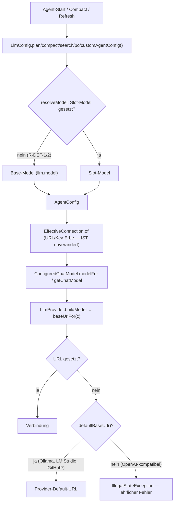
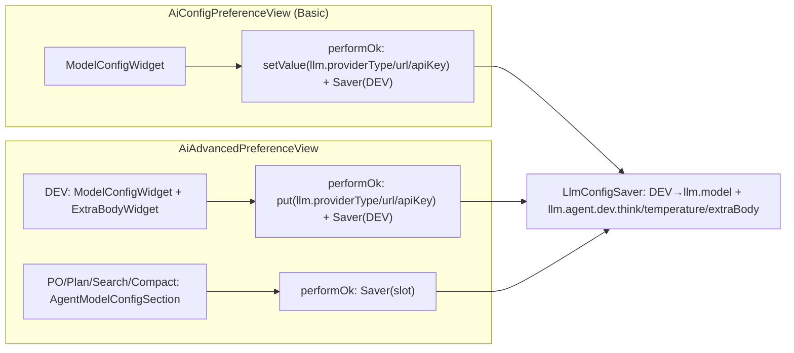

# Story: Default-Inheritance — dev ist der Default, alle NULL-Slots erben Base

> **Branch:** `story/issue-149-think` (bleibt, kein neuer Branch) — Dev prüft vor Start Ist-Zustand
> (Branch exists @ `a8f29f0a`, clean). Commit nach JEDER grünen Iteration inkl. homepage-Dateien.
> **Surefire ist Ground Truth** (core: Maven Surefire; OSGi: Tycho-Surefire-Zahlen) —
> `eclipseRunJavaTests`-Zahlen NIEMALS als Testnummer melden (AGENTS).
> **docs/** schreibt nur Jon** — Dev rührt `docs/**` nicht an. Dev-Scope: Code + `homepage/`.
> **Lint-Gate:** `lintDocsAndTests(root=repo, docRoots=[docs], idPattern="UC-DEF-\\d+")` nach jedem
> Inkrement mit neuen UC-IDs. UC-DEF-1…8 sind jetzt als `####`-Headings in
> `docs/default-inheritance.md` definiert (Paul 2026-09-28) — das Gate sollte grün laufen.
> Meldet der Linter TROTZDEM Test-IDs ohne Doc-Definition oder andere Lint-Fehler: **STOP-AND-ASK**
> — Docs-Edits bleiben Jon-Sache.

## 0. STOP-AND-ASK (Da Mek — geltend für ALLE Inkremente, Paul 2026-09-08)

Bei **Compile-Fehlern ohne Lösung**, **nicht-grün-bekommenden Tests**, **IST-Widersprüchen zum
Plan** oder Unklarheiten: **aktiv bei Jon nachfragen** — nie still workarounden, nie SOLL ändern,
nie Tests abschwächen damit sie grün werden. Rote Tests vor dem Fix systematisch (Bug-Hunt-Muster).

---

## 1. Context

**Ziel:** dev ist der Default-Slot (ADR-0062, Paul bestätigt „bleiben"). Konsequent machen:

1. **R-DEF-1:** Core-Slots (PLAN/COMPACT/SEARCH) mit leerem Model erben das Base-Model — wie PO
   heute schon (`LlmConfig.poAgentConfig() :210`). IST: sie bleiben `model=null` = „provider default".
2. **R-DEF-2:** Custom Agents mit leerem `model:` im Frontmatter erben Base-Model (Paul: „ja bitte").
3. **R-DEF-3 (Bug #125-Regression):** Base-URL leer → Provider-Default (Ollama
   `http://localhost:11434`, LM Studio `http://localhost:1234/v1` — von Paul bestätigt); Provider
   ohne Default → **ehrlicher Fehler** statt langchain4j-„baseUrl cannot be null or blank".
   Root Cause: JFace `ScopedPreferenceStore.setValue` entfernt Instance-Keys == DefaultScope-Default
   (`LlmPreferenceInitializer:30` setzt DefaultScope-URL = `http://localhost:11434`), Runtime liest
   rohen InstanceScope (`LlmConfigLoader:30`, `EclipseLlmConfigStore:21-23`).
4. **R-DEF-8:** Basic-Page bekommt Temperature (leer = unset, Parse-Punkt `AgentTemperature`,
   Position nach Think = Bindung 6). Extra body bleibt Advanced-only.
5. **R-DEF-4/5/7:** Advanced-DEV-Sektion = „Dev (Default)", ganz oben, gespiegelte Basic-Felder
   (Provider · URL · API-Key · Model+Refresh · Think) + Temperature + extra body; schreibt die
   Base-Keys (`llm.providerType|url|apiKey|model`) — manuelle UCs (Paul-Smoke).
6. **R-DEF-6:** „No model configured"-Guard (`AIChatView.java:542-545`, `getActiveModel()`) bleibt
   unverändert — kein neuer Test, kein Code-Change.

**Kritischer Paul-Bug (Deckung):** „nur Default gesetzt" → Base-URL leer (JFace-Trap) →
langchain4j-Crash; R-DEF-3 fängt das per Provider-Default + ehrlichem Fehler. „DEV-Model gelöscht"
→ Base-Model null → Guard (R-DEF-6) meldet ehrlich. „Advanced-Refresh tot" → R-DEF-3 im
listModels-Pfad + Widget-Live-Read (R-MCW-2, schon gebaut).

**Docs (Ground Truth):** `docs/default-inheritance.md` (R-DEF-1…8, BDD-Tabelle) ·
`docs/adr/0062-base-inheritance-dev-default.md` · `docs/model-config-widget.md` (Scope-Update) ·
`docs/advanced-configuration.md` (R-T1…R-T5) · verwandt: ADR-0036, ADR-0061, ADR-0005, ADR-0034.

**Verwandt (nicht Teil dieses Plans):** ModelConfigWidget-Story (✅ done, `story/model-config-widget`).

## 2. Design decisions

- **D1 — Vererbung als eine Methode in `LlmConfig` (core).** Neuer privater Helfer
  `resolveModel(String slotModel)` (Spiegelbild zu `resolveThink`, R-THINK-10-Muster):
  `StringUtil.hasValue(slotModel) ? slotModel : model`. Angewendet in `planAgentConfig`,
  `compactAgentConfig`, `searchAgentConfig`, `customAgentConfig` **und** `poAgentConfig`
  (ersetzt dessen Inline-Fallback :210 — „one behaviour, one implementation"). `devAgentConfig`
  bleibt unverbatim base-model (kein Fallback nötig). Javadocs der 4 Methoden: „model null =
  provider default" → „empty model inherits the base model".
- **D2 — URL-Fallback lebt im Provider-Layer (core).** `LlmProvider` bekommt:
  - `default String defaultBaseUrl() { return null; }` — OllamaProvider/LmStudioProvider
    überschreiben mit ihren Defaults; GithubModelsProvider/GithubCopilotProvider migrieren ihre
    privaten `baseUrl(c)`-Fallbacks darauf (konstanten bleiben in der Klasse, werden public).
  - `default String baseUrlFor(LlmConfig config)` — Auflösung an EINER Stelle:
    konfigurierte URL → `defaultBaseUrl()` → sonst `IllegalStateException`
    **„No base URL configured — open Window > Preferences > Peon AI"** (Englisch, Parität zum
    Guard `AIChatView:543`; Deutsch im Doc ist Beschreibung, nicht String).
  - **Wer `baseUrlFor` NICHT aufruft, braucht keine URL** (Gemini, Mistral, Anthropic — deren
    langchain4j-Defaults gelten weiter; Anthropic behält seine optionale URL-Prüfung :33-35).
    Der ehrliche Fehler firet also nur bei Providern, die eine URL wirklich brauchen
    (OLLAMA, OPEN_AI, LM_STUDIO, OPEN_AI_OFFICIAL — OpenAI-kompatibel mit fremder URL hat keinen
    Default).
  - Umbau der Call-Points auf `baseUrlFor(c)`: `OllamaProvider:30,53` · `LmStudioProvider:35,64`
    · `OpenAiProvider:42,86` · `OpenAiOfficialProvider:26,50` · GithubModels/Copilot `baseUrl(c)`.
  - **Eine Konstante, ein Zuhause:** `OllamaProvider.DEFAULT_BASE_URL` / `LmStudioProvider.DEFAULT_BASE_URL`
    werden public; `LlmConfig.newOllama/newLmStudio` referenzieren sie (aktuell Literale-Dublette,
    `LlmConfig.java:124/129`).
  - **ConnectionIdentity bleibt wie sie ist** (URL aus Store, auch null) — der Fallback greift erst
    beim `buildModel`/`listAiModels`; keine Identity-/Cache-Semantik-Änderung (ADR-0034 unberührt).
- **D3 — Basic-Temperature = Dev-Slot-Temperature (R-DEF-8).** Feld im `ModelConfigWidget` nach
  Think (Bindung 6), Label **„Temperature (empty = unset):"** — bewusst NICHT „(Default)": Temperature
  erbt NICHT an andere Agenten (R-T, homepage:34 „no value is inherited between agents", ADR-0062
  „keine Mischung") — ein „(Default)"-Label würde eine Vererbung suggerieren, die es nicht gibt.
  Kein Provider-Gate (R-T5). `ConnectionValues` bekommt `temperature`; `snapshot()`/Reload-Identität
  enthält sie NICHT (Request-Level wie Think). Persistenz: `performOk` →
  `devRecord.withTemperature(...)` → Key `llm.agent.dev.temperature` (Loader liest ihn für DEV schon,
  `LlmConfigLoader.agentRecord :65`; Parse-Punkt bleibt `AgentTemperature.parse` in
  `LlmConfig.agentBuilder :163` — kein zweiter Parse-Pfad).
- **D4 — Advanced-DEV-Sektion = `ModelConfigWidget` + `ExtraBodyWidget` (Reuse statt Neu-Bau).**
  Das Widget wurde dafür designt (R-MCW-5/ADR-0005: Suppliers statt Store-Zugriff). Eine generische
  `AgentModelConfigSection`-Sonderlocke wäre schlechter: sie friert die Think-Form bei Construction
  ein (:59-60) — der DEV-Provider ist aber im Feld editierbar → live-rebuild nötig = exakt die
  R-MCW-6-Logik, die nur das Widget hat. DEV-Sektion auf Advanced:
  `TitledGroup("Dev (Default)")` → `ModelConfigWidget` (Provider·URL·Key·Model+Refresh·Think·
  Temperature·Ping) + `ExtraBodyWidget` (aus `AgentModelConfigSection` extrahiert, damit alle
  Sections ein Implementation teilen). Label-Ausrichtung: Widget bekommt einen optionalen
  Label-Alignment-Parameter (Basic `SWT.LEFT`, Advanced `SWT.END` — „Label je Caller"-Präzedenz
  `ModelComboWidget`, R-A2).
- **D5 — Save-Routing DEV (R-DEF-4, gleiche Keys wie Basic):**
  `AiAdvancedPreferenceView.performOk` behandelt DEV speziell:
  `store.put(llm.providerType/url/apiKey, widget-Werte)` via `EclipseLlmConfigStore` +
  `LlmConfigSaver.saveAgentModelConfig(store, DEV, devRecord(model, think, temperature, extraBody))`
  — der Saver schreibt DEV-Model nach `llm.model` (IST :20-21) und mit `url=null/key=null` im Record
  werden `llm.agent.dev.url/apiKey` entfernt (Clean-Break-Räumung). PO/PLAN/SEARCH/COMPACT bleiben
  auf dem generischen Pfad.
- **D6 — `llm.agent.dev.url/apiKey` werden nie-gelesene Keys (Clean Break, F1 GEWÄHRT Paul
  2026-09-28).** `LlmConfigLoader.agentRecord` liest für DEV **keine** Agent-URL/Key-Keys mehr
  (:60-61 galt für alle IDs — DEV-Zweig übergibt url/key = null). `llm.agent.dev.model` war schon
  **nie gelesen** (Loader mappt DEV auf Base-Model, `LlmConfigLoader:51` IST — kein Code-Change
  für model nötig). Damit ist ein alter Dev-URL/Key-Override weg — konsistent zu „dev ist der
  Default-Slot, kein Override-Slot" (ADR-0062 Consequences) und zur AGENTS-Regel „removed keys
  are ignored, never migrated"; Docs-Begründung (default-inheritance.md R-DEF-4): unsichtbarer
  Override gegen die UI = Lügen-Klasse. Räumung passiert im Save-Pfad (D5): null-Record-Felder →
  `saveOrRemove` entfernt `llm.agent.dev.url/apiKey` beim nächsten Save.
- **D7 — UC-IDs 1:1 zu den Regeln:** UC-DEF-n ↔ R-DEF-n. Tests tragen `// UC-DEF-n`-Kommentare
  (GIVEN/WHEN/THEN-Struktur). UC-DEF-4/5 sind Paul-Smoke, bekommen aber automatisierte
  Unterstützungstests (Store-Routing-PDE-Test bzw. Deklarations-Test).
- **D8 — Kein eigener `default`-Slot, keine Migration, kein Store-Fallback auf DefaultScope** —
  ADR-0062 lehnt beides ab („das generelle JFace-Entfernungs-Verhalten bleibt beobachtbar"); das
  Angebot „EclipseLlmConfigStore liest DefaultScope mit" wurde bewusst NICHT gewählt (ADR-Decision
  respektiert, nicht neu aufgerollt).

## 3. Architecture

Auflösungsfluss (core, unverändert außer Fallback-Punkte):



Save-Routing (beide Pages schreiben dieselben Keys):



Code-Skizze (Signature-Level, core):

```java
// LlmProvider
/** Base URL fallback when the config URL is blank (R-DEF-3); null = no default. */
default String defaultBaseUrl() { return null; }

/** URL for connections: configured URL, else the provider default (R-DEF-3).
 *  Honest error — never langchain4j's "baseUrl cannot be null or blank". */
default String baseUrlFor(LlmConfig config) {
    if (StringUtil.hasValue(config.getUrl())) return config.getUrl();
    var fallback = defaultBaseUrl();
    if (StringUtil.hasNoValue(fallback))
        throw new IllegalStateException("No base URL configured — open Window > Preferences > Peon AI");
    return fallback;
}

// LlmConfig
private String resolveModel(String slotModel) {
    return StringUtil.hasValue(slotModel) ? slotModel : model;
}
// planAgentConfig/compactAgentConfig/searchAgentConfig/customAgentConfig/poAgentConfig:
//     .model(resolveModel(slot.model()))
```

`AgentModelConfig` bekommt `withTemperature(String)` (Spiegel zu `withModel/withThink`, 1-Zeiler).

## 4. Inkremente (jedes für sich kompilierend + Surefire grün, Commit pro Inkrement)

### Inc 1 — Core-Vererbung (R-DEF-1 + R-DEF-2)

> **Status: DONE 2026-09-28** (commit `19a67c17`) — Surefire core **1047/1047 grün** (Vorher 1040, +7 Tests).
> Lint-Gate: UC-DEF-1/2 belegt; UC-DEF-3…8 UNBELEGT (erwartet — Inc 2/4 folgen).
> ⚠️ Dev-Beobachtung für PO: der Wire-Test `slotWithOwnUrlButEmptyModel_sendsBaseModelOnTheWire` ist
> **auch ohne die Änderung grün** (Mutation `resolveModel → return slotModel` verifiziert): der Wire
> zeigt den Base-Model über den baked-in Model in `EffectiveConnection.buildConfig`
> (`base.toBuilder().url(...)`, model wird nie aus dem Agent übernommen) — per-request-Parameter
> (null) überlagern ihn nicht. Der Test bleibt als Wire-Vertrags-Pin (Charakterisierung); die
> Falsifizierbarkeit für UC-DEF-1 tragen die 6 Unit-Tests (alle rot unter derselben Mutation).
> Zusätzlich 1-Wort-Javadoc-Fix in `LlmConfigLoader` („inherit base / provider default" →
> „inherit base …") — nach der Änderung faktisch falsch geworden.

**Ziel:** PLAN/COMPACT/SEARCH/Custom mit leerem Model erben das Base-Model; PO-Code auf den
geteilten Helfer umgestellt; Javadoc „provider default" abgelöst.

**Deliverables:**
- `org.sterl.llmpeon.core/src/main/java/org/sterl/llmpeon/ai/LlmConfig.java` —
  `resolveModel` + 5 Methoden (po/plan/compact/search/custom) + Javadoc-Updates
  (auch `AgentModelConfig`-Javadoc „dev slot is special" bleibt korrekt).
- Tests:
  - `org.sterl.llmpeon.core/src/test/java/org/sterl/llmpeon/ai/AgentModelResolutionTest.java`
    - `// UC-DEF-1` `emptyPlanSlotInheritsBaseModel` / `emptyCompactSlotInheritsBaseModel` /
      `emptySearchSlotInheritsBaseModel` / `ownModelBeatsInheritance` (Slot gesetzt → eigenes
      Model gewinnt, keine Regression)
  - `org.sterl.llmpeon.core/src/test/java/org/sterl/llmpeon/agent/CustomAgentServiceTest.java`
    - `// UC-DEF-2` `frontmatterEmptyModel_inheritsBaseModel` (Frontmatter ohne `model:` →
      `getConfig().getModel()` = Base-Model); `// UC-DEF-2` `frontmatterModelStillWins`
  - Wire-Beweis (memory-Regel 30: Send-Pfad-Logik beide Richtungen):
    `org.sterl.llmpeon.core/src/test/java/org/sterl/llmpeon/compact/CompactServiceTest.java`
    - `// UC-DEF-1` `slotWithOwnUrlButEmptyModel_sendsBaseModelOnTheWire` (serverB-URL + leerer
      Model → Request an serverB trägt `base-model`, nicht null)

**Vorab-Inventarisierung (Dev macht VOR dem Umbau, Grep):** alle Tests, die leere Slots mit
`model=null`-Erwartung haben (Kandidaten: `AgentModelResolutionTest`, `PerAgentConnectionE2ETest`,
`CompactServiceTest`, `CustomAgentServiceTest`, MockLlmServer-Captures mit `modelName`-Asserts).
Bekannt grün bleiben: `emptyCompactSlotFallsBackToBaseConnection` (Base-Pfad, `isBase` → Base-Model
am Wire — unverändert), `AiPlanAgentTest.getAgentModelName_returnsNull_whenNoPlanModelSet`
(`getAgentModelName()` liest den Slot, nicht `planAgentConfig` — bewusst UNVERÄNDERT: Chat-UI-
Selector zeigt weiterhin nur eigene Slots).
**Seiteneffekt dokumentieren:** OpenAI-GPT5-Default-Cache-Key (`OpenAiProvider.defaultCacheKeyEntries :77-81`)
greift für leere Slots jetzt (Base-Model vorhanden statt null) → `peon-ai-plan` etc. — erwünscht
(per-Agent-Cache-Keys waren das Design).

**Verification:** `mvn -pl org.sterl.llmpeon.core test` (Surefire-Zahl melden), kein Plugin-Touch
→ Plugin kompiliert unverändert.

### Inc 2 — Base-URL-Fallback + ehrlicher Fehler (R-DEF-3)

> **Status: DONE 2026-09-28** (commit `76df135d`) — Surefire core **1053/1053 grün** (Vorher 1047, +6 Tests).
> Lint-Gate: UC-DEF-1/2/3 belegt; UC-DEF-4…8 UNBELEGT (erwartet — Inc 3/4 folgen).
> Mutation-Check: `baseUrlFor` ohne Fallback/Throw → exakt 4 rot (ollama/lmStudio/github Defaults +
> openAiHonestError), 2 grün (configuredUrlWins-Guard, urllessProvidersDoNotThrow-Charakterisierung).
> Dev-Beobachtung: GitHub-Trailing-Slash-Normalisierung bleibt Provider-lokal
> (`withoutTrailingSlashes(baseUrlFor(c))`) — das Plan-Muster `baseUrlFor(c)` allein würde
> konfigurierte URLs mit Slash-Ende doppeln (`…/inference//chat/completions`); Verhalten unverändert.

**Ziel:** leere Base-URL → Provider-Default; Provider ohne Default → ehrlicher
`IllegalStateException` statt langchain4j-„baseUrl cannot be null or blank" (auch im
Refresh/listModels-Pfad — dort starb der Advanced-Refresh mit NPE/Exception, `OpenAiProvider:86`).

**Deliverables:**
- `org.sterl.llmpeon.core/src/main/java/org/sterl/llmpeon/provider/LlmProvider.java` —
  `defaultBaseUrl()` + `baseUrlFor(LlmConfig)` (Skizze §3).
- `OllamaProvider` (:30,:53) / `LmStudioProvider` (:35,:64) / `OpenAiProvider` (:42,:86) /
  `OpenAiOfficialProvider` (:26,:50) — auf `baseUrlFor(c)` umgestellt.
- `GithubModelsProvider` / `GithubCopilotProvider` — private `baseUrl(c)` → `defaultBaseUrl()`
  + `baseUrlFor(c)`; `DEFAULT_BASE_URL` public.
- `LlmConfig.newOllama/newLmStudio` — referenzieren die Provider-Konstanten (Dublette weg).
- Tests (core, neu `org.sterl.llmpeon.core/src/test/java/org/sterl/llmpeon/provider/ProviderBaseUrlTest.java`
  oder je Provider-Klasse):
  - `// UC-DEF-3` `ollamaFallsBackToDefaultUrl` / `lmStudioFallsBackToDefaultUrl`
    (`baseUrlFor(config mit url=null)` == `http://localhost:11434` bzw. `http://localhost:1234/v1`)
  - `// UC-DEF-3` `configuredUrlWins` (gesetzte URL bleibt verbatim)
  - `// UC-DEF-3` `openAiWithoutUrlThrowsHonestError` (Message enthält „No base URL configured",
    NICHT langchain4j-Text; gilt für OPEN_AI + OPEN_AI_OFFICIAL)
  - `// UC-DEF-3` `githubModelsAndCopilotDefaultUrls` (private-Fallback-Migration verifiziert)
  - `// UC-DEF-3` `urllessProvidersDoNotThrow` (Gemini/Mistral/Anthropic: `buildModel` mit
    url=null wirft keinen Base-URL-Fehler — Anthropic-Optionalfall :33 charakterisiert)

**Vorab-Prüfung:** Grep `getUrl()` in `provider/` (IST-Zahlen oben verifizieren — memory-Regel 18)
und Tests mit url=null-Builds (`VoiceInputServiceTest` nutzt newLmStudio/newOllama mit gesetzter
URL — unverändert).

**Verification:** Surefire core; `eclipseBuildProject` Plugin (nur Compile-Berührung via core-API —
kein Plugin-Code ändert sich).

### Inc 3 — Basic-Page: Temperature (R-DEF-8)

> **Status: DONE 2026-09-28** (commit `39c83789`) — Surefire core **1053/1053** (unverändert —
> Inc-3-Core-Change ist nur `withTemperature`, neue Tests liegen im Plugin-Test-Modul, wie in
> §7 erwartet „OSGi +7, Inc 3: 3"); Tycho OSGi **304 / 0F / 0E / 23 Skipped** (alle SWT-Tests
> headless skipped — bekannt); Display-Verifikation (Eclipse-Runner, nicht Offiziell):
> **304/304 grün, 0 Skipped** — alle SWT-Tests inkl. der 3 neuen UC-DEF-8-Tests liefen real.
> Lint-Gate: UC-DEF-8 belegt, 0 orphane Test-IDs; UC-DEF-4/5/7 UNBELEGT (erwartet — Inc 4);
> **UC-DEF-6 bleibt per Design UNBELEGT** („kein neuer Test", bestehender Guard) — Hinweis an Jon
> (Docs-Besitz).
> Mutation-Check: `performOk` ohne `.withTemperature(...)` → exakt 1 rot
> (`performOkPersistsTemperature: expected:<0.7> but was:<null>`), Revert → 304/304 grün.
> ⚠️ **Bug-Fund für PO-Triage (präexistierend, NICHT in Inc 3 gefixt — Scope):**
> `AiConfigPreferenceView.performOk:105` → NPE bei **leerem API-Key-Feld**: `getValues()` liefert
> `stripToNull("")` = null, und `ScopedPreferenceStore.setValue(name, null)` (verifiziert in der
> Plattform-Quelle) macht `getDefaultString(name).equals(null)` = false →
> `EclipsePreferences.put(name, null)` → NPE. Folge: Provider/URL sind dann schon geschrieben,
> Saver (Model/Think/Temperature) läuft nicht → Partial Save. Ollama-User mit leerem Key-Feld +
> OK trifft das. UC-MCW-6 tippt immer einen Key, daher bisher ungetestet.
> ⚠️ Rendered- vs. Parent-Index: das Temperature-Feld liegt auf Parent-Index 13/14, aber auf
> Rendered-Index 12/13 (das exkludierte Think-Text-Feld auf Parent-12 schiebt die
> Rendered-Reihenfolge) — die Test-Adaptionen nutzen jeweils den richtigen Indexraum.

**Ziel:** `ModelConfigWidget` bekommt das Temperature-Feld nach Think (Bindung 6); Basic-`performOk`
persistiert `llm.agent.dev.temperature`.

**Deliverables:**
- `org.sterl.llmpeon.core/src/main/java/org/sterl/llmpeon/ai/AgentModelConfig.java` — `withTemperature`.
- `org.sterl.llmpeon/src/org/sterl/llmpeon/parts/config/widgets/ModelConfigWidget.java` —
  Temperature-Text-Feld nach Think (kein Provider-Gate, R-T5), `ConnectionValues` + `temperature`
  (toString maskiert nichts — Temperature ist kein Secret), `load()`/`getValues()` verdrahtet;
  `snapshot()` UNVERÄNDERT (Temperature ist keine Connection-Identity — wie Think).
- `org.sterl.llmpeon/src/org/sterl/llmpeon/parts/config/AiConfigPreferenceView.java` — `performOk`
  ergänzt `.withTemperature(values.temperature())`.
- Tests:
  - `org.sterl.llmpeon.test/src/org/sterl/llmpeon/test/ModelConfigWidgetTest.java`
    - `// UC-DEF-8` `showsTemperatureFieldAfterThink` — **angepasst in denselben Inkrement:**
      UC-MCW-1 `showsConnectionFieldset` (children 12/13 → 14/15) und UC-MCW-7-Kette um die neue
      Bindung erweitern (memory-Regel 33: alle Seed-Abhängigkeiten des Feld-Zählers inventarisieren).
    - `// UC-DEF-8` `temperatureRoundTripsThroughValues` (load → getValues, leer → null)
  - `AiConfigPreferenceViewTest.java`
    - `// UC-DEF-8` `performOkPersistsTemperature` (Fixture-Muster beibehalten: Keys VOR Page-Build,
      Restore in finally — `llm.agent.dev.temperature` in die KEYS-Liste aufnehmen)

**Verification:** Tycho-Testlauf (PDE-Runner; erster Lauf braucht ggf. Workspace-Trust, memory 13;
Surefire/Tycho-Zahl melden, PDE-Skips headless sind bekannt).

### Inc 4 — Advanced: „Dev (Default)"-Sektion (R-DEF-4/5/7)

> **Status: DONE 2026-09-28** — Surefire core **1054/1054** (Vorher 1053, +1: UC-DEF-4 Loader-Test);
> Tycho OSGi **306 / 0F / 0E / 25 Skipped** (alle SWT headless skipped — bekannt; +2 neue
> UC-DEF-4/7-Tests); Display-Verifikation (Eclipse-Runner, nicht Offiziell): **306/306 grün,
> 0 Skipped** — alle SWT-Tests inkl. der 2 neuen liefen real.
> Lint-Gate: 8/8 UC-Definitionen, 0 orphane Test-IDs; UC-DEF-1…5/7/8 belegt; **UC-DEF-6 bleibt
> per Design UNBELEGT** (wie Inc 3 gemeldet).
> Mutation-Check: `performOk` DEV-Base-Key-Writeouts deaktiviert → exakt 1 rot
> (`performOkWritesBaseKeysForDev`: expected http://127.0.0.1:9/v1 but was http://127.0.0.1:1 =
> Fixture-URL bleibt), `devSectionCarriesFullFieldset` bleibt grün; Revert → 306/306.
> ⚠️ SOLL-bedingte Test-Adaption (F1/D6, NICHT abgeschwächt): `LlmConfigSaverTest.roundtripDevStable`
> (UC-THINK-2) pinnte den alten SOLL „dev url/key überstehen den Roundtrip" — unter D6 liest der
> Loader die Keys nie mehr. Record jetzt auf die verbliebenen DEV-Felder (model via Base-Key,
> think, extraBody, temperature) — Intent (Roundtrip-Stabilität des DEV-Slots) bleibt.
> Dev-Beobachtung: `TitledGroup` ist 1-spaltig; die DEV-Sektion baut ein internes 2-spaltiges
> Composite (Widget-Vertrag) — PO/PLAN/SEARCH/COMPACT-Sektionen unverändert (kein TitledGroup-Change).


**Ziel:** DEV-Sektion gespiegelt + ganz oben + complete DEV-Slot; Save-Routing auf Base-Keys;
Dev-Override-Keys werden nie-gelesen (D6 — F1 von Paul gewährt 2026-09-28).

**Deliverables:**
- `.../parts/config/widgets/ExtraBodyWidget.java` (NEU) — Controller (kein Composite) mit Label
  „Extra body (JSON):", Multi-Text, Example-Buttons + Status-Label (Logik 1:1 aus
  `AgentModelConfigSection.buildJson/buildJsonExamples/pasteExample :138-184` extrahiert; API:
  `setBody(String)` / `getExtraBody()` / Konstruktor `(Composite parent, boolean visible)`).
- `.../widgets/AgentModelConfigSection.java` — delegiert an `ExtraBodyWidget` (kein Verhalten-
  Wechsel für PO/PLAN/SEARCH/COMPACT).
- `.../widgets/ModelConfigWidget.java` — Label-Alignment-Parameter (Basic SWT.LEFT / Advanced
  SWT.END, D4).
- `.../config/AiAdvancedPreferenceView.java`:
  - `AGENT_SECTIONS`: DEV zuerst, Titel `Dev (Default)`; Rest in bisheriger Reihenfolge (R-DEF-5).
  - `addAgentSection`: DEV-Zweig baut `TitledGroup("Dev (Default)")` + `ModelConfigWidget` (inkl.
    Ping — F2 gewährt, Verbindungssicht, voller Widget-Reuse) + `ExtraBodyWidget` statt generischer
    Section.
  - `performOk`: DEV-Zweig nach D5 (provider/url/key → Base-Keys via `EclipseLlmConfigStore`;
    Model/Think/Temperature/ExtraBody via `LlmConfigSaver.saveAgentModelConfig(DEV, ...)` mit
    `url=null/key=null` → räumt `llm.agent.dev.url/apiKey`).
- `org.sterl.llmpeon.core/src/main/java/org/sterl/llmpeon/ai/LlmConfigLoader.java` —
  `agentRecord`/`loadModelConfigs`: DEV bekommt url/key = null (liest `llm.agent.dev.url/apiKey`
  nie mehr; `llm.agent.dev.model` war schon nie gelesen — Loader mappt DEV auf Base-Model :51,
  kein model-Change; Javadoc-Zeile 46 „dev's model is the base" bleibt korrekt, um die
  Never-Read-Keys ergänzen).
- Tests:
  - `AdvancedPreferenceSectionsTest.java` — `// UC-DEF-5` `devSectionIsFirstAndTitledDefault`
    (Bestellung `dev, po, plan, search, compact` + Titel-Assert; ersetzt die alte
    `showsPoSection`-Order-Erwartung `po, plan, dev, ...`).
  - `LlmConfigLoaderTest.java` — `// UC-DEF-4` `devUrlAndApiKeyKeysAreIgnored` (gesetzte
    `llm.agent.dev.url/apiKey` → Dev-Record url/key null; **Vorab-Grep**, wer liest
    `agentKey(DEV, ...)` sonst noch — IST: nur der Loader, memory-Regel 27).
  - NEU `org.sterl.llmpeon.test/src/org/sterl/llmpeon/test/AiAdvancedPreferenceViewTest.java`
    (PDE, `AbstractSwtUiTest`-Muster von `AiConfigPreferenceViewTest`: Fixture VOR Build, finally-
    Restore) — `// UC-DEF-4` `performOkWritesBaseKeysForDev` (Widget-Werte → `llm.providerType/url/
    apiKey` + `llm.model` + `llm.agent.dev.think/temperature/extraBody`; alt-Keys entfernt) +
    `// UC-DEF-7` `devSectionCarriesFullFieldset` (Provider·URL·Key·Model·Think·Ping·Temperature·
    ExtraBody im DEV-Group; Rendering selbst = Paul-Smoke).
  - UC-DEF-4/5-Abnahme: **Paul-Smoke** (Docs: manuelle UCs).

**Grep-Vorabprüfung (Clean Break, memory 27 — Grep `llm.agent.dev` über core + plugin + tests,
IST-Verifizierung 2026-09-28):** Referenzen — `LlmConfigLoader.agentRecord` :60-61 (liest
url/apiKey, wird im DEV-Zweig auf null gesetzt — DIESE Inkrement-Änderung) · `LlmConfigSaver`
(liest/schreibt DEV-Felder; mit null-Record-Feldern räumt `saveOrRemove` url/apiKey — kein
Saver-Code-Change) · `AiConfigPreferenceView:105` + `LlmConfigSaverTest:68` (nur Kommentare) ·
keine weiteren Reader von `llm.agent.dev.url/apiKey/model` gefunden. `llm.agent.dev.think/
temperature/extraBody` bleiben LESE-würdige Keys (unverändert). Minimale Compile-Fix-Zeilen
gehören in DIESES Inkrement.

**Verification:** Surefire core + Tycho (Plugin); PDE-Runner für die neuen SWT-Tests.

### Inc 5 — Homepage

> **Status: DONE 2026-09-28** — Markdown-Diff-Review (3 Dateien, kein Code-Touch):
> `configuration.md` (Feldliste +Temperature; URL-Fallback-Bullet R-DEF-3 inkl. exakter
> Fehlermeldung; Model-Abschnitt = Base-Model/Vererbung R-DEF-1/2; Ollama/LM-Studio-URLs als
> Default markiert; neuer Abschnitt „Temperature" R-DEF-8: Dev-Agent, leer=unset, invalide →
> warn+ignoriert, Extra-body-wins, KEINE Vererbung) · `advanced-configuration.md`
> (How-It-Works: Dev-(Default)-Sektion spiegelt Basic + schreibt dieselben Settings, alle
> anderen Slots erben Base-Model R-DEF-1/2/4/5/7; Temperature-Abschnitt +Basic-Bezug) ·
> `custom-agents.md` (`model`: empty/omitted = inherits base model; Connection-Section
> explizit). `docs/**`-Änderungen im Working Tree sind JONs (unberührt, uncommitted).

**Ziel:** User-Sicht: Vererbung + Temperature auf Basic + Dev-(Default)-Sektion dokumentieren.

**Deliverables (Dev-Scope, KEINE `docs/**`-Änderungen):**
- `homepage/src/setup/configuration.md`:
  - Feldliste (:14) um **Temperature** ergänzen; neuer Abschnitt „Temperature" (leer = unset —
    kein Parameter gesendet, `AgentTemperature`-Parse: invalide Eingabe → warn + ignoriert, R-T1/T2;
    gilt für den Dev-Agenten, **keine Vererbung** an andere Agenten).
  - Verbindung/Abschnitt „Model": alle Agenten erben das Base-Model (R-DEF-1/2); leere Base-URL →
    Provider-Default (Ollama `http://localhost:11434`, LM Studio `http://localhost:1234/v1`), Provider
    ohne Default → ehrlicher Fehler mit Hinweis auf Preferences (R-DEF-3).
- `homepage/src/setup/advanced-configuration.md`:
  - :26 „Plan, Search, and Compact use the provider's default model" → **alle Slots erben das
    Base-Model**; DEV-Sektion heißt „Dev (Default)", steht ganz oben und spiegelt die Basic-Fields
    (schreibt dieselben Keys) + Temperature + Extra body (R-DEF-4/5/7).
  - Temperature-Abschnitt (:34) um den Basic-Feld-Bezug ergänzen (Basic editiert den Dev-Slot).
  - Prüfen/aktualisieren: `homepage/src/setup/custom-agents.md` (Model-Feld: leer = Base-Model).
- **Keine** `docs/**`-Commits durch den Dev (Jon committed Docs separat).

**Verification:** Markdown-Diff Review; kein Code-Touch.

### Review-Nacharbeiten (2026-09-28, Da-Dok-Verdict CONCERNS — 3 Punkte, gleicher Branch)

> **Status: DONE 2026-09-28** (commit `a3320aa8`) —
> **C1** Lügen-Kommentar korrigiert: `AiConfigPreferenceView.performOk`-Kommentar beschreibt jetzt das IST
> (Saver räumt die Legacy-Keys `llm.agent.dev.url/apiKey`, hält das geladene extraBody; dev = Default-Slot).
> **C2** NPE-Fix (red-first): Test `AiConfigPreferenceViewTest.performOkWithEmptyUrlAndApiKey_removesKeysAndSavesCompletely`
> ROT vor dem Fix (`NPE EclipsePreferences.put ← ScopedPreferenceStore.setValue ← performOk:104` — Partial Save),
> GRÜN nach dem Fix. Fix: `EclipseLlmConfigStore.putOrRemove` (NEU, shared static — put wenn hasValue, sonst
> remove; Javadoc verankert: `setValue(name, null)` NPEt; `getString` liest live vom Node → Node-Write sicher).
> Basic-`performOk` schreibt provider/url/key jetzt via `EclipseLlmConfigStore` (wie Advanced-Page Inc 4);
> Advanced-Page delegiert an den shared Helper (private Helper + StringUtil-Import entfernt).
> **C2c** Mutation (putOrRemove: `""` statt remove) → exakt 1 rot (`expected null, but was:<>`), Revert → grün.
> **C3** Mutation (Loader DEV-Zweig liest url/key wieder) → `LlmConfigLoaderTest.devUrlAndApiKeyKeysAreIgnored` rot
> (`expected null, but was "http://dev-override:11434"`), Revert → grün.
> Surefire: core **1054/1054** (unverändert) · Tycho OSGi **307/0F/0E/26 Skipped** (+1 Test, +1 headless-Skip)
> · Display **307/307, 0 Skipped** · Lint: 8/8 Defs, 0 orphane IDs, UC-DEF-6 UNBELEGT per Design.

## 5. Affected files (gesamt)

| Inkrement | Datei | Änderung |
|---|---|---|
| 1 | `core/.../ai/LlmConfig.java` | `resolveModel` + 4-5 Methoden + Javadoc |
| 1 | `core/.../ai/AgentModelResolutionTest.java` | UC-DEF-1 Tests |
| 1 | `core/.../agent/CustomAgentServiceTest.java` | UC-DEF-2 Tests |
| 1 | `core/.../compact/CompactServiceTest.java` | UC-DEF-1 Wire-Test |
| 2 | `core/.../provider/LlmProvider.java` | `defaultBaseUrl` + `baseUrlFor` |
| 2 | `core/.../provider/{Ollama,LmStudio,OpenAi,OpenAiOfficial,GithubModels,GithubCopilot}Provider.java` | `baseUrlFor`-Umstellung |
| 2 | `core/.../ai/LlmConfig.java` | Fabriken → Provider-Konstanten |
| 2 | `core/.../provider/ProviderBaseUrlTest.java` (NEU) | UC-DEF-3 Tests |
| 3 | `core/.../ai/AgentModelConfig.java` | `withTemperature` |
| 3 | `plugin/.../widgets/ModelConfigWidget.java` | Temperature-Feld |
| 3 | `plugin/.../config/AiConfigPreferenceView.java` | `performOk` + Temperature |
| 3 | `plugin-test/.../ModelConfigWidgetTest.java` | UC-DEF-8 + UC-MCW-1/7-Adaption |
| 3 | `plugin-test/.../AiConfigPreferenceViewTest.java` | UC-DEF-8 Persistenz |
| 4 | `plugin/.../widgets/ExtraBodyWidget.java` (NEU) | Extraktion |
| 4 | `plugin/.../widgets/AgentModelConfigSection.java` | Delegation |
| 4 | `plugin/.../config/AiAdvancedPreferenceView.java` | DEV-Sektion + Routing |
| 4 | `core/.../ai/LlmConfigLoader.java` | DEV-Keys nie-lesen |
| 4 | `plugin-test/.../AdvancedPreferenceSectionsTest.java` | UC-DEF-5 |
| 4 | `core/.../ai/LlmConfigLoaderTest.java` | UC-DEF-4 Loader-Test |
| 4 | `plugin-test/.../AiAdvancedPreferenceViewTest.java` (NEU) | UC-DEF-4/7 |
| 5 | `homepage/src/setup/configuration.md`, `advanced-configuration.md`, ggf. `custom-agents.md` | Doku |

**Bewusst UNVERÄNDERT:** `EffectiveConnection`, `ConnectionIdentity`, `ConfiguredChatModel`,
`LlmConfigSaver`, `LlmPreferenceInitializer` (Defaults bleiben — der JFace-Trap bleibt beobachtbar,
ADR-0062), `AIChatView`-Guard (:542), `ThinkResolver`/Think-Pfade, `ModelComboWidget`,
`ModelListCache`, alle Custom-Agent-Frontmatter-Keys (`url`/`api_key`/`temperature` bleiben).

## 6. Rules & constraints

- **Log OR throw — nie beides.** Der Base-URL-Fehler wird geworfen, nicht geloggt; er läuft in die
  bestehende Chat-Exception-Anzeige (`handleChatException`).
- **A tool/UI must never lie:** kein stiller Ersatzwert für URL (R-MCW-6-Wertregel als Vorbild) —
  Fallback nur auf NENNbaren Provider-Default, sonst ehrlicher Fehler.
- **Empty means unset:** Temperature leer → kein Parameter; Model leer → Vererbung (R-DEF), nie
  erfundener Default.
- **Clean break:** keine Migration; `llm.agent.dev.url/apiKey`-Räumung via null-Record im Saver-Pfad.
- **Secrets:** API-Key erscheint nie in Messages/toString (bestehende Masken unverändert lassen;
  neue `ConnectionValues.toString` maskiert bereits).
- **Threads:** UI-Zugriffe im Widget-/Page-Kontext auf UI-Thread (bestehende Muster
  `AbstractSwtUiTest`/`EclipseUtil.runInUiThread`); Fetch bleibt Snapshot-basiert.
- **Tests:** GIVEN/WHEN/THEN + `// UC-DEF-n`; Surefire = Ground Truth; SWT-Tests im PDE-Runner
  (erster Lauf: Workspace-Trust, memory 13; bei Timeout NICHT parallel nachstarten).
- **Kein `docs/**`-Write durch Dev.** Homepage ja.
- **Kein Git-Branch-Wechsel** ohne Paul-Ansage; commit pro grünem Inkrement inkl. Homepage.

## 7. BDD acceptance (UC-DEF ↔ Tests)

| UC | GIVEN/WHEN/THEN (Kurzform) | Test |
|---|---|---|
| UC-DEF-1 | Core-Slot leer → Base-Model; gesetzt → eigenes; Wire-Beweis URL-Slot+leer→Base-Model | `AgentModelResolutionTest.*InheritsBaseModel`, `ownModelBeatsInheritance`, `CompactServiceTest.slotWithOwnUrlButEmptyModel_sendsBaseModelOnTheWire` |
| UC-DEF-2 | Custom-Frontmatter ohne `model:` → Base-Model; mit → eigenes | `CustomAgentServiceTest.frontmatterEmptyModel_inheritsBaseModel`, `frontmatterModelStillWins` |
| UC-DEF-3 | URL leer → Provider-Default (Ollama/LM Studio/GitHub*); OPEN_AI ohne URL → ehrlicher Fehler; URL-lose Provider werfen nicht | `ProviderBaseUrlTest.*` |
| UC-DEF-4 | Advanced-DEV-Sektion spiegelt Basic + schreibt Base-Keys | `AiAdvancedPreferenceViewTest.performOkWritesBaseKeysForDev`, `LlmConfigLoaderTest.devUrlAndApiKeyKeysAreIgnored` + **Paul-Smoke** |
| UC-DEF-5 | DEV ganz oben, Titel „Dev (Default)" | `AdvancedPreferenceSectionsTest.devSectionIsFirstAndTitledDefault` + **Paul-Smoke** |
| UC-DEF-6 | Guard bleibt (Base-Model null → „No model configured") | bestehender Guard, kein neuer Test |
| UC-DEF-7 | DEV-Sektion = kompletter DEV-Slot (Ping + Temp + Extra body) | `AiAdvancedPreferenceViewTest.devSectionCarriesFullFieldset` + **Paul-Smoke** |
| UC-DEF-8 | Basic-Temperature: Feld nach Think, leer = unset, persistiert `llm.agent.dev.temperature` | `ModelConfigWidgetTest.showsTemperatureFieldAfterThink`, `temperatureRoundTripsThroughValues`, `AiConfigPreferenceViewTest.performOkPersistsTemperature` |

Erwartete Surefire-Zahlen: core 1040 + ~12 (Inc 1: 6, Inc 2: 7, Inc 4: 1 core) · OSGi +7
(Inc 3: 3, Inc 4: 3 + 1 Order-Test) — Dev meldet echte Zahlen, nicht diese Schätzung.

## 8. Test strategy

- UC-DEF-1 zusätzlich als **Wire-Test** (Mock-Server, Captured-Body) — Send-Pfad-Logik wird in
  BEIDE Richtungen geprüft (memory 30): Slot-Model gewinnt UND leer erbt Base-Model am Wire.
- Bestehende Tests werden NICHT abgeschwächt: UC-MCW-1/7-Feldzähler-Adaptionen sind SOLL-bedingt
  (neues Feld) und werden im Plan benannt — jede weitere rote Anpassung = STOP-AND-ASK.
- PDE-SWT-Tests: Fixture VOR Page-Build persistieren, Restore in finally (memory 12); Timeouts
  der Fetch-Jobs über bestehende WAIT_TIMEOUT_MS-Konstanten.
- Der Loader-Test (UC-DEF-4) ist SWT-frei (Plain JUnit4 in core? — Nein: `LlmConfigLoaderTest`
  liegt in core, Maven-only) — Key-Räumung via `EclipseLlmConfigStore`-Scratch-Node (Muster
  `AdvancedPreferenceSectionsTest.temperatureRoundTripsThroughEclipseStore`).

## 9. Open questions

**Alle Fragen beantwortet (Paul, 2026-09-28):**
- **F1 — GEWÄHRT:** `llm.agent.dev.url/apiKey` enden als Feature (Loader liest nie mehr, Saver
  räumt beim nächsten Save); `llm.agent.dev.model` war schon nie gelesen. Steht in
  default-inheritance.md R-DEF-4 + ADR-0062 Consequences + advanced-configuration.md. → Inc 4
  enthält den Loader-Clean-Break.
- **F2 — JA:** Ping bleibt in der Dev-(Default)-Sektion (Verbindungssicht, voller Widget-Reuse).
- **F3 — JA:** Label „Temperature (empty = unset):", ohne „(Default)" (Temperature erbt nicht).
- **Lint/UC-Docs:** ERLEDIGT — UC-DEF-1…8-Headings existieren in `docs/default-inheritance.md`
  (Paul committed); Lint-Gate sollte grün sein, bei Lint-Funden trotzdem STOP-AND-ASK.

## 10. Review (Da Dok, 2026-09-28, Pre-Mortem — Plan↔Code / Docs↔Code / Docs↔Plan)

### Verdict: **CONCERNS** — akzeptabel, keine Blocker; 4 nicht-blockierende Befunde.

**Lint-Gate (Nachvollzug):** erster Lauf mit falschem testRoot-Scan (nur core) meldete UC-DEF-5/7/8
UNBELEGT — wiederholt mit korrekten Pfaden (`org.sterl.llmpeon.core/src/test` +
`org.sterl.llmpeon.test/src`): 8/8 Definitionen, 20 ID-Zeilen / 7 eindeutige Test-IDs
(UC-DEF-1…5, 7, 8), einziger Finding **UNBELEGT UC-DEF-6** — exakt der per Design dokumentierte
Stand (§Inc 4). Dev-Claim bestätigt.

### a) Plan↔Code — alle 5 Inkremente umgesetzt (Evidenz)

- **Inc 1** `19a67c17`: `LlmConfig.resolveModel` (:204) angewendet in poAgentConfig/plan/compact/
  search/custom (:211/:219/:227/:235/:248); `devAgentConfig` unverändert base-model (:193).
  4 Unit-Tests `AgentModelResolutionTest` (10 Tests gesamt) + 2 `CustomAgentServiceTest` +
  Wire-Test `CompactServiceTest.slotWithOwnUrlButEmptyModel_sendsBaseModelOnTheWire` (serverB
  trägt `base-model`, Base-URL erhält keinen Call). Dev-Beobachtung (Wire-Test auch ohne Feature
  grün, Mutation verifiziert) ist korrekt und ehrlich dokumentiert.
- **Inc 2** `76df135d`: `LlmProvider.defaultBaseUrl()/baseUrlFor` mit exakt der geplanten
  Ehrlich-Fehler-Message; `Ollama/LmStudio/OpenAi/OpenAiOfficial` auf `baseUrlFor(c)` umgestellt
  (inkl. `listAiModels`-Pfad); `GithubModels/GithubCopilot`-Fallbacks migriert, `DEFAULT_BASE_URL`
  public; `LlmConfig.newOllama/newLmStudio` referenzieren die Konstanten (Dublette weg).
  **Abweichung legitim:** Trailing-Slash-Normalisierung bleibt Provider-lokal
  (`withoutTrailingSlashes(baseUrlFor(c))`) — die Plan-Skizze hätte URLs mit `/`-Ende kaputt
  gemacht; dokumentiert, verhaltenstreu.
- **Inc 3** `39c83789`: `AgentModelConfig.withTemperature`; `ModelConfigWidget` Temperature-Text
  nach Think (kein Provider-Gate), `ConnectionValues.temperature` (+ toString ohne Secret),
  `load()/getValues()` verdrahtet, `snapshot()` unverändert; Basic-`performOk` →
  `withTemperature` → Key `llm.agent.dev.temperature`.
- **Inc 4** `593fe634`: `ExtraBodyWidget` extrahiert (Controller, `visible`-Gate), 
  `AgentModelConfigSection` delegiert (kein Verhaltens-Wechsel); `ModelConfigWidget` Label-Style-
  Parameter (LEFT/END); `AGENT_SECTIONS` = `dev, po, plan, search, compact` mit Titel
  „Dev (Default)"; `performOk` DEV-Zweig schreibt Base-Keys via `putOrRemove` + Saver(DEV) mit
  null-Record-URL/Key → räumt Legacy-Keys; `LlmConfigLoader.agentRecord`: DEV-Zweig liest
  `llm.agent.dev.url/apiKey` nie mehr — Grep bestätigt: **keine weiteren Reader** dieser Keys.
- **Inc 5** `3f909ace`: Homepage-Diffs korrekt (Feldliste +Temperature, URL-Defaults markiert,
  Temperature-Abschnitt mit R-T-Semantik, custom-agents `model:`-Vererbung, Advanced-How-It-Works).

**Evidenz-Zahlen:** Surefire core **1054/0F/0E** (Reports 19:31) · OSGi-Surefire **306/0F/0E**
(SWT-Tests headless skipped — wie gemeldet; `AiAdvancedPreferenceViewTest 2/2 skipped`,
`ModelConfigWidgetTest 6/6`, `AiConfigPreferenceViewTest 4/4` in Reports sichtbar) ·
ProviderBaseUrlTest 6/6, AgentModelResolutionTest 10/10 in Reports. **Hinweis:** der „Display-Runner
306/306, 0 skipped"-Claim hat kein persistiertes Artefakt (interaktiver PDE-Runner) — dokumentiertes
Muster aus dem Widget-Zyklus, hier nur notiert.

### b) Docs↔Code — R-DEF-1…8 abgebildet, je UC ein Test (UC-DEF-6 per Design keiner)

- R-DEF-1/2: Unit-Tests beide Richtungen (leer erbt / gesetzt gewinnt). **R-DEF-2 am Wire:** kein
  eigener Wire-Test für Custom — aber derselbe EffectiveConnection-Bake-in-Mechanismus, den der
  UC-DEF-1-Wire-Test charakterisiert; Doc-BDD-Tabelle fordert für R-DEF-2 nur „Automat (core)".
  Kein Gap gegen Doc/Plan.
- R-DEF-3: Default-URLs Ollama/LM Studio/GitHub* verbatim getestet; `configuredUrlWins`; OPEN_AI +
  OPEN_AI_OFFICIAL werfen `IllegalStateException("No base URL configured — open Window >
  Preferences > Peon AI")`, Test asserted explizit `hasMessageNotContaining("cannot be null or
  blank")`; Gemini/Mistral/Anthropic charakterisiert (werfen nicht).
- R-DEF-8: „leer = unset" wahr — `AgentTemperature.parse` null/blank → null (`AgentTemperature.java:20`),
  `ProviderRequestSupport.apply` setzt `b.temperature(null)` → kein Parameter; Wire-Gegenbeweis
  R-T1 existiert (`AgentTemperatureTest:83` `has("temperature") isFalse`). Keine Vererbung:
  pro-Slot-Key, DEV-Slot only.
- D6-Clean-Break: Loader-Test `devUrlAndApiKeyKeysAreIgnored`, PDE-Test asserted die physische
  Räumung beider Legacy-Keys nach OK (Advanced); Basic-OK räumt dieselben Keys über denselben
  Saver-Pfad (Plan D6 „beim nächsten Save") — Verhalten konform, siehe Befund C2.

### c) Docs↔Plan — kein Coverage-Gap

Alle R-DEF-n/UC-DEF-n im Plan §7 mit Tests gemappt; Doc-BDD-Tabelle verlangt für R-DEF-4/5
„Manuell (User-Smoke)" — der Plan liefert zusätzlich automatisierte Unterstützungstests
(Verbesserung, keine Lücke).

### d) Architektur-Check

- Widget = Controller ohne Store-Zugriff (nur injizierter Supplier) — ADR-0005/0060 gewahrt.
- Basic-Page und Advanced-DEV-Sektion schreiben dieselben Keys über denselben `LlmConfigSaver` —
  keine Doppellung. Kleine Asymmetrie: Advanced nutzt `putOrRemove` (null-sicher), Basic nutzt
  `ScopedPreferenceStore.setValue` (JFace-Trap bleibt beobachtbar — ADR-0062 bewusst).
- Layering: Vererbung (core) und URL-Fallback (core/provider) sauber; Plugin ändert nur UI-Wiring.

### e) Test-Honesty

Alle Adaptionen (Feldzähler 12→14/13→15/10→12/22→24, `roundtripDevStable`-Record, Order-Erwartung)
sind SOLL-bedingt und im Plan vordeklariert. Neue Tests falsifizieren die Regel (Mutation-Checks
Inc 2: 4 rot / Inc 3: 1 rot / Inc 4: 1 rot). Charakterisierungen (`Wire-Test`, 
`urllessProvidersDoNotThrow`) sind als solche gelabelt. Keine Abschwächung jenseits der benannten.

### Befunde (nicht-blockierend)

- **C1 — Stale Kommentar (Lüge-Risiko):** `AiConfigPreferenceView.performOk` (:108-109) behauptet
  „keeps the dev url/key/extraBody overrides (loaded state) untouched" — seit Inc 4 (D6) hat der
  geladene DEV-Record url/key = null → der Saver **entfernt** `llm.agent.dev.url/apiKey` bei
  Basic-OK. Verhalten ist Plan-konform (D6), der Kommentar widerspricht ihm. Ein-Zeilen-Fix,
  Docs-nahe Code-Stelle → PO.
- **C2 — Basic-OK-Räumung ungetestet:** die Legacy-Key-Räumung per Basic-Page-OK ist kein
  expliziter Test (nur Advanced-OK testet sie). Mutation `performOk`-Record auf geladene
  url/key → kein Test rot. Kleine Ergänzung empfohlen, kein Blocker (Saver+Loader je für sich
  getestet).
- **C3 — Präexistenter NPE (bestätigt, PO-Triage):** `AiConfigPreferenceView.performOk:105`
  `setValue(PREF_API_KEY, null)` bei leerem Key-Feld → JFace-NPE → Partial Save. Im Test
  dokumentiert + umgangen. NICHT in diesem Zyklus gefixt (Scope) — bleibt auf Jon/Triage-Liste.
- **C4 — Display-Runner-Claim ohne Artefakt:** „306/306, 0 Skipped" beruht auf dem interaktiven
  PDE-Runner; die archivierten Surefire-Reports zeigen die SWT-Tests als skipped. Muster
  bekannt, kein Blocker.

### Skill/instruction gap (Empfehlung, item 9)

`.agents/skills/eclipse-preferences/SKILL.md` kennt die JFace-Store-Fallen nicht: (a) `setValue`
entfernt den Instance-Key, wenn der Wert == DefaultScope-Default (Root Cause R-DEF-3),
(b) `setValue(name, null)` → NPE (C3). Beide kosten je einen Zyklus-Bugfund — Abschnitt
„ScopedPreferenceStore setValue traps" empfohlen (Docs-Besitz: Skill-Evolution-Loop).

### Mutation-Check-Empfehlung (item 8) für den PO

Spot mit höchstem Beweiswert: **LlmConfigLoader.agentRecord DEV-Zweig** (`dev ? null : read`)
— Mutation zurück auf bedingungsloses Lesen muss `devUrlAndApiKeyKeysAreIgnored` rot machen; das
ist der D6-Vertrag. Zweit Spot: Basic-`performOk` (siehe C2).

**Most likely reason this breaks later:** der Stale-Kommentar (C1) lehrt den nächsten Dev das
falsche Modell („Basic rührt dev-Overrides nicht an") und jemand „repariert" den tatsächlich
gewollten Clean-Break — **change that most reduces that risk:** Kommentar in C1 mit dem Inc-5-Commit
irgendwann mitschieben (Jon/Docs-nah), plus C2-Test, der das Verhalten festnagelt.