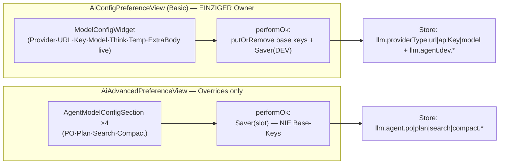
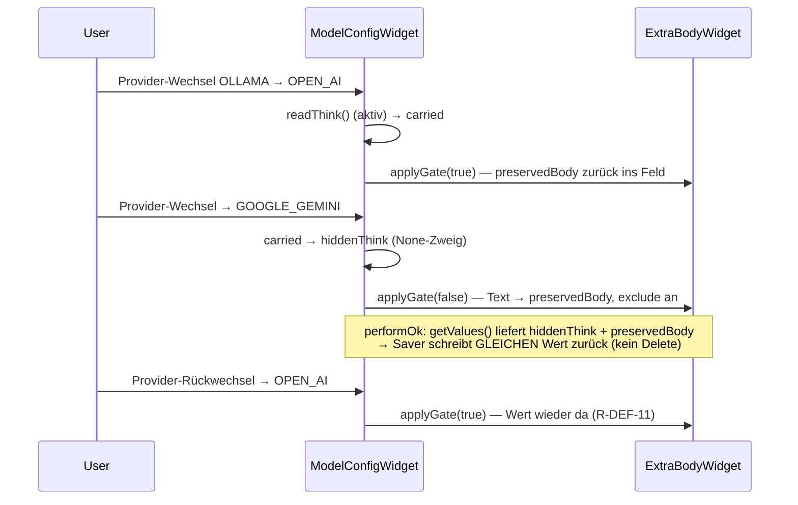

# Story: Widget-Rework R-DEF-9…11 — „Default for all agents", ein Owner, kein Doppelt-Editor

> **Branch:** `story/issue-149-think` (bleibt, kein neuer Branch). Commit nach JEDER grünen
> Iteration; Homepage-Dateien mit Inc-4-Commit. **Surefire ist Ground Truth** (core: Maven
> Surefire; OSGi: Tycho-Surefire-Zahlen) — `eclipseRunJavaTests`-Zahlen NIEMALS als Testnummer
> melden. **Vor JEDEM Plugin-Testlauf `eclipseBuildProject` über geänderte Projekte** (stale
> Bundle-Klassen in bin/ → ClassNotFoundException, memory 16). SWT-Tests im PDE-Runner.
> **docs/** schreibt nur Jon — Dev rührt `docs/**` nicht an. Dev-Scope: Code + `homepage/`.
> **Lint-Gate:** `lintDocsAndTests(root=repo, docRoots=[docs], idPattern="UC-DEF-\\d+")` nach
> jedem Inkrement mit neuen UC-IDs (UC-DEF-9/10/11 sind als `####`-Headings in
> `docs/default-inheritance.md` definiert — Gate soll grün laufen; bei Lint-Funden STOP-AND-ASK).

## 0. STOP-AND-ASK (Da Mek — geltend für ALLE Inkremente, Paul 2026-09-08)

Bei **Compile-Fehlern ohne Lösung**, **nicht-grün-bekommenden Tests**, **IST-Widersprüchen zum
Plan** oder Unklarheiten: **aktiv bei Jon nachfragen** — nie still workarounden, nie SOLL ändern,
nie Tests abschwächen damit sie grün werden. Rote Tests vor dem Fix systematisch (Bug-Hunt-Muster).
**Test-Ersatz/-Löschung ist in DIESEM Plan SOLL-bedingt benannt (§4 Inc 3 + §7) — jede weitere
rote Anpassung darüber hinaus = STOP-AND-ASK.**

---

## 1. Context

**Goal (Paul-GO 2026-09-29):** „Default for all agents" auf der Basic-Seite, Advanced nur
Overrides, **versteckt ≠ löschen**. Ground Truth: `docs/default-inheritance.md` (Rework-Abschnitt
R-DEF-9/10/11 ❌ specified, R-DEF-4/5/7 ☠️ superseded) · `docs/adr/0063-default-config-single-owner-basic-page.md`
(über ADR-0062) · `docs/model-config-widget.md` (Scope-Update 2026-09-29) ·
`docs/advanced-configuration.md` (Update 2026-09-29).

**WARUM (zwei bewiesene Fehler aus dem Paul-Smoke, Da-Mek-IST-Analyse):**

1. **Build-time-Gate + stille Löschung:** das Extra-Body-Feld wurde einmalig beim Page-Bau
   provider-gated (`ExtraBodyWidget`-Konstruktor `visible=false` → `jsonText=null`,
   `setBody` no-op :52-56, `getExtraBody()` null :59-61) — erscheint erst nach Apply +
   Tab-Wechsel; beim Advanced-OK mit geschlossenem Gate wurden gespeichertes extraBody/Think
   **still gelöscht** (`null` → `LlmConfigSaver.saveOrRemove` → remove).
2. **Doppelt-Editor-Falle (bewiesen):** `PreferenceDialog.okPressed()` ruft `performOk` auf jede
   **besuchte** Seite (Basic zuerst, Advanced zuletzt). Beide Pages schrieben alle Base-Keys +
   Dev-Slot aus ihrem Tab-Besuch-Stand → **Basic-Edits verloren gegen Advanced-Stale**; fehlender
   Provider-Key materialisierte den DefaultScope-Default (OLLAMA). „Speichert nicht immer" =
   genau dieser Mechanismus.

**IST-Anker (2026-09-29 verifiziert):**

- `AiAdvancedPreferenceView.addDevSection:103-117` (DEV-Sektion: `ModelConfigWidget` + standalone
  `ExtraBodyWidget` mit build-time-Gate :114-115), `performOk:119-138` schreibt Base-Keys
  (:128-130) + `Saver(DEV)` :131-133 (mit `devExtraBody.getExtraBody()`) + Slot-Schleife
  (:134-136). `AGENT_SECTIONS:40-45` = dev, po, plan, search, compact.
- `AiConfigPreferenceView`: Widget-Bau :39-42, `storeValues()` :78-84 (6-Feld-ConnectionValues,
  extraBody fehlt), `performOk:97-117` — Base-Keys :107-109 + `Saver(DEV)` :113-115 mit
  `withModel/withThink/withTemperature` (extraBody via geladenen Record bewahrt — Kommentar :110-112),
  Copilot-Login-Reload :119+ via `storeValues()`.
- `ModelConfigWidget`: Felder 0-14 (all-Indices; think created-once 10-12, Temperature 13-14),
  Provider-Listener → `rebuildThinkOnProviderChange` :253 (carried = `readThink()` VOR dem
  Form-Switch), `applyThinkForm` :266 → `applyThinkValue` :294 (**None → value dropped**, :307),
  `readThink :310` (**None → `""` — genau der Think-Lösch-Pfad bei Gemini/Mistral**),
  `load:164` / `getValues:176` / `snapshot:190` (= Connection-Identity, think nicht enthalten).
  Javadoc :36-45 („created once, toggled via GridData.exclude" — Muster fürs Live-Gate).
- `ExtraBodyWidget`: Konstruktor `(parent, visible)` early-return bei `visible=false` :37-41,
  Label hardcoded `SWT.END` :94-98, Status-Label exclude- until-Paste :78-83.
- `AgentModelConfigSection`: `extraBody = new ExtraBodyWidget(this, provider.supportsExtraBody())`
  :68 (construction-Gate OK — Provider dort NICHT editierbar, R-MCW-5 deferral), `load :76` /
  `getRecord :86` mit `readThink`-None → `""` :172.
- Gate-Tabelle `extraBodyMode`: **unterstützt** = OPEN_AI, LM_STUDIO, GITHUB_COPILOT,
  ANTHROPIC (BUILD_TIME); **NONE** = OLLAMA, GOOGLE_GEMINI, MISTRAL, GITHUB_MODELS,
  OPEN_AI_OFFICIAL (`LlmProvider.supportsExtraBody :90-92`).
- `LlmConfigSaver:19-38`: DEV-Model → `llm.model` :20-21 (bleibt!), `saveOrRemove :32-38`
  blank → remove. `AgentModelConfig`: `withModel/withThink/withTemperature` vorhanden,
  **`withExtraBody` fehlt** (zu ergänzen).
- `ConnectionValues` (6 Felder: provider, url, apiKey, think, model, temperature) — 7
  Konstruktor-Stellen: `AiConfigPreferenceView:81`, `AiAdvancedPreferenceView:112`,
  `ModelConfigWidget:165+177`, `ModelConfigWidgetTest` ×6.

## 2. Design decisions

- **D1 — ExtraBodyWidget zieht INS ModelConfigWidget (Komposition, Reuse statt Neu-Bau).**
  Das Widget ist der komplette Default-Editor (Scope-Update model-config-widget.md 2026-09-29;
  supersedes R-MCW-1 „extra body außerhalb"). Die Basic-Page bekommt das Feld nur live, wenn es
  im Widget sitzt — der Provider-Listener (`rebuildThinkOnProviderChange`-Pfad) gehört dem Widget.
  `ConnectionValues` bekommt `extraBody` als 7. Feld (ein load/getValues-Paar, Page bleibt dünn —
  ADR-0005: Widget owns state, Page routet).
- **D2 — Live-Gate = created-once + exclude-Toggle (exakt das Think-Muster, R-MCW-6).**
  ExtraBodyWidget wird refactored: Kontrollen (Label · Multi-Text · Examples-Row · Status-Label)
  werden **immer** gebaut; der Provider-Gate wird per `applyGate(boolean)` live umgeschaltet
  (`GridData.exclude` + `visible` + `parent.layout()` — GridLayout honoriert nur exclude).
  Konstruktor-Signatur `(Composite parent, boolean visible)` bleibt (Initial-Gate), neuer
  optionaler Label-Style-Parameter (Basic `SWT.LEFT`, Advanced `SWT.END` — „Label je Caller",
  R-A2/D4-Präzedenz; IST-Default `SWT.END` bleibt für die Sections).
- **D3 — Versteckt ≠ löschen über „preserved value"-Feld (eine Quelle, ein Funnel).**
  - `ExtraBodyWidget`: internes `preservedBody`. `applyGate(false)` capturt den Text in
    `preservedBody` VOR dem Verstecken; `applyGate(true)` schreibt `preservedBody` zurück ins Feld.
    `getExtraBody()`: sichtbar → Feld-Content, versteckt → `preservedBody`. Somit überlebt der
    letzte sichtbare Wert (geladen ODER getippt) versteckte Phasen und Provider-Rückwechsel
    („kehrt der Provider zurück, ist der Wert wieder da" — R-DEF-11).
  - `ModelConfigWidget`-Think analog: `applyThinkValue`-None-Zweig sett `hiddenThink = value`
    (der carried-Wert, der VOR dem Form-Switch gelesen wurde); `readThink()` None →
    `hiddenThink` statt `""`. `load()` resettet `hiddenThink` und füttert es via
    `applyThinkForm(None, v.think(), false)`. Ein Funnel (`applyThinkValue` None-Zweig) settet,
    ein Leser (`readThink`) konsumiert.
  - **Bewusste Kette (dokumentieren, nicht ändern):** R-MCW-6-Regel „fixed list ohne Match →
    geleert, nie stiller Ersatzwert" gilt WEITERHIN — erst geleert (sichtbar, Paul-Regel), dann
    versteckt, heißt der Wert ist weg, BEVOR das Feld hidden wird. R-DEF-11 schützt nur die
    None-Transition (versteckt), nicht das Paul-approvierte Listen-Clearing.
  - `snapshot()` UNVERÄNDERT — think/extraBody sind Request-Level, keine Connection-Identity
    (R-ML2/ADR-0034 unberührt).
- **D4 — Basic = alleiniger Owner (R-DEF-10).** Advanced verliert DEV-Sektion
  (`addDevSection`, `devWidget`/`devExtraBody`, DEV in `AGENT_SECTIONS`, DEV-Zweig in
  `addAgentSection`) und Base-Key-Writes im `performOk` (:123-133) — nur noch die
  PO/PLAN/SEARCH/COMPACT-Slot-Schleife. `LlmConfigSaver`-DEV-Sonderfall (Model → `llm.model`)
  und Loader-Clean-Break bleiben UNVERÄNDERT (Basic performOk schreibt weiter via `Saver(DEV)`).
- **D5 — `AgentModelConfig.withExtraBody(String)` (core, 1-Zeiler)** — Spiegel zu
  `withThink/withTemperature`; nötig für Basic-`performOk` (Inc 2), gehört ins Inkrement der
  ersten Nutzung.
- **D6 — Basic-Gruppierung via `TitledGroup("Default for all agents")`** vor dem Widget; das
  Widget baut in einen 2-Spalten-Grid-Composite INNHALB der Gruppe (dasselbe Wrapper-Muster wie
  `addDevSection` :104-107 — Reuse eines etablierten Musters).
- **D7 — Bewusste Grenze (out of scope, keine Frage an Paul nötig):** die per-agent
  `AgentModelConfigSection`s behalten ihr construction-time-Gate (Provider dort fix, R-MCW-5
  deferral) und ihr hidden → `""`/null-Verhalten für **po/plan/search/compact**-think/extraBody.
  R-DEF-11 scoped die Docs explizit auf `llm.agent.dev.*` („KEIN Pfad löscht
  `llm.agent.dev.extraBody` oder `llm.agent.dev.think` mehr still"). Der Advanced-DEV-Pfad fällt
  mit R-DEF-10 ohnehin weg. Falls Paul die Sections nachziehen will: separate Story.

## 3. Architecture

Save-Routing NACH dem Rework (ein Owner, keine geteilten Keys mehr):



Live-Gate + Preserve (Widget-intern, think und extraBody gleicher Mechanismus):



Code-Skizze (Signature-Level):

```java
// ExtraBodyWidget — created-once + live gate (D2/D3)
public ExtraBodyWidget(Composite parent, boolean visible, int labelStyle) // labelStyle neu, 2-arg bleibt (END)
public void applyGate(boolean supports)   // false: Text→preservedBody, alle 4 Controls exclude; true: zurück
public void setBody(String body)          // preservedBody + (sichtbar) Feld synchron
public String getExtraBody()              // sichtbar: Feld; versteckt: preservedBody (versteckt ≠ löschen)

// ModelConfigWidget
public record ConnectionValues(AiProvider provider, String url, String apiKey,
        String think, String model, String temperature, String extraBody) { ... } // 7. Feld
// load(): setBody(v.extraBody()) + applyGate(provider.supportsExtraBody()); hiddenThink=null-Reset
// providerCombo-Listener: rebuildThinkOnProviderChange() + extraBody.applyGate(...supportsExtraBody())
// readThink(): None → hiddenThink (statt "")
```

```java
// AgentModelConfig (core) — Inc 2
public AgentModelConfig withExtraBody(String extraBody) {
    return new AgentModelConfig(url, apiKey, model, think, extraBody, temperature);
}

// AiConfigPreferenceView.performOk (Inc 2) — statt nur loaded-Record:
LlmConfigSaver.saveAgentModelConfig(store, AgentModelConfig.DEV,
        LlmPreferenceInitializer.buildWithDefaults().modelConfigFor(AgentModelConfig.DEV)
                .withModel(values.model()).withThink(values.think())
                .withTemperature(values.temperature()).withExtraBody(values.extraBody()));
```

## 4. Inkremente (jedes für sich kompilierend + grün, Commit pro Inkrement)

### Inc 1 — ModelConfigWidget + ExtraBodyWidget live + versteckt ≠ löschen (UC-DEF-11)

**Status: ✅ DONE (2026-09-29, `af27674b`)** — PDE 310/0/0 · Core 1054/0/0/0 · Tycho 310/0F/0E/29S.
Mutation-Nachweis: Preserve-Capture + None-Set entfernt → exakt 3 rot → revert → clean.
D7-Guard in `AgentModelConfigSection` (Jon akzeptiert): Widget-Vertrag geändert, Sections behalten hidden→null.

**Ziel:** Widget trägt Extra body als Bindung 7 mit **live** Provider-Gate; hidden think/extraBody
surviven `getValues()` (kein `""`/null → kein Delete). Kein Page-Verhalten-Change außer
Think-Preserve (fließt durch) und der Advanced-DEV-Sektion nutzt ab jetzt das Widget-interne
Extra-Body-Feld (kein Doppel-Feld).

**Deliverables:**
- `org.sterl.llmpeon/src/org/sterl/llmpeon/parts/config/widgets/ExtraBodyWidget.java` —
  Refactor nach D2/D3: created-once + `applyGate(boolean)`, `preservedBody`-Feld,
  `getExtraBody()`-Preserve-Semantik, Label-Style-Parameter (2-arg-Konstruktor delegiert mit
  `SWT.END` — `AgentModelConfigSection:68` ohne Änderung). Javadoc: Build-time-Gate → Live-Gate
  (R-DEF-11), Konstruktions-Gate-Formulierung in `ExtraBody.java`-Kommentaren („UI gate ships in
  a later cycle" :20) ist core — KEIN core-Change nötig, nur Plugin-Javadoc.
- `org.sterl.llmpeon/src/org/sterl/llmpeon/parts/config/widgets/ModelConfigWidget.java` —
  Komposition: `ExtraBodyWidget` nach Temperature (all-Indices 15-18: Label, Multi-Text span 2,
  Examples-Row span 2, Status-Label); Provider-Listener erweitert um
  `extraBody.applyGate(LlmProviders.of(provider()).supportsExtraBody())`; `ConnectionValues` +
  `extraBody` (7. Feld, toString unmasked — kein Secret); `load()` (setBody + Gate + hiddenThink
  Reset), `getValues()` (extraBody durchreichen), `readThink()` None → `hiddenThink`,
  `applyThinkValue` None-Zweig sett `hiddenThink`. `snapshot()` UNVERÄNDERT. Klassen-Javadoc:
  Binding-Liste um „6 Extra body (live gate, R-DEF-9/11)" ergänzen.
- `org.sterl.llmpeon/src/org/sterl/llmpeon/parts/config/AiConfigPreferenceView.java` —
  `storeValues()`: 7. Arg `devRecord.extraBody()` (minimal compile-fix, memory 27).
- `org.sterl.llmpeon/src/org/sterl/llmpeon/parts/config/AiAdvancedPreferenceView.java` —
  minimal compile-fix: standalone `devExtraBody` ENTFERNEN (Widget-internal übernimmt — sonst
  Doppel-Feld), `addDevSection` vereinfacht (load mit `devRecord.extraBody()`), `performOk`
  :133 `devExtraBody.getExtraBody()` → `values.extraBody()`. (Die Sektion selbst stirbt in Inc 3.)

**Tests (alle `org.sterl.llmpeon.test`, PDE-Runner, `// UC-DEF-11`-Kommentare):**
- `ModelConfigWidgetTest`:
  - NEU `extraBodyFieldFollowsProviderChangeLive` — GIVEN Widget mit OLLAMA (Field hidden) WHEN
    Provider-Wechsel → OPEN_AI THEN Feld sofort sichtbar (Label „Extra body (JSON):", Multi-Text,
    Examples-Row) OHNE Apply; WHEN Wert getippt → Gemini THEN hidden UND
    `getValues().extraBody()` == getippter Wert; WHEN zurück → OPEN_AI THEN Wert wieder im Feld.
  - NEU `hiddenThinkSurvivesNoneProvider` — GIVEN OLLAMA think=`false` getippt WHEN → Gemini THEN
    `getValues().think()` == `"false"` (nicht `""`) und zurück → Ollama zeigt es wieder.
  - ADAPTIERT `showsConnectionFieldset` (UC-MCW-1, SOLL-bedingt): all 15 → **19** (4 Extra-Body-
    Kontrollen), rendered OLLAMA bleibt **14**; `assertFalse(hasLabelContaining("extra body"))`
    → ersetzt durch: Label existiert, aber excluded (hidden für NONE-Provider).
  - ADAPTIERT `thinkFieldFollowsProviderChange` (UC-MCW-7, SOLL-bedingt): Gemini-Schritt
    `getValues().think()` `""` → `"low"` (Preserve des letzten sichtbaren Werts); rendered 12 bleibt.
- `AiConfigPreferenceViewTest`:
  - NEU `hiddenThinkKeySurvivesOk` (`// UC-DEF-11`) — Fixture GOOGLE_GEMINI + gespeichertes
    `llm.agent.dev.think`; Page bauen, OK → Key IMMER NOCH da (Page-Pfad des Preserve).
    THINK_KEY bereits in KEYS-Restore-Liste.

**Verification:** `eclipseBuildProject` (plugin + test) → PDE-Runner-Suite; Surefire core
(erwartet unverändert 1054 — melden, nicht schätzen).

### Inc 2 — Basic-Seite: „Default for all agents" + Extra-Body-Persistenz (UC-DEF-9)

**Status: ✅ DONE (2026-09-29, `c7d4e71d`)** — PDE 313/0/0 · Core 1054/0/0/0 · Tycho 313/0F/0E/32S.
Abweichung (Jon zu berichten): Plan „rendered 24→28" ist mit D6-Wrapper inkonsistent — IST 14
(OLLAMA, Groups-Grid trägt nur das Widget) / 17 (nach Switch auf OpenAI, +3 sichtbare
Extra-Body-Kontrollen; Status-Label bleibt bis Paste excluded). Struktur folgt D6/ADR-0063.

**Ziel:** Basic-Seite trägt die Überschrift und persistiert den kompletten Dev-Slot inkl.
extraBody — der Single-Owner-Write-Pfad.

**Deliverables:**
- `org.sterl.llmpeon.core/src/main/java/org/sterl/llmpeon/ai/AgentModelConfig.java` —
  `withExtraBody(String)` (D5).
- `org.sterl.llmpeon/src/org/sterl/llmpeon/parts/config/AiConfigPreferenceView.java` —
  `createFieldEditors`: `TitledGroup("Default for all agents")` + 2-Spalten-Grid (Wrapper-Muster
  `addDevSection:104-107`), Widget baut darein (D6); `performOk`: `.withExtraBody(values.extraBody())`
  (D5) — Kommentar :110-112 aktualisieren („keeps the loaded extraBody" → Widget-Wert mit
  Preserve-Semantik). Copilot-Login-Reload unverändert (`storeValues()` trägt extraBody schon).

**Tests (`org.sterl.llmpeon.test`, PDE-Runner):**
- `AiConfigPreferenceViewTest`:
  - NEU `showsDefaultForAllAgentsGroup` (`// UC-DEF-9`) — GIVEN Basic-Page (Fixture OPEN_AI —
    extra-body-fähig) WHEN gerendert THEN Gruppe „Default for all agents" existiert und trägt
    Provider·URL·Key·Model+Refresh·Think·Temperature·**Extra body (JSON)** (+Examples-Row +
    Status-Label) in dieser Bindungsreihenfolge; Render-Verhalten selbst = Paul-Smoke.
  - NEU `performOkPersistsExtraBody` (`// UC-DEF-9`) — GIVEN Fixture OPEN_AI WHEN JSON getippt +
    OK THEN `llm.agent.dev.extraBody` == JSON; WHEN Feld geleert + OK THEN Key ENTFERNT
    (empty = unset, `saveOrRemove`). DEV_EXTRA_BODY_KEY in die KEYS-Restore-Liste.
  - NEU `hiddenExtraBodyKeySurvivesOk` (`// UC-DEF-11`) — Fixture OLLAMA + gespeichertes
    `llm.agent.dev.extraBody`; Page bauen (Feld hidden), OK OHNE Änderung → Key erhalten
    (Page-Pfad, versteckt ≠ löschen).
  - ADAPTIERT `performOkPersistsWidgetValues` (SOLL-bedingt): rendered 24 → **28** (+4 sichtbare
    Extra-Body-Kontrollen unter OPEN_AI); Think-Indices 10/11 unverändert (Extra body hängt HINTEN
    an, nothing shifts).

**Verification:** `eclipseBuildProject` → PDE-Runner; Surefire core (1054 erwartet).

### Inc 3 — Advanced: DEV-Sektion raus, keine Base-Key-Writes (UC-DEF-10)

**Status: ✅ DONE (2026-09-29, `43c91fb2`)** — PDE 312/0/0 · Core 1054/0/0/0 · Tycho 312/0F/0E/31S ·
Lint grün (nur MANUELL UC-DEF-6). Grep-Verify: Base-Key-Writer im Plugin nur noch
`AiConfigPreferenceView` + `LlmPreferenceInitializer` (DefaultScope/Copilot-Login);
`AgentModelConfig.DEV` nur noch Basic. Jon-Entscheidung (a): `// UC-DEF-4`-Zeile in
`LlmConfigLoaderTest` entfernt (Test bleibt als Loader-Clean-Break-Regression, ADR-0062;
Doc-Referenz in default-inheritance.md).

**Ziel:** Single Owner strukturell — Advanced schreibt ausschließlich PO/PLAN/SEARCH/COMPACT-Slots.

**Deliverables:**
- `org.sterl.llmpeon/src/org/sterl/llmpeon/parts/config/AiAdvancedPreferenceView.java` —
  `AGENT_SECTIONS` ohne DEV (po, plan, search, compact); `addDevSection` + `devWidget`/
  `devExtraBody`-Felder + DEV-Zweig in `addAgentSection` ENTFERNT; `performOk`: Base-Key-Writes
  + `Saver(DEV)` ENTFERNT (:123-133) — nur Slot-Schleife; Klassen-Javadoc neu (Single Owner,
  ADR-0063).
- **Grep-Verifikation (Vorab, memory 18/27):** Base-Writer auf Advanced müssen 0 bleiben —
  Grep `PREF_PROVIDER_TYPE|PREF_URL|PREF_API_KEY|PREF_MODEL` + `AgentModelConfig.DEV` über
  `org.sterl.llmpeon` — IST nach Umbau: nur noch `AiConfigPreferenceView` (Basic) +
  `LlmPreferenceInitializer` (DefaultScope-Defaults, unberührt, ADR-0062) + GitHub-Copilot-Login
  (Basic-Flow). Minimale Compile-Fix-Zeilen in DIESES Inkrement.

**Tests (PDE-Runner + Plain-JUnit4, `// UC-DEF-10`):**
- `AdvancedPreferenceSectionsTest`:
  - ERSETZT `devSectionIsFirstAndTitledDefault` (UC-DEF-5, ☠️ superseded) → NEU
    `devSectionIsGoneAndSlotOrderStable` (`// UC-DEF-10`): `AGENT_SECTIONS` ==
    `po, plan, search, compact`, kein „Dev"-Titel.
  - ADAPTIERT `everyCoreSlotHasASection` (SOLL-bedingt): vergleicht gegen `CORE_IDS` **ohne DEV**
    (entweder gefiltert oder neue Konstante `OVERRIDE_IDS = CORE_IDS ohne DEV` — Dev wählt;
    Empfehlung: lokale Filterung, keine neue öffentliche Konstante ohne Nutzer).
- `AiAdvancedPreferenceViewTest`:
  - GELÖSCHT `performOkWritesBaseKeysForDev` (UC-DEF-4 ☠️) und `devSectionCarriesFullFieldset`
    (UC-DEF-7 ☠️) + `devGrid`-Helper — SOLL-bedingt, Feature superseded (default-inheritance.md
    markiert R-DEF-4/5/7 als ☠️).
  - NEU `performOkWritesOnlySlotKeys` (`// UC-DEF-10`) — GIVEN Fixture mit gesetzten Base-Keys +
    PO-Section WHEN PO-Werte getippt + Advanced-OK THEN PO-Slot-Keys geschrieben UND
    `llm.providerType/url/apiKey/model` UNVERÄNDERT (Fixture-Stand) UND `llm.agent.dev.think`/
    `temperature`/`extraBody` UNVERÄNDERT — der Single-Owner-Beweis (stale override + default
    materialization strukturell tot).
- BLEIBT unverändert: `LlmConfigLoaderTest.devUrlAndApiKeyKeysAreIgnored` (Loader-Clean-Break,
  R-DEF-4-Teil bleibt SOLL), `AgentModelConfigSectionTest` (Saver(DEV)→`llm.model` ist
  Basic-Pfad-Semantik, nicht die entfernte Sektion).

**Verification:** `eclipseBuildProject` → PDE-Runner; Surefire core (Loader-Test unverändert).

### Inc 4 — Homepage (Dev-Scope, KEINE `docs/**`-Änderungen)

**Status: ✅ DONE (2026-09-29, `585d9f88`)** — Lint grün (nur MANUELL UC-DEF-6).
`custom-agents.md` geprüft: :105 bleibt korrekt („base connection from Peon Configuration") — unverändert.
Nicht angerührt (aus Plan-Scope): Homepage-Screenshots (`mcp-config.png` zeigt die alte Struktur ohne
Gruppe/Extra-Body — für ein Screenshot-Update durch Jon/Paul notiert).

**Deliverables:**
- `homepage/src/setup/configuration.md`:
  - :14 Feldliste um **Extra body (JSON)** ergänzen; Verbindungssatz: „Default for all agents"-
    Gruppe benennen.
  - NEU Abschnitt „Extra body (JSON)" (nach Temperature): Dev-Slot-Feld auf DIESER Seite; **live
    sichtbar** je Provider (sichtbar für OpenAI/LM Studio/GitHub Copilot/Anthropic, hidden für
    Ollama/Gemini/Mistral/GitHub Models/OpenAI-Official — ohne Apply/Tab-Wechsel); 3 Example-
    Buttons (Paste ersetzt Inhalt); **versteckt ≠ löschen**: Provider-Wechsel auf einen
    NONE-Provider versteckt das Feld, löscht das gespeicherte JSON aber nie — Rückwechsel zeigt
    es wieder; es wird nur nicht gesendet.
  - :220 „(Advanced page)" → Basic-Bezug (das Extra-body-Feld des Dev-Agenten steht auf DIESER
    Seite).
- `homepage/src/setup/advanced-configuration.md`:
  - :25 „Dev (Default)-section mirrors …" ersetzen durch: **Basic = Default-Owner** („Default for
    all agents" — kompletter Slot inkl. Extra body), **Advanced = Overrides only** (keine
    DEV-Sektion); Dev ist der Default-Agent, dessen Einstellungen auf der
    [Configuration](./configuration.md)-Page leben.
  - :33 Temperature: „The Dev agent's field is also on the main page — both pages edit the same
    value" → Dev-Temperature wird NUR auf der Basic-Page editiert (Advanced hat keine
    Dev-Sektion mehr).
  - :45 Per-Agent-Think-Aufzählung („PO, Dev (the default), Plan, Search, Compact") → Dev-Think
    = Think (Default) auf Basic; Advanced-Sections nur für die vier Overrides.
  - :93 „Each agent's section has an Extra body (JSON) field" → pro-Agent-Overrides (PO/Plan/
    Search/Compact); Dev-Extra-body auf Basic; hidden-≠-delete-Satz fürs Dev-Feld.
  - :29 Absatz (PO-Slot-Hinweis) auf neue Struktur prüfen.
- `homepage/src/setup/custom-agents.md` — :105 prüfen (leere Felder erben Base) — vermutlich
  unverändert; nur anfassen, wenn der Dev-Default-Bezug now falsch ist.

**Verification:** Markdown-Diff Review; kein Code-Touch; Lint-Gate.

## 5. Affected files (gesamt)

| Inkrement | Datei | Änderung |
|---|---|---|
| 1 | `plugin/.../widgets/ExtraBodyWidget.java` | created-once + live `applyGate` + preserve |
| 1 | `plugin/.../widgets/ModelConfigWidget.java` | Komposition Bindung 7 + `ConnectionValues` +7. Feld + think-Preserve |
| 1 | `plugin/.../config/AiConfigPreferenceView.java` | `storeValues()` 7-arg (compile-fix) |
| 1 | `plugin/.../config/AiAdvancedPreferenceView.java` | standalone `devExtraBody` raus (Widget-internal) |
| 1 | `plugin-test/.../ModelConfigWidgetTest.java` | UC-DEF-11 neu ×2, UC-MCW-1/7 SOLL-Adaption |
| 1 | `plugin-test/.../AiConfigPreferenceViewTest.java` | UC-DEF-11 `hiddenThinkKeySurvivesOk` |
| 2 | `core/.../ai/AgentModelConfig.java` | `withExtraBody` |
| 2 | `plugin/.../config/AiConfigPreferenceView.java` | TitledGroup + `withExtraBody` im performOk |
| 2 | `plugin-test/.../AiConfigPreferenceViewTest.java` | UC-DEF-9 ×2 + UC-DEF-11 Page-Pfad + UC-MCW-6-Count |
| 3 | `plugin/.../config/AiAdvancedPreferenceView.java` | DEV-Sektion + Base-Key-Writes ENTFERNT |
| 3 | `plugin-test/.../AdvancedPreferenceSectionsTest.java` | UC-DEF-5-Test ersetzt, Core-Slot-Test adaptiert |
| 3 | `plugin-test/.../AiAdvancedPreferenceViewTest.java` | 2 Tests gelöscht (SOLL), UC-DEF-10 neu |
| 4 | `homepage/src/setup/configuration.md` | „Default for all agents" + Extra body + hidden≠delete |
| 4 | `homepage/src/setup/advanced-configuration.md` | Dev-(Default)-Abschnitt → Basic-Owner/Overrides |
| 4 | `homepage/src/setup/custom-agents.md` | prüfen |

**Bewusst UNVERÄNDERT:** `LlmConfigSaver` (DEV→`llm.model` bleibt — Basic-Pfad),
`LlmConfigLoader` (Clean Break dev.url/apiKey nie gelesen — bleibt), `LlmPreferenceInitializer`
(DefaultScope-Defaults, JFace-Trap bleibt beobachtbar), `EffectiveConnection`/`ConnectionIdentity`/
`ConfiguredChatModel`, `ModelComboWidget`, `ModelListCache`, `AgentModelConfigSection`
(construction-Gate bleibt — D7-Grenze), `ExtraBody.parse`/Merge-Pfad (core), GitHub-Copilot-Login,
`AIChatView`-Guard, `ThinkResolver`.

## 6. Rules & constraints

- **Ein Key, ein Editor** (ADR-0063): Base-Keys + Dev-Slot schreibt ausschließlich Basic;
  Advanced nur `llm.agent.<po|plan|search|compact>.*` + Global-Settings. Kein Key zwei Pages.
- **Versteckt ≠ löschen:** hidden Felder liefern den letzten sichtbaren Wert (geladen oder
  getippt) zurück — nie `""`/null → nie stilles `saveOrRemove`-Delete für `llm.agent.dev.think`
  / `extraBody`.
- **Log OR throw / A tool must never lie / Empty means unset / Clean break** (AGENTS) — unverändert.
- **Secrets:** API-Key nie in toString/Messages — `ConnectionValues.toString` maskiert weiter;
  extraBody/temperature sind keine Secrets (bleiben unmasked).
- **Threads:** Widget-Zugriffe UI-Thread; Fetch-Jobs über bestehende Snapshot-Muster
  (`FetchSnapshot`, `WAIT_TIMEOUT_MS`); Timeouts nicht parallel nachstarten (memory 13).
- **Tests:** GIVEN/WHEN/THEN + `// UC-DEF-n`; Surefire = Ground Truth; vor jedem Plugin-Testlauf
  `eclipseBuildProject` (memory 16); Fixture VOR Page-Build persistieren, Restore in finally
  (memory 12) — neue Keys (DEV_EXTRA_BODY_KEY, THINK_KEY fürs Gemini-Test-Fixture) in die
  KEYS-Restore-Listen.
- **Kein `docs/**`-Write durch Dev.** Homepage ja (Inc 4). Kein Branch-Wechsel ohne Paul-Ansage.

## 7. BDD acceptance (UC-DEF ↔ Tests)

| UC | GIVEN/WHEN/THEN (Kurzform) | Test | Inkrement |
|---|---|---|---|
| UC-DEF-9 | Basic rendert „Default for all agents" mit komplettem Slot (…·Temp·Extra body Bindung 7); OK persistiert `llm.agent.dev.extraBody` (leer → entfernt) | `AiConfigPreferenceViewTest.showsDefaultForAllAgentsGroup`, `performOkPersistsExtraBody` (+ Paul-Smoke Rendering) | 2 |
| UC-DEF-10 | Advanced ohne DEV-Sektion; Advanced-OK schreibt KEINEN Base-Key, Slot-Keys ja, Dev-Slot unberührt | `AdvancedPreferenceSectionsTest.devSectionIsGoneAndSlotOrderStable`, `AiAdvancedPreferenceViewTest.performOkWritesOnlySlotKeys` (+ Paul-Smoke) | 3 |
| UC-DEF-11 | Extra-Body-Feld folgt Provider live; hidden → gespeicherter Wert überlebt OK (think UND extraBody), Rückwechsel zeigt ihn wieder | `ModelConfigWidgetTest.extraBodyFieldFollowsProviderChangeLive`, `hiddenThinkSurvivesNoneProvider`, `AiConfigPreferenceViewTest.hiddenThinkKeySurvivesOk`, `hiddenExtraBodyKeySurvivesOk` | 1+2 |
| (UC-DEF-4/5/7) | ☠️ superseded — Tests `performOkWritesBaseKeysForDev`, `devSectionCarriesFullFieldset`, `devSectionIsFirstAndTitledDefault` GELÖSCHT/ERSETZT (oben benannt, SOLL-bedingt) | — | 3 |
| UC-MCW-1/7 | SOLL-Adaption (Feldzähler 19/14, think-Preserve statt `""`) — SOLL-bedingt benannt, keine Abschwächung | `ModelConfigWidgetTest` | 1 |

Erwartete Zahlen: core unverändert 1054 · OSGi +5 netto (Inc 1: +3, Inc 2: +3, Inc 3: −3 gelöscht
+2 neu, Adaptions-funded) — **Dev meldet echte Surefire-/Tycho-Zahlen, nie diese Schätzung.**

## 8. Test strategy

- **Beide Richtungen** (memory 30): live-gate erscheinen (OLLAMA→OPEN_AI) UND verschwinden-plus-
  erhalten (→Gemini) werden getestet; Page-Pfad (performOk) UND Widget-Pfad (getValues).
- **Seed/Count-Inventarisierung (memory 33):** alle Feldzähler-Tests benannt —
  `showsConnectionFieldset` (15→19 all, 14 rendered Ollama), `performOkPersistsWidgetValues`
  (24→28), `devSectionCarriesFullFieldset` (19, stirbt), `devGrid`-Helper. Weitere Kinderzähler
  per Grep vor Inc 1 verifizieren.
- **Fixture-Hygiene (memory 12):** KEYS-Restore-Listen je Testklasse um die neuen Keys erweitern,
  BEVOR Tests schreiben; Restore in finally.
- Mutations-Check wie R-MCW-6: `applyGate(false)`-Capture (versteckt ≠ löschen) sollte rot werden,
  wenn man das Capture weglässt — Test muss das beweisen (`hiddenExtraBodyKeySurvivesOk`).
- Keine SWT-Tests außerhalb des PDE-Runners; erste Suite-Runs: Workspace-Trust beachten (memory 13).

## 9. Open questions

**Keine** — Paul-GO 2026-09-29 deckt alle Entscheidungen (R-DEF-9/10/11 + Inkrement-Slicing).
Dokumentierte Grenzen ohne Fragebedarf: D7 (Sections behalten construction-Gate — Doc-Scope =
Dev-Keys), D3-Kette (R-MCW-6 Listen-Clearing bleibt vor dem Preserve). Falls Paul D7 anders
will: separate Story, nicht in diesem Plan.

---

## 11. Review (Da Dok, 2026-09-29 — Pre-Mortem R-DEF-9/10/11)

**Verdict: CONCERNS** — akzeptabel, **keine Blocker, keine Rework-Items**. SOLL == IST auf
Code-Ebene: alle 4 Commits sauber gegen Plan + Feature-Docs + ADR-0063 verifiziert, alle
BDD-Szenarien haben echte (falsifizierbare) Tests, alle Abweichungen sind dokumentiert und
Jon-akzeptiert. Non-Blocking-Gaps G1–G6 unten; G1 ist auch die Risk-Line.

### Jon-Check-Points (alle 6 verifiziert, Evidenz file:line)

1. **Feature-Doc-BDD → Test (inkl. 3× hidden≠delete): ✓** — UC-DEF-9 →
   `AiConfigPreferenceViewTest.showsDefaultForAllAgentsGroup` + `performOkPersistsExtraBody`;
   UC-DEF-10 → `AdvancedPreferenceSectionsTest.devSectionIsGoneAndSlotOrderStable` +
   `AiAdvancedPreferenceViewTest.performOkWritesOnlySlotKeys` (assertet Base-Keys UNVERÄNDERT,
   Dev-Slot UNVERÄNDERT, PO-Slot geschrieben = Single-Owner-Beweis); UC-DEF-11 →
   `ModelConfigWidgetTest.extraBodyFieldFollowsProviderChangeLive` + `hiddenThinkSurvivesNoneProvider`,
   `AiConfigPreferenceViewTest.hiddenThinkKeySurvivesOk` + `hiddenExtraBodyKeySurvivesOk`
   (Page- und Widget-Pfad, beide Richtungen je memory 30). Superseded-Tests (UC-DEF-4/5/7) wie
   §7 benannt gelöscht/ersetzt; `LlmConfigLoaderTest.devUrlAndApiKeyKeysAreIgnored` bleibt
   (Clean Break).
2. **Base-Key-Writer: ✓** — Grep `PREF_PROVIDER_TYPE|PREF_URL|PREF_API_KEY|PREF_MODEL` über
   Plugin: nur `AiConfigPreferenceView:115-117` (Basic) + `LlmPreferenceInitializer`
   (DefaultScope :28-36, Copilot-Login :70-77 — beides SOLL laut ADR-0062/0063).
   `AgentModelConfig.DEV` Plugin-seitig nur noch Basic; core-seitig nur Loader/Saver/Record
   (bewusst unverändert).
3. **Inc-1-Diff vs. Plan: ⚠ IST-Abweichung (günstig, zu berichten)** — Jon-Intake sagte „Inc-1
   uncommitted im Working Tree"; **IST: Inc-1 ist committed (`af27674b`)**, Working Tree enthält
   nur noch `docs/**` (Jon) + ADR-0063 + Plan. Review lief auf dem committed Diff. Alle
   Inc-1-Deliverables vorhanden: `ExtraBodyWidget` created-once + `applyGate` :96-110 +
   `preservedBody` :40 + Preserve-Semantik `getExtraBody()` :87-89 (open→Feld, closed→
   preservedBody; `setBody` :76-81 füttert preservedBody auch bei closed Gate) + 2-arg-Ctor
   delegiert `SWT.END` :46-48 (`AgentModelConfigSection:68` unverändert aufrufbar);
   `ModelConfigWidget` Bindung 7 nach Temperature, `ConnectionValues` +7. Feld (unmasked —
   extraBody ist kein Secret, §6 OK), `load()` mit `hiddenThink=null`-Reset,
   `onProviderChange` mit `extraBody.applyGate(...)`, `applyThinkValue`-None-Zweig →
   `hiddenThink`, `readThink` None → `hiddenThink`, `snapshot()` UNVERÄNDERT.
4. **R-MCW-6-Interaktion — nachgewiesen (nicht behauptet): ✓** — aus dem Quellcode
   `ModelConfigWidget.applyThinkValue`: Fixed-List-no-match leert das Combo **sichtbar**
   (`else if (carried) thinkCombo.setText("")`), also BEVOR eine spätere None-Transition
   `hiddenThink` setzt → ein Paul-geleerter Wert bleibt weg; eine reine None-Kette (Wert noch
   sichtbar bei Wechsels) wird erst dann gepreserved. Exakt die D3-„Bewusste Kette" aus dem
   Plan, in der IST bestätigt.
5. **Docs↔Code R-DEF-9/10/11 + ADR-0063: ✓ 1:1** — `default-inheritance.md` (R-DEF-9/10/11 ❌
   specified, R-DEF-4/5/7 ☠️), ADR-0063 (über 0062, Decisions+Consequences gehalten),
   `model-config-widget.md` Scope-Update, `advanced-configuration.md`, Homepage `c7d4e71d`/
   `585d9f88` (Gruppe „Default for all agents", Extra-Body-Abschnitt mit hidden≠delete,
   Advanced ohne DEV-Sektion) — alles konsistent mit dem gebauten Code. Lint (selbst gelaufen,
   docRoots=docs + beide Test-Roots, idPattern `UC-DEF-\d+`): 8/8 UC-Defs, 24 ID-Zeilen/7
   unique, einziges Finding `MANUELL UC-DEF-6` (legitim, R-DL-22).
6. **Kein `docs/**`-Write durch Dev: ✓** — alle 4 Commits enthalten null `docs/`-Dateien;
   Homepage nur in `585d9f88` (Dev-Scope laut Plan §4 Inc 4).

### Evidence (Zahlen, alle gegen archivierte Reports/11:21, memory 16)

- Core Surefire **1054/0F/0E/0S** ✓ (Plan: 1054 erwartet).
- OSGi Tycho headless **312/0F/0E/31S** ✓; Per-Klasse: ModelConfigWidgetTest 8,
  AiConfigPreferenceViewTest 9, AiAdvancedPreferenceViewTest 1, AdvancedPreferenceSectionsTest 4 —
  alle 8 neuen/ersetzen Tests in den archivierten XMLs vorhanden. Rechenweg konsistent:
  Baseline 307 (nach `a3320aa8`) +3 (Inc 1) +3 (Inc 2) −1 (Inc 3: −3 gelöscht, +2 neu) = 312.
- PDE-Runner „312/0/0" (Inc-1/2/3-Statuszeilen): **kein persistiertes Artefakt** (interaktiver
  Runner; Tycho-Zahlen decken dieselben Tests ab, 31 SWT-Skips headless-bekannt) — wie im
  Vorzyklus, Notiz statt Blocker (G6).

### Non-Blocking-Gaps (CONCERNS — keine Rework erforderlich)

- **G1 (Risk) — fehlender Edge-Test für die D3-„Bewusste Kette" (R-MCW-6 vs. R-DEF-11):**
  Die Präzedenz „List-Clearing passiert sichtbar ERST, None-Preserve ZWEIT" ist nur implizit
  im Code (`ModelConfigWidget.applyThinkValue`-Zweigreihenfolge) + im Plan (D3) dokumentiert,
  aber **nicht durch einen eigenen Test gepinnt**. `hiddenThinkSurvivesNoneProvider` prüft die
  reine None-Kette (Preserve); kein Test prüft „getippt → Fixed-List-Provider ohne Match
  (sichtbar geleert) → None-Provider ⇒ Wert bleibt `""`". Ein späterer Preserve-„Verbesserer"
  (None-Zweig setzt `hiddenThink` vor das Listen-Clearing) würde Paul-geleerte Werte still
  auferstehen lassen — grün, ohne dass ein Test es fängt. **Empfohlener Test (Da Thinka/Da Mek):**
  `ModelConfigWidgetTest.thinkClearedByListSwitchStaysClearedAfterNoneTransition` — GIVEN
  Ollama think=`false`, WHEN → OpenAI (Liste ohne `false`) THEN Combo sichtbar leer, THEN →
  Gemini THEN `getValues().think()` == `""` (nicht `false`).
- **G2 — Duplikat (Rule of Three, simple/local):** SWT-Idiom „`exclude = !visible` +
  `setVisible(visible)`" (GridLayout honoriert nur exclude) in 3 Stellen:
  `ExtraBodyWidget.setGateVisible:150-151`, `ModelConfigWidget.setThinkVisible:300-301`
  (beide neu) + `McpPreferenceView:333-336` (vorhanden). Extraktions-Kandidat:
  `SwtUtil.setExcluded(Widget control, boolean visible)` — niedrige Priorität, 2 Zeiler.
- **G3 — Plan §8 Mutation-Claim unpräzise (Plan-Text, kein Code-Defekt):** Plan sagt
  „`hiddenExtraBodyKeySurvivesOk` soll rot werden, wenn das Capture wegfällt" — **falsch**:
  dieser Test pinnt `setBody`→`preservedBody` bei closed Gate (Load-Pfad); das
  `applyGate(false)`-Capture wird tatsächlich von
  `extraBodyFieldFollowsProviderChangeLive` (getippt → hidden) falsifiziert. Devs IST-Evidenz
  („Preserve-Capture + None-Set entfernt → exakt 3 rot") ist korrekt (1 Capture + 2 None-Set).
  → §8-Zitat korrigieren, keine Code-Folge.
- **G4 — Plan §5-Tabelle stale:** `AgentModelConfigSection` steht in „Bewusst UNVERÄNDERT",
  erhielt aber die D7-Guard-Zeile (`getRecord` → `extraBodySupported ? extraBody.getExtraBody()
  : null`) + Feld — **notwendig** (ohne sie würde die neue Preserve-Semantik die Sections
  hidden→preserved statt hidden→null machen, D7-Verstoß) und in der Inc-1-Statuszeile
  benannt + Jon-akzeptiert. → nur die §5-Tabelle nachziehen.
- **G5 (oberflächlich):** Bindungs-Nummering — Test-Kommentar „binding 6" vs. Javadoc/Docs
  „Binding 7" (off-by-one). Position (nach Temperature) ist semantisch eindeutig; bei nächster
  Gelegenheit vereinheitlichen.
- **G6 (Evidenz):** PDE-Runner-Zahlen (312/0/0 in den Statuszeilen) sind nicht im Repo
  nachprüfbar (kein konsistiertes Artefakt) — siehe Evidence.

### Plan-Coverage-Gap

Kein Gap gegen Dev. Hinweis an Jon (Docs-Ebene, kein Dev-Rework-Item): die D3-Präzedenz
(„List-Clearing vor None-Preserve") steht nur im Plan; `docs/model-config-widget.md` bzw.
`docs/default-inheritance.md` (R-DEF-11) formulieren sie nicht explizit — ein Satz in
R-DEF-11 („stille Wiederauferstehung eines Paul-geleerten List-Clear-Werts ist aus
Sicht der Docs nicht vorgesehen") würde G1 auf Doc-Seite absichern.

### Skill/Instruct-Gap

Kein neues. Die Empfehlung aus dem Vorzyklus-Review (`eclipse-preferences`-Skill:
`ScopedPreferenceStore.setValue`-Traps (a) Default-gleich-Removal, (b) null-NPE + geteiltes
`putOrRemove`) ist bereits implementiert (`5beb28d7`,
`.agents/skills/eclipse-preferences/SKILL.md`); die Skill-Impact-Ledger-Eintragungen
(Agents/Skills) stimmen.

### Mutation-Check

Kein neuer needed — Inc-1-Nachweis (Capture + None-Set → exakt 3 rot → revert → clean) ist
konsistent mit der Source-Trace; einzig das §8-Zitat (G3) nachziehen.

### Risk-Line

**Most likely reason this breaks later:** die D3-Präzedenz (List-Clearing sichtbar erst,
None-Preserve zweit) hat keinen eigenen Test (G1) — eine spätere Preserve-„Verbesserung"
in `applyThinkValue` lässt Paul-geleerte Think-Werte still auferstehen, alle existierenden
Tests bleiben grün (genau die SOLL-Verletzung „Empty means unset"/Paul-Regel R-MCW-6).
**Change that most reduces that risk:** G1-Test
`thinkClearedByListSwitchStaysClearedAfterNoneTransition` nachrüsten.
