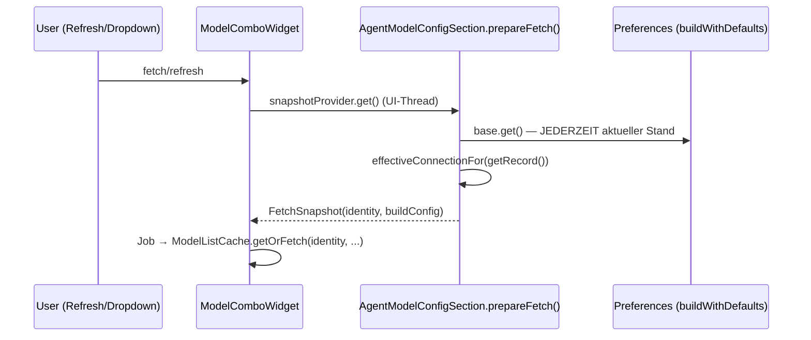

# R-ML1 — Fetch-Identity ist live (docs/model-loading.md) — Branch `story/lib-update-2026-09-09` (nicht wechseln)

## ⛔ STOP-AND-ASK (Da Mek, User-Regel 2026-09-08 — gilt immer)
Bei Compile-Fehlern, IST-Widersprüchen zum Plan oder Unklarheiten: AKTIV bei Jon (PO,
askDev-Kanal) nachfragen — nie still workarounden, nie das SOLL (docs/model-loading.md) ändern.

## 1. Context
Bug-1 (lib-update Smoke-Test 2026-09-10): die Advanced-Page snapshotet `LlmConfig` einmalig
pro Page-Leben (`AiAdvancedPreferenceView.createFieldEditors`, `config = buildWithDefaults()`),
reicht es an fünf `AgentModelConfigSection`-Composites; `AgentModelConfigSection.base` ist
`final` (AgentModelConfigSection.java:49) und `prepareFetch()` (:99) baut die
Effective-Connection-Identity aus diesem Stale-Base → eine Base-URL-Korrektur wirkt beim
Listen-Fetch (Refresh-Button/Dropdown) erst nach Page-Reopen. Die Basic-Page ist korrekt
(live-Supplier, `AiConfigPreferenceView.java:98-99` → `ModelComboWidget.baseSnapshot(...)` im
Supplier). Agenten mit **eigener** URL sind live (`getRecord()`) — betroffen sind nur Agenten,
die die Base-URL erben. SOLL: Fetch-Identity zur **Fetch-Zeit** aus aktueller Konfiguration.

## 2. Design decisions
- **Live-Supplier statt Snapshot** (SOLL-Vorgabe): `AgentModelConfigSection` nimmt im
  Konstruktor `Supplier<LlmConfig> base` statt `LlmConfig base`. `prepareFetch()` ruft
  `base.get().effectiveConnectionFor(getRecord())` — Identität + Build-Config zur Fetch-Zeit
  (UI-Thread, vor dem Job-Snapshot; Mechanik unverändert, der Stale-Guard in
  `ModelComboWidget.applyModelList` vergleicht ohnehin gegen den aktuellen Supplier).
- **Widget-FORM bleibt Konstruktions-Zeit:** think-Form/extra-body-Sichtbarkeit hängen am
  Base-Provider (`LlmProviders.of(base.get().getProviderType())` im Konstruktor). Ein
  Provider-Wechsel kann das Composite nicht nachbauen — Form-Determinierung aus `base.get()`
  beim Aufbau (wie heute, kein Regressionsrisiko; R-ML1 betrifft nur die Fetch-Identity).
- Keine Änderung an `ModelComboWidget`, `ModelListCache`, Refresh-Button/Dropdown-Verhalten,
  `getRecord()` (R-ML1b-IST bleibt).
- **Keine Test-Erfindung (ehrlich manuell):** die Änderung ist reines Wiring; SWT-freie Logik
  (`FetchSnapshot`, `fetchList`, `effectiveConnectionFor`) existiert bereits und ist gedeckt
  (`AgentModelConfigFetchTest`, `ModelComboWidgetTest`, core). Es entsteht KEINE neue
  SWT-freie Logik → kein Unit-Test, Verifikation manuell + Code-Review (SWT-Präzedenz
  R-UI1/R-MCP3). Kein Scheintest.

## 3. Architecture

Vorher: `P` nur beim Page-Aufbau (stale Base). Nachher: `P` bei jedem Fetch — gleiche Naht wie
die Basic-Page (eine Verhaltensweise, eine Implementierung).

## 4. Affected files (Referenz-Anzahl selbst per Grep verifiziert, Memory-Regel 18)
- `org.sterl.llmpeon/src/org/sterl/llmpeon/parts/config/widgets/AgentModelConfigSection.java`
  — Konstruktor: `LlmConfig base` → `Supplier<LlmConfig> base`; Feld `private final LlmConfig base`
  → `private final Supplier<LlmConfig> base`; Provider/Think-Form im Konstruktor aus
  `base.get()`; `prepareFetch()`: `base.get().effectiveConnectionFor(getRecord())`. Javadoc der
  Klasse/Parameter anpassen (live supplier, fetch identity). Sonst unverändert.
- `org.sterl.llmpeon/src/org/sterl/llmpeon/parts/config/AiAdvancedPreferenceView.java` —
  `addAgentSection`: `new AgentModelConfigSection(titledGroup.getGroup(), agentId, config)` →
  `LlmPreferenceInitializer::buildWithDefaults` als Supplier. **Einzige Konstruktor-Call-Site
  (Grep: 1 Treffer, `new ModelComboWidget`-Callers unberührt — Tests nutzen nur
  `FetchSnapshot`/`fetchList`).** Feld `private LlmConfig config` entfällt damit komplett
  (nur in `createFieldEditors`/`addAgentSection` benutzt) — Snapshot-Quelle weg.
- docs/**: nur committen (docs/model-loading.md enthält R-ML1) — nicht ändern.
- Was bleibt: `ModelComboWidget`, `ModelListCache`, `AiConfigPreferenceView` (bereits live),
  `LlmConfig.effectiveConnectionFor` (core).

## 5. Rules & constraints
- Log OR throw; keine neuen Warnings/Suppressions ohne Not; `eclipseBuildProject` vor OSGi-Testlauf.
- UI-Thread-Disziplin: `prepareFetch()`/`getRecord()` nur im UI-Thread (SWT-Widget-Reads) —
  Supplier wird von `ModelComboWidget` ausschließlich auf dem UI-Thread aufgerufen (IST, bleibt).
- Kein Umbau über den Fix hinaus (kein Provider-Form-Live-Building, kein Cache-Refactoring).

## 6. BDD acceptance (manuelle Verifikation + Code-Review, wie im SOLL spezifiziert)
- **R-ML1a** GIVEN die Advanced-Page ist offen WHEN die Base-URL wird geändert und gespeichert
  THEN der nächste Listen-Fetch (Refresh-Button oder Dropdown-Open) nutzt die neue
  Effective-Connection-Identity — kein Page-Reopen nötig.
- **R-ML1b** GIVEN ein Agent mit eigener URL WHEN die Agent-URL wird geändert THEN der Fetch
  nutzt die neue Agent-URL (IST-Verhalten, bleibt erhalten — Regression-Guard via Review).

## 7. Test strategy
- Kein neuer automatisierter Test (siehe Design decisions — kein SWT-Harness, keine neue
  SWT-freie Logik; bestehende Abdeckung: `AgentModelConfigFetchTest`, `ModelComboWidgetTest`).
- EIN Inkrement: Build grün (`eclipseBuildProject` alle geänderten Projekte; OSGi-Suite läuft,
  falls Trust-Dialog bestätigt — sonst User informieren, nicht parallel nachstarten), manuelle
  Verifikation R-ML1a/b durch den User → Commit inkl. docs/**.

## 8. Open questions
- none.
