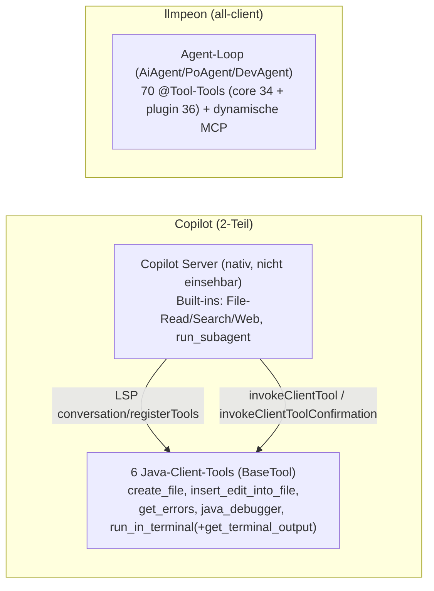

# Tool-Vergleich: GitHub Copilot Eclipse-Plugin (extern) vs. llmpeon (unser Plugin)

**Status:** Hoch-Level-Plan / Entscheidungsgrundlage (kein Build-Plan), 2026-09-19. Da Thinka.
**Kein Code wird in diesem Plan gebaut.** Ziel: Für JEDES Tool-Paar (und neue Tool-Ideen) festhalten, was die
Konkurrenz besser macht und **WARUM**, was wir übernehmen (Empfehlung Ja/Nein/teilweise + Aufwand S/M/L) und
der UI-Aspekt. Paul geht danach mit dem PO je Item durch und **akzeptiert/verwirft jedes CR-Item eigenständig**.
Dieser Plan gibt Empfehlungen + Begründung, trifft aber keine endgültige PO-Entscheidung vorweg.

## 0. Legende & Konventionen
- **Empfehlung:** Ja (übernehmen) / Teilweise (nur Subset) / Nein (bewusst nicht)
- **Aufwand:** S (ein kleines Inkrement) · M (mehrere Inkremente) · L (eigener Story-Zyklus)
- **CR-n** = nummeriertes Change-Request-Item = genau eine PO-Entscheidung.
- **Abdeckungsgarantie:** Jedes externe Client-Tool ist 1:1 in CR-1..CR-7; JEDES unserer 70 Tools ist exakt in
  einer Matrixzeile/Abdeckungszelle benannt (auch wenn Fazit „kein Übernahme-Bedarf“ lautet).
- **Verifiziert heute (IST, Code-Lesung):** Die drei Hygiene-Befunde in §4 (CR-17/18/19) sind gegen den Quellcode
  bestätigt, nicht aus Doku übernommen.
- **Einschränkung extern:** Copilot-Architektur = 6 Java-Client-Tools (`BaseTool`) + serverseitige Built-ins
  (File-Read/Search/Web, `run_subagent`), die nativ im Server laufen und **nicht einsehbar** sind. Der Vergleich
  gilt also für die Client-Tools + die sichtbare UI/Confirmation-Schicht, nicht für die Server-Innenleben.

## 1. Architektur-Vergleich (Kontext)

- **Kernunterschied:** Copilot delegiert die „intelligente“ Arbeit (Lesen, Suchen, Web, Subagent) an einen
  nativen Server und hält die Client-Tools klein und UI-lastig (Review/Undo/Confirmation). llmpeon ist
  **voll im Client**: komplette Read/Search/Navigation/Docs/Orchestration/Memory/Skills/Build-Tools selbst.
  → Copilot ist in den Bereichen, wo es **keine** Client-Tools hat, nicht vergleichbar (Server-Blackbox).
  llmpeon ist dort **stärker** (sichtbare, ehrlich-disclosed Caps, Code-Navigation, Orchestrierung).
- **Copilots echte Kante** liegt in der **UI-Sicherheits- & Review-Schicht** (Undo-Cache, WorkingSetBar,
  Compare-Editor) und im **Confirmation-Modell** (Kategorien + Scope-Caching) — das sind die CR-Items mit
  dem größten Nutzwert für uns (CR-6, CR-7).

## 2. Vergleichsmatrix (CR-Items)

> Format je Item: **Unser Tool (Pfad) · Externes Tool (Pfad) · Konkurrenz besser + WARUM · UI-Aspekt · Empfehlung.**

### CR-1 — Datei anlegen (create_file)
- **Unser Tool:** `diskWriteFile` (`…/tool/tools/DiskFileWriteTool.java`), `eclipseWriteFile` (`…/parts/tools/EclipseWorkspaceWriteFileTool.java`).
- **Extern:** `com.microsoft.copilot.eclipse.ui/…/tools/CreateFileTool.java`.
- **Konkurrenz besser + WARUM:** Kein eigener Funktionsvorsprung — Parent-Dir-rekursiv + „exists→Fehler mit
  Verweis auf Edit-Tool“ haben wir funktional auch. Der Vorsprung ist rein **UI** (Original-Content-Cache →
  Undo; Änderungen landen in der WorkingSetBar) → gehört zu **CR-7**.
- **UI-Aspekt:** Undo + WorkingSetBar (CR-7), sonst identisch.
- **Empfehlung:** **Nein** (Tool-Logik: kein Übernahme-Bedarf); der Nutzwert steckt komplett in CR-7 (Undo/Bar). Aufwand: —.

### CR-2 — Datei bearbeiten (Smart Edit vs. unser Edit-Guard)
- **Unser Tool:** `eclipseEditFile`/`eclipseReplaceLines`/`eclipseInsertLines`/`eclipseUpdateOpenFile`,
  `diskEditFile`/`diskReplaceLines`/`diskInsertLines` (s. o. Write-Tools); Shared-Logik: `FileUtils`/`AiReponseBuilder`
  (Edit-Guard min-3-Chars, Count-Guard, Replace-All-Semantik).
- **Extern:** `…/tools/EditFileTool.java` („Smart Edit“).
- **Konkurrenz besser + WARUM:** Kopiert **keinen** oldString-Anker — der Server regeneriert die **GANZE Datei**
  mit `// ...existing code...`-Platzhaltern. → **Keine** Insert/Match-Bugs (unsere Edit-Guard-/Insert-Jagd wird
  umgangen). `validateEdit()` lehnt read-only ab; `keepHistory=true`.
- **Aber (WARUM wir den Mechanismus NICHT übernehmen sollen):** Ganzer-File-Regen = **hohe Token-Kosten** je
  Edit (Datei voll in Prompt), bei großen Dateien unpraktikabel, und der Model kann **andere Stellen der Datei
  still ändern** (Silent-Drift) — weniger präzise/sicher als unser gezielter, count-geprüfter Edit.
- **UI-Aspekt:** Compare-Editor (eclipse.compare) mit editierbarer „Proposed Changes“-Seite + WorkingSetBar
  Keep/Undo/View-Diff; Original einmalig gecacht → Undo über **Multi-Round-Edits**.
- **Empfehlung:** **Teilweise** — Mechanismus (Whole-File-Regen) = **Nein** (Token-Kosten + Drift-Risiko,
  gegen unser Edit-Guard), aber **Review-UI übernehmen** → gehört zu **CR-7** (Compare-Editor + Original-Cache). Aufwand: M (nur UI-Teil).

### CR-3 — Fehler prüfen (get_errors)
- **Unser Tool:** `eclipseReadProjectProblems`, `eclipseBuildProject` (`…/parts/tools/EclipseBuildTool.java`).
- **Extern:** `…/tools/GetErrorsTool.java`.
- **Konkurrenz besser + WARUM:** Fehler **pro Datei** (Pfad-Array) und nur **SEVERITY_ERROR** / DEPTH_ZERO —
  d. h. gezielte, token-schlankere Validierung genau der Datei, die gerade bearbeitet wurde. Wir liefern
  heute **projektweite** Probleme. Prompt-Muster dort: „after editing a file to validate the change“.
- **UI-Aspekt:** keiner (Reintool).
- **Empfehlung:** **Ja** — per-File-Modus ergänzen (Pfadleiste + SEVERITY_ERROR-Filter). Offene Variante: neues
  Tool vs. optionaler Pfad-Filter auf `eclipseReadProjectProblems` (s. §6). Aufwand: **S**.

### CR-4 — NEU: Java-Debugger-Tool (wir haben KEINES)
- **Unser Tool:** — (kein Debugger-Tool; nur Build/Test/Problems).
- **Extern:** `…/tools/JavaDebuggerToolAdapter.java` (Nightly+JDT), 15 Actions (get_state, get_variables nested,
  get_stack_trace, evaluate_expression AST-Eval 5s, set_variable, Breakpoints conditional/hitCount/exception,
  step_over/in/out, continue, suspend); JSON-Output; **`needConfirmation()=true` für JEDE Action**.
- **Zweck/WARUM sinnvoll:** Live-Debugging per Agent (Variablen, Ausdrücke, Breakpoints) — heute in llmpeon
  gar nicht möglich; stärkt den „run + diagnose“-Loop.
- **Risiken:** **Sicherheit** (evaluate_expression / set_variable = Code-Ausführung/State-Mutation) → zwingend
  auf Confirmation-Infra (CR-6) angewiesen; **L** (OSGi/JDT-Debugger-API, 15 Actions, Session-Lifecycle);
  JDT/Nightly-Abhängigkeit wie extern.
- **Empfehlung:** **Nein (erst) / Roadmap** — L, sicherheitskritisch, orthogonal zum heutigen Core-Loop und ohne
  CR-6 nicht verantwortbar. Lese-Actions-Subset (state/vars/stacktrace) als möglichen späteren Start. Aufwand: **L**.

### CR-5 — NEU: (persistente/Background-)Terminal-Session + Output-Fetch
- **Unser Tool:** `shellRunCommand` (One-shot, Timeout 60s, Tail 60, Hard-Cap 3000, je Call Bestätigung) —
  `…/tool/tools/ShellTool.java`.
- **Extern:** `…/tools/RunInTerminalToolAdapter.java` + Inner-Class `get_terminal_output` (L258); persistente
  Session (Win PowerShell / Linux bash / macOS sh) → **env+cwd bleiben erhalten**; `isBackground=true` →
  Terminal-ID, Output per ID nachlesbar (1000-Zeilen-Truncation); Terminal-View wird sichtbar; 2 Backends per
  SPI; cwd aus referenzierten Chat-Dateien; Confirmation mit Auto-Approve-Cache.
- **Zweck/WARUM sinnvoll:** Läufe, die >60s brauchen oder **Zustand tragen** (Maven-Build-Step-Sequenz, REPL,
  exportierte Vars, `cd`) — unser One-shot-Timeout ist dafür die harte Grenze. Output-nachlesen = Long-Running
  statt Blocken.
- **Risiken:** Session-Lifecycle (Leck/Orphan), Sicherheit (persistente Shell) → braucht CR-6; Truncation muss
  (wie extern) **disclosed** sein (unsere Disziplin).
- **Empfehlung:** **Ja (Teilweise)** — erst **persistente Foreground-Session** (env+cwd behalten) statt 60s-
  One-shot; Background + `get_terminal_output`-per-ID als nächster Schritt. Aufwand: **M** (Foreground) / M+ (mit Background).

### CR-6 — Confirmation-Modell (quer; größter Enabler)
- **Unser Tool:** **nur** eine Shell-Bestätigung (AIChatView-Widget) — keine Kategorien, kein Scope-Cache.
- **Extern:** `ConfirmationService` (UI) — Kategorien (terminal/file_read/file_write/file_operation/mcp_tool/
  safe_tool/web/unknown), **YOLO-Preference**, Entscheidungen mit Scope **Once / Session / Global gecacht**,
  Subagent-Conversations auf Parent gemappt, Policy kann Auto-Approve deaktivieren.
- **Konkurrenz besser + WARUM:** Unsere Orchestrierung (Plan/Dev/Review) läuft **autonom & lang** → je-Call-
  Bestätigung = **Fatigue** oder zu grobe „stets“/„nie“. Scope-Caching (Session) gibt Kontrolle ohne
  Unterbrechungsflut; Kategorien gestatten feingranulare Politik.
- **UI-Aspekt:** Confirm-Dialog mit **Scope-Wahl** (Once/Session/Global) + Category-Anzeige.
- **Empfehlung:** **Ja** — Foundation für CR-4/CR-5 und alle autonomen Edits. Mindestvariante „Session“ vor
  vollem Category-Modell abwägen (s. §6). Aufwand: **M-L**.

### CR-7 — Change-Review-UI: Original-Cache → Undo + WorkingSetBar (quer über alle Write/Edits)
- **Unser Tool:** alle Write/Edit-Tools aus CR-1/CR-2 (Write-Tools, Pfade s. dort).
- **Extern:** Querschnitt aus `CreateFileTool` + `EditFileTool` + `WorkingSetHandler.java`/`ChangedFile.java`
  + Compare-Editor.
- **Konkurrenz besser + WARUM:** Original **einmalig gecacht** → **Undo auch über Multi-Round-Edits**; Änderungen
  in einer **WorkingSetBar** mit **Keep / Undo / View-Diff pro Datei** (eclipse.compare, editierbare Proposed-
  Changes-Seite). → Der Agent darf „mutig“ editieren, weil der User jede Runde einzeln annehmen/verwerfen/diffen
  kann. Das ist der zentrale **Vertrauens- & Sicherheitshebel**, den wir heute nicht haben (Edits landen
  unmittelbar ohne gebündelte Review/Undo-Leiste).
- **UI-Aspekt:** Das Kernstück — Changes-Leiste + Compare-Editor + Undo-Cache.
- **Empfehlung:** **Ja** — höchster UX-/Vertrauensgewinn, hebt auch die Edit-Guard-Sorgen aus CR-2. Aufwand: **L**
  (Write-Pfad + UI + Multi-Round-State).

### CR-8 — Read-Familie (unser Edge, kein externes Client-Counterpart)
- **Unsere Tools:** `diskReadFile` (`DiskFileReadTool.java`), `eclipseReadFile`/`eclipseReadOpenFile`/
  `eclipseOpenFileInEditor`/`eclipseList` (`EclipseWorkspaceReadFileTool.java`), `eclipseFindResource`
  (`EclipseCodeNavigationTool.java`), `diskListDirectory` (`DiskFileReadTool.java`).
- **Extern:** serverseitig nativ (nicht einsehbar) — im Client **kein** Read-Tool.
- **Fazit:** Kein Übernahme-Bedarf; **unser Vorsprung** (sichtbare, ehrlich-disclosed Caps, Workspace+Disk-Dual,
  Open-File-Reader). — Empfehlung **Nein** (nichts zu übernehmen). Aufwand: —.

### CR-9 — Search-Familie (unser Edge, ehrliche Caps)
- **Unsere Tools:** `diskGrepFiles` (`DiskGrepTool.java`), `eclipseGrepFiles` (`EclipseGrepTool.java`),
  `diskSearchFiles` (`DiskFileReadTool.java`), `eclipseSearchFiles` (`EclipseWorkspaceReadFileTool.java`),
  `searchAgent` (`SearchAgentTool.java`, Read-only-Filter).
- **Extern:** serverseitig nativ (nicht einsehbar) — im Client **kein** Search-Tool.
- **Fazit:** Kein Übernahme-Bedarf; **unser Edge** (Read-only-Subagent, disclosed File/Line-Caps). → Die
  Caps-**Hygiene** dieser Familie wird in CR-17/18 gesondert behandelt. Empfehlung **Nein** (Funktionalität) /
  Hygiene siehe CR-17/18. Aufwand: —.

### CR-10 — Code-Navigation (unser Edge, kein externes Counterpart)
- **Unsere Tools:** `eclipseFindJavaType`, `readTypeSource`, `eclipseFindReferences` (`EclipseCodeNavigationTool.java`).
- **Extern:** kein Client-Counterpart (Navigation serverseitig/Blackbox).
- **Fazit:** Reiner **Vorsprung** (JDK/JAR-Quellzugriff, Referenzen, Typ-Metadaten ohne Decompiling). Empfehlung
  **Nein** (nichts zu übernehmen). Aufwand: —.

### CR-11 — Docs-Linter (unser Edge)
- **Unsere Tools:** `lintDocs`/`lintDocsAndTests` (`…/docslinter/DocsLinterTool.java`), `nextIds`
  (`…/docslinter/DocsIdTool.java`).
- **Extern:** keiner. **Fazit:** **Vorsprung** (Doc-/Test-ID-Integrität). Empfehlung **Nein**. Aufwand: —.

### CR-12 — Orchestrierung (unser Edge)
- **Unsere Tools:** `PoDelegateTool` (`…/poagent/tools/PoDelegateTool.java` — talkPlan/planWithPlanAgent/
  clearPlan/compactPlan · reviewPlanAgent/clearReview/compactReview · askDev/buildWithDev/clearDev/compactDev),
  `askUser` (`…/parts/tools/AskUserTool.java`).
- **Extern:** Agent/Ask/Plan-Chat-Modes + `run_subagent` (serverseitig, Blackbox) — aber **kein** vergleichbares
  Plan/Dev/Review-Delgationstool im Client.
- **Fazit:** **Vorsprung** (explizite PO-Orchestrierung). Empfehlung **Nein** (nichts zu übernehmen). Aufwand: —.
  *(Anknüpfung: CR-6 Confirmation würde die autonomy dieser Agents sauber absichern.)*

### CR-13 — Memory (unser Edge)
- **Unsere Tools:** `memoryAdd`/`memoryRemove`/`memoryReplace`/`memoryReset` (`…/parts/tools/memory/`),
  `compactSession` (`…/tool/tools/CompactSessionTool.java`).
- **Extern:** keiner. **Fazit:** **Vorsprung** (Workspace-Memory, 200 Slots). Empfehlung **Nein**. Aufwand: —.

### CR-14 — Skills (unser Edge)
- **Unsere Tools:** `skillRead`/`skillList`/`skillReadFile` (`…/tool/tools/SkillTool.java`).
- **Extern:** keiner. **Fazit:** **Vorsprung** (Skill-/Prompt-System). Empfehlung **Nein**. Aufwand: —.

### CR-15 — Build / Test / Console (unser Edge)
- **Unsere Tools:** `eclipseRunTests` (`EclipseRunTestTool.java`), `eclipseBuildProject`/`eclipseRefreshProject`/
  `eclipseReadProjectProblems`/`eclipseListAllOpenProjects` (`EclipseBuildTool.java`),
  `eclipseReadConsoleLog`/`eclipseListAvailableConsoles` (`EclipseConsoleLogTool.java`).
- **Extern:** keiner (Build/Test/Console im Client nicht vorhanden).
- **Fazit:** **Vorsprung** (PDE/OSGi-Testlauf, Console-Read). Empfehlung **Nein** (nichts zu übernehmen). Aufwand: —.
  *(Cross-Ref: CR-3 nutzt `eclipseReadProjectProblems`.)*

### CR-16 — Sonstiges / MCP (unser Edge / paritätisch)
- **Unsere Tools:** `reloadConfig` (`…/scaffold/ReloadConfigTool.java`), dynamische MCP-Tools,
  `readOperationSystemInformation` (`ShellTool.java`).
- **Extern:** MCP-Tools werden ebenfalls unterstützt (paritätisch); `readOperationSystemInformation` ohne
  Gegenstück.
- **Fazit:** Kein Übernahme-Bedarf. Empfehlung **Nein**. Aufwand: —.

## 3. Neue Tool-Kandidaten (extern vorhanden, wir nicht)
> Zusammengefasst in CR-4 und CR-5 (dort mit Zweck/Aufwand/Risiko). Keine weiteren extern-nicht-abgedeckten
> Kandidaten gefunden. **Priorisierungsvorschlag (meiner):** CR-7 > CR-6 > CR-5(FG) > CR-3 > CR-4(defer).

## 4. Hygiene-Items (eigene Caps/Disclosure-Disziplin) — VERIFIZIERT heute
> AGENTS.md: „A tool must never lie about a limit“; Prinzip „honesty stays in the output“. Grep-Tools disclose
> Caps im Output (`AiReponseBuilder.grepComplete`, Zeilen-Cap + File-Cap); die **Search-Tools** tun das **nicht**.

- **CR-17 — `eclipseSearchFiles`: Cap 1000 im Output NICHT disclosed.**
  - **Pfad:** `…/parts/tools/EclipseWorkspaceReadFileTool.java:120-160`; Output via `AiReponseBuilder.searchComplete`
    (`…/tool/AiReponseBuilder.java:61`), das Caps **nie** im Ergebnis meldet. `limit` (Default 100, max 1000) wird
    hart gekappt (Zeile 132), aber der LLM sieht nur `onTool(...returned N results)` (Log), **kein** Disclosure im
    Return, wenn 1000 erreicht wird. → Tangiert „no lie about a limit“ (stille Kappung).
  - **Empfehlung:** **Ja**, **S** — wie `grepComplete`: bei `matches.size() >= limit` eine Disclosure-Zeile im
    Return ergänzen („capped at N — narrow your search“).
- **CR-18 — `diskSearchFiles`: Default 50 / 0=unlimited, Output-Cap nicht disclosed.**
  - **Pfad:** `…/tool/tools/DiskFileReadTool.java:73-99`; `@P` sagt „0 = unlimited. Default 50“ (Parameter-Doku ist
    ehrlich), aber der **Return** meldet bei erreichtem Limit nicht, dass gekappt wurde (`searchComplete` ohne Cap-
    Hinweis). Inkonsistenz zu Grep-Disziplin.
  - **Empfehlung:** **Ja**, **S** — Cap-Disclosure im Return ergänzen (nur falls `limit>0` und erreicht).
- **CR-19 — `webFetchAsMarkdown`: GAR keine Output-Cap (Context-Bombe).**
  - **Pfad:** `…/tool/tools/WebFetchTool.java:49-73`. Nur 30s/10s-Timeout, **kein** Größencap auf HTML/Markdown;
    Fehlerpfad (status≥400, Zeile 67) gibt **vollständiges** `htmlContent` zurück. Große Seite = unkontrollierbarer
    Context-Blowup.
  - **Empfehlung:** **Ja**, **S** — Hard-Cap auf Result (z. B. N KB) + Disclosure; Fehlerpfad auf Status+Snippet
    kürzen (nicht voller Body). Vergleichspunkt extern: `get_terminal_output` trunciert auf 1000 Zeilen
    (disclosed) → Maßstab für unsere Disziplin.
- **Vergleichspunkt (kein eigenes CR):** extern `get_terminal_output` Truncation=1000 Zeilen — **wenn** wir
  CR-5-Background einführen, dieselbe Disclosure-Disziplin wie extern anwenden.

## 5. Was wir BEWUSST NICHT übernehmen (und warum)
- **Smart-Edit Whole-File-Regen (CR-2-Mechanismus):** Token-Kosten je Edit (ganze Datei in Prompt) + Silent-Drift-
  Risiko (Model kann unbetrafte Stellen ändern) > Nutzen; unser gezielter Edit-Guard ist präziser/effizienter.
  **Nur die Review-UI** davon übernehmen (CR-7), nicht den Regen-Mechanismus.
- **Confirmation-YOLO als Default:** Default bleibt „bestätigen“; YOLO nur **Opt-in** (Security-Default). Außen
  kann Policy Auto-Approve deaktivieren — wir halten das sicherheitsbewusst.
- **Serverseitige Built-ins (File-Read/Search/Web/`run_subagent`):** andere Architektur (2-Teil), nicht einsehbar
  und nicht adaptierbar; llmpeon ist bewusst all-client. Kein Übernahme-Kandidat — **kein Nachteil**, da wir diese
  Fähigkeiten selbst (und sichtbarer) haben (CR-8/9).
- **File-Operationen auf absolute lokale Pfade außerhalb des Workspace** (`create_file` workspace-ODER-absolut):
  wir sind bewusst **Workspace-scoped** (Disk-Tools für den Bereich davor); eigene Boundary beibehalten.

## 6. Offene Fragen für Paul (für den PO-Run — keine Entscheidungen vorweggenommen)
1. **CR-4 Debugger:** jetzt anpacken (L) vs. **Roadmap/defer** (mein Lean: **defer**, sicherheitskritisch +
   ohne CR-6 nicht verantwortbar)? Falls ja: nur Lese-Subset (state/vars/stacktrace) als Start?
2. **CR-5 Terminal:** erst **persistente Foreground-Session** nur (mein Lean), oder inkl. Background +
   `get_terminal_output`-per-ID in einem Zug?
3. **CR-6 Confirmation Umfang:** volles Category-Modell + Once/Session/Global, oder **minimal „Session-“Cache**
   vorab (mein Lean: minimal zuerst)?
4. **CR-2/CR-7:** Ist die Token-Kosten-Abwägung für den **Whole-File-Regen** akzeptabel, oder fix „gezielter Edit +
   nur Review-UI“ (mein Lean: fix)? Und ist die **WorkingSetBar/Undo** (L) priorisierbar vor CR-6?
5. **CR-3 get_errors:** **neues** Tool vs. **optionaler Pfad-Filter** auf bestehendem `eclipseReadProjectProblems`
   (mein Lean: Filter, weniger Tool-Fläche)?
6. **Hygiene (CR-17/18/19):** als **ein schnelles Folge-Inkrement** bündeln (alle drei S, gleiche Disclosure-
   Logik) oder getrennt abarbeiten? (mein Lean: bündeln.)
7. **Reihenfolge/Priorität** der angenommenen Items insgesamt — mein Vorschlag in §3 (CR-7 > CR-6 > CR-5 > CR-3,
   CR-4 defer, Hygiene parallel). Bestätigen/ändern?

**Nächster Schritt:** Paul + PO gehen §2–§6 je CR-Item durch (accept/reject). Erst nach PO-Freigabe wird ein
**eigenes Build-Plan** (konkret, inkrementiert) aus den akzeptierten Items erstellt — dieser Plan ist **kein**
Build-Plan.
