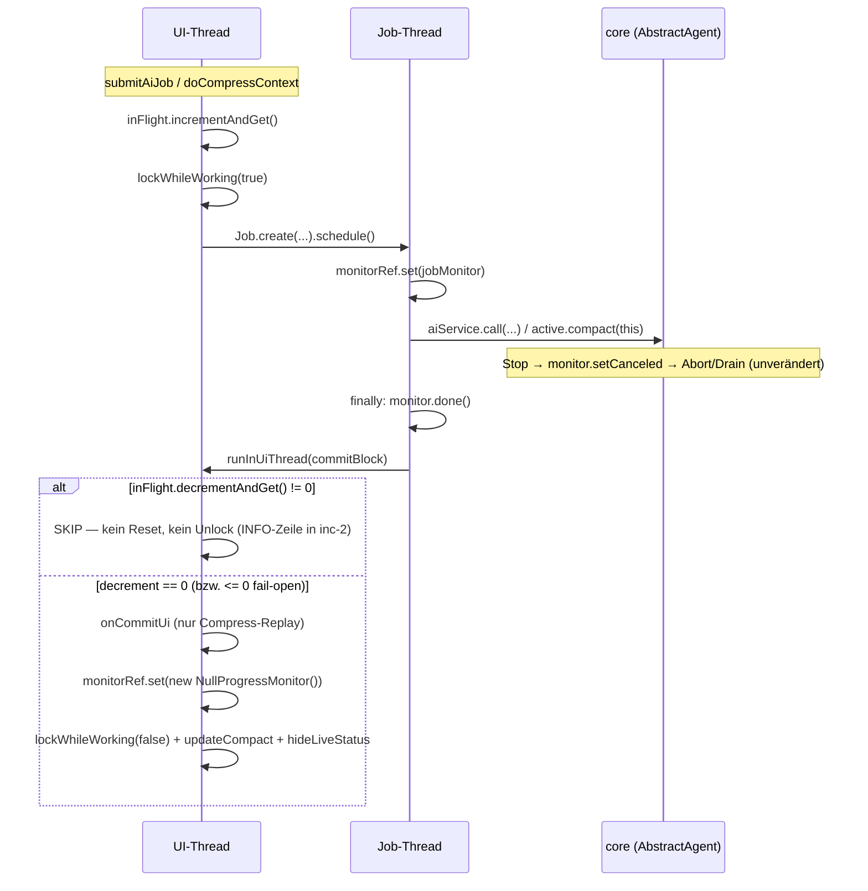

# Story: Chat Job Lifecycle — Stop-Fenster-Fix (R-ST1–R-ST3)

## ⚠️ STOP-AND-ASK (gilt für das GANZE Zyklus-Team — Da Mek, prominent zuerst)

Bei **Compile-Fehlern ohne Lösung**, **nicht-grün-bekommenden Tests**, **IST-Widersprüchen zum
Plan** oder Unklarheiten: Da Mek fragt **aktiv bei Jon (askDev-Kanal)** — **nie still
workarounden, nie das SOLL ändern**. Workarounds sind auch dann verboten, wenn sie "grün"
machen. Kein planImplemented (Archivierung = Dev-Agent nach PO-Review, memory #10).

---

## 1. Context

**Bug „Stop-Fenster"** (pre-existing, User 2026-09-10): Während ein Run lebt (grüner Ball
korrekt), ist der Stop-Button tot und wirkungslos. Ursache: Clobber-Race — ein stale
Job-`finally` (verzögert durch UI-Render) entlockt die UI und resetet `monitorRef`, während
der nächste Run schon lebt. Fenster bleibt bis zum nächsten Send.

**Mechanismus (code-verifiziert, 2026-09-10):**
- Stop-Enable **nur** über `UserInputWidget.isWorking(boolean)` → `stopButton.setEnabled`
  (einzige Call-Site: `AIChatView.lockWhileWorking`). Senden ist **nie** gesperrt (Queuing
  ist Baseline).
- `handleDoneChatResponse` (Job-finally): `monitorRef.set(new NullProgressMonitor())` läuft
  **synchron auf dem Job-Thread**; der Unlock läuft asynchron via `runInUiThread`
  (verzögbar durch Rendering). `AbstractAgent.call` setzt `working=false` im **eigenen**
  finally — **bevor** der Job-finally durch ist → User kann im Fenster schon den nächsten
  Run submitten → dessen Body setzt `monitorRef`, dann läuft der stale Unlock.
- Phantom-Job-Loch: Doppel-Send im Schedule-Fenster → Job 2's `call()` wird vom
  `working.compareAndSet` in `AbstractAgent.call` (core, AbstractAgent.java:177) abgelehnt
  (queued + returns null sofort) → sein finally würde als "letzter" unlocken, während
  Job 1 lebt. „Latest submit" ≠ „letzter Finisher".
- Queue-Drain läuft **innerhalb desselben `call()`** (AbstractAgent.java:186–199) → kein
  zweiter Job pro Queued-Message → Counter deckt den ganzen Turn ab.

**SOLL:** Feature-Doc `docs/chat-job-lifecycle.md` (❌ specified, 2026-09-10) ist die SOT —
R-ST1 In-Flight-Counter, R-ST2 Graceful Stop, R-ST3 Turn-INFO-Logging, inkl. BDDs und
Counter-Invarianten. Alle Design-Entscheidungen sind gefallen (User-freigegeben,
Design-Review Da Thinka eingearbeitet). Dieser Plan ist die Dev-Handover; die Doc bleibt
Fach-SOT, der Plan ist die technische Ausführungsanweisung.

## 2. Design decisions (alle entschieden — nichts für den Dev freigestellt)

1. **In-Flight-Counter statt Generation-Ticket** (User-Entscheid nach Design-Review):
   `AtomicInteger` in AIChatView, increment im Submit (UI-Thread, paarig zum `lock(true)`,
   vor `.schedule()`), decrement + Commit-Entscheidung **innerhalb des
   `runInUiThread`-Runnables** im finally (UI-serialisiert mit dem Submit → kein TOCTOU).
   Schließt den Clobber UND das Phantom-Job-Loch (siehe Doc-WEIL).
2. **Keine Core-Klasse** (`TurnToken`/RunGate wäre Overkill — würde nur AtomicInteger
   testen; SWT-Wiring ist untestbar, Präzedenz R-UI1/R-MCP3). Regression-Guard-Rolle:
   BDDs im Feature-Doc + R-ST3-Skip-Zeile als Live-Evidence.
3. **`monitorRef.set(Null)` wandert ins UI-Runnable** (nur dort darf er passieren) — im IST
   läuft er auf dem Job-Thread, das ist Teil des Clobbers. `monitor.done()` bleibt
   unguarded auf dem Job-Thread (eigener Monitor des Jobs).
4. **Frischer `NullProgressMonitor` pro Commit** (IST-Muster beibehalten, KEIN shared
   Constant): `NullProgressMonitor.setCanceled` **speichert** den Cancel-Flag
   (Source verifiziert) — eine shared-Instanz würde einen idle-Stop "klebrig" machen.
   Jeder Commit installiert eine frische Instanz → kein Zustand überlebt.
5. **Fail-open bei Unbalance:** `decrementAndGet() <= 0` → aufräumen (Reset+Unlock trozdem
   ausführen — die UI darf nie hängen bleiben); `< 0` → zusätzlich ERROR-Log
   (`LOG.error`, verifiziert: `ILog.error(String)` existiert). **Kein defensiver
   try/catch um `.schedule()`** — AGENTS-Regel "Dead guards survived here for months";
   `Job.create().schedule()` wirft nicht.
6. **Compress-Guard:** der vorgeschaltete `Display.getDefault().asyncExec` von
   `doCompressContext` (Memory-Replay + hideLiveStatus + refreshStatusLine) wird **in den
   Guard verschoben** (Parameter `Runnable onCommitUi` an `handleDoneChatResponse`, läuft
   im Commit-Pfad VOR Reset+Unlock — preserves IST-Reihenfolge). Bei Skip → kein Replay
   (stale Compress darf nicht in den Chat des lebenden Runs schreiben; kosmetische Lücke
   akzeptiert, Skip-Zeile ist die Evidence).
7. **Log-Konventionen:** bestehendes Muster `private static final ILog LOG =
   Platform.getLog(AIChatView.class)` + `LOG.info(String)` (AIChatView.java:64, :240, :587).
   R-ST3: `LOG.info`, **immer an** (nicht hinter `isDebugMode()` — der Incident verlor
   Evidence bei debug=off). ERROR-Log (Invarianten-Verletzung) via `LOG.error(String)`.
   **Nicht** java.util.logging, **kein** IStatus-Dialog.
8. **Log-Formate (konkret, kein Spielraum):**
   - Submit (AI): `turn submit: agent=<name> in-flight=<n nach increment>`
   - Submit (Compress): `turn submit (compress): agent=<name> in-flight=<n>`
   - Skip: `turn finally skipped (newer run in flight): agent=<name> in-flight <before>-><after>`
     — "eigen" = Wert VOR dem decrement (`remaining+1`), "aktuell" = danach (`remaining`).
     Kein `run=7` (Ticket-Relikt im Doc-Beispiel — wird in inc-2 im Doc korrigiert).
   - Commit: `turn done: agent=<name> reset committed (in-flight 1->0)`
   - ERROR (nur bei `< 0`): `unbalanced in-flight turn counter (<value>) — cleaning up`
   - Agent-Name wird beim **Submit gecaptured** (`getActiveAgent()` im finally liefert nach
     Agent-Wechsel den falschen Namen); Compress capttured `active` dort ebenfalls.
9. **R-ST2 = kein Code-Change:** Stop-Handler (AIChatView.java:141
   `() -> getIProgressMonitor().setCanceled(true)`) bleibt unverändert. Post-Fix ist
   `monitorRef` immer der lebende Run (oder frischer Null-Monitor wenn idle) → Stop idle =
   stiller Noop (Button ist idle disabled anyway), Stop live = Abort-Pfad
   (`AbstractAgent.handleAbortAndDrain`, ADR-0017) unverändert. Dokumentiertes Rest-Fenster
   (Submit → Job-Body-Start, ms) bleibt — Fix = Overkill (Doc R-ST1 verzeichnet es).

## 3. Architektur



- Submit-Side (increment) und Commit-Side (decrement+Entscheidung) laufen beide auf dem
  UI-Thread → mit `doSendMessage`/`doCompressContext` serialisiert → kein TOCTOU.
- 1:1-Paarung strukturell garantiert: genau **2** Call-Sites von `handleDoneChatResponse`
  (grep-verifiziert: submitAiJob.java:579, doCompressContext.java:495), beide im Job-finally;
  genau **2** increment-Stellen.
- Abhängigkeitsrichtung: Counter bleibt **plugin-lokal** (AIChatView-Feld) — core kennt
  keinen UI-Lifecycle; core bleibt unberührt (kein Modul-Crossing, memory #27).

## 4. Betroffene Dateien

**Nur diese zwei Code-Dateien ändern sich; core/llmpeon.test/releng bleiben unberührt:**

| Datei | Änderung |
|---|---|
| `org.sterl.llmpeon/src/org/sterl/llmpeon/parts/AIChatView.java` | inc-1: Counter + Guard; inc-2: R-ST3-Logging |
| `docs/chat-job-lifecycle.md` | inc-2: R-ST3-Beispielzeile (Ticket-Relikt `run=7`) + Status ❌→✅ |
| `docs/index.md` | inc-2: Chat-Job-Lifecycle-Eintrag auf ✅ gebaut (User-Smoke-Vermerk) |

Keine Homepage-Änderung (Bugfix stellt dokumentiertes Verhalten wieder her, kein neues
User-Feature). Betroffene Zeilen (Stand 2026-09-10, verifiziert):
- AIChatView.java:90 — `monitorRef`-Feld (unverändert)
- AIChatView.java:141 — Stop-Handler `getIProgressMonitor().setCanceled(true)` (unverändert, R-ST2)
- AIChatView.java:317–325 — `getIProgressMonitor()`/`isCanceled()` (unverändert)
- AIChatView.java:474–499 — `doCompressContext` (increment 477-Vorzeile; finally 488–496:
  pre-asyncExec 490–494 entfernen → `onCommitUi`-Lambda; Call 495 erweitert)
- AIChatView.java:567–583 — `submitAiJob` (increment + lock(true) vor `.schedule()`:576/582)
- AIChatView.java:585–599 — `handleDoneChatResponse` (Guard-Neubau, Reset wandert ins UI-Runnable)
- AIChatView.java:627–636 — `lockWhileWorking` (unverändert)
- `AbstractAgent.java` (core):177/186–199/213–220 — **nur Lesereferenz, kein Code-Change**

## 5. Inkremente (jedes für sich kompilierend + grün; docs-first wo Doc betroffen)

### inc-1 — R-ST1: Counter + Guard (der eigentliche Bugfix)

1. **Code** `AIChatView.java`:
   - Import `java.util.concurrent.atomic.AtomicInteger`; Feld neben `monitorRef` (Zeile 90):
     ```java
     /** R-ST1: submitted-but-unfinished turn jobs. Submit increments (UI thread, pre-schedule),
      *  the finally's UI-runnable decrements — commit (reset+unlock) belongs to the LAST finisher. */
     private final AtomicInteger inFlightTurns = new AtomicInteger();
     ```
   - `submitAiJob` (567): **vor** `lockWhileWorking(true)` (568): `inFlightTurns.incrementAndGet();`
   - `doCompressContext` (474): increment vor `lockWhileWorking(true)` (477)
   - `doCompressContext`-finally (488–496): den `Display.getDefault().asyncExec`-Block
     (490–494) **entfernen**; stattdessen Replay als `onCommitUi`-Lambda übergeben:
     ```java
     } finally {
         handleDoneChatResponse(cr, monitor, ex, () -> {
             // own refresh to ensure the onTool messages are preserved after compact
             refreshStatusLine();
             aiService.getActiveAgent().getMemory().forEach(chatHistory::appendMessage);
             chatHistory.hideLiveStatus();
         });
     }
     ```
   - `handleDoneChatResponse` (585–599) neu:
     ```java
     private void handleDoneChatResponse(ChatResponse cr, IProgressMonitor monitor, Exception ex, Runnable onCommitUi) {
         if (aiService.getConfig().isDebugMode()) {
             LOG.info("Chatreponse: " + (cr == null ? "null" : cr.aiMessage()));
         }
         monitor.done();
         // R-ST1: the commit decision lives INSIDE the UI runnable — UI-thread-serialized with
         // the submits. A stale finally (newer run in flight) must touch neither monitorRef
         // nor the lock. (IST reset the monitorRef on the job thread — that was the clobber.)
         EclipseUtil.runInUiThread(parent, () -> {
             int remaining = inFlightTurns.decrementAndGet();
             if (remaining < 0) LOG.error("unbalanced in-flight turn counter: " + remaining + " — cleaning up");
             if (remaining <= 0) { // fail-open: UI must never stay stuck
                 if (onCommitUi != null) onCommitUi.run();
                 monitorRef.set(new NullProgressMonitor());
                 lockWhileWorking(false);
                 actionsBar.updateCompact(
                         aiService.getActiveAgent().getMemory().getTotalTokenUsed(),
                         aiService.getConfig().getAutoCompactAfter());
                 chatHistory.hideLiveStatus();
             }
             // else: a newer run owns lock + monitorRef — touch nothing (skip INFO line lands in inc-2)
         });
     }
     ```
   - Beide Call-Sites passen die Signatur an (`null` bei submitAiJob für `onCommitUi`).
2. **Verifikation:** `eclipseBuildProject("org.sterl.llmpeon")` grün,
   `eclipseReadProjectProblems` leer. Core unberührt (kein Surefire-Impact).
3. **Commit** (auf `story/lib-update-2026-09-09`, siehe §8): Code + evtl. Doc nur falls
   inc-1 dabei etwas am IST-Text ändert (derzeit nicht nötig — Doc ist schon Counter-SOLL).

### inc-2 — R-ST3 Turn-INFO-Logging + R-ST2-Abschluss + Doc-Sync

1. **Code** `AIChatView.java`:
   - `submitAiJob`: `final var agent = aiService.getActiveAgent();` capturen, nach dem
     increment: `LOG.info("turn submit: agent=" + agent.getName() + " in-flight=" + inFlightTurns.get());`
   - `doCompressContext`: captured `active` vorhanden →
     `LOG.info("turn submit (compress): agent=" + active.getName() + " in-flight=" + inFlightTurns.get());`
   - `handleDoneChatResponse`-Signatur: `String agentName` ergänzen; beide Submit-Stellen
     übergeben den gecapttured Namen.
   - Im UI-Runnable: Skip-Zweig →
     `LOG.info("turn finally skipped (newer run in flight): agent=" + agentName + " in-flight " + (remaining + 1) + "->" + remaining);`
     Commit-Zweig (nur bei echtem Commit, nicht beim fail-open-ERROR-Fall zusätzlich) →
     `LOG.info("turn done: agent=" + agentName + " reset committed (in-flight " + (remaining + 1) + "->" + remaining + ")");`
   - R-ST2: **kein Code** — nur Verifikation (siehe Abschnitt 7).
2. **Doc** `docs/chat-job-lifecycle.md`: R-ST3-Beispielzeile korrigieren (Ticket-Relikt
   `run=7` → Counter-Werte wie oben), Status ❌→`✅ gebaut — User-Smoke ausstehend`.
   `docs/index.md`: Chat-Job-Lifecycle-Eintrag entsprechend aktualisieren.
3. **Verifikation:** Build grün + Problems leer, dann Commit (Code + beide Docs).

## 6. Rules & Constraints

- **STOP-AND-ASK gilt** (oben). Kein SOLL-Ändern, keine stillen Workarounds.
- **Invariante 1:1-Paarung:** exakt ein increment pro Submit ↔ exakt ein decrement pro
  Job-Lifecycle (finally läuft garantiert, `try/finally` in beiden Jobs). Cancel ist kein
  Sonderpfad. Kein weiterer increment/decrement-Punkt darf entstehen.
- **Nie unter 0:** `<= 0` → fail-open aufräumen; `< 0` → zusätzlich ERROR-Log.
- **Decision-Thread:** decrement + Entscheidung NUR im `runInUiThread`-Runnable — niemals
  auf dem Job-Thread (das ist die Kernkorrektur des Designs).
- **Kein Dead Guard:** keine Defensive-try/catch um `.schedule()`; keine Checks, die nie
  feuern können.
- **Log OR throw, never both** (AGENTS) — hier: nur Logs, keine Throws im finally-Pfad.
- Log-Format wie in §2.8 festgelegt (ASCII `->`, kein `run=`-Ticket-Relikt).
- Branch: **weiter auf `story/lib-update-2026-09-09`** (18 Commits, unmerged — AIChatView
  wurde dort im mcp-fixes-Zyklus geändert; Branch off main würde konflikten). Kein
  Branch-Wechsel ohne explizite Ansage (memory #19). Commit pro grünem Inkrement inkl.
  docs/**; Merge/Squash = User-Entscheidung.
- eclipseBuildProject vor jedem JUnit-Lauf; Surefire = Ground Truth für Testzahlen (hier:
  keine neuen Tests, siehe 7).

## 7. BDD-Acceptance + Test-Strategie

SWT-Wiring ist nicht automatisiert testbar (Präzedenz R-UI1/R-MCP3/R-ML1a) — **keine neuen
automatisierten Tests**, keine Core-Klasse. Abbildung je Regel (Muster wie mcp.md R-MCP3):

| Regel / BDD | Verifikation |
|---|---|
| R-ST1a Commit-Pfad (Turn endet als letzter → Reset+Unlock) | manuelle Verifikation — Smoke 1 |
| R-ST1b Skip-Pfad (Run B lebt, Job A's finally → kein Reset/Unlock) | manuelle Verifikation — Smoke 2 + R-ST3-Skip-Zeile als Live-Evidence |
| R-ST1 Phantom-Job (Doppel-Send im Schedule-Fenster → kein stale Unlock) | manuelle Verifikation — Smoke 3 (best effort) + Code-Review des Counter-Wirings |
| Invariante 1:1-Paarung | Code-Review (2 increment-Stellen ↔ 2 `handleDoneChatResponse`-Call-Sites, grep-verifiziert) |
| Invariante never-below-0 (fail-open + ERROR) | manuell nicht konstruierbar → Code-Review; ERROR-Log im Code-Weg dokumentiert |
| R-ST2 Stop idle = stiller Noop | manuelle Verifikation — Smoke 4 (Button idle disabled; frischer Null-Monitor macht Cancel-Flag nicht klebrig — Source-verifiziert) |
| R-ST2 Stop bricht lebenden Run ab | manuelle Verifikation — Smoke 4 (Abort-Pfad unverändert) |
| R-ST3 INFO-Zeilen je Turn (immer an, nicht Debug-ge-gated) | manuelle Verifikation — Smoke 5 (Error Log View, INFO-Filter) |

Keine bestehenden Tests betroffen (core unberührt; Plugin-Test-Modul hat keine AIChatView-
Tests). Verify-Loop je Inkrement: `eclipseBuildProject("org.sterl.llmpeon")` +
`eclipseReadProjectProblems` leer → commit.

### Verifikation (User, laufende Eclipse-Instanz)

1. **Happy Turn:** Send → Antwort → Input unlockt, Stop disabled, keine Skip-Zeile.
2. **Stale-finally-Repro:** sofort nach Turn-Ende (während UI noch sperrt) neuen Send
   absetzen → neuer Run lebt → UI bleibt korrekt gesperrt bis zum ECHTEN Ende; ggf.
   Skip-Zeile im Log. (Original-Bug: wäre hier entlockt worden.)
3. **Phantom-Job:** Turn-Ende + Doppel-Send im selben Augenblick → kein vorzeitiger Unlock,
   Stop bleibt enabled solange 🟢; Skip-Zeile möglich.
4. **Compress + sofort Send:** Compact drücken, sofort senden → kein stale Unlock/Replay;
   Compress-finally skippt oder committet korrekt.
5. **R-ST2/Abort:** Run aktiv → Stop → Run bricht ab (Queue-Drain wie bisher), UI unlockt;
   idle → Stop-Button disabled.
6. **R-ST3:** Error Log View (INFO sichtbar) → je Turn: `turn submit: agent=…` + `turn done:
   … reset committed` bzw. Skip-Zeile; Agent-Wechsel mid-run → finally-Zeile zeigt den beim
   Submit gecapttured Agent-Namen.
7. **Restart + Vertrauens-Dialog** beachten (memory #13): erster Plugin-Testlauf braucht
   Workspace-Trust; hier kein JUnit-Lauf geplant, aber die Smoke-Steps brauchen einen
   Plugin-Restart auf dem Branch-Stand.

## 8. Status (Da Mek)

- **inc-1 (R-ST1 Counter + Guard): DONE** — commit `ff69a3d` (Code + PO-Docs). Build grün, nur die 10 known-benign Warnings.
- **inc-2 (R-ST3 Turn-INFO-Logging): DONE** — commit `9cbb355` (Code; keine Doc-Änderungen nötig — PO-Docs waren in inc-1 bereits synchron). Build grün, nur die 10 known-benign Warnings.
- **R-ST2:** kein Code-Change (Design-Decision 9) — Verifikation läuft über Smoke 4.
- **Offen:** PO-Review + User-Smoke (Abschnitt 7, Steps 1–7). Danach `planImplemented` (nur auf Anweisung).

## 9. Offene Punkte

- **Keine.** Alle Entscheidungen (Counter statt Ticket, Invarianten, Log-Placement/-Level,
  keine Core-Klasse, Inkrement-Schnitt inc-1/inc-2, Branch) sind im Feature-Doc + diesem
  Plan fest. Einzig mic decision in-Plan: die Doc-Beispielzeile `turn finally skipped:
  agent=Jon run=7 in-flight=1` enthält ein Ticket-Relikt — inc-2 korrigiert sie auf
  Counter-Werte (Design-Decision 8 in Abschnitt 2). Falls Jon eine Turn-Sequenznummer als
  Log-Korrelations-ID will: kleine Erweiterung, aber nicht Teil dieses Zyklus.