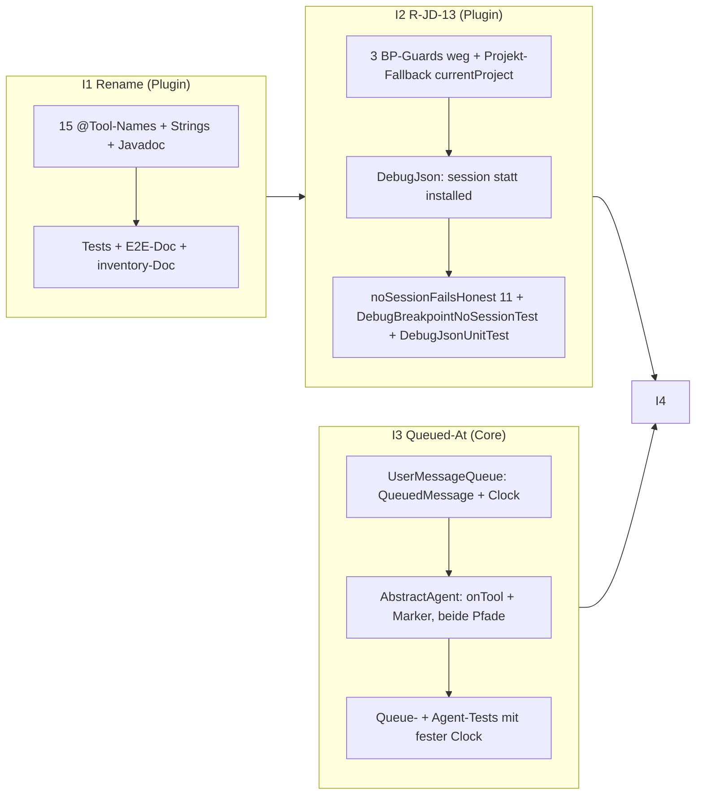

# Mini-Zyklus: Tool-Polish 2026-09-23 (I1 Rename debugJava*, I2 R-JD-13, I3 Queued-At, I4 Homepage)

> **⛔ STOP-AND-ASK (prominent, gilt je Inkrement):** Bei Compile-Fehlern ohne Lösung,
> nicht-grün-bekommenden Tests, IST-Widersprüchen zum Plan oder Unklarheiten: **STOPP und aktiv bei
> Jon nachfragen (askDev-Kanal)** — nie still workarounden, nie SOLL ändern. Fachliche Lücke, die
> keine Regel beantwortet → STOP-AND-ASK, nie selbst füllen.

## Status
- **I1** (Rename 15 Debug-Tools → `debugJava*`): ✅ — Longest-First-Rename in 3 Main- + 6 Test-Dateien + E2E-/Inventory-/ADR-/AGENTS-DEV-Docs; Grep-Gate: **0** alte Namen in `src/**` + non-historischen Docs (Rest nur in `docs/adr/**`, `open-points.md`, `index.md`-Datumzeile = planmäßig NICHT anfasst); Plugin-Build grün (nur Pre-Existing-Warnings), **Suite 272/0/0** (Baseline gleich, reines Umbenennen).
  - Abweichung gemeldet: `DebugPrimaryTypeTest.java` (2 Kommentare) war im Plan-File-List nicht genannt, wird aber vom eigenen Grep-Gate (0 Treffer in `src/**`) verlangt → mit renamed.
  - Flag für Jon (SOLL-Doc, nicht von Da Mek editiert): `docs/java-debugger-tool.md:96` sagt „use continue"-Hinweis, Plan/Code sagt `use debugJavaContinue` — SOLL↔Code-Reconciliation = Docs-Owner.
- **I2** (R-JD-13 Breakpoints ohne Session): ✅ — 3 BP-Actions (`debugJavaSetBreakpoint`/`…SetExceptionBreakpoint`/`…RemoveBreakpoint`) verlieren den Session-Guard (Marker-Op); Projekt-Auflösung ohne Session: relativer Pfad → `currentProject` (Chat-View), sonst ehrlicher Fehler (nennt: kein Session-Project-Attribut **und** kein Projekt in der Chat-View gewählt); `DebugJson.breakpointResponse`/`removedResponse` tragen ohne Session `session` statt `installed` (SOLL-Wortlaut exakt, Constant `NO_SESSION_MARKER_OP`); `noSessionFailsHonest` auf 11 session-gebundene Actions eingeschränkt; neu `DebugBreakpointNoSessionTest` ×5 + `DebugJsonUnitTest` ×2. Suite **279/0/0** (Baseline 272 + 7), Build grün (nur Pre-Existing-Warnings), Core unverändert. Docs: UC-JD-15 „Automatisiert:"-Zeile befüllt (Status ❌ bleibt = PO).
  - Abweichung gemeldet: `removedResponse` → `public` (notwendig, damit der Stub-Test in `org.sterl.llmpeon.test` es aufrufen kann; konsistent mit `breakpointResponse`, das schon public ist).
  - Ist-Korrektheit: Class-Javadoc `JavaDebugTool` + Javadoc/Comment in `JavaDebugToolTest` auf „11 session-gebundene Actions / R-JD-13" angepasst (sonst falsch).
- **I3** (Rule 9 Queued-At Disclosure): ⬜ offen
- **I4** (Homepage-Nachziehen): ⬜ offen

## 1. Kontext

Mini-Zyklus mit vier Inkrementen auf Branch **`analysis/tool-evolution`** (Git-Zustand vor Zyklus-Start
selbst prüfen: Branch existiert noch/ist er gemerged? — Memory 2026-09-05). **Commit je Inkrement,
inkl. geänderter `docs/**`** (nie nur Code). SOLL steht in den Docs — 1:1 folgen, nichts erfinden.

| # | Inkrement | SOLL | Modul |
|---|-----------|------|-------|
| I1 | 15 Debug-Tools snake_case → `debugJava*` (Clean Break, keine Aliase) | `docs/java-debugger-tool.md` (Namen) + [ADR-0054](docs/adr/0054-tool-naming-camelcase-family-prefix.md) | Plugin |
| I2 | R-JD-13: Breakpoints ohne Session (Marker-Op) | `docs/java-debugger-tool.md` R-JD-13 / UC-JD-15 | Plugin |
| I3 | Rule 9: Queued-At Disclosure `(queued HH:mm)` | `docs/queued-user-messages.md` Rule 9 | Core |
| I4 | Homepage-Nachziehen | AGENTS.md „homepage = user-visible Änderungen im selben Inkrement" | Homepage |

**UC-Konventionen:** UC-Kommentar am Test = reine ID (z. B. `// UC-JD-15`), kein Text dahinter.
Core-Tests: JUnit 5 + AssertJ; Plugin-Tests: JUnit 4, keine externen Assertion-Libs.
Vor Plugin-Testlauf: `eclipseBuildProject` über geänderte Projekte (stale bin/ → ClassNotFoundException).
Tests: GIVEN/WHEN/THEN. Stub/mock-LLM-Tests verifizieren **beide Richtungen** (Payload capturen + asserten
UND was beim Monitor ankommt). Gates: **Core via Maven Surefire = Ground Truth**, Plugin via
eclipseBuildProject + JUnit. Status-Flips in Docs (`❌→✅`) macht **NICHT** Da Mek (PO-Aufgabe) —
Da Mek trägt nur Testnamen in „Automatisiert:"-Zeilen ein, per `eclipseEditFile` mit eindeutigem
oldString (nie per Zeilennummer), danach Grep-Count-Verifikation.

## 2. Verifizierte IST-Fakten (2026-09-23, Da Thinka)

### I1 — Referenz-Inventory (komplett per Grep verifiziert)

**Rename-Mapping (ADR-0054, Longest-First-Reihenfolge beachten — `set_breakpoint` ⊂ `set_exception_breakpoint`):**

| alt (snake) | neu (camel) |
|---|---|
| `set_exception_breakpoint` | `debugJavaSetExceptionBreakpoint` |
| `set_breakpoint` | `debugJavaSetBreakpoint` |
| `remove_breakpoint` | `debugJavaRemoveBreakpoint` |
| `list_breakpoints` | `debugJavaListBreakpoints` |
| `evaluate_expression` | `debugJavaEvaluateExpression` |
| `get_stack_trace` | `debugJavaGetStackTrace` |
| `get_variables` | `debugJavaGetVariables` |
| `get_exception` | `debugJavaGetException` |
| `set_variable` | `debugJavaSetVariable` |
| `step_over`/`step_in`/`step_out` | `debugJavaStepOver`/`debugJavaStepIn`/`debugJavaStepOut` |
| `get_state` | `debugJavaGetState` |
| `continue` | `debugJavaContinue` |
| `suspend` | `debugJavaSuspend` |

**Live-Stellen (müssen renamed werden):**
- `org.sterl.llmpeon/src/org/sterl/llmpeon/parts/tools/debug/JavaDebugTool.java` — 15× `@Tool(name=…)`
  (:71, :79, :88, :100, :159, :168, :205, :266, :302, :332, :364, :380, :396, :421, :440),
  14× `noSession("…")`-Strings, `waitForSuspend(…, "…")`-Labels (:377, :393, :418, :437, :621, :628),
  Class-Javadoc :48 (`list_breakpoints`), `stepOut`-Meldung „use continue" (:411) → „use debugJavaContinue",
  `listBreakpoints`-Description :332 (beinhaltet `remove_breakpoint(id)`-Referenz),
  `remove_breakpoint`-Description :302 (referenziert `set_breakpoint`/`set_exception_breakpoint`).
- `DebugJson.java` — Javadoc-Namen (:56, :91, :234, :271, :318, :336).
- `DebugSession.java` — Kommentar :75 (`get_state`).
- Plugin-Tests: `SharedToolsComponentTest.java:188-189` (`ts.getExecutor("get_state")` —
  **funktionale** Referenz → `debugJavaGetState`), Kommentare in `JavaDebugToolTest.java:28,73`,
  `DebugListBreakpointsTest.java:22`, `DebugSessionThreadsTest.java:139,162,194,203`,
  `DebugJsonUnitTest.java:369,471,486` (nur Kommentare).
- **Keine** Core-Referenzen (Grep clean: `org.sterl.llmpeon.core`), **keine Prompt-Referenzen**
  (`src/main/resources` clean).
- E2E-Doc `org.sterl.llmpeon.test/ai-e2e-test/java-debugger-e2e-test.md` — :80-82, :91, :98-101,
  :107-108, :116, :121, :127-133, :141, :150-153 (Abschluss-Frage listet „14 Tool-Namen" → **15**
  inkl. `debugJavaListBreakpoints` korrigieren, R-JD-11 fehlt dort).
- `docs/tool-descriptions-inventory.md` :191-204 (Tabelle Zeilen 56-68, Namen + In-Description-
  Referenzen in Zeile 63) — ADR-0054 nennt dieses Doc explizit.

**Historisch = NICHT anfassen** (datierte Aufzeichnungen): `peon-plan/overview-done-*.md`,
`docs/adr/0049…` (API-Drift-Doku), `docs/open-points.md` (🔒-Log), `docs/index.md` (datierte
Status-zeilen, die 2026-09-23-Notiz dort hat bereits die neuen Namen),
`github-copilot-for-eclipse/` (externes Referenzprojekt).

**Grep-Verifikation am Ende von I1:** die 15 alten Namen müssen **0 Treffer** liefern in:
`org.sterl.llmpeon*/src/**`, `docs/**` außer `docs/adr/**`, `homepage/src/**`, `AGENTS*.md`,
`peon-plan/overview.md`. Die Longest-First-Falle (`set_breakpoint` ⊂ `set_exception_breakpoint`)
wird damit erwischt, wenn sie überlebt.

### I2 — Code-Fakten

- `JavaDebugTool.java`: BP-Guards bei `setBreakpoint` :211-214, `setExceptionBreakpoint` :272-275,
  `removeBreakpoint` :304-307; `noSession`-Helper :600-603 (ruft `onProblem`); `NO_SESSION`
  = `DebugSession.NO_SESSION` (DebugSession.java:26).
- **Marker-Factory braucht kein IDebugTarget — bereits durch den Bestand bewiesen:**
  `JDIDebugModel.createLineBreakpoint(IFile, typeName, line, …)` (:250) und
  `createExceptionBreakpoint(workspaceRoot, …)` (:289) laufen heute schon ohne Target-Parameter.
  Marker-Typs/Attrs stimmen mit der AGENTS-DEV-Notiz überein:
  `org.eclipse.jdt.debug.javaLineBreakpointMarker` / `javaExceptionBreakpointMarker`,
  `IBreakpoint.ENABLED` (kein `IMarker.ATTR_ENABLED`). Da Mek verifiziert die Signaturen
  trotzdem bei der Umsetzung kurz (readTypeSource) — Abweichung = STOP-AND-ASK.
- `setBreakpoint` nutzt `session` **nur** für die Projekt-Auflösung bei relativen Pfaden
  (:232-236); absolute Pfade `/projekt/…` sind schon session-frei (:224-230).
- `DebugJson.breakpointResponse` (:235) trägt `installed` (:254); `removedResponse` (:319) = `{id, removed}`.
- `listBreakpoints` hat nur den `currentProject`-Guard (:334) — bleibt so (R-JD-11).
- `currentProject` (Chat-View-Auswahl) = etablierter Träger für „gewähltes Projekt"
  (R-JD-11, `setCurrentProject` :64).
- **Tests:** `JavaDebugToolTest.noSessionFailsHonest` (:30-63) iteriert 14 Actions (alle außer
  list) inkl. `setBreakpoint`/`setExceptionBreakpoint`/`removeBreakpoint` (:44-46) — nach I2 müssen
  genau die **11 session-gebundenen** bleiben. Fixture-Muster für neue Marker-Tests:
  `DebugListBreakpointsTest` (erzeugt echte Marker im Fixture-Projekt, Cleanup in `finally`,
  `AbstractIntegrationTest` liefert `project` + `PeonTestFixture.ALPHA`-Datei `src/org/sterl/fixture/Alpha.java`).

### I3 — Code-Fakten

- `org.sterl.llmpeon.core/…/queuedmessages/UserMessageQueue.java`: `Deque<String> queue` :7,
  `batchStartTime` :8 (Burst-Window, nicht queuedAt — **bleibt**, eigene Semantik),
  `add()` :20 (mergt `last` + neue Message, :29-38), `pollNext()` :46, `drainAll()` :48 (join),
  `size()` :56, `clear()` :57.
- `AbstractAgent.java` (`org.sterl.llmpeon.agent`): Feld `messageQueue = new UserMessageQueue()` :44;
  `call()`: `drainAll()` :183, Follow-up-Marker `"[Queued Message]: "` :191, Join mit initial :188,
  in-loop `pollNext()` :203, onTool-Zeile „Reading queued User message: " :205,
  in-loop-Marker :206, `handleAbortAndDrain` :222-229, `drainQueue()` :232 (Interface-Contract
  `AiAgent.drainQueue()` → String, bleibt String).
- **Einziger pollNext/drainAll-Consumer ist AbstractAgent** (Plugin nur `getQueuedMessageCount()`,
  AIChatView :680-682; `drainQueue()` aktuell ohne Plugin-Caller).
- Tests: `AbstractAgentTest.callNullInitialWithQueuedProcessesQueueAsPayload` :526-546
  (assertet `"[Queued Message]:"` + `q1`, **ohne** Zeit — erweitern), `testQueuedMessagesChainedFifo`
  :49-87 (assertet nur contains msg2/msg3 — übersteht den Marker, wird um Zeit-Assert erweitert),
  `UserMessageQueueTest` (~20 Tests, alle `new UserMessageQueue(200)` bzw `(100)`,
  `pollNext()`-Assertions auf String :30,48,65-66,84-87,130-133,148-150,191).

## 3. Inkrement 1 — Rename 15 Debug-Tools → `debugJava*` (Plugin)

**Polarität: reines Umbenennen** (Namen in Annotationen, Strings, Kommentaren, Docs).
Kein Verhalten, keine neue Logik, keine Aliase (ADR-0054 Clean Break).

### Design
- Reihenfolge der Ersetzung **Longest-First** (Tabelle oben, `set_exception_breakpoint` vor
  `set_breakpoint`), danach die Grep-Verifikation aus §2/I1.
- `noSession("…")`/`waitForSuspend("…")`-Strings + `stepOut`-„use continue" → neue Namen
  (Tool-Referenzen in ehrlichen Meldungen dürfen nicht alt bleiben).
- Tool-Descriptions: **nur** die Tool-Namen-referenzierenden Textstellen (:302, :332, :411) —
  keine sonstigen Description-Änderungen (SOLL-Rename, keine Beschreibungs-Rework).

### Betroffene Dateien
1. `org.sterl.llmpeon/src/org/sterl/llmpeon/parts/tools/debug/JavaDebugTool.java` (15 Annotations,
   Strings, Javadoc, Descriptions)
2. `…/debug/DebugJson.java` (Javadoc)
3. `…/debug/DebugSession.java` (Kommentar)
4. `org.sterl.llmpeon.test/src/org/sterl/llmpeon/test/SharedToolsComponentTest.java` (getExecutor)
5. `…/test/JavaDebugToolTest.java`, `DebugListBreakpointsTest.java`, `DebugSessionThreadsTest.java`,
   `DebugJsonUnitTest.java` (Kommentare)
6. `org.sterl.llmpeon.test/ai-e2e-test/java-debugger-e2e-test.md` (alle Phasen + Abschluss „14→15")
7. `docs/tool-descriptions-inventory.md` (Tabelle 56-68)

### BDD / Tests
- `SharedToolsComponentTest.javaDebugToolIsEditToolFilteredFromReadOnlyAgents` — executor unter
  neuem Namen gefunden (bestehender Test, nur String).
- `JavaDebugToolTest.noSessionFailsHonest` — weiter grün (14 Actions, Verhalten identisch).
- **Nicht-regressionspflichtig** sind die UC-JD-Tests nicht — Rename-Polarität; grüne Suite = Beweis.

### Gate
`eclipseBuildProject` (org.sterl.llmpeon + org.sterl.llmpeon.test) grün, **gesamte** Plugin-Suite
grün (Baseline vor Änderung notieren), Core Surefire unverändert grün. Grep-Verifikation 0 Restreferenzen.
Commit inkl. Docs.

## 4. Inkrement 2 — R-JD-13: Breakpoints ohne Session (Plugin)

SOLL: `docs/java-debugger-tool.md` **R-JD-13 / UC-JD-15** (1:1, inkl. exaktem Response-Wording).

### Design-Entscheidungen
1. **3 Actions verlieren den Session-Guard**: `debugJavaSetBreakpoint`, `debugJavaSetExceptionBreakpoint`,
   `debugJavaRemoveBreakpoint`. Die 11 session-gebundenen + `debugJavaListBreakpoints` (R-JD-11) bleiben.
2. **Projekt-Auflösung `debugJavaSetBreakpoint` ohne Session** (aus SOLL abgeleitet, nicht erfunden —
   UC-JD-15: „Marker existiert im **gewählten** Projekt", der etablierte Träger = `currentProject`):
   - absoluter Pfad `/projekt/…` → wie heute, session-frei;
   - relativer Pfad + Session → `session.sessionProject()` (wie heute);
   - relativer Pfad + **keine Session** → `currentProject` (Chat-View-Auswahl);
   - relativer Pfad + keine Session + kein `currentProject` → ehrlicher Fehler (nennt: kein
     Session-Project-Attribut **und** kein Projekt in der Chat-View gewählt).
   → Auflösung von Paul bestätigt (2026-09-23): `currentProject` (Chat-View) ist das intendierte
     „gewählte Projekt" — konsistent mit R-JD-11.
3. **No-Session-Response** (SOLL-Wortlaut, exakt):
   `no active session — breakpoint stored as marker, installed when a session starts`
   - Constant in `JavaDebugTool` (z. B. `NO_SESSION_MARKER_OP`); gilt für set, set-exception **und**
     remove („dito-Response" — SOLL).
   - `debugJavaSetBreakpoint`/`…SetExceptionBreakpoint` ohne Session: gleiches JSON wie heute,
     **ohne** `installed`, stattdessen Feld `"session"` mit dem No-Session-Satz.
   - `debugJavaRemoveBreakpoint` ohne Session: `{id, removed, session: <Satz>}`.
   - Mit Session: unverändert (inkl. `installed` — Install-Pfad bleibt manuell verifiziert, UC-JD-15).
4. **DebugJson-Signaturen** (einzige Call-Change): `breakpointResponse(bp, file, line, exceptionType,
   String noSessionNote)` (`note == null` → `installed`, sonst `session`), `removedResponse(id,
   String noSessionNote)`. Alte 4- bzw. 1-Arg-Overloads **nicht** behalten (Clean Break;
   DebugJsonUnitTest-Call-Sites :472, :487 auf `null` umstellen).
5. CU-Auflösung (R-JD-7, `primaryTypeName`) + hitCount-Clamp (R-JD-12) gelten unverändert.
6. **Kein** `onProblem` auf dem no-session-Erfolgspfad (kein Problem — der Marker wurde angelegt).

### Betroffene Dateien
- `org.sterl.llmpeon/src/org/sterl/llmpeon/parts/tools/debug/JavaDebugTool.java` (3 Guards weg,
  Projekt-Auflösung, Responses; **3 BP-Descriptions aktualisieren**: no-session-Verhalten nennen,
  z. B. „Works without a debug session — stored as a JDT marker, installed into the VM when a
  session starts (no VM-install status in the response when no session is active).")
- `…/debug/DebugJson.java` (2 Signaturen + `session`-Feld statt `installed` bei Note)
- `org.sterl.llmpeon.test/src/org/sterl/llmpeon/test/JavaDebugToolTest.java` —
  `noSessionFailsHonest` auf **11** Actions einschränken (:44-46 raus), Kommentar :28 aktualisieren
  („11 session-gebunden; BP-ohne-Session = R-JD-13, DebugBreakpointNoSessionTest")
- **NEU** `…/test/DebugBreakpointNoSessionTest.java` (Muster `DebugListBreakpointsTest`)
- `…/test/DebugJsonUnitTest.java` (2 Call-Sites + no-session-Rendering-Tests, s. u.)
- `docs/java-debugger-tool.md` — **nur** die „Automatisiert:"-Zeile von UC-JD-15 (:233) mit den
  Testnamen befüllen (eclipseEditFile, eindeutiges oldString, danach Grep-Count-Check).
  Status ❌ R-JD-13/UC-JD-15 bleibt — Flip ist PO-Aufgabe.

### BDD (UC-JD-15: `breakpointsWorkWithoutSession`)
```
GIVEN keine Debug-Session (launchCount == 0)
WHEN debugJavaSetBreakpoint(file, line, condition, hitCount, policy) auf Fixture-CU (currentProject gesetzt)
THEN Response enthält "no active session — breakpoint stored as marker, installed when a session starts"
AND Response enthält KEIN "installed"-Feld
AND ein Line-BP-Marker (javaLineBreakpointMarker) existiert im gewählten Projekt
   (condition/hitCount korrekt, Marker-Ebene)
WHEN debugJavaRemoveBreakpoint(id)
THEN Marker entfernt, Response {removed:true} + dito-No-Session-Satz
GIVEN keine Session WHEN debugJavaSetExceptionBreakpoint(fqn)
THEN Exception-BP-Marker am Workspace-Root existiert, Response mit dito-Satz
GIVEN keine Session UND kein `currentProject`
WHEN debugJavaSetBreakpoint(relativer Pfad)
THEN ehrlicher Fehler: kein Session-Project-Attribut UND kein Projekt in der Chat-View gewählt
AND kein Marker angelegt
```
(Automatisiert: Marker-Ebene; Install-Pfad manuell — SOLL.)

### Neue Tests (Plugin, JUnit 4, Kommentare `// UC-JD-15`)
`DebugBreakpointNoSessionTest extends AbstractIntegrationTest`, Cleanup in `finally`:
1. `setBreakpointWithoutSessionStoresMarker` — SOLL-Branch 1 (Marker via
   `project.findMarkers(LINE_BREAKPOINT_MARKER, true, DEPTH_INFINITE)` verifizieren).
2. `removeBreakpointWithoutSessionRemovesMarker` — Marker via `JDIDebugModel.createLineBreakpoint`
   anlegen, `debugJavaRemoveBreakpoint(id)` entfernen, Existenz weg.
3. `setExceptionBreakpointWithoutSessionStoresMarker` — Marker am `getRoot()` (DEPTH_ZERO).
`DebugJsonUnitTest` (Stub-Ebene, beide Richtungen = Render-Eingabe + JSON-Output):
4. `breakpointResponseWithoutSessionOmitsInstalled` — noSessionNote → `"session" : "no active session …"`,
   kein `"installed"`.
5. `removedResponseCarriesNoSessionNote` — dito für remove.
6. `setBreakpointRelativePathWithoutSessionUsesCurrentProject` — relativer Pfad, keine Session,
   `setCurrentProject(project)` → Marker entsteht im **gewählten Projekt** (BDD-Branch „relativ +
   keine Session + currentProject"; Test 1 nutzt dieselbe Auflösung — Fixture-CU via relativem Pfad).
7. `setBreakpointRelativePathNoSessionNoProjectFailsHonestly` — relativer Pfad, keine Session,
   kein `currentProject` → ehrlicher Fehler (nennt: kein Session-Project-Attribut **und** kein
   Projekt in der Chat-View gewählt), kein Marker angelegt.

### Gate
eclipseBuildProject grün, Plugin-Suite grün, Core unverändert. Commit inkl. `docs/java-debugger-tool.md`.

## 5. Inkrement 3 — Rule 9: Queued-At Disclosure (Core)

SOLL: `docs/queued-user-messages.md` **Rule 9** (1:1): Eintrag trägt `queuedAt`; **beide** Konsumenten
zeigen `(queued HH:mm)` — onTool-Zeile `Reading queued User message: <text> (queued 14:32)` UND
Marker `[Queued Message] (queued 14:32): <text>` (in-loop **und** Follow-up-Pfad); Burst-Join zeigt
die Zeit des **ersten** Eintrags; Clock injizierbar; Message-Text hinter dem Präfix unverändert.

### Design-Entscheidungen
1. **Record** `QueuedMessage(String text, long queuedAt)` in `UserMessageQueue` (nested public
   record) — modern, ein Record statt zwei parallele Deques. `Deque<QueuedMessage>`.
2. **Clock gehört zur Queue** (sie stampft): Konstruktoren
   - `UserMessageQueue(long batchWindowMs)` → `Clock.systemDefaultZone()` (Production, bestehende
     Call-Sites kompilieren);
   - `UserMessageQueue(long batchWindowMs, Clock clock)` (Tests/Injection).
   `add()` nutzt `clock.millis()` statt `System.currentTimeMillis()` (auch für `batchStartTime` —
   konsistent, Test deterministisch).
3. **Burst-Join behält den ersten Timestamp:** beim Merge (:29-38) übernimmt die neue Kombination
   das `queuedAt` des gemergten letzten Eintrags (= Batch-Start).
4. **API-Change (einseitig, Core-intern + ein Interface bleibt):**
   - `pollNext()` → `QueuedMessage` (war String);
   - `drainAll()` → `QueuedMessage` (combiniert; `queuedAt` = **erster** Eintrag) oder `null`;
   - `AbstractAgent.drainQueue()` (Interface `AiAgent`) bleibt `String` — Wrapper:
     `var d = messageQueue.drainAll(); return d == null ? null : d.text();`
   - `handleAbortAndDrain` nutzt `.text()` (Abort-Drain = Memory-Payload, **keine** Zeit nötig — SOLL
     verlangt sie nur für onTool + Marker).
5. **Formatierung an einer Stelle** (One Behaviour, One Implementation): die Queue kennt ihre
   Clock/Zone und stellt das Label bereit:
   ```java
   // UserMessageQueue
   public String queuedLabel(long queuedAt) {
       return Instant.ofEpochMilli(queuedAt).atZone(clock.getZone()).format(HHMM); // "HH:mm"
   }
   ```
   `AbstractAgent` baut die beiden Strings aus `text()` + `queuedLabel(entry.queuedAt())`:
   - in-loop: `monitor.onTool("Reading queued User message: " + e.text() + " (queued " + messageQueue.queuedLabel(e.queuedAt()) + ")")`
     und `next = queuedMarker(e);`
   - Follow-up (:191): `next = queuedMarker(drained);`
   - Helper `queuedMarker(QueuedMessage e)` = `"[Queued Message] (queued " + label + "): " + e.text()`.
   - Join-Fall :188 (`stillQueued + sep + initialMessage`) → `stillQueued.text() + …` (keine Zeit —
     SOLL verlangt sie hier nicht, Marker kommt nur bei Follow-up/in-loop).
6. **Test-Sauma:** `AbstractAgent` erhält ein **package-privates** `void setMessageQueue(UserMessageQueue)`
   (Test in `org.sterl.llmpeon.agent` = gleiches Package; Präzedenz: statische Test-Seams
   `listBreakpoints(IProject)`/`primaryTypeName`). Kein Konstruktoren-Change an Subklassen.

### Betroffene Dateien (nur Core)
- `org.sterl.llmpeon.core/src/main/java/org/sterl/llmpeon/queuedmessages/UserMessageQueue.java`
- `org.sterl.llmpeon.core/src/main/java/org/sterl/llmpeon/agent/AbstractAgent.java`
- Tests: `…/src/test/java/org/sterl/llmpeon/queuedmessages/UserMessageQueueTest.java`,
  `…/src/test/java/org/sterl/llmpeon/agent/AbstractAgentTest.java`
- **Keine** Plugin-/Doc-Änderung (Rule-9-„Tests:"-Zeile im SOLL ist generisch; Status-Flip = PO).

### BDD (Rule 9)
```
GIVEN eine Message wird um 14:32 gequeued (fest injizierte Clock, z. B.
      Clock.fixed(Instant.parse("2026-09-23T14:32:00Z"), ZoneId.of("UTC")))
WHEN sie in-loop (pollNext) konsumiert wird
THEN onTool == "Reading queued User message: <text> (queued 14:32)"
AND der an das Mock-LLM gesendete UserMessage-Payload enthält
     "[Queued Message] (queued 14:32): <text>" (Text unverändert hinter dem Präfix)
GIVEN null-initial + 1 gequeued (Follow-up/Compact-Pfad)
WHEN call(null, …)
THEN Payload = "[Queued Message] (queued 14:32): <text>" (keineswegs „null" im Prompt)
GIVEN Burst (3 Messages im Fenster, Rule 1)
WHEN konsumiert THEN Zeit des ERSTEN Eintrags im Präfix (beide Richtungen)
```

### Test-Strategie (JUnit 5 + AssertJ, beide Richtungen, deterministisch)
1. `AbstractAgentTest.callNullInitialWithQueuedProcessesQueueAsPayload` (:526) — erweitern:
   feste Clock injizieren (setMessageQueue + `new UserMessageQueue(10_000, fixedClock)`),
   Assert um `(queued 14:32)` im Marker erweitern, bestehende `doesNotContain("null")` bleibt.
2. `AbstractAgentTest.testQueuedMessagesChainedFifo` (:49) — Monitor mit onTool-Capture + fixe Clock;
   THEN: onTool-Zeile für den Burst = „Reading queued User message: msg2<ls>msg3 (queued 14:32)"
   (Zeit des ersten Eintrags) + Memory-Payload enthält den Marker. (Latches/Timeouts bleiben.)
3. `UserMessageQueueTest` — alle `pollNext()`-Assertions auf `.text()` umstellen, `drainAll()`-
   Assertions analog; **neue** Tests (je 1, kurze Namen):
   - `entriesCarryQueuedAtFromFirstAdd` (Burst-Merge hält ersten Timestamp),
   - `newEntryAfterWindowGetsNewTimestamp`,
   - `drainAllReturnsFirstEntryQueuedAt`,
   - `queuedLabelFormatsHHmmInClockZone` (injected Clock).

### Gate
Maven Surefire (llmpeon-core) grün = Ground Truth (Zahlen aus Surefire, nicht Eclipse-Runner).
Kein Plugin-Aufbau nötig (Achtung: Interface `AiAgent` bleibt unverändert → Plugin kompiliert weiter;
kurzer `eclipseBuildProject` als Billig-Check trotzdem ok). Commit.

## 6. Inkrement 4 — Homepage-Nachziehen

SOLL: AGENTS.md „User behavior/visible changes need the update in the same increment".
**Kein** volles Tool-Register (bewusst verworfen).

### Betroffene Dateien + Inhalt (Wortlaut = Vorschlag, Fakten müssen stimmen)
1. `homepage/src/setup/custom-agents.md` —
   a) Prefix-Tabelle „Common built-in prefixes" (:170-177), Zeilen ergänzen (vor `mcp__`):
   - `` `debugJava` `` — Java-Debugger (Dev-agent-only, edit tool): 15 Actions `debugJavaGetState` …
     `debugJavaSuspend` (volle Liste wie im SOLL); Session = vom User im Debug-View gestartet;
     Breakpoint-Actions (set/remove/exception) wirken **ohne Session** (Marker, installiert wenn eine
     Session startet).
   - `` `web` `` — `webGet` (nur bei „Enable disk tools" aktiv — Hinweis, siehe `disk`-Zeile).
   - `` `shell` `` — `shellRunCommand` (Shell-Kommando, nicht für File-I/O).
   - Docs-Familie: **IST-Fakten** — die Tools heißen `lintDocs`, `lintDocsAndTests`
     (Prefix `lintDocs` deckt beide, Matching = `startsWith`, `ToolPolicy.java:27`) und `nextIds`
     (kein Prefix, exakter Name nötig). Zeile final mit den **tatsächlich matchenden** Prefixen
     (`lintDocs`, `nextIds`) — ein `docs`-Prefix matcht nichts (Task-Abkürzung korrigiert, nicht
     erfunden; von Paul bestätigt 2026-09-23).
   b) **Debugger-Abschnitt** (neu, kompakt, Nähe zu „File tools"-Sektion): was die 15 Tools können
   (lesend/ändernd), Session = User-Property (kein Auto-Start, ehrlicher Fehler ohne Session),
   no-session-Breakpoints (R-JD-13), keine Confirmations (User sieht jede Änderung im Debug-UI).
2. `homepage/src/index.md` —
   a) „Available Tools" (:62-73): Bullet **Java Debugger** ergänzen (debugJava*, Session startet der
      User, Breakpoints auch ohne Session).
   b) CTRL+Enter-Infobox (:82-84) **oder** dort wo Queuing beschrieben ist: ein Satz zu
      `(queued HH:mm)` — Rule 9 ist user-visible Chat-Output, daher im selben Zyklus (AGENTS.md-
      Regel; im Task nicht explizit, daher **bewusst als Zusatz markiert** — wenn PO es nicht will,
      fällt genau dieser Satz).

### Gate
Kein Build nötig (Markdown). **Nur `homepage/src` committen, `.vitepress/dist` nicht anfassen**
(generiertes Build-Artefakt, wird beim Release gebaut — Konvention von Paul bestätigt 2026-09-23).
Commit.

## 7. Reihenfolge & Gesamtdatenfluss

I1 → I2 → I3 → I4 (je für sich kompilierbar + grün, eine Polarität je Inkrement).



## 8. Open Questions

**Keine.** Alle 3 Fragen von Paul am 2026-09-23 entschieden (jeweils wie empfohlen):
1. I2 Projekt-Fallback = `currentProject` (Chat-View) → §4 Decision 2 + neue Tests 6/7.
2. Homepage-Docs-Zeile = real matchende Prefixes `lintDocs`/`nextIds` → §6.1a.
3. Homepage = nur `homepage/src` committen, `dist` nicht anfassen → §6 Gate.
