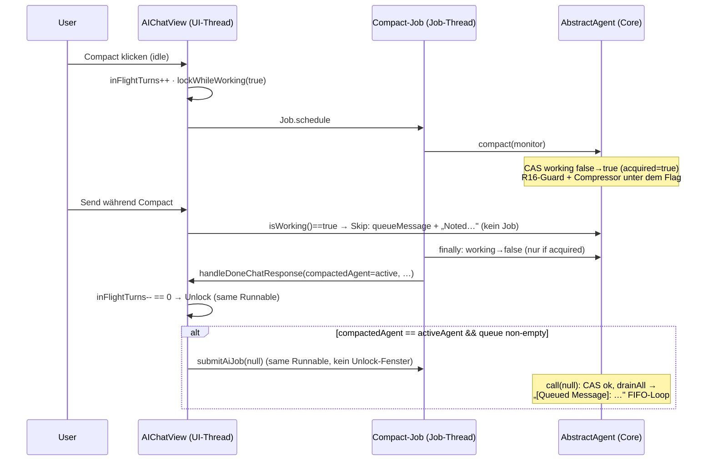

# Compact-Lock — User-getriggerter Compact verhält sich wie ein Turn (2026-09-22)

## ⛔ STOP-AND-ASK (User-Regel 2026-09-08 — gilt für ALLE Inkremente)

Bei Compile-Fehlern ohne Lösung, nicht-grün-bekommenden Tests, IST-Widersprüchen zu diesem
Plan oder Unklarheiten: **STOPP und Rückfrage über den Jon-Kanal** — nie still workarounden,
nie SOLL ändern. UC-Status in `docs/compact-lock.md` bleibt ❌ — Flippen macht Jon nach Review.
Da Thinka ruft `planImplemented` NIEMALS auf; Archivierung = Aufgabe des Dev-Agenten nach
bestandenem PO-Review.

## 1. Context

User-getriggerter Compact (`AIChatView.doCompressContext` / `doCompressAgent`) lief als Job
**ohne** das `working`-Flag von `AbstractAgent` → dokumentierter Memory-Race (Send während
Compact = paralleler `call()` gegen dieselbe Memory, während `compact()` sie leert,
`docs/chat-job-lifecycle.md` Backlog), Roster zeigte den Agenten inaktiv, gequeuete
Nachrichten wachten erst beim nächsten manuellen Turn auf.

**Scope (Paul):** gebaut wird **nur R-CT-1 (Lock) + R-CT-3 (Follow-up-Trigger)**.
R-CT-2 (Queue-Guard) und R-CT-4 (Anzeige) fallen **gratis** aus dem Flag heraus —
keine Code-Änderung dort. 🟡-Indikator und „!-Messages" sind EXPLIZIT OUT OF SCOPE.
UC-CT-3/4/5/6 = manuelle Verifikation (User-Smoke; kein SWT-Test-Harness, Präzedenz R-UI1/R-MCP3).

SOLL-Quellen: `docs/compact-lock.md` (R-CT-1…4, UC-CT-1…6),
`docs/adr/0052-compact-uses-working-flag.md`, `docs/chat-job-lifecycle.md` (R-ST1-Konventionen),
`docs/queued-user-messages.md` (Queue-Mechanik, wird reused, NICHT geändert).

## 2. Design decisions

- **D1 (R-CT-1):** `AbstractAgent.compact()` startet mit `boolean acquired = working.compareAndSet(false, true);`
  — **vor** dem R16-Guard (Guard wird dann unter dem Flag evaluiert, serialisiert).
  `finally { if (acquired) working.set(false); }`. In-Loop-Compact (Auto-Compact :241,
  `CompactSessionTool`) läuft mit `working==true` → CAS scheitert → `acquired==false` →
  wird weder akquiriert noch released (Flag gehört dem Turn). `PoDelegateTool.compact(slave)`
  compaktiert einen **anderen** (idle) Agenten → CAS succeeds → Slave ist währenddessen
  korrekt `working`. Ein `AtomicBoolean` reicht — Ownership über `acquired`.
- **D2 (R-CT-3, Trigger-Placement):** Follow-up-Check + Submit liegen **innerhalb des
  `remaining <= 0`-Branch** des `handleDoneChatResponse`-UI-Runnables — Unlock + Submit im
  selben UI-Thread-Runnable, kein Unlock-Fenster (ADR-0017, Memory-Regel #5 atomic UI chaining).
  Inflight-Skip-Branch (`remaining > 0`): **kein** Follow-up — der neuere Turn drainet die
  Queue selbst beim `call()`-Einstieg → kein doppeltes Submit.
- **D3 (Compact-Job-Unterscheidung):** `handleDoneChatResponse` erhält einen neuen
  `@Nullable AiAgent compactedAgent`-Parameter. Send-Pfad (`submitAiJob`) übergeben `null`;
  beide Compact-Pfade übergeben den kompaktierten Agenten. `agentName` (Display-String, bei
  Slave = `slave.uiName()`) bleibt wie heute. Kein Boolean-Flag, keine Job-Typ-Klasse.
- **D4 (nur aktiver Agent):** Trigger-Bedingung `compactedAgent == aiService.getActiveAgent()`
  (Identität — `AgentService` hält langelebte Instanzen; Implementierer verifiziert).
  Slave-Compact → kein Follow-up (Sklaven-Queue wird nicht vom UI gefüttert).
  Agent-Wechsel während des Compacts → kein Follow-up (Queue des alten Agenten bleibt,
  wird bei dessen nächstem Turn drainet).
- **D5 (Follow-up = `submitAiJob(null)` + Core-Fix):** `call()` :183-184 concatiniert heute
  `stillQueued + lineSeparator + initialMessage` — bei `initialMessage==null` und non-empty
  Queue ergibt das latent „…\nnull" im LLM-Prompt (defekt, heute unerreichbar via Follow-up,
  erreichbar via Empty-Send + Queue). Fix: `initialMessage` blank + drained Queue nicht leer
  → **Payload = drained Queue mit `"[Queued Message]:"`-Prefix** (UC-CT-4 verlangt die
  Markierung auch auf dem ersten Eintrag; in-Loop `pollNext` markiert schon identisch, :197-198).
- **D6 (Cancel-Parität):** Trigger feuert bei **jedem** Compact-Job-Ende (Erfolg/Fehler/**Stop**),
  `ex` ist irrelevant. Stop-canceled Compact → `handleChatException` liefert `null` (sieht
  aus wie Erfolg) → Follow-up feuert trotzdem. Rationale: „die Nachricht wird dann trotzdem
  verarbeitet" (Paul, R-CT-3 WEIL) + kein „N queued messages preserved"-Pfad. Kompact-Abort
  drainet nicht (Drain-on-Abort gehört zu `call()`, nicht zu `compact()`).
- **D7 (Freebies, keine Änderungen):** `resolveOutgoingMessage` :617-627 unverändert —
  `isWorking()==true` während Compact → `Skip` + Queue + Ack (R-CT-2). Roster 🟢 via
  `agent.isWorking()` Pull (`AiAgentStatusModel` :40, Blatt-Regel :53), Compact-Buttons
  via `AiAgentStatusModel.compactEnabled` (`AiAgentStatusWidget.java:96`) +
  `ActionsBarWidget.lockWhileWorking` :156 — alles fällt aus dem Flag (R-CT-4).
  Geprüft: Actions-bar-Compact-Button ist per `lockWhileWorking` während laufendem Turn
  deaktiviert → kein Gegen-Race (Compact-während-Turn) durchs UI; der CAS ist Backstop.
- **D8 (Tests):** Core: UC-CT-1/2 headless in `AbstractAgentTest` (StreamMock-Pattern,
  s. Test strategy). UC-CT-2 ist **Regression-Pin** (IST verhält sich dort schon korrekt —
  Test fixt die Re-Entrancy gegen zukünftige naive finally-Release). Plugin: **keine**
  neuen Headless-Tests (AIChatView braucht SWT `Display`; im `org.sterl.llmpeon.test` existiert
  kein View-Test, nur Kommentar-Verweis `PeonAiServiceTest.java:1727`). Evidenz = INFO-Log +
  User-Smoke.

## 3. Architecture

Komponenten-Grenzen bleiben: **Core** (`AbstractAgent`) besitzt Flag + Queue +
`[Queued Message]`-Semantik; **Plugin** (`AIChatView`) besitzt nur Job-Lifecycle,
Unlock-Entscheidung und den einen neuen Trigger. Abhängigkeitsrichtung unverändert
(UI → core, core ohne UI-Kenntnis). Neues State: null (kein `compacting`-Flag, kein Future).



Code-Sketches (Signaturniveau):

```java
// AbstractAgent.compact (I1) — nur die Hülle neu, Body unverändert
public boolean compact(AiMonitor monitor) {
    boolean acquired = working.compareAndSet(false, true); // User-Pfad; In-Loop: CAS failt
    try {
        if (memory.size() < 3) return false;              // R16-Guard, jetzt unter dem Flag
        /* …IST-Body unverändert… */
    } finally {
        if (acquired) working.set(false);
    }
}

// AbstractAgent.call :183-184 (I2)
var stillQueued = messageQueue.drainAll();
String next;
if (stillQueued == null) {
    next = initialMessage;
} else if (StringUtil.hasValue(initialMessage)) {
    next = stillQueued + System.lineSeparator() + initialMessage;
} else {
    next = "[Queued Message]: " + stillQueued;            // Follow-up: Queue ist Payload
}

// AIChatView.handleDoneChatResponse (I3) — neu: 1. Parameter + Block im Unlock-Branch
private void handleDoneChatResponse(@Nullable AiAgent compactedAgent, String agentName,
        @Nullable ChatResponse cr, IProgressMonitor monitor, Exception ex) {
    /* …IST… */
    EclipseUtil.runInUiThread(parent, () -> {
        int remaining = inFlightTurns.decrementAndGet();
        if (remaining < 0) { /* …IST fail-open… */ }
        if (remaining <= 0) {
            monitorRef.set(new NullProgressMonitor());
            lockWhileWorking(false);
            actionsBar.updateCompact(/* …IST… */);
            // R-CT-3 (D2/D4): im selben Runnable wie der Unlock
            if (compactedAgent != null
                    && compactedAgent == aiService.getActiveAgent()
                    && compactedAgent.getQueuedMessageCount() > 0) {
                LOG.info("compact follow-up: agent=" + agentName
                        + " queued=" + compactedAgent.getQueuedMessageCount());
                submitAiJob(null);
            }
            LOG.info("turn done: agent=" + agentName + " …"); // IST
        } else { /* …IST skip… */ }
    });
}
```

Call-Site-Updates (I3): `submitAiJob` :646 → `(null, agent.getName(), cr, monitor, ex)`;
`doCompressContext` :528 → `(active, active.getName(), null, monitor, ex)`;
`doCompressAgent` :559 → `(agent, slave.uiName(), null, monitor, ex)`.

## 4. Affected files

| Datei | Änderung | Inkrement |
|---|---|---|
| `org.sterl.llmpeon.core/src/main/java/org/sterl/llmpeon/agent/AbstractAgent.java` | I1: `compact()` :270-299 → CAS-Hülle. I2: `call()` :183-184 → 3-Wege-Next. (`working` :45, `StringUtil`-Import vorhanden) | I1, I2 |
| `org.sterl.llmpeon.core/src/test/java/org/sterl/llmpeon/agent/AbstractAgentTest.java` | I1: +3 Tests, 1 Erweiterung (:397-423 `compact_secondCallDirectlyAfterCompact_isNoop` um `isWorking()==false`). I2: +1 Test | I1, I2 |
| `org.sterl.llmpeon/src/org/sterl/llmpeon/parts/AIChatView.java` | I3: `handleDoneChatResponse` :652-681 (Signatur + Follow-up-Block + Log), 3 Call-Sites :528/:559/:646 | I3 |
| **unverändert** (bewusst): `resolveOutgoingMessage` :593-629, `UserMessageQueue`, `AiAgentStatusModel`, `AiAgentStatusWidget`, `ActionsBarWidget`, `doCompressContext`/`doCompressAgent`-Job-Body (nur die `handleDoneChatResponse`-Aufrufe ändern sich) | — | — |
| Docs (nur **Commit**, keine Edit!): `docs/compact-lock.md`, `docs/adr/0052-compact-uses-working-flag.md`, `docs/index.md`, `docs/queued-user-messages.md`, `docs/open-points.md`, `docs/chat-job-lifecycle.md` | mit I1-Commit committen | I1 |

## 5. Rules & constraints

- Log OR throw, nie beides; Tool/Log-Ehrlichkeit: Follow-up-Log-Zeile ist die
  Manual-Verification-Evidence (analog R-ST3).
- Counter-Invarianten R-ST1 bleiben 1:1: Follow-up-Submit läuft durch den **bestehenden**
  `submitAiJob` (increment + lock + finally-Guard) — kein eigener Counter-Pfad.
- Kein `System.lineSeparator()`-Verstoß: D5-Prefix ist fester Marker-Text
  (konsistent mit :197-198 `"[Queued Message]: " + next`).
- `monitorRef`/`monitor`-Semantik unverändert; Compact-Stop cancelt weiterhin über
  `monitorRef` (Compressor läuft durch `StreamingBridge` mit dem Job-Monitor).
- Plugin-Änderungen UI-Thread-sicher: alles im bestehenden `runInUiThread`-Runnable.
- Keine Migration, kein neuer UI-State, keine neue Abhängigkeit.
- Git (Memory #19): Branch `story/compact-lock-2026-09-22` **von `story/f2-debug-linter-2026-09-21` tip**
  (frischer Stand inkl. Linter-Fixes). Commit nach jeder grünen Iteration inkl. Story-Docs +
  Plan; Docs-Dateien (o.g. 6) mit dem I1-Commit. Branch-Wechsel nur auf Ansage.
- Vor jedem Plugin-Testlauf `eclipseBuildProject` für `org.sterl.llmpeon` UND
  `org.sterl.llmpeon.test` (stale `bin/`-Klassen, Memory #16).

## 6. BDD Acceptance (UC → Test)

| UC | Polarität | Test / Verifikation |
|---|---|---|
| UC-CT-1 (R-CT-1) | Happy | **`AbstractAgentTest.compactHoldsWorkingFlagDuringCompressorCall`** — 3 Messages in Memory, StreamMock-Callback: `agent.isWorking()` während Compressor-Call == `true`; nach `compact()` Rückkehr == `false` |
| UC-CT-1 | Fehler | **`AbstractAgentTest.compactFailedReleasesWorkingFlag`** — Mock wirft `IllegalStateException`; Exception propagiert; danach `isWorking()==false` (finally-Release) |
| UC-CT-1 | R16-Guard | Erweiterung **`compact_secondCallDirectlyAfterCompact_isNoop`** (:397): am Ende `assertThat(agent.isWorking()).isFalse()` — No-Op-Compact (Guard-Return unter dem Flag) released sauber |
| UC-CT-2 (R-CT-1) | Pin (IST-schon-grün, Re-Entrancy-Fixierung) | **`AbstractAgentTest.inLoopCompactDoesNotReleaseTurnsWorkingFlag`** — Auto-Compact-Szenario (`autoCompactAfter(100)` + `ThreadSafeMemory`-Override `getTotalTokenUsed()==101`, Pattern `buildsSystemPromptOnceWhenAutoCompacting` :454); Mock-Call 1 = Compressor (OK), Mock-Call 2 = Turn: `agent.isWorking()` **im Turn nach dem In-Loop-Compact** == `true`; nach `call()` == `false` |
| UC-CT-4 (R-CT-3, Core-Voraussetzung) | Happy + „no-null"-Defekt | **`AbstractAgentTest.callNullInitialWithQueuedProcessesQueueAsPayload`** — `queueMessage("q1")`; `agent.call(null, monitor)`; THEN: erste User-Message im Memory enthält `"[Queued Message]:"` und `"q1"`, **enthält kein** literales `"null"`; exakt ein LLM-Call für die Queue-Payload. Red vor I2 („…\nnull"), grün danach |
| UC-CT-2/UC-CT-1 (Queue-Survival) | — | unverändert, bereits gedeckt: queued-user-messages Regel 5 (`compact_session`-Survival-Tests) |
| UC-CT-3 (R-CT-2 freebie) | — | **Manuell** (Smoke 1) — kein zweiter Job, Ack im Chat |
| UC-CT-4 (R-CT-3, UI) | — | **Manuell** (Smoke 2) — Follow-up-Job startet, FIFO, `[Queued Message]`-Markierung |
| UC-CT-5 (R-CT-3) | Fehler | **Manuell** (Smoke 3) — fehlgeschlagener Compact → Queue trotzdem verarbeitet, kein „N queued message(s) preserved" |
| UC-CT-6 (R-CT-4 freebie) | — | **Manuell** (Smoke 4) — Roster 🟢 auf dem kompakten Mitglied, Boss leuchtet nicht (Blatt-Regel) |

## 7. Test strategy

- Core-Gate = **Maven Surefire voll auf `llmpeon-core`** (AGENTS.md: Surefire ist ground
  truth, nicht `eclipseRunTests`), Baseline Branch-Tip **923 / 0 Fail / 19 Skip** (PO-Review
  2026-09-21) → nach I1: 926, nach I2: 927 Tests.
- Plugin-Gate = `eclipseRunTests` auf `org.sterl.llmpeon.test` (PDE/OSGi), Baseline **260 / 0 / 0**.
  Wichtig für I3: `PeonAiServiceTest` ruft `compact(null)` an 13 Stellen an idle Agents —
  muss mit dem neuen Acquire/Release grün bleiben (Regression-Canary).
  Erster Plugin-Testlauf braucht einmalig manuelle Workspace-Trust-Bestätigung im UI
  (Memory #13) — bei Timeout nicht parallel nachstarten, User informieren.
- Test-Hygiene (AGENTS.md „Test honesty"): UC-CT-1-Tests sind echte Red→Green
  (vor I1: `isWorking()` während Compressor == false). UC-CT-2-Test ist **bewusst**
  ein Pin (IST-korrekt, fixt Re-Entrancy) — im Test-Javadoc so markieren.
- Bidirektionalität: UC-CT-1-Happy-Test assertet NICHT nur „true während" — auch
  „false danach" (Release-Defekt) und im UC-CT-2-Test „false nach call()".
- Latches mit Timeouts (5-10 s), wie das bestehende `testQueuedMessagesChainedFifo` :48-86.

## 8. Inkremente (je grün + kompilierend, Modulgrenzen)

### I1 — R-CT-1: Compact belegt das working-Flag (Core)
1. `AbstractAgent.compact()` → CAS-Hülle (D1), Body unverändert.
2. Tests: +3 (`compactHoldsWorkingFlagDuringCompressorCall`,
   `compactFailedReleasesWorkingFlag`, `inLoopCompactDoesNotReleaseTurnsWorkingFlag`)
   + 1-Assertion-Erweiterung in `compact_secondCallDirectlyAfterCompact_isNoop`.
3. Gate: `llmpeon-core` Surefire voll grün (erwartet 926/0/19).
4. Commit: Code + Tests + die 6 Story-Docs (s. §4) + diese Plan-Datei.

### I2 — R-CT-3 Core-Voraussetzung: `call(null)` mit Queue (Core)
1. `AbstractAgent.call()` :183-184 → 3-Wege-Next (D5).
2. Test: +1 (`callNullInitialWithQueuedProcessesQueueAsPayload`).
3. Gate: `llmpeon-core` Surefire voll grün (erwartet 927/0/19).
4. Commit.

### I3 — R-CT-3 UI: Follow-up-Trigger (Plugin)
1. `AIChatView.handleDoneChatResponse` → Signatur + Follow-up-Block + Log-Zeile
   (D2/D3/D4/D6); 3 Call-Sites aktualisieren.
2. Keine neuen Tests (D8); Plugin-Suite ist Regression-Gate.
3. Gate: `eclipseBuildProject` `org.sterl.llmpeon` + `org.sterl.llmpeon.test` fehlerfrei,
   dann Plugin-Suite voll grün (erwartet 260/0/0).
4. Commit.
5. Smoke 1-4 (PO-Review mit User, §9) → danach Jon flipped UC-CT-1…6 ❌→✅
   (manuelle UCs mit `(manuelle Verifikation …)`-Marker, vgl. ADR-0051-Konvention).

## 9. Manuelle Smoke-Steps (UC-CT-3/4/5/6, nach I3)

1. **UC-CT-3:** Agent mit ≥3 Messages, idle → Actions-bar Compact klicken → während
   des sichtbar streamenden Compacts Text einfügen + Send → **erwartet:** „Noted, I will
   respond as soon as I finished…"-Ack, **kein** zweiter Job (Task-View: nur der
   „Compact"-Job), kein LLM-Traffic für die neue Nachricht.
2. **UC-CT-4:** Fortsetzung von 1 → nach Compact-Ende startet **automatisch** ein
   „Peon AI request"-Job → die gequeuete Nachricht wird beantwortet; Chat zeigt
   `[Queued Message]`-Semantik (mehrere gequeuete Nachrichten: eine nach der anderen).
   Log-Evidenz: INFO `compact follow-up: agent=… queued=N`.
3. **UC-CT-5:** Compact erzwingen, der fehlschlägt (z. B. Provider-URL auf tot gestellt
   oder Rate-Limit) → Fehler-Meldung im Chat → danach wird die gequeuete Nachricht
   **trotzdem** verarbeitet (Follow-up feuert), **kein** „N queued message(s)
   preserved"-TOOL-Message.
4. **UC-CT-6:** Team-Mitglied per Roster-Button compacten (Da Boss wie Sklave) → während
   des Compacts zeigt die Zeile dieses Mitglieds 🟢; Da Boss leuchtet **nicht** mit
   (Blatt-Regel); nach Ende: beide inaktiv.

## 10. Edge cases (bewusst akzeptiert, dokumentiert)

- **Clear-Zwischenfenster:** User klickt Clear zwischen Unlock und Follow-up-Job-Start
  (ms-Fenster) → Follow-up läuft als Empty-Continuation-Turn — identisch zum
  IST-Empty-Send-Verhalten, kein neuer Defekt. Kein Guard (would need eigenes Flag).
- **Agent-Wechsel während Compact:** kein Follow-up (D4) — Queue des verlassenen Agenten
  überlebt und wird bei dessen nächstem Turn drainet (bestehende Semantik).
- **Inflight-Skip + Follow-up:** folgt aus D2 — neuerer Turn drainet selbst; kein doppeltes Submit.

## 11. Offene Fragen für die Implementierung

- **Keine blockierenden.** Zwei Da-Thinka-Entscheidungen, PO-reviewbar:
  D5 (`[Queued Message]:`-Prefix auf dem ersten Follow-up-Eintrag + „\nnull"-Fix in Core)
  und D6 (Stop-Cancel behandelt wie Fehler → Follow-up feuert, kein Verlust).
  Bei Widerspruch: STOP-AND-ASK vor I2/I3.
- `compactedAgent == aiService.getActiveAgent()` setzt Instanz-Identität des
  `AgentService` voraus — Implementierer mit einem Blick verifizieren (Agenten sind
  langelebte Instanzen); bricht es: STOP-AND-ASK.

## Risk line

**Most likely reason this breaks later:** Jemand „vereinfacht" später das Release in
`compact()` (immer `working.set(false)` im finally, ohne `acquired`-Check) → der
In-Loop-Compact released das Turn-Flag vorzeitig → Phantom-IDLE-Fenster, in dem ein
paralleler `call()` durchrückt — exakt der Race, den wir schließen. —
**Change that most reduces that risk:** UC-CT-2-Pin-Test
(`inLoopCompactDoesNotReleaseTurnsWorkingFlag`) — Mutation macht ihn rot.
