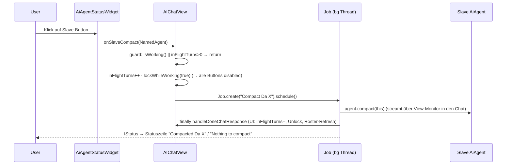

# Plan: PO Compact — R18 Cascade raus, Per-Slave Compact-Buttons, Homepage-Doku

## STOP-AND-ASK (bindend für den Dev-Agenten)

Bei **Compile-Fehlern ohne Lösung**, **nicht-grün-bekommenden Tests**, **IST-Widersprüchen zum Plan**
oder **Unklarheiten**: AKTIV bei Jon (askDev-Kanal) nachfragen — **nie still workarounden oder das
SOLL ändern.** Jeder IST-Widerspruch (z. B. Zeile/Signatur weicht ab) wird gemeldet mit Fundort
(file:line), bevor weitergearbeitet wird.

---

## 1. Context

Story `story/po-compact-2026-09-13` (Branch von `main` @ `c808c42`; aktuell auf `main` mit 4
uncommitteten Docs-Dateien: `docs/po-agent-jon.md`, `docs/agenten-status-im-header.md`,
`docs/index.md`, `docs/memory.md` — plus untracked `peon-plan/overview-done-*.md`).

Drei vertikale Inkremente, jedes für sich grün:

1. **Core (R18):** `AiPoAgent.compact()` komprimiert nur Jon — der implizite Slave-Cascade
   (`compactPlan → compactReview → compactDev`) wird entfernt. SOLL: `docs/po-agent-jon.md` R18.
2. **Plugin (Header-Compact-Buttons):** jede Sklaven-Zeile im Header-Roster (Da Thinka / Da Mek /
   Da Dok — **nicht** Da Boss) bekommt einen Flat-Icon-Button (Compact-Icon, Tooltip
   `Compact Da X`); Klick komprimiert genau diesen Agenten. SOLL:
   `docs/agenten-status-im-header.md` → „Per-Agent Compact-Buttons".
3. **Homepage:** neue user-facing Seite + Sidebar-Eintrag für Agenten-Team, Per-Slave Compact,
   „Compact = nur der jeweilige Agent", „Clear im Jon-Modus räumt Jon + alle Sklaven weg" (R19).

Unverändert (bewusst): die **expliziten** Slave-Compact-Tools in `PoDelegateTool`
(`compactPlan`/`compactReview`/`compactDev` — Jon kann gezielt per Tool compacten),
`AiPoAgent.clear()` (Clear-Cascade bleibt, R19), Auto-Compact der Slaven
(`SLAVE_COMPACT_FACTOR = 0.7` in `BuildPoAgentComponent`), `doCompressContext` (Action-Bar-Button).

**Doc-Status-Flips (❌→✅ sind PO-Aufgabe nach dem PO-Review — NICHT Teil der Dev-Inkremente):**
- `docs/po-agent-jon.md` R18: ❌ → ✅
- `docs/agenten-status-im-header.md` „Per-Agent Compact-Buttons": ❌ → ✅
- `docs/po-agent-jon.md` R19: Homepage-Teil (❌ „Teil des Inkrements") → ✅

## 2. Design decisions

- **Inc 1 — Override komplett entfernen, nicht hohl lassen.** `AiPoAgent.compact()` wird
  gelöscht; Jon erbt `AbstractAgent.compact()` (`AbstractAgent.java:165`), die bereits
  R16-Skip (`memory.size() < 2 → false`, kein LLM-Call, kein Clear), nullSafety und
  Compact-Flow enthält. Kein toter 2-Zeilen-Override. `clear()` (R19) bleibt unverändert.
- **Inc 2 — Testbare Logik bleibt im Core-Model** (`AiAgentStatusModel`, SWT-frei, headless):
  Button-Anwesenheit (nur Sklaven-Zeilen), Enablement und Feedback-Text werden als Pure-Funktionen
  dort gehalten — genau wie die Blatt-Regel heute. Das Plugin-Widget ist dann dünn: es rendert und
  wirft Callbacks, es rechnet nichts.
- **Inc 2 — Job-Mechanik 1:1 von `AIChatView.doCompressContext`** (AIChatView.java:487-506)
  übernommen (inFlightTurns → lockWhileWorking(true) → Job.create → monitorRef.set → finally
  `handleDoneChatResponse` → `PeonConstants.status`). Der einzige Unterschied: der geklickte
  Slave statt `aiService.getActiveAgent()`, plus Roster-Refresh danach. Keine zweite Lock/Unlock-
  Implementierung, keine neuen Observer.
- **Inc 2 — Kein Pre-Check `< N Messages` im View.** `doCompressContext` bricht bei `< 3` still
  ab; der Button-Pfad darf das nicht (SOLL: Feedback statt Stillstand). Der Guard lebt nur in
  Core (R16, `< 2`); der Job läuft immer, `compact()` liefert `false` → Statuszeile
  `Nothing to compact`.
- **Inc 2 — Rows werden strukturell aufgebaut, pro `refresh()` nur aktualisiert** (Text/Enablement),
  neu gebaut nur bei Team-Größenwechsel (Agent-Wechsel PO ↔ Nicht-PO). Vermeidet Dispose/Recreate
  pro Monitor-Event (`onChatResponse`/`onTokenUsage` rufen `refreshRoster()` öfter pro Turn).
- **Inc 3 — Seite unter `usage/`** (Verhalten beim Arbeiten mit Peon AI, wie
  `usage/selections.md`), nicht unter `setup/`. Sidebar-Eintrag in der bestehenden „Usage"-Gruppe
  (`homepage/.vitepress/config.ts`) — die Top-Nav hat keine Usage-Sektion, die Sidebar *ist*
  die Navigation. Sprache/Format der bestehenden Seiten (Tabs/Tip-Boxes/Verification-Section).
  Cross-Link auf `/setup/peon-po` (umgekehrt: kurzer Hinweis dort ist **optional**, kein Muss).

## 3. Architecture

```mermaid
graph TD
  subgraph Plugin [org.sterl.llmpeon]
    AIB[AIChatView<br/>doCompressAgent · inFlightTurns · handleDoneChatResponse]
    H[HeaderBarWidget]
    W[AiAgentStatusWidget<br/>rows: Label (+Button je Sklave)]
  end
  subgraph Core [llmpeon-core]
    M[AiAgentStatusModel<br/>rows() · build() · compactEnabled() · compactResult()]
    A[AiPoAgent<br/>compact() = erbt AbstractAgent (R18: kein Cascade)]
    S[AiAgent compact/monitor<br/>R16-Skip < 2]
  end
  AIB -->|Consumer&lt;NamedAgent&gt; + Supplier&lt;Boolean&gt;| H
  H -->|Supplier&lt;List&lt;NamedAgent&gt;&gt; + Callback| W
  W -->|pure| M
  AIB -->|agent.compact(this) in Job| S
  A -.->|erbt| S
```

Klick-Sequenz (Inc 2):



### Neue/veränderte Interfaces (Signatur-Sketch)

Core, `AiAgentStatusModel`:

```java
public record Entry(String text, boolean working, boolean slave) {}   // slave = Zeile > 0 (kein Da-Boss-Button)

// in build(): slave = i > 0

/** Button nur enabled, wenn der Agent idle IST und kein Turn/Compact in-flight ist. */
public static boolean compactEnabled(boolean agentWorking, boolean turnInFlight) {
    return !agentWorking && !turnInFlight;
}

/** Statuszeilen-Feedback des Slave-Compact-Jobs (R16-Skip statt Stillstand). */
public static String compactResult(boolean compacted, String uiName) {
    return compacted ? "Compacted " + uiName : "Nothing to compact";
}
```

Plugin, `AiAgentStatusWidget` (neue Constructor-Parameter, UI-thread only):

```java
public AiAgentStatusWidget(Composite parent, int style,
        Supplier<List<NamedAgent>> team,
        Consumer<NamedAgent> onSlaveCompactClick,
        Supplier<Boolean> turnInFlight)
```

- Layout: 1 `Composite` (RowLayout HORIZONTAL, pack, spacing 2) pro Eintrag; darin
  `Label` (Text inkl. Präfix `   ·   ` für i>0 und `🟢 ` bei working — wie heute im Single-Label)
  und bei `entry.slave()` ein `SwtUtil.createIconButton(row, ImageUtil.loadImage(row,
  ImageUtil.COMPACT), "Compact " + uiName)`. Alle Controls bekommen
  `WidgetCss.CSS_CLASS_NAME_KEY = EclipseUiUtil.CSS_CLASS_HEADER_BAR_WIDGET` (wie der heutige
  Label/hammer).
- `refresh()`: `AiAgentStatusModel.rows(team.get())` ziehen; wenn Eintragszahl ≠ gebauter
  Row-Zahl → alte Row-Composites `dispose()` + neu bauen; sonst Label-Text + Button
  `setEnabled(AiAgentStatusModel.compactEnabled(agent.isWorking(), turnInFlight.get()))`
  aktualisieren. Button-`Selection` → `onSlaveCompactClick.accept(namedAgent)` —
  `NamedAgent` pro Row in einem parallel gehaltenen `List<NamedAgent>` (gleiche Reihenfolge
  wie `getTeam()`). `requestReflow()` wie heute. `isDisposed()`-Guards wie heute.

Plugin, `AIChatView` (neue Methode, neben `doCompressContext`):

```java
private void doCompressAgent(NamedAgent slave) {
    var agent = slave.agent();
    if (agent.isWorking() || inFlightTurns.get() > 0) return; // defensiv — Buttons sind disabled
    inFlightTurns.incrementAndGet();
    LOG.info("turn submit (slave compact): agent=" + slave.uiName() + " in-flight=" + inFlightTurns.get());
    lockWhileWorking(true);
    Job.create("Compact " + slave.uiName(), monitor -> {
        monitorRef.set(monitor);
        Exception ex = null;
        boolean result = false;                 // vor dem finally capturen (state vor Ref-Reset)
        try {
            result = agent.compact(this);
            if (result) EclipseUtil.runInUiThread(parent, this::refreshChat);
            EclipseUtil.runInUiThread(parent, headerBar::refreshRoster); // Kontextgröße fällt sichtbar
        } catch (Exception e) {
            ex = handleChatException(e);
        } finally {
            handleDoneChatResponse(slave.uiName(), null, monitor, ex);
        }
        return PeonConstants.status(AiAgentStatusModel.compactResult(result, slave.uiName()), ex);
    }).schedule();
}
```

Wiring (AIChatView.java:121-124): `new HeaderBarWidget(parent, SWT.NONE, ..., aiService::getStatusAgents,
this::doCompressAgent, () -> inFlightTurns.get() > 0)` — `HeaderBarWidget` bekommt die beiden
Parameter und reicht sie an `AiAgentStatusWidget` weiter (sonst nichts geändert).

## 4. Affected files

### Inc 1 — Core R18 (kompiliert + grün für sich)
| Datei | Änderung |
|---|---|
| `org.sterl.llmpeon.core/src/main/java/org/sterl/llmpeon/poagent/AiPoAgent.java` | **`compact(AiMonitor)`-Override löschen** (heute ca. Zeile 135-149, Cascade mit `monitor.onTool("Compact Da …")` + `compactPlan/compactReview/compactDev`). `clear()` bleibt. |
| `org.sterl.llmpeon.core/src/test/java/org/sterl/llmpeon/agent/AiPoAgentTest.java` | `compact_cascadesToAllThreeSlaves` → umbauen (siehe §7); neuer R16-Skip-Test. |

Referenz-Check (Plan-Slicing-Regel, vor dem Entfernen greppen): `compactPlan\|compactReview\|compactDev`
→ `AiPoAgent.java` (Cascade — wird raus), `PoDelegateTool.java` (Tool-Definitionen — **bleibt**),
`PoDelegateToolTest.java` (testet die expliziten Tools — **bleibt, unverändert**). Plugin-Modul:
keine Referenzen (geprüft). Kein anderer Caller hängt am Override (polymorph via `AiAgent.compact`).

### Inc 2 — Plugin Header-Compact-Buttons (kompiliert + grün für sich)
| Datei | Änderung |
|---|---|
| `org.sterl.llmpeon.core/src/main/java/org/sterl/llmpeon/agent/AiAgentStatusModel.java` | `Entry` + `slave`, `compactEnabled`, `compactResult` (§3). |
| `org.sterl.llmpeon.core/src/test/java/org/sterl/llmpeon/agent/AiAgentStatusModelTest.java` | neue Pure-Logic-Tests (§7). Bestehende Tests anpassen, falls `Entry`-Record erweitert wird. |
| `org.sterl.llmpeon/src/org/sterl/llmpeon/parts/widget/AiAgentStatusWidget.java` | Single-Label → Row-Composites (Label + Button je Sklave), refresh-Diffing, Callback. |
| `org.sterl.llmpeon/src/org/sterl/llmpeon/parts/widget/HeaderBarWidget.java` | Constructor + 2 Parameter, Durchreichung an das Roster-Widget. |
| `org.sterl.llmpeon/src/org/sterl/llmpeon/parts/AIChatView.java` | Wiring (Zeile 121-124) + `doCompressAgent` (§3). |

Nicht angefasst: `SwtUtil`, `ImageUtil` (Icons existieren: `ImageUtil.COMPACT`),
`ActionsBarWidget`, `doCompressContext`, `PeonAiService.getStatusAgents()`.

### Inc 3 — Homepage (kompiliert = gebaut für sich)
| Datei | Änderung |
|---|---|
| `homepage/src/usage/agents.md` | **neue** Seite „Agent Team" (§6, Inhaltspunkte). |
| `homepage/.vitepress/config.ts` | Sidebar `Usage`-Gruppe: `{ text: 'Agent Team', link: '/usage/agents' }`. |

## 5. Rules & Constraints

- **Threading:** alle SWT-Änderungen UI-Thread (Widget-`refresh()` läuft heute schon nur via
  `EclipseUtil.runInUiThread`-Trigger); Slave-Compact auf `Job.create` (bg). `monitorRef` nur
  setzen wie in `doCompressContext`; State (`result`) **vor** `handleDoneChatResponse`
  (die setzt `monitorRef` zurück) capturen.
- **System.lineSeparator()** in neuen Strings mit Inhalt/Text (memory #7) — hier nur
  Single-Lines, `\n` irrelevant, aber kein Hardcoding falls Text wächst.
- **Kein Logging von Config/Secrets** auf dem neuen Pfad (memory #20) — `handleChatException`
  wird unverändert *weiterverwendet*, nicht dupliziert.
- **Plugin-Tests:** JUnit 4, keine externen Assertion-Libs (OSGi). SWT-Widget selbst **nicht**
  testen (wie `TokenHeaderWidget` — dokumentierte Abgrenzung); testbar ist nur die Pure-Logik im
  Core-Model.
- **Core-Tests:** JUnit 5 + AssertJ, GIVEN/WHEN/THEN-Kommentar-Struktur wie die
  `AiPoAgentTest`-Existierenden; `StreamMock.getCallCount()` für „kein/exakt ein LLM-Call".
- **Surefire = Ground Truth** für Testzahlen (nicht `eclipseRunTests`). Core:
  `mvn -pl org.sterl.llmpeon.core test` (bzw. vom Parent `mvn test -pl`). 
- **Build vor Plugin-Testlauf:** `eclipseBuildProject` über `org.sterl.llmpeon` + `org.sterl.llmpeon.test`
  (stale Bundle-Klassen → ClassNotFoundException); erster PDE-Testlauf des Sessions braucht einmalig
  die manuelle Workspace-Trust-Bestätigung im UI-Dialog (sonst Launch-Timeout, „0 tests ran").
- **Git (R15):** Branch `story/po-compact-2026-09-13` von `main` `c808c42` anlegen (vor Start
  Git-Zustand prüfen: aktueller Branch, existiert der Story-Branch bereits? — nicht still
  umbenennen). Nach **jeder grünen Iteration** committen (Scope = Dateien der Iteration),
  Commit-Message `inc-N: <Summary>`. Die 4 uncommitteten Docs-Dateien und die untracked
  `peon-plan/overview-done-*.md` gehen in den **ersten** Commit mit. Kein Merge ohne User.

## 6. BDD Acceptance

### Inc 1 — R18 (core, `AiPoAgentTest`)
```
GIVEN Jon mit PoDelegateTool und drei Slaven (jeder mit ≥ 2 Messages)
WHEN po.compact(null)
THEN wird NUR Jons Memory komprimiert (alte Messages weg, Summary drin)
AND Da Thinka/Da Mek/Da Dok bleiben bytegleich unverändert
AND StreamMock.getCallCount() == 1  (kein Slave-Traffic)

GIVEN Jon hat < 2 Messages im Memory
WHEN po.compact(null)
THEN false, Memory unverändert, StreamMock.getCallCount() == 0  (R16-Skip)
```
Bestehend bleiben grün: `clear_cascadesToAllThreeSlaves` (R19), `PoDelegateToolTest`-Compact-Tools.

### Inc 2 — Header-Buttons (UI: User-Smoke; Logik: core-Tests)
```
GIVEN Jon ist aktiv und Da Mek idle, kein Turn in-flight
WHEN der User drückt Da Meks Compact-Button
THEN wird AUSSCHLIESSLICH Da Mek komprimiert (ein LLM-Call, streamt in den Chat)
AND Statuszeile "Compacted Da Mek", Roster zeigt den gefallenen Kontext

GIVEN Da Mek hat < 2 Messages
WHEN der User drückt Da Meks Compact-Button
THEN kein LLM-Call, Statuszeile "Nothing to compact"

GIVEN Da Mek arbeitet (🟢) ODER inFlightTurns > 0
THEN Da Meks Button ist disabled

GIVEN ein Nicht-PO-Agent ist aktiv
THEN keine Roster-Zeilen, keine Compact-Buttons

Da Boss-Zeile: kein Button (Action-Bar-Compact bleibt dafür)
Tooltip je Button: "Compact Da X"
```

### Inc 3 — Homepage
- Neue Seite existiert unter `/usage/agents`, in der Sidebar unter „Usage" verlinkt,
  `npm run build` (homepage) fehlerfrei. Inhalt (englisch, Stil von `usage/selections.md`):
  1. Agent-Team im Header (Jon-Modus): Da Boss / Da Thinka / Da Mek / Da Dok,
     Kontextgröße + 🟢 auf dem arbeitenden Blatt.
  2. Per-Slave Compact-Button (Icon, Tooltip `Compact Da X`), Klick komprimiert **nur** diesen
     Agenten; Feedback `Compacted Da X` bzw. `Nothing to compact` (< 2 Messages, kein LLM-Call).
  3. „Compact komprimiert nur den jeweiligen Agenten" — Jons Compact (Action-Bar-Button /
     compactSession) = Jon allein; Slaven compacten sich selbst bei eigenem Bedarf.
  4. „Clear im Jon-Modus räumt Jon + alle Sklaven weg" (bewusste Asymmetrie zu Compact, R19).

## 7. Test strategy

**Inc 1** (`AiPoAgentTest`, core JUnit 5 + AssertJ):
- `compact_cascadesToAllThreeSlaves` **umbauen →** `compact_onlyCompactsJon_notSlaves`:
  Setup wie heute (StreamMock, `poWithSlaves`, je 2 Messages pro Slave + 2 für Jon);
  THEN: Jon compacted (kein `jon old`, `COMPRESSED` present) **und** jeder Slave enthält noch
  `old <name>` **und** hat **kein** `COMPRESSED`-AiMessage; **und**
  `streamMock.getCallCount()` ist `1`. → **Red-first**: gegen IST schlägt er (Cascade compactet
  alle 3 Slaves, count == 4), dann Fix (Override weg), dann grün.
- Neu `compact_skipsWithoutLlmCall_whenBelowTwoMessages`: Jon mit 1 Message, `streamMock.reset()`,
  `po.compact(null)` → `false`, Memory unverändert, `getCallCount() == 0`.
- `PoDelegateToolTest`-Compact-Tests: unverändert (explizite Tools bleiben) — nur grün halten.

**Inc 2** (`AiAgentStatusModelTest`, core):
- `entries_bossRowHasNoCompactButton_slaveRowsDo` (3-Zeilen-Team: `slave` = false,true,true).
- `compactEnabled_matrix` (4 Kombinationen agentWorking × turnInFlight — nur
  false,false → true).
- `compactResult_successVsSkip` (`"Compacted Da Mek"` / `"Nothing to compact"`).
- Bestehende Blatt-Regel-Tests: `Entry`-Konstruktoren-Anpassung, falls der Record wächst.
- Plugin: **kein** SWT-Test (dokumentiert). Verifikation = User-Smoke-Checkliste (BDD oben) +
  `eclipseBuildProject` grün. Falls der User es will: `org.sterl.llmpeon.test`-Suite einmalig
  laufen lassen (PDE, Trust-Dialog beachten) — Standard-Suite, kein neuer Test.

**Inc 3**: `npm run build` im `homepage/` (VitePress) fehlerfrei; Links manuell im
Preview/Build-Output prüfen (`ignoreDeadLinks: true` schlägt keine Toten-Links an).

## 8. Ausführung (Reihenfolge, je ein grüner Commit)

1. **Git:** Zustand prüfen (main @ c808c42? Branch existiert schon?), `git switch -c
   story/po-compact-2026-09-13`. Commit 1: die 4 uncommitteten Docs + untracked
   `peon-plan/overview-done-*.md` (Message: `docs: po-compact SOLL + plan archives`) — falls Jon
   entscheidet, sie mit Inc 1 zu committen statt separat: **fragen, nicht raten**.
2. **Inc 1:** Red-Test → Fix → grün (`mvn test` core, Surefire-Zahlen notieren) → Commit
   `inc-1: R18 compact cascade removed, Jon compacts only himself`.
3. **Inc 2:** Core-Model + Tests → grün; dann Widget/HeaderBar/AIChatView → `eclipseBuildProject`
   (`org.sterl.llmpeon` + `org.sterl.llmpeon.core`) → Commit
   `inc-2: per-slave compact buttons in header roster`. Danach User-Smoke (BDD §6) — Smoke-Bugs
   sind eigene grüne Iterations-Commits.
4. **Inc 3:** Seite + Sidebar → `npm run build` → Commit
   `inc-3: homepage agent-team page (compact buttons, clear cascade)`.
5. **PO-Review:** Jon flippt die Doc-Statusmarker (§1), Dev committet die Flips
   (`docs: flip R18/header-buttons to ✅`) — erst nach bestandener Abnahme.
6. Merge/Squash = **User-Entscheidung**.

## 9. Open questions

- **Nichts Blockierendes.** Einzige bewusste Abweichung vom User-Text: „Nav-Eintrag" =
  Sidebar-Eintrag in der „Usage"-Gruppe (die Top-Nav kennt keine Usage-Sektion) — falls
  Top-Nav gemeint war: ein Zeile in `config.ts`, kein Wiederaufbau.
- Beobachtung (out of scope, nicht fixen ohne Ansage): `homepage/src/setup/peon-po.md` listet
  das Team ohne **Da Dok** — leicht veraltet. Kandidat für Folge-Story, nicht diese.
