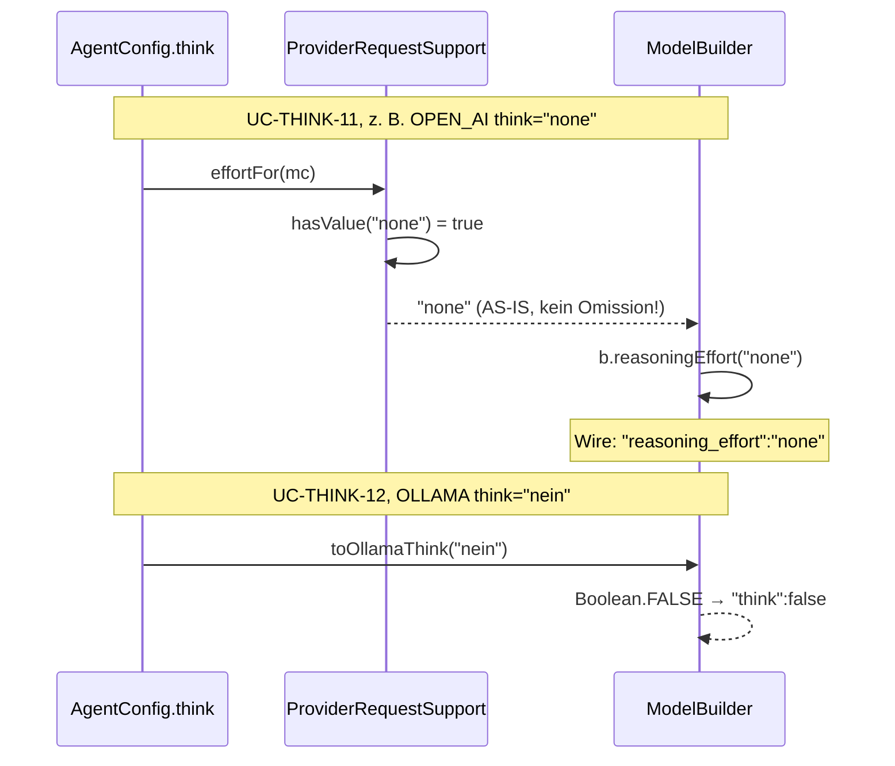

# Plan — R-THINK-11/12: Verbatim-Think (ADR-0064)

> **Status:** STARTKLAR (2026-09-29) — Q2 (Anthropic-Freeze) + Q4 (Branch `story/issue-149-think`) von Jon bestätigt (§10). Abnahme: Jon nach grünem Final-Gate.
> **Story:** Verbatim-Think — String-Provider (OPEN_AI-Familie: OPEN_AI/OPEN_AI_OFFICIAL/GITHUB_MODELS/GITHUB_COPILOT + LM_STUDIO) senden den gesetzten Think-Wert AS-IS auf die Leitung; nur Ollama (Toggle) interpretiert; ANTHROPIC/GEMINI/MISTRAL behalten ihre provider-eigene Übersetzungsschicht (Q2 bestätigt, ADR-0064 Decision 3).
> **SOLL-Quellen:** `docs/per-agent-think.md` §„Rework 2026-09-29" (:146–188, UC-THINK-11 :157–173, UC-THINK-12 :177–188) + `docs/adr/0064-verbatim-think-values.md` (Decision :17–35, Consequences :37–51). **Verbatim-Liste in der UC-Zeile korrigiert (Jon 2026-09-29, `per-agent-think.md:159–161`):** nur OPEN_AI, LM_STUDIO, GITHUB_COPILOT, GITHUB_MODELS — ANTHROPIC/GEMINI/MISTRAL explizit ausgenommen (Übersetzungsschicht, ADR-0064 Decision 3). Lint-Gate zu SOLL: grün (12/12 UC-THINK-ids definiert, 0 Probleme — re-verifiziert 2026-09-29 nach Doc-Korrektur).
> **Warum:** Paul-Smoke: `think: none` auf OPEN_AI kam nie auf dem Request an (Off-Omission) — das Modell dachte trotzdem weiter. `think: true` auf o4 wurde still zu `high` remappt (On-Mapping). Beide Verträge sind tot (ADR-0064).

---

## Fortschritt (Da Mek)

- **Inc 1** ✅ (2026-09-29): Evidenz grün — `ReasoningEffort.of()` lenient, Rohtext via `asString()` (Plan-Sketch `value()` liefert das `_UNKNOWN`-Enum; javap-Diagnose, planautorisiert). 7 rote SOLL-Tests befestigt, 0 ungeplante Rotten. Surefire-Baseline 1054/0 → 1060/7 (exakt die in §4/5 markierten Rotten).
- **Inc 2** ✅ (2026-09-29): `effortFor` → verbatim, `toOllamaThink` +`TOGGLE_OFF`(nein), `toReasoningEffort`+`toReasoning` raus (Clean-Break, 0 Consumer), `LmStudioProvider:63` → verbatim. Surefire 1060/7 → **1057/0/0** (voller grün, alle 7 Inc-1-Rotten grün). Delta: −4 removed (`offValuesMapToGenericOmitValues`/`truthyValuesMapToHigh`/`explicitLevelsPassThrough`/`toReasoning_*`) +1 new (`isOff_isOn_keepFrozenTokens`) = −3. Build clean (0 Errors).
  - **⚠️ PLAN-DEVIATION (PO-Entscheid Jon, 2026-09-29):** Inc-3-LM-Fix (`LmStudioProvider:63` → verbatim) **nach Inc 2 vorgezogen** → Inc-2-Gate = voller grün (statt „grün abzgl. 2 lmstudio-true"). Konsequenz: `toReasoning` (letzter Consumer = LmStudio) stirbt **hier in Inc 2** (Clean-Break §2.7), nicht in Inc 3. Inc 3 = nur noch `isTrue`/`isFalse` raus + `/thinking/OPEN_AI` löschen + Anthropic-Frozen-Beweise.
- **Inc 3** ✅ (2026-09-29): `isTrue`/`isFalse` raus (0 Consumer, grep-verifiziert), `/thinking/OPEN_AI` gelöscht (ANTHROPIC bleibt), `ThinkModelMappingTest` OPEN_AI-Fälle raus (Anthropic + OLLAMA bleiben). Surefire 1057 → **1055/0/0** (voller grün, inkl. Anthropic-Frozen-Beweise `anthropicGenericOnUsesModelMapping` + `ThinkModelMappingTest` Anthropic). Build clean (0 Errors).
- **Inc 4** 🔄 (2026-09-29): Core ✅ (`ThinkValueSupport`: OFF/AUTO/valuesItems/valuesDisplay/valuesStored raus, 1051/0/0) + Widgets ✅ (`ModelConfigWidget` + `AgentModelConfigSection` §2.4 verbatim, `select(0)` :127 tot, `carried`-Parameter tot). **⚠️ Plan-§8-Lücke (Jon: „war meins, Befund berechtigt"):** PDE `AgentModelConfigSectionTest` pinnte Off/Auto am ANTHROPIC-Combo (2 Tests nicht inventarisiert; `AnthropicProvider:89` = `Values([adaptive, enabled])`). **Gate-Entscheidung Jon Option A (2026-09-29):** ANTHROPIC-Combo = nur `values()` (`[adaptive, enabled]`), editierbar, leer=unset, kein Default — exakt SOLL (frozen ist Anthropics Wire-Übersetzungsschicht, nicht die Combo-UI); beide Tests mechanisch adaptiert. PDE-Run + Commit ausstehend.

## 0. STOP-AND-ASK (Pflicht — Paul 2026-09-08)

Bei **irgendeinem** der folgenden Fälle: HALTEN, Jon per askDev-Kanal fragen, **nie** still workarounden, **nie** einen Test abschwächen/umgehen:

1. Compile-Fehler, gegen den kein Lösungsweg in diesem Plan steht.
2. Ein Test rot, der **nicht** in §8 als SOLL-bedingt rot/namenändernd inventarisiert ist.
3. Ein Test, der laut Plan grün bleibt, wird rot (Regression).
4. IST-Widerspruch zu einer in §4 zitierten Zeile/Signatur (Zeilen dürfen ±2 abgedriftet sein; Signatur-Semantik nicht).
5. `ReasoningEffort.of(unknownValue)` wirft (Inc 1 Evidence) — **kein** Fallback entworfen, siehe §2.3.
6. Zweiter roter Test nach dem Baseline-Run von Inc 1, der nicht in §4.1 als „rot" markiert ist (Drift → zuerst fragen, dann handeln).
7. Branch-Zustand weicht von Q4-Absprache ab (Inc 1, Schritt 0).

**Testrenames/-Entfernungen in §8 sind SOLL-nominiert** und dürfen ohne Rückfrage umgesetzt werden. Jeder weitere rote Test außerhalb dieser Liste = STOP-AND-ASK.

**Evidenz-Regel (Memory 28):** Pro Inkrement liefert Da Mek konkrete IST-Evidenz pro Deliverable (Datei + Status/Zeile/Ausgabe), nicht „done". PO verifiziert, bevor ein Inkrement erledigt gilt.

---

## 1. Kontext

- **Modul-Verzeichnis:** Workspace `/llmpeon-core` = Disk `org.sterl.llmpeon.core/`. Plugin: `/org.sterl.llmpeon`, PDE-Tests: `/org.sterl.llmpeon.test`. Alle Pfade unten workspace-relativ.
- **Provider-Matrix (ThinkSupport, `LlmProviders`):**
  - **Values (String-Kanal):** `OPEN_AI`, `OPEN_AI_OFFICIAL`, `GITHUB_MODELS`, `GITHUB_COPILOT` (alle 4 über `ProviderRequestSupport.effortFor`, Werte `[none,minimal,low,medium,high,xhigh]` aus `ReasoningEffort.Known` — **werte bleiben unverändert**), `LM_STUDIO` (`toReasoning` → body `reasoning`), `ANTHROPIC` (`anthropicThinkingType` → `thinking.type`+`thinkingBudgetTokens`), `GEMINI` (build-time `HIGH`, kein Request-Kanal).
  - **Toggle (Boolean-Kanal):** `OLLAMA` (`toOllamaThink` → body `think`: Boolean), `MISTRAL` (kein Request-Kanal).
- **Zwei unabhängige Verträge, die heute beide tot sind:**
  1. `effortFor` (ProviderRequestSupport:84–89): `isOff→null`, `isGenericOn→ThinkModelMapping.resolveOn(OPEN_AI,model)`, sonst `toReasoningEffort` (off-tokens→`none`).
  2. `toReasoning` (ThinkResolver:84–90): off-tokens→`off`, `true/on/yes`→`on`, sonst through.
- **Frost-Liste (NICHT anfassen):** `ThinkResolver.isOff`/`isGenericOn`/`isOn`/`toOllamaThink`-Rumpf, `ThinkModelMapping` (Klasse + `resolveOn` + `/thinking/ANTHROPIC`), `AnthropicProvider` (inkl. `anthropicThinkingType` und Budget-Logik), `GoogleGeminiProvider`, `MistralProvider`, `OllamaProvider`, alle `isThinkSupported`/`!isOff`-Consumer (Agents, LlmConfig, CustomAgent:150, ProviderRequestSupport:109), `ReasoningPresets` (nur `onTokens()`/`offTokens()`-Consumer, beide überleben), `AgentConfig.think`/`ConfiguredChatModel` (Pipeline, SOLL-unberührt), `MockLlmServer` (Wiederverwendung, keine Änderung nötig).

## 2. Design-Entscheidungen

### 2.1 Verbatim = as-is, keine Normalisierung

- **Leergang = unset = nichts senden** (regul „Leergang" bleibt, unverändert) — geprüft via `StringUtil.hasValue` (blank-safe, stripToNull).
- **Jeder andere Wert (nach der blank-Prüfung) wird WORTLICH gesendet** — kein Trim des Wertes, keine Lowercasing, keine Validierung gegen die Known-Liste. UI ist keine Whitelist (SOLL :161–162): `none`→`none`, `true`→`true`, `banana`→`banana`, Legacy-`false`→`false`.
- Der einzige String, der „versteht", bleibt Ollama (Toggle, §2.2). Anthropic behält seine **provider-eigene Übersetzungsschicht** (API-Format, keine Wert-Interpretation — ADR-0064 Decision 3, **Q2 bestätigt 2026-09-29**; SOLL: `per-agent-think.md:159–161`).

### 2.2 ja/nein-Platzierung (UC-THINK-12)

- R-THINK-12 scoped „ja/nein" explizit auf **Toggle (Ollama)** — und `!isOff(...)` ist ein **frozen** abgeleiteter Flag (5 Production-Consumer + Anthropic-Pfad). Deshalb:
  - **`"nein"` geht in ein TOGGLE-LOKALES Off-Set innerhalb von `toOllamaThink`** — NICHT in den geteilten `OFF`-String (sonst würde Custom-Agents `think_supported:false` u. a. still „aus" schalten → Regression an frozen Flag).
  - **`"ja"` braucht KEINEN Code** — `toOllamaThink`-else-Branch gibt bereits `TRUE` (R-THINK-12-Bullet „ja → true" ist heute schon erfüllt; wird nur per Test befestigt).
- **Code-Sketch:**
  ```java
  private static final Set<String> TOGGLE_OFF = Set.of("false", "off", "no", "nein", "none");

  public static Boolean toOllamaThink(String think) {
      var v = norm(think);
      if (v.isEmpty()) return null;                 // Leergang → Feld weg
      return TOGGLE_OFF.contains(v) ? Boolean.FALSE : Boolean.TRUE;  // case-insens.
  }
  ```
  (Bestehende `norm`-Lowercasing/Trim-Logik bleibt. `TOGGLE_OFF` ersetzt in dieser Methode die `OFF`-Prüfung; der geteilte `OFF` :18 wird **nicht** angefasst.)

### 2.3 OPEN_AI_OFFICIAL / GITHUB_MODELS: `ReasoningEffort.of` mit Fremdwerten

`openAiOfficialParameters` (ProviderRequestSupport:115–123) baut `ReasoningEffort.of(effort)` — heute nur mit `none|…|xhigh`. Nach Verbatim kommen beliebige Strings („true", „banana").

- **Workspace-Evidenz für LENIENTES Verhalten:** langchain4j-öffentlich-API `OpenAiOfficialResponsesStreamingChatModel.reasoningEffort(String)` → `ReasoningEffort.of(reasoningEffort)` **ungewacht** (`/langchain4j-aggregator/langchain4j-community/langchain4j-community-openai-official/src/main/java/dev/langchain4j/community/model/openaiofficial/OpenAiOfficialResponsesStreamingChatModel.java:1004`) + `InternalOpenAiHelper`-Familie:496 gibt beliebige User-Strings durch. Also: `of()` = lenient enum, `value()` liefert den Rohtext zurück.
- **Aber:** `readTypeSource(ReasoningEffort)` scheiterte (Javadoc-Parser-Bug, leere Signaturen) — die Signatur `value()` ist NICHT 100% per Quelltext belegt.
- **Auflösung in Inc 1 (evidenz-first, Memory-Prinzip „API-Vertrag im Quell lesen, nie raten"):** Ein Surefire-Test pinnt das Verhalten:
  ```java
  // UC-THINK-11
  @Test
  void reasoningEffortOf_unknownValuesAreLenient() {
      assertThat(ReasoningEffort.of("true").value()).isEqualTo("true");
      assertThat(ReasoningEffort.of("banana").value()).isEqualTo("banana");
  }
  ```
  - **Grün** → Evidenz fixiert, Inc 2+ dürfen darauf bauen. (Falls `value()` nicht existiert: `javap -classpath` auf `~/.m2/.../openai-java-core-4.41.0.jar` read-only zum Akzessor-Namen — nur Diagnose, kein File-I/O.)
  - **Rot/Exception** → STOP-AND-ASK (Punkt 5). Bewusst **kein** Fallback (z. B. „Unknown → String-Parameter") entworfen — das wäre ein neuer Vertrag, den Paul erst entscheiden muss.

### 2.4 Verbatim-Implementierung (Code-Sketches)

**`ProviderRequestSupport.effortFor`** (ersetzt :84–89; die **einzige** verändernde Stelle für alle 4 OpenAI-Familien-Provider — „one behaviour, one implementation"):
```java
/** Verbatim-Kanal (ADR-0064): Leergang = nichts senden, sonst Wert AS-IS. */
static String effortFor(ModelConfig mc) {
    return StringUtil.hasValue(mc.getThink()) ? mc.getThink() : null;
}
```
`openAiOfficialParameters` (:115–123) bleibt **unverändert** — es erhält den verbatim Wert und baut `ReasoningEffort.of(effort)` (→ §2.3).

**`LmStudioProvider.build`** (ersetzt die `toReasoning`-Zuweisung :63):
```java
if (StringUtil.hasValue(mc.getThink())) {
    reasoning = Map.of("reasoning", mc.getThink());   // verbatim; "off"→"off"
}
```
(Provider-Map-Flow `customParameters` bleibt; Leergang → Feld fehlt wie heute.)

**Widgets (beide, gleiche Logik — eine Implementierung, zwei Aufrufstellen):**
```java
// items
thinkCombo.setItems(values.values().toArray(new String[0]));   // echte Werte, kein Off/Auto
// laden/setzen (applyThinkValue / loadThink):
var value = StringUtil.stripToEmpty(value);
int idx = thinkCombo.indexOf(value);
if (idx >= 0) thinkCombo.select(idx); else thinkCombo.setText(value);  // leer → nichts ausgewählt
// lesen (readThink):
return StringUtil.stripToEmpty(thinkCombo.getText());
```
**`AgentModelConfigSection` :127 `thinkCombo.select(0)` MUSS STERBEN** — Index 0 wäre jetzt der erste echte Wert (z. B. `none`) und würde bei leerem Stored-Wert still „none" eintragen (SOLL-Verstoß: Leergang = nichts senden).

### 2.5 Was stirbt, was bleibt (Clean-Break, Memory 27 — Referenz-Checklisten grep-verifiziert 2026-09-29)

| Symbol | Status | Verbleibende Consumer nach Umsetzung |
|---|---|---|
| `ThinkResolver.toReasoningEffort` :68–73 | **sterbt Inc 2** (mit dem Umbau von `effortFor` — letzte Consumer in derselben Änderung) | — |
| `ThinkResolver.toReasoning` :84–90 | **sterbt Inc 3** (mit dem Umbau von `LmStudioProvider`) | — |
| `ThinkResolver.isTrue` :33 / `isFalse` :37 | **sterben Inc 3** (GREP-BESTÄTIGT: 0 Production-Consumer, nur Test-Pin) | — |
| `ThinkModelMapping.resolveOn` :44 | **bleibt** (frozen Anthropic) | `ProviderRequestSupport.anthropicThinkingType` :110 |
| `ThinkModelMapping.allOnValues` :57 | **bleibt** (Option-Datei-Loader, missing=leer — sicher nach OPEN_AI-Datei-Delete) | `ThinkModelMapping` selbst |
| `thinking/OPEN_AI` (Resource) | **sterbt Inc 3** | — (einzige Aufrufstelle `resolveOn(OPEN_AI)` stirbt Inc 2) |
| `thinking/ANTHROPIC` (Resource) | **bleibt** | `resolveOn(ANTHROPIC)` |
| `ThinkValueSupport.OFF` :27 / `AUTO` :29 | **sterben Inc 4** | nur `valuesItems`/`valuesDisplay`/`valuesStored` (alle sterben im selben Inc) |
| `ThinkValueSupport.valuesItems` :40 / `valuesDisplay` :49 / `valuesStored` :56 | **sterben Inc 4** | `ModelConfigWidget` :291/:316/:329 + `AgentModelConfigSection` :126/:156/:170 (alle im selben Inc) |
| `ThinkValueSupport.toggleItems` :35 / `extraBodyVisible` :63 | **bleiben** | beide Widgets (Toggles: `""/true/false` unverändert) |
| `ThinkResolver.OFF` :18 / `ON` :19 | **bleiben** (frozen Vokabular; `offTokens()`/`onTokens()` → `ReasoningPresets` :36–37) | `ReasoningPresets`, Tests |
| `ThinkResolver.isOn` :52 | **bleibt** (nur Test-Consumer — befestigt frozen Vokabular) | `ThinkResolverTest` |

### 2.6 Architektur-Abbildung

```mermaid
flowchart LR
    subgraph UI["Plugin (SWT) — Inc 4"]
        WC[ModelConfigWidget<br/>AgentModelConfigSection]
    end
    subgraph Core["llmpeon-core"]
        TV[ThinkValueSupport<br/>SWT-frei: toggleItems, extraBodyVisible<br/>(valuesItems/Display/Stored sterben)]
        TR[ThinkResolver<br/>frozen: isOff/isOn/isGenericOn/offTokens/onTokens<br/>neu: toOllamaThink +TOGGLE_OFF<br/>tot: toReasoningEffort, toReasoning, isTrue, isFalse]
        PRS[ProviderRequestSupport<br/>effortFor → VERBATIM<br/>anthropicThinkingType FROZEN<br/>openAiOfficialParameters UNVERÄNDERT]
        TMM[ThinkModelMapping<br/>FROZEN (nur noch ANTHROPIC)]
    end
    subgraph Provs["Provider.build — fast alles unverändert"]
        OA[OpenAi / Official / GithubModels / Copilot<br/>via effortFor]
        LM[LmStudio → VERBATIM reasoning]
        AN[Anthropic FROZEN]
        OL[Ollama → toOllamaThink]
        GM[Gemini/Mistral FROZEN]
    end
    WC -->|setItems: echte Werte| TV
    WC -->|readThink: verbatim String| AC[AgentConfig.think]
    AC -->|LlmConfig.isThinkSupported = !isOff FROZEN| GM
    AC --> PRS -->|String: Leergang→null, sonst as-is| OA
    AC --> LM
    AC --> AN
    AC -->|Boolean: null/TRUE/FALSE| OL
```


```mermaid
sequenceDiagram
    participant Cfg as AgentConfig.think
    participant PRS as ProviderRequestSupport
    participant B as ModelBuilder
    Note over Cfg,B: UC-THINK-11, z. B. OPEN_AI think="none"
    Cfg->>PRS: effortFor(mc)
    PRS->>PRS: hasValue("none") = true
    PRS-->>B: "none" (AS-IS, kein Omission!)
    B->>B: b.reasoningEffort("none")
    Note over B: Wire: "reasoning_effort":"none"
    Note over Cfg,B: UC-THINK-12, OLLAMA think="nein"
    Cfg->>B: toOllamaThink("nein")
    B-->>B: Boolean.FALSE → "think":false
```

## 3. Betroffene Dateien

### Änderungen (Code)
| Datei | Inkrement | Änderung |
|---|---|---|
| `llmpeon-core/src/main/java/org/sterl/llmpeon/provider/ProviderRequestSupport.java` | 2 | `effortFor` → verbatim (:84–89); Javadoc-Update (Kein-Mapping-Mehr, ADR-0064) |
| `llmpeon-core/src/main/java/org/sterl/llmpeon/ai/ThinkResolver.java` | 2+3 | Inc 2: `toOllamaThink` + `TOGGLE_OFF`, `toReasoningEffort` raus, Javadoc. Inc 3: `toReasoning`/`isTrue`/`isFalse` raus, Javadoc (Toggle-Interpretation + frozen-Vokabular) |
| `llmpeon-core/src/main/java/org/sterl/llmpeon/provider/LmStudioProvider.java` | 3 | :63 `toReasoning` → verbatim `Map.of("reasoning", think)` |
| `llmpeon-core/src/main/resources/thinking/OPEN_AI` | 3 | **Delete** (ANTHROPIC bleibt) |
| `llmpeon-core/src/main/java/org/sterl/llmpeon/provider/ThinkValueSupport.java` | 4 | `OFF`/`AUTO`/`valuesItems`/`valuesDisplay`/`valuesStored` raus; Javadoc: echte Werte, kein Pseudo-Eintrag |
| `llmpeon-plugin: org.sterl.llmpeon/src/org/sterl/llmpeon/parts/config/widgets/ModelConfigWidget.java` | 4 | :289–291 items-Logik, :311–326 applyThinkValue, :316/:329 values*-Calls |
| `org.sterl.llmpeon/src/org/sterl/llmpeon/parts/config/widgets/AgentModelConfigSection.java` | 4 | :116–135 buildThink (inkl. **`select(0)` :127 raus**), :152–164 loadThink, :156/:170 values*-Calls |
| `homepage/src/setup/advanced-configuration.md` | 5 | :58–61 (Off-Token → nur Ollama interpretiert), :67–77 (Built-in-Model-Mapping → nur Anthropic; `/thinking/OPEN_AI` weg), :81 (OpenAI-Familie: Leergang=nichts; Off-Tokens verbatim) |
| `homepage/src/setup/configuration.md` | 5 | :209 („true für auto" → nur noch Anthropic) |
| `homepage/src/setup/custom-agents.md` | 5 | :82 (think-Zeile: Off-Token nur bei Ollama; String-Provider verbatim inkl. `false`) |

### Tests (core, JUnit 5/AssertJ)
| Datei | Inkrement | Änderung |
|---|---|---|
| `core/src/test/java/.../ai/AiProviderRequestParametersTest.java` | 1+2 | §8, Tests 1a–1e |
| `core/src/test/java/.../ai/ThinkResolverTest.java` | 2+3 | §8 Tests 2a–2c |
| `core/src/test/java/.../ai/ThinkModelMappingTest.java` | 3 | OPEN_AI-Fälle :9–22 raus (Rest bleibt) |
| `core/src/test/java/.../provider/ThinkValueSupportTest.java` | 4 | values*-Tests :26–51 raus; toggle :18–22 + extraBody :55–68 bleiben |
| `core/src/test/java/.../agent/CustomAgentConnectionE2ETest.java` | 1+2 | §8 Test 5a |
| `core/src/test/java/.../tool/PerAgentConnectionE2ETest.java` | 1+2+3 | §8 Tests 6a–6c |
| `plugin.test: org.sterl.llmpeon.test/src/org/sterl/llmpeon/test/ModelConfigWidgetTest.java` | 4 | `thinkFieldFollowsProviderChange` :100–166: :116–117 expectedItems aus `((ThinkSupport.Values) LlmProviders.of(AiProvider.OPEN_AI).thinkSupport()).values()` (off/auto weg); :124 `indexOf("low")` bleibt gültig |

### NICHT anfassen (Verifikation durch grünes Bestehen, kein Edit)
`OpenAiProvider`, `OpenAiOfficialProvider`, `GithubModelsProvider`, `GithubCopilotProvider`, `OllamaProvider`, `AnthropicProvider` (inkl. `Values` :89), `GoogleGeminiProvider`, `MistralProvider`, `ThinkModelMapping.java`, `ReasoningPresets`(+Test), `AgentConfig`, `ConfiguredChatModel`, `LlmConfig`, `CustomAgent`, alle `*Agent.java` (isOff-Consumer), `AiServicePerAgentThinkTest`, `CompactServiceTest` (beide think-Tests), `ProviderCapabilitiesTest`, `MockLlmServer` (Wiederverwendung), `docs/**` (**Jon-bereich — Da Mek editiert KEINE Docs**).

## 4. Inkremente

> **Branch-Protokoll (Inc 1, Schritt 0):** Da Mek prüft den Git-Zustand **read-only** (aktueller Branch). Q4 bestätigt (Jon 2026-09-29): `story/issue-149-think` (Paul: „wir bleiben auf dem Branch"). Auf `main`/anderer Branch = **STOP-AND-ASK** (Punkt 7). Nach jeder grünen Iteration **committen** (Code + Tests + Homepage-Dateien dieses Inks — nie nur Code, Memory 19). Keine Branch-Wechsel ohne Ansage.

### Inc 1 — Evidenz & rote Tests (nur Tests, 0 Prod-Code-Zeile)
Ziel: Ist-Basis fixieren + die SOLL-Veränderungen als rote Tests befestigen, BEVOR Code geändert wird (Bug-Hunt-Prinzip: rot vor fix).
1. **Schritt 0:** Branch-Check (read-only) → bei Abweichung STOP-AND-ASK.
2. **Baseline:** voller Core-Surefire-Run, Anzahl notieren (Stand 2026-09-28: **1040/0**). Surefire ist Ground Truth (Memory 1) — `eclipseRunJavaTests`-Zahlen NIE zitieren.
3. **Evidenz-Test (grün):** `reasoningEffortOf_unknownValuesAreLenient` (§2.3) — rot/Exception = STOP-AND-ASK.
4. **Grüne Charakterisierung (bestätigen Ist, kein Fix):**
   - `openAiPlainVerbatim`-Teilfall `xhigh` → `"xhigh"` (Today schon grün).
   - **PerAgent-Zeile `lmstudio-off`:** LM_STUDIO, model `lm-mock`, think `off` → Body-`reasoning == "off"` (grün heute, `toReasoning` durchlässt) — belegt, dass das Off-Token heute schon verbatim-ähnlich durchkommt, nur `true`→`on` stört.
5. **ROTE Tests (SOLL-rot):**
   - `openAiPlainVerbatim` (Test 1d): Teilfälle `none`→`"none"` (rot: `null`), `true`→`"true"` (rot: `high`), `banana`→`"banana"` (grün), `medium`→`"medium"` (grün).
   - `openAiOfficialGenericOnSendsLiteralTrue` (Test 1c): `true`→`ReasoningEffort.of("true")` (rot: `high`).
   - `CustomAgentConnectionE2ETest.legacyThinkSupportedFalse_reachesOwnStub_withLiteralFalseEffort` (Test 5a, umbenannt): Body-`reasoning_effort == "false"` (rot: Feld fehlt).
   - **PerAgent-Zeile `lmstudio-true`:** think `true` → Body-`reasoning == "true"` (rot: `"on"`; **wird erst in Inc 3 grün** — LM-Studio-Fix kommt da).
   - **PerAgent-Zeile `ollama-nein`:** think `nein` → Body-`think == false` (rot: `true`; **wird in Inc 2 grün**).
6. **Gate:** Surefire-Run mit exakt den erwarteten roten Tests (nur die in 5 markierten; jeder weitere Rot = STOP-AND-ASK Punkt 6). Commit (markiert: rote Tests).

### Inc 2 — OPEN_AI-Familie verbatim + Ollama ja/nein (UC-THINK-11 Kern + UC-THINK-12)
1. `ProviderRequestSupport.effortFor` → verbatim (§2.4). Javadoc: ADR-0064, kein Mapping mehr.
2. `ThinkResolver.toOllamaThink` → `TOGGLE_OFF` mit `nein` (§2.2). **Gleiches Inkrement:** `toReasoningEffort` **entfernen** (letzte Consumer `effortFor` stirbt hier — Memory 27). Javadoc-Block aktualisieren.
3. Tests: 1a rename+verengen, 1b verbleibt, 1c rename+neu, 1d neu (grün), 1e zusammenführen, 2a/2b raus (Inc-2-Teile), 2b′ `toOllamaThink`-Erweiterung (ja/nein/ci), 5a grün, PerAgent `ollama-nein` grün.
4. **Gate:** voller Core-Surefire **grün** (Zahlen gegen Inc-1-Baseline: +neu −weg, Differenz nachvollziehbar) + `eclipseBuildProject llmpeon-core`. Commit.

### Inc 3 — LM_STUDIO verbatim + Core-Totcode (UC-THINK-11 Rest)
1. `LmStudioProvider` :63 → verbatim (§2.4).
2. `ThinkResolver`: `toReasoning` + `isTrue` + `isFalse` **entfernen** (Consumer gestorben bzw. 0 — §2.5), Javadoc finalisieren.
3. **Delete** `llmpeon-core/src/main/resources/thinking/OPEN_AI`. `thinking/ANTHROPIC` bleibt.
4. Tests: 3a `lmStudioReasoningVerbatim`, 2c raus, `ThinkModelMappingTest` OPEN_AI-Fälle raus, PerAgent `lmstudio-true` grün, `lmstudio-off` bleibt grün.
5. **Gate:** voller Core-Surefire grün + Build. Commit.

### Inc 4 — UI: Off/Auto aus den Combos (UC-THINK-11 Rest)
1. `ThinkValueSupport`: `OFF`/`AUTO`/`valuesItems`/`valuesDisplay`/`valuesStored` raus; Javadoc (echte Werte, leer=nichts senden).
2. `ModelConfigWidget` + `AgentModelConfigSection`: §2.4-Widgetlogik; **`select(0)` stirbt** (:127).
3. Tests: `ThinkValueSupportTest` values*-Tests raus; PDE `ModelConfigWidgetTest.thinkFieldFollowsProviderChange` wie §3.
4. **Gate:** voller Core-Surefire grün + `eclipseBuildProject` an **allen 3** Projekten (stale-Bundle-Schutz, Memory 16) + PDE `ModelConfigWidgetTest` grün. **Hinweis Memory 13:** Erster PDE-Run kann die manuelle Workspace-Trust-Bestätigung im UI-Dialog brauchen — Da Mek informiert Paul, wartet auf die Bestätigung (keine parallelen Starts). Commit.

### Inc 5 — Homepage + Final-Gate
1. Homepage-Dateien (§3) — **nur** sichtbare/verhalten-relevante Zeilen; SOLL-Konformität mit §2.1/2.2.
2. **Final-Gate:** voller Core-Surefire grün (Zahlen final dokumentiert) + `eclipseBuildProject` (3 Projekte) + PDE-Suite grün.
3. **Lint-Gate** (nach jedem Inkrement, das UC-Tags dazugegeben hat — hier final):
   `lintDocsAndTests(root=/Users/sterlp/dev/workset/peon-ai, docRoots=["docs"], idPattern="UC-THINK-\\d+", testRoots=["org.sterl.llmpeon.core/src/test/java", "org.sterl.llmpeon.test/src"], testGlobs=["*Test.java"])` → 0 Probleme.
4. Evidenz-Report an Jon (Datei × Status × Zeile, Memory 28). **Status-Flip R-THINK-11/12 ❌→✅ in `docs/per-agent-think.md` = JON (PO) nach grünem Gate — nicht Da Mek.**

## 5. Regeln & Constraints

- **Verbatim-Semantik** (verbindlich): blank → `null`/Feld-fehlend; sonst **genau der String wie gespeichert** (kein Trim des Wertes, keine Lowercasing, keine Whitelist-Prüfung). UI-`readThink` trimmt nur für die Combo-Anzeige (`stripToEmpty`), der gespeicherte Wert bleibt der Rohtext.
- **Log OR throw, never both**; kein Logging in diesem Feature nötig.
- **Secrets:** keine (Think-Werte sind nicht sensibel; aber: keine `ModelConfig`-toString in Tests/Logs).
- **Memory 27 (Clean-Break):** jede Entfernung erst mit obiger §2.5-Checkliste (grep-verifiziert 2026-09-29) abgleichen; Entfernung + letzte-Consumer-Umbau **im selben Inkrement**; jedes Inkrement kompiliert allein.
- **Memory 30 (Stub-Honesty):** alle PerAgent-/CustomAgent-E2E-Tests asserten **beide** Richtungen — captured Request-Body **und** (wo relevant) Response-Verarbeitung. Neue Zeilen in §8 folgen dem bestehenden `getLastRequestBody()`-Muster.
- **Memory 1/28:** Surefire-Zahlen; Evidenz pro Deliverable.
- **Memory 16:** vor PDE-Runs `eclipseBuildProject`. **Memory 13:** Trust-Dialog. **Memory 19/23:** Branch + Commit-Rhythmus.
- **UC-Tags:** jeder neue/geänderte Test trägt `// UC-THINK-11` bzw. `// UC-THINK-12` (Lint-Gate).
- **Docs:** Da Mek editiert **keine** `docs/**` (Jon-Bereich); Homepage-Dateien sind Dev-Scope (sichtbare Verhaltensänderung, AGENTS.md-Repo-Layout).

## 6. BDD-Akzeptanz (SOLL-Bullets → konkrete Tests)

**UC-THINK-11 (Verbatim-Think-String):**
| SOLL-Bullet | Test |
|---|---|
| `none` → `reasoning_effort:"none"` (OpenAI) | `openAiPlainVerbatim` (Teilfall none) |
| `true` → wörtlich (kein `high`) | `openAiPlainVerbatim` (true) + `openAiOfficialGenericOnSendsLiteralTrue` |
| `xhigh` → `xhigh` | `openAiPlainVerbatim` (xhigh) |
| Leergang → nichts senden | `openAiOfficialOmitsReasoningWhenUnset` + `openAiPlainVerbatim` (blank) |
| LM-Studio: `off` → `reasoning:"off"` | `lmStudioReasoningVerbatim` + PerAgent `lmstudio-off` |
| LM-Studio: `true` → `reasoning:"true"` | `lmStudioReasoningVerbatim` + PerAgent `lmstudio-true` |
| Legacy `false` → `reasoning_effort:"false"` | `CustomAgentConnectionE2ETest.legacyThinkSupportedFalse_reachesOwnStub_withLiteralFalseEffort` |
| Combo ohne Off/Auto, echte Werte | `ThinkValueSupportTest` (values-Tests weg = Negativ-Beweis) + PDE `ModelConfigWidgetTest.thinkFieldFollowsProviderChange` (Items == `values()`) |
| Mapping-Datei `OPEN_AI` weg, Anthropic bleibt | `ThinkModelMappingTest` (nur Anthropic-Fälle) + `anthropicGenericOnUsesModelMapping` grün (FROZEN) |

**UC-THINK-12 (ja/nein bei Toggle):**
| SOLL-Bullet | Test |
|---|---|
| `ja` → `think:true` | `ThinkResolverTest.toOllamaThink_…` (erweitert) + `AiProviderRequestParametersTest.ollamaThinkFlag_…` (erweitert) |
| `nein` → `think:false` | dito + PerAgent `ollama-nein` (Wahrend-E2E) |
| bestehende Tokens unverändert (on/yes/false/off/no/none) | bestehende Tests bleiben grün (unchanged) |
| Groß/Kleinschreibung egal | `ThinkResolverTest.toOllamaThink_…` (z. B. `NEIN`→false, `Ja`→true) |

**Frozen-Kontrakt (darf NICHT brechen — Regression-Tests):** `anthropicGenericOnUsesModelMapping`, `anthicThinkingType`-Budget-Tests (AnthropicProvider), `ollamaDevThinkOff_sendsThinkFalse`, `ollamaUnsetStillOmitsForCompactAndSearch`, `sendThinkingTransportIndependent`, `geminiNeverCarriesThinking`, `frontmatterAgent_reachesOwnStub` (think high→high), `compactSlotThinkReachesTheWire`, `compactSlotThinkAnthropicSendsThinkingBlock`, `ProviderCapabilitiesTest` (Capability-Tabelle + openAiFamily values), `ReasoningPresetsTest`, alle `AiServicePerAgentThinkTest`.

## 7. Test-Strategie

- **Rotes-vor-Grün** (Bug-Hunt-Prinzip, Memory 22): Inc 1 legt alle SOLL-Änderungen als rote Tests + grüne Charakterisierungen; Inc 2/3 drehen sie grün. Da Mek darf **keinen** Test grün „beheben", der nicht in §8 inventarisiert ist.
- **Stub-Tests in beide Richtungen** (Memory 30): PerAgent/CustomAgent-Zeilen asserten den exakten Wire-Body-String (`reasoning_effort`, `reasoning`, `think`) aus `getLastRequestBody()`.
- **Kein persistierter State** (Memory 12): alle E2E-Tests bauen ihre Agent-Files selbst (`writeAgentMd`-Hilfsmethoden bleiben), räumen im `finally`.
- **Timeouts:** bestehende MockLlmServer-Pattern (lokaler Server, deterministisch) — keine neuen sleeps nötig.
- **Gates pro Inkrement:** siehe §4. Baseline-Zahl aus Inc 1 ist die Referenz für alle späteren Delta-Erklärungen.
- **PDE** (nur Inc 4): `ModelConfigWidgetTest` als einziger UI-PDE-Test im Scope; Suite-Start erst nach `eclipseBuildProject`.

## 8. Test-Inventar (konkret, SOLL-Abhängig)

**`AiProviderRequestParametersTest.java`** (Pfad `core/src/test/java/org/sterl/llmpeon/ai/`):
- 1a. `openAiOfficialOmitsReasoningWhenOffOrUnsetOrFalse` (:56–65) → **RENAME** `openAiOfficialOmitsReasoningWhenUnset` (:58–62 nur null/`""`/`"   "`; off/false/false-Fälle raus) — Inc 1 rot für null-Teile? Nein: null/blank war schon grün; die **umgebaute** Testform ist erst mit verbatim `effortFor` final grün → Inc 2.
- 1b. `openAiOfficialConcreteLevelPassesThrough` (:67–72) → bleibt, grün.
- 1c. `openAiOfficialGenericOnUsesModelMapping` (:74–86) → **RENAME** `openAiOfficialGenericOnSendsLiteralTrue`, assertet `ReasoningEffort.of("true")` — Inc 1 rot (heute `high`), Inc 2 grün.
- 1d. `openAiPlainUsesStringEffort` (:88–102) → **RENAME** `openAiPlainVerbatim`: none/true/xhigh/medium verbatim + `banana` + blank→null — Inc 1 rot (none, true), Inc 2 grün.
- 1e. `openAiPlainGenericOnKnownModelMapsToHigh` (:104–109) → **auflösen** in 1d (gpt-5.5 + `true` → `"true"`).
- 1f. `lmStudioReasoning_offTokensSendOffTrueSendsOnConcretePasses` (:111–133) → **RENAME** `lmStudioReasoningVerbatim`: `off`→`"off"` bleibt; `false`/`none`/`no` → jetzt **wörtlich**; `true`→`"true"` (war `"on"`); `banana`→`"banana"`; blank→kein Feld — Inc 2 rot für die Literals (LM-Fix fehlt noch), **Inc 3 grün**.
- 2a/2b (Ollama): `ollamaThinkFlag_unsetOrBlankOmits` (:135–142) bleibt; `ollamaThinkFlag_offTokensSendFalse_onSendsTrue` (:144–155) → **ERWEITERN** um `ja`→true, `nein`→false, `banana`→true, `NEIN`→false (ci) — Inc 1 rot (nein), Inc 2 grün. `ollamaDevThinkOff_sendsThinkFalse` (:157–171) bleibt.
- 2c. Bleibt: `ollamaUnsetStillOmitsForCompactAndSearch` (:173–185), `sendThinkingTransportIndependent` (:187–201), `anthropicGenericOnUsesModelMapping` (:204–218, **FROZEN**), `geminiNeverCarriesThinking` (:220–226), `devAndPlan` (:40–53).

**`ThinkResolverTest.java`:**
- :11–18 `offValuesMapToGenericOmitValues` + :20–27 `truthyValuesMapToHigh` → **RAUS** (Testen toReasoningEffort, stirbt Inc 2).
- :29–38 `explicitLevelsPassThrough` → **RAUS** (gleicher Grund).
- :40–46 + :48–57 → zusammen in `toOllamaThink_*` **ERWEITERN** (ja/nein/ci/banana) — Inc 1 rot (nein), Inc 2 grün.
- :59–72 `toReasoning_*` → **RAUS** (Inc 3, toReasoning stirbt).
- **NEU** `isOff_isOn_keepFrozenTokens` (UC-THINK-3 legacy: `off/no/none/false`→isOff; `true/on/yes`→isOn; `none`→beide, `nein`→**isOff=FALSE** (nur Toggle-Set, nicht shared OFF!) — befestigt die §2.2-Grenze).

**`ThinkModelMappingTest.java`:** :9–15 + :17–22 (OPEN_AI-Fälle) **RAUS** (Inc 3). :24–30 Anthropic, :32–36 unknown, :38–42 OLLAMA-nofile bleiben.

**`ThinkValueSupportTest.java`:** :26–31, :33–38, :40–46, :48–51 **RAUS** (Inc 4). :18–22 (toggleItems), :55–68 (extraBodyVisible) bleiben.

**`CustomAgentConnectionE2ETest.java`:**
- `frontmatterAgent_reachesOwnStub` (:58–97) bleibt grün (think `high`→`"high"`).
- `legacyThinkSupportedFalse_reachesOwnStub_withoutReasoningEffort` (:99–139) → **RENAME** `legacyThinkSupportedFalse_reachesOwnStub_withLiteralFalseEffort`, assertet `reasoning_effort == "false"` — **Inc 1 rot**, **Inc 2 grün**. (`writeAgentMdLegacyOff` :158–172 bleibt; `isThinkSupported`-BDD-Verhalten (B7) unverändert — Test :137 bleibt.)

**`PerAgentConnectionE2ETest.java`** (Varianten :64–88, Matrix-Erweiterung = OCP):
- Bestehende Zeilen (openai medium, anthropic enabled, ollama true) bleiben grün.
- **NEU Inc 1:** `("lmstudio-off", LM_STUDIO, "lm-mock", "off")` → `reasoning == "off"` (grün, Charakterisierung); `("lmstudio-true", LM_STUDIO, "lm-mock", "true")` → `reasoning == "true"` (rot, **Inc 3** grün); `("ollama-nein", OLLAMA, "ollama-mock", "nein")` → `think == false` (rot, **Inc 2** grün). `stubUrl`-Logik :259–262 bedient beide (`/v1` vs `rootUrl`) — keine Änderung.

**PDE `ModelConfigWidgetTest.java`:** `thinkFieldFollowsProviderChange` (:100–166): :116–117 `expectedItems` ohne off/auto (aus `values()`); Rest-Flow (provider-Wechsel, `indexOf("low")`) bleibt.

**PDE `AgentModelConfigSectionTest.java`** (ergänzt 2026-09-29 — §8-Lücke, Gate-Entscheidung Jon Option A): `thinkValuesFieldIsNativeEditableCombo` (:73–74) → Items `[adaptive, enabled]`, Default leer (kein `select(0)`); `thinkValueRoundtripsThroughRecord` (:104–117) → Roundtrip mit echten Werten (adaptive/enabled/leer), kein Off/Auto-Mapping. ANTHROPIC-Wire-Vertrag unverändert (frozen, ADR-0064 Decision 3).

**Unverändert-grün (Verifikation, kein Edit):** `ThinkModelMappingTest` :24–42 (nach OPEN_AI-Remove), `CompactServiceTest` :380–431, `AiServicePerAgentThinkTest` (alle 4), `ProviderCapabilitiesTest`, `ReasoningPresetsTest`, `ThinkValueSupportTest` toggle/extraBody, `ThinkResolverTest` toOllamaThink-Rumpf (erweitert).

## 9. PO-Doc-Zeilen (Jon editiert — Da Mek nur verweist)

Verhaltensänderungen, die SOLL-Docs berühren (für Jon nach grünem Gate, mit Status-Flip R-THINK-11/12):
- `docs/per-agent-think.md` :31 (UC-THINK-1 BDD „OpenAI kennt kein off" — abgelöst durch Verbatim), :54 (UC-THINK-3 LM-Studio-Bullet: `off`→`off` bleibt, `true`→`on` stirbt), :90 (UC-THINK-6 B6: `false` kommt jetzt an), :101–108 (UC-THINK-8: OPEN_AI-Mapping-Arm tot, Anthropic bleibt).
- `docs/adr/0064-verbatim-think-values.md`: Q2-Bestätigung ist mit Decision 3 (:33–35) + korrigierter UC-Zeile (`per-agent-think.md:159–161`) konsistent; **Rest-Konsistenz (Jon-Entscheidung, nicht Dev-Scope):** Decision 1 (:22–26) listet noch ANTHROPIC/GEMINI/MISTRAL unter „Verbatim-Provider" — Kürzung der Liste auf OPEN_AI-Familie + LM_STUDIO offen.
- `docs/index.md` :33 Rework-Zusammenfassung bereits vorhanden (keine Änderung nötig).
- Provider-Semantics :192–195 haben schon ⚠️-Historie-Notiz (keine Aktion).

## 10. Offene Fragen — beantwortet (Jon, 2026-09-29)

**Q2 — Anthropic-Freeze: BESTÄTIGT (wie Empfehlung).** ANTHROPIC gefroren (Übersetzungsschicht + `resolveOn(ANTHROPIC)` + `thinking/ANTHROPIC` bleiben; `anthropicGenericOnUsesModelMapping` + Budget-Tests dürfen nicht brechen), GEMINI/MISTRAL keine Änderung (kein Request-Kanal), GITHUB_COPILOT/GITHUB_MODELS verbatim mit der OpenAI-Familie. SOLL-Referenz: korrigierte Verbatim-Liste `docs/per-agent-think.md:159–161` (Jon hat die UC-Zeile 2026-09-29 korrigiert: ANTHROPIC/GEMINI/MISTRAL raus).
(Historie: UC-THINK-11 listete anfänglich ANTHROPIC/GEMINI/MISTRAL unter den Verbatim-Providern, ADR-0064 Decision 3 dagegen Übersetzungsschicht — Widerspruch aufgelöst per Q2 + Doc-Korrektur.)

**Q4 — Branch: BESTÄTIGT.** Arbeit auf `story/issue-149-think` (Paul: „wir bleiben auf dem Branch"). Da Mek prüft read-only in Inc 1/Schritt 0; Abweichung = STOP-AND-ASK (Punkt 7).

---
*Plan-Quellen: ADR-0064 + per-agent-think.md §Rework (SOLL); IST grep-/read-verifiziert am 2026-09-29 (Zeilen in §3/§8). Surefire-Baseline-Ziel: Inc 1 dokumentiert.*
